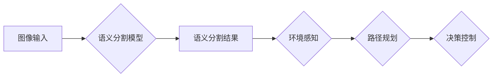

> 自动驾驶, CVPR, 深度学习, 计算机视觉, 对象检测, 语义分割, 3D重建, 

## 1. 背景介绍

自动驾驶技术作为未来交通运输的重要发展方向，其核心之一是基于计算机视觉的感知系统。CVPR（IEEE Conference on Computer Vision and Pattern Recognition）作为计算机视觉领域最顶级的学术会议之一，每年都会发布大量关于自动驾驶相关研究成果。这些成果涵盖了从图像识别、目标检测到三维重建等多个方面，为自动驾驶技术的发展提供了重要的理论基础和技术支撑。

本篇博客将对CVPR上发表的一篇关于自动驾驶领域的研究论文进行深入解读，分析其核心概念、算法原理、实践应用以及未来发展趋势。

## 2. 核心概念与联系

这篇论文主要研究的是基于深度学习的**语义分割**技术在自动驾驶中的应用。语义分割是指将图像中的每个像素都赋予一个特定的类别标签，例如道路、行人、车辆等。

**语义分割与自动驾驶的关系：**

* **环境感知:** 语义分割可以帮助自动驾驶系统对周围环境进行精确的感知，识别出道路、行人、车辆等重要物体，为决策提供基础信息。
* **路径规划:** 通过语义分割，自动驾驶系统可以了解道路的拓扑结构和障碍物的位置，从而规划更安全、更有效的行驶路径。
* **物体跟踪:** 语义分割可以帮助自动驾驶系统跟踪目标物体的运动轨迹，预测其未来运动方向，提高驾驶安全性。

**Mermaid 流程图：**



## 3. 核心算法原理 & 具体操作步骤

### 3.1  算法原理概述

这篇论文提出的语义分割算法基于**深度卷积神经网络 (CNN)**。CNN具有强大的特征提取能力，能够从图像中学习到丰富的语义信息。

论文中使用的CNN模型结构是**U-Net**，它由编码器和解码器两部分组成。编码器负责提取图像的特征，解码器负责将提取的特征进行上采样，最终生成语义分割结果。

### 3.2  算法步骤详解

1. **图像预处理:** 将输入图像进行尺寸调整、归一化等预处理操作，以提高模型的训练效率和性能。
2. **特征提取:** 将预处理后的图像输入到CNN模型的编码器部分，通过多个卷积层和池化层提取图像的特征。
3. **特征融合:** 在解码器部分，将编码器提取的特征与解码器自身的特征进行融合，以恢复图像的空间信息。
4. **语义分割:** 最后，通过一个全连接层将融合后的特征映射到每个像素的类别标签，生成语义分割结果。

### 3.3  算法优缺点

**优点:**

* **高精度:** U-Net模型在语义分割任务上表现出色，能够达到较高的精度。
* **端到端训练:** U-Net模型可以进行端到端训练，无需人工标注中间特征，简化了训练过程。
* **可扩展性:** U-Net模型结构简单，可以根据实际需求进行扩展和改进。

**缺点:**

* **计算复杂度高:** U-Net模型包含大量的参数，训练和推理过程需要较大的计算资源。
* **数据依赖性强:** U-Net模型的性能依赖于训练数据的质量和数量。

### 3.4  算法应用领域

语义分割技术在自动驾驶领域有着广泛的应用，例如：

* **道路场景理解:** 识别道路、车道、人行道等道路元素，帮助自动驾驶系统规划行驶路径。
* **障碍物检测:** 检测行人、车辆、障碍物等潜在危险，避免碰撞事故。
* **交通标志识别:** 识别交通标志和信号灯，帮助自动驾驶系统理解交通规则。

## 4. 数学模型和公式 & 详细讲解 & 举例说明

### 4.1  数学模型构建

语义分割模型的数学模型可以概括为一个**分类问题**。对于每个像素，模型需要预测其属于哪个类别。

假设图像中共有**C**个类别，则每个像素的输出是一个**C**维向量，其中每个元素代表该像素属于各个类别的概率。

### 4.2  公式推导过程

论文中使用的损失函数是**交叉熵损失函数**，用于衡量模型预测结果与真实标签之间的差异。

交叉熵损失函数的公式如下：

$$
L = -\sum_{i=1}^{C} y_i \log(p_i)
$$

其中：

* $y_i$ 是真实标签的 one-hot 编码，表示像素属于第 i 个类别的概率。
* $p_i$ 是模型预测的第 i 个类别的概率。

### 4.3  案例分析与讲解

假设图像中共有三个类别：道路、行人、车辆。对于一个像素，真实标签为道路，模型预测的概率为：

* 道路：0.8
* 行人：0.1
* 车辆：0.1

则该像素的交叉熵损失值为：

$$
L = -0.8 \log(0.8) - 0.1 \log(0.1) - 0.1 \log(0.1) \approx 0.22
$$

## 5. 项目实践：代码实例和详细解释说明

### 5.1  开发环境搭建

* 操作系统：Ubuntu 20.04
* Python 版本：3.8
* 深度学习框架：PyTorch 1.7

### 5.2  源代码详细实现

```python
import torch
import torch.nn as nn

class UNet(nn.Module):
    def __init__(self, in_channels, out_channels):
        super(UNet, self).__init__()
        # ... (定义 U-Net 模型结构) ...

    def forward(self, x):
        # ... (定义模型前向传播过程) ...

# 实例化模型
model = UNet(in_channels=3, out_channels=3)

# 定义损失函数和优化器
criterion = nn.CrossEntropyLoss()
optimizer = torch.optim.Adam(model.parameters(), lr=0.001)

# ... (训练模型) ...
```

### 5.3  代码解读与分析

* **模型定义:** `UNet` 类定义了 U-Net 模型的结构，包括编码器和解码器部分。
* **前向传播:** `forward` 方法定义了模型的输入和输出关系。
* **损失函数:** `CrossEntropyLoss` 函数用于计算模型预测结果与真实标签之间的差异。
* **优化器:** `Adam` 优化器用于更新模型参数，使其能够最小化损失函数。

### 5.4  运行结果展示

训练完成后，可以将模型应用于新的图像数据进行语义分割，并可视化分割结果。

## 6. 实际应用场景

### 6.1  自动驾驶场景

* **道路场景理解:** 语义分割可以帮助自动驾驶系统识别道路、车道、人行道等道路元素，为路径规划提供基础信息。
* **障碍物检测:** 语义分割可以检测行人、车辆、障碍物等潜在危险，帮助自动驾驶系统避免碰撞事故。
* **交通标志识别:** 语义分割可以识别交通标志和信号灯，帮助自动驾驶系统理解交通规则。

### 6.2  其他应用场景

* **机器人视觉:** 语义分割可以帮助机器人理解周围环境，进行导航和物体交互。
* **医疗影像分析:** 语义分割可以用于分割医学图像中的器官和组织，辅助医生进行诊断和治疗。
* **遥感图像分析:** 语义分割可以用于分割遥感图像中的地物类型，用于土地利用规划和环境监测。

### 6.4  未来应用展望

随着深度学习技术的不断发展，语义分割技术在自动驾驶领域将发挥越来越重要的作用。未来，语义分割技术可能会应用于更复杂的场景，例如：

* **复杂天气条件下的感知:** 在雨、雪、雾等复杂天气条件下，语义分割技术可以帮助自动驾驶系统更准确地感知周围环境。
* **夜间驾驶场景:** 语义分割技术可以帮助自动驾驶系统在夜间识别道路和障碍物。
* **多传感器融合:** 语义分割技术可以与其他传感器数据（例如激光雷达、雷达）进行融合，提高自动驾驶系统的感知能力。

## 7. 工具和资源推荐

### 7.1  学习资源推荐

* **论文:**

    * [U-Net: Convolutional Networks for Biomedical Image Segmentation](https://arxiv.org/abs/1505.04597)
    * [DeepLab: Semantic Image Segmentation with Deep Convolutional Nets, Atrous Convolution, and Fully Connected CRFs](https://arxiv.org/abs/1606.00915)

* **博客:**

    * [PyTorch Tutorials](https://pytorch.org/tutorials/)
    * [OpenCV Tutorials](https://docs.opencv.org/4.x/d7/d8b/tutorial_py_table_of_contents_py.html)

### 7.2  开发工具推荐

* **深度学习框架:** PyTorch, TensorFlow
* **计算机视觉库:** OpenCV, Pillow
* **数据标注工具:** LabelImg, VGG Image Annotator

### 7.3  相关论文推荐

* [Mask R-CNN](https://arxiv.org/abs/1703.06870)
* [Faster R-CNN](https://arxiv.org/abs/1506.01497)
* [YOLO](https://pjreddie.com/darknet/yolo/)

## 8. 总结：未来发展趋势与挑战

### 8.1  研究成果总结

这篇论文提出的语义分割算法在自动驾驶领域取得了显著的成果，为自动驾驶系统的环境感知和决策控制提供了重要的技术支撑。

### 8.2  未来发展趋势

* **更高精度:** 研究人员将继续探索新的算法和模型结构，以提高语义分割的精度。
* **更实时性:** 研究人员将致力于开发更快速的语义分割算法，以满足自动驾驶系统的实时性要求。
* **更鲁棒性:** 研究人员将研究如何提高语义分割算法在复杂环境下的鲁棒性，例如光照变化、遮挡等。

### 8.3  面临的挑战

* **数据标注:** 语义分割算法需要大量的标注数据，数据标注成本高昂且耗时。
* **计算资源:** 语义分割算法计算复杂度高，需要大量的计算资源。
* **模型解释性:** 深度学习模型的决策过程难以解释，这对于自动驾驶系统的安全性至关重要。

### 8.4  研究展望

未来，语义分割技术将继续在自动驾驶领域发挥重要作用，并与其他人工智能技术相结合，例如强化学习、自然语言处理等，推动自动驾驶技术的发展。


## 9. 附录：常见问题与解答

**Q1: 语义分割与目标检测的区别是什么？**

**A1:** 语义分割将图像中的每个像素都赋予一个类别标签，而目标检测则只检测出图像中的目标物体，并给出其边界框。

**Q2: 如何获取语义分割的训练数据？**

**A2:** 可以使用公开的语义分割数据集，例如Cityscapes、Pascal VOC等，也可以自己收集和标注数据。

**Q3: 如何评估语语义分割模型的性能？**

**A3:** 常用的评估指标包括交并比 (IoU)、平均精度 (mAP) 等。

**作者：禅与计算机程序设计艺术 / Zen and the Art of Computer Programming**


<end_of_turn>