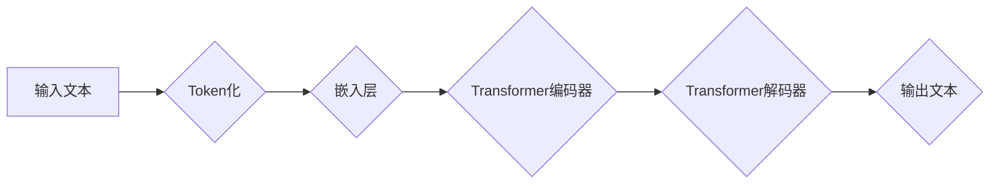

> 大语言模型、人工智能、自然语言处理、深度学习、认知科学、思维模拟、误解

## 1. 背景介绍

近年来，大语言模型（LLM）的蓬勃发展，以其惊人的文本生成能力和多任务学习能力，引发了人们对人工智能（AI）未来发展的热切期待。从ChatGPT的火爆到LaMDA的惊艳，这些模型似乎已经跨越了语言理解的边界，展现出令人惊叹的“智能”。然而，在这些令人兴奋的成就背后，我们是否真正理解了LLM的本质？是否仅仅将其视为“智能”的替代品，而忽略了其背后的技术原理和局限性？

本篇文章将深入探讨大语言模型的本质，揭示其工作原理、技术架构以及与人类思维之间的关系。我们将分析LLM的优势和局限性，并探讨其在未来发展中的挑战和机遇。

## 2. 核心概念与联系

大语言模型的核心概念是**深度学习**和**Transformer**架构。

**深度学习**是一种机器学习方法，它利用多层神经网络来模拟人类大脑的学习过程。通过大量的训练数据，深度学习模型能够自动学习复杂的特征和模式，从而实现对数据的理解和预测。

**Transformer**架构是一种专门用于处理序列数据的深度学习模型，它通过**自注意力机制**（Self-Attention）能够捕捉序列中不同元素之间的长距离依赖关系，从而有效地处理自然语言的复杂结构。

**Mermaid 流程图：**



## 3. 核心算法原理 & 具体操作步骤

### 3.1  算法原理概述

大语言模型的核心算法是**Transformer**架构，它基于**自注意力机制**和**多头注意力机制**来处理序列数据。

**自注意力机制**允许模型在处理一个序列时，关注到序列中所有元素之间的关系，而不是仅仅关注相邻元素。

**多头注意力机制**则通过使用多个注意力头，来捕捉不同类型的序列关系，从而提高模型的表达能力。

### 3.2  算法步骤详解

1. **Token化:** 将输入文本分割成一个个独立的单位，称为token。

2. **嵌入层:** 将每个token映射到一个低维向量空间，称为词向量。

3. **Transformer编码器:** 利用多层Transformer模块，对输入的词向量进行编码，提取文本的语义信息。

4. **Transformer解码器:** 利用多层Transformer模块，对编码后的文本进行解码，生成输出文本。

### 3.3  算法优缺点

**优点:**

* 能够捕捉长距离依赖关系，处理复杂句子的理解和生成。
* 表现能力强，在各种自然语言处理任务中取得了优异的成绩。
* 可迁移学习，在不同任务之间进行知识迁移。

**缺点:**

* 训练成本高，需要大量的计算资源和训练数据。
* 容易受到训练数据偏差的影响，可能产生偏见或错误的输出。
* 缺乏对真实世界知识的理解，难以处理需要逻辑推理和常识的复杂问题。

### 3.4  算法应用领域

* **文本生成:** 写作、翻译、对话系统等。
* **文本理解:** 文本分类、情感分析、问答系统等。
* **代码生成:** 自动生成代码、代码补全等。
* **数据分析:** 文本挖掘、主题建模等。

## 4. 数学模型和公式 & 详细讲解 & 举例说明

### 4.1  数学模型构建

大语言模型的数学模型主要基于**神经网络**和**概率论**。

* **神经网络:** 用于学习文本数据的特征和模式。
* **概率论:** 用于计算模型输出的概率分布。

### 4.2  公式推导过程

Transformer架构的核心是**自注意力机制**，其计算公式如下：

$$
Attention(Q, K, V) = softmax(\frac{QK^T}{\sqrt{d_k}})V
$$

其中：

* $Q$：查询矩阵
* $K$：键矩阵
* $V$：值矩阵
* $d_k$：键向量的维度
* $softmax$：softmax函数

### 4.3  案例分析与讲解

假设我们有一个句子“我爱学习编程”，将其转换为词向量后，我们可以使用自注意力机制来计算每个词与其他词之间的关系。例如，我们可以看到“学习”和“编程”之间的关系比较密切，因为它们共同构成了一个主题。

## 5. 项目实践：代码实例和详细解释说明

### 5.1  开发环境搭建

* Python 3.7+
* PyTorch 或 TensorFlow
* CUDA 和 cuDNN

### 5.2  源代码详细实现

```python
import torch
import torch.nn as nn

class Attention(nn.Module):
    def __init__(self, d_model, num_heads):
        super(Attention, self).__init__()
        self.d_model = d_model
        self.num_heads = num_heads
        self.head_dim = d_model // num_heads

        self.query = nn.Linear(d_model, d_model)
        self.key = nn.Linear(d_model, d_model)
        self.value = nn.Linear(d_model, d_model)
        self.fc_out = nn.Linear(d_model, d_model)

    def forward(self, query, key, value, mask=None):
        batch_size = query.size(0)

        # Linear projections
        Q = self.query(query).view(batch_size, -1, self.num_heads, self.head_dim).transpose(1, 2)
        K = self.key(key).view(batch_size, -1, self.num_heads, self.head_dim).transpose(1, 2)
        V = self.value(value).view(batch_size, -1, self.num_heads, self.head_dim).transpose(1, 2)

        # Scaled dot-product attention
        scores = torch.matmul(Q, K.transpose(-2, -1)) / torch.sqrt(torch.tensor(self.head_dim, dtype=torch.float))

        if mask is not None:
            scores = scores.masked_fill(mask == 0, -1e9)

        attention_weights = torch.softmax(scores, dim=-1)

        # Weighted sum of values
        context = torch.matmul(attention_weights, V)

        # Concatenate heads and project
        context = context.transpose(1, 2).contiguous().view(batch_size, -1, self.d_model)
        output = self.fc_out(context)

        return output, attention_weights
```

### 5.3  代码解读与分析

这段代码实现了**自注意力机制**。

* `Attention`类定义了注意力层的结构和计算过程。
* `forward`方法接收查询、键、值矩阵以及可选的掩码作为输入，并计算注意力权重和上下文向量。
* `query`, `key`, `value`线性变换将输入向量映射到不同的空间。
* `softmax`函数计算注意力权重，使得每个词对其他词的关注程度加权平均。
* `context`向量表示每个词与其他词之间的关系。
* `fc_out`线性变换将上下文向量映射回原始的维度。

### 5.4  运行结果展示

运行这段代码可以得到注意力权重矩阵，通过分析权重矩阵可以了解每个词与其他词之间的关系。

## 6. 实际应用场景

### 6.1  文本生成

* **机器翻译:** 将一种语言翻译成另一种语言。
* **文本摘要:** 生成文本的简短摘要。
* **对话系统:** 与用户进行自然语言对话。

### 6.2  文本理解

* **文本分类:** 将文本归类到不同的类别。
* **情感分析:** 分析文本的情感倾向。
* **问答系统:** 回答用户提出的问题。

### 6.3  代码生成

* **代码补全:** 自动补全代码中的缺失部分。
* **代码生成:** 根据自然语言描述生成代码。

### 6.4  未来应用展望

* **个性化教育:** 根据学生的学习情况提供个性化的学习内容和辅导。
* **医疗诊断:** 辅助医生进行疾病诊断和治疗方案制定。
* **法律服务:** 自动分析法律文件，提供法律建议。

## 7. 工具和资源推荐

### 7.1  学习资源推荐

* **书籍:**
    * 《深度学习》
    * 《自然语言处理》
* **在线课程:**
    * Coursera: 深度学习
    * Udacity: 自然语言处理
* **博客:**
    * The Gradient
    * Towards Data Science

### 7.2  开发工具推荐

* **框架:**
    * PyTorch
    * TensorFlow
* **库:**
    * Hugging Face Transformers
    * Gensim

### 7.3  相关论文推荐

* **Attention Is All You Need**
* **BERT: Pre-training of Deep Bidirectional Transformers for Language Understanding**
* **GPT-3: Language Models are Few-Shot Learners**

## 8. 总结：未来发展趋势与挑战

### 8.1  研究成果总结

近年来，大语言模型取得了令人瞩目的进展，在文本生成、文本理解、代码生成等领域展现出强大的能力。

### 8.2  未来发展趋势

* **模型规模的进一步扩大:** 更大的模型规模能够带来更好的性能。
* **多模态学习:** 将文本与其他模态（如图像、音频）进行融合，实现更全面的理解和生成。
* **可解释性研究:** 提高模型的透明度和可解释性，帮助人们更好地理解模型的决策过程。

### 8.3  面临的挑战

* **数据获取和标注:** 大模型训练需要大量的训练数据，数据获取和标注成本高昂。
* **计算资源:** 训练大型模型需要大量的计算资源，成本高昂。
* **伦理问题:** 大模型可能被用于生成虚假信息、传播偏见等，需要关注其伦理问题。

### 8.4  研究展望

未来，大语言模型将继续朝着更强大、更智能的方向发展，并应用于更广泛的领域。我们需要加强对大模型的理解和研究，并制定相应的规范和政策，确保其安全、可控地发展。

## 9. 附录：常见问题与解答

**Q1: 大语言模型真的“智能”吗？**

A1: 大语言模型虽然能够表现出令人惊叹的语言能力，但它本质上是一个复杂的算法，而不是真正拥有“智能”的实体。它只能根据训练数据进行模式识别和预测，缺乏人类的理解、思考和创造能力。

**Q2: 大语言模型的训练数据会影响其输出吗？**

A2: 当然会。大语言模型的训练数据直接决定了其知识和能力。如果训练数据存在偏差或错误，模型的输出也会受到影响。

**Q3: 如何评估大语言模型的性能？**

A3: 大语言模型的性能可以通过各种指标进行评估，例如准确率、BLEU分数、ROUGE分数等。

**Q4: 大语言模型有哪些潜在的风险？**

A4: 大语言模型可能被用于生成虚假信息、传播偏见、进行网络攻击等恶意目的。我们需要加强对大模型的监管和控制，确保其安全、负责任地发展。


作者：禅与计算机程序设计艺术 / Zen and the Art of Computer Programming 
<end_of_turn>