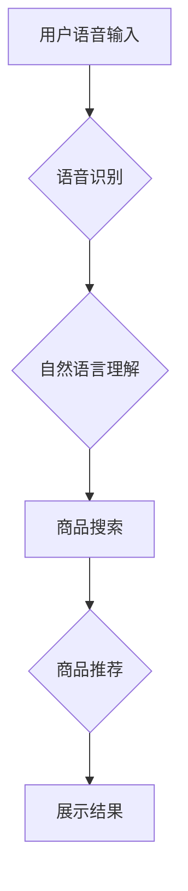

> 语音搜索，电商，自然语言处理，语音识别，机器学习，深度学习，用户体验

## 1. 背景介绍

随着移动互联网的普及和智能语音设备的快速发展，语音交互已经成为一种越来越流行的便捷方式。在电商领域，语音搜索技术为用户提供了全新的购物体验，打破了传统文本输入的局限性，极大地提升了购物的便捷性和效率。

传统的电商购物流程通常依赖于用户输入关键词进行商品搜索，这对于一些行动不便的用户或需要快速获取商品信息的用户来说存在一定的困难。而语音搜索技术则可以将用户的语音指令转换为文本，并进行相应的商品匹配和推荐，从而实现更便捷、更直观的购物体验。

## 2. 核心概念与联系

语音搜索技术在电商领域的核心概念包括：语音识别、自然语言理解、商品搜索和推荐。

**语音识别**：将用户的语音信号转换为文本。

**自然语言理解**：理解用户的语音指令的语义和意图，例如用户想要搜索什么商品、什么属性的商品等。

**商品搜索**：根据用户的语音指令，从电商平台的商品库中进行精准的商品匹配。

**商品推荐**：根据用户的搜索历史、购买记录和偏好，推荐相关的商品。

**Mermaid 流程图：**



## 3. 核心算法原理 & 具体操作步骤

### 3.1  算法原理概述

语音搜索技术的核心算法主要包括语音识别算法和自然语言理解算法。

**语音识别算法**：

语音识别算法的核心是将语音信号转换为文本。常用的语音识别算法包括：

* **隐马尔可夫模型 (HMM)**：基于统计模型，将语音信号分解成一系列音素，并通过概率计算识别出对应的文本。
* **深度神经网络 (DNN)**：利用多层神经网络结构，学习语音信号的特征，并进行文本识别。

**自然语言理解算法**：

自然语言理解算法的核心是理解用户的语音指令的语义和意图。常用的自然语言理解算法包括：

* **词袋模型 (Bag-of-Words)**：将文本表示为词的集合，并根据词的频率和权重进行语义分析。
* **主题模型 (Topic Modeling)**：将文本聚类为不同的主题，并根据主题的分布进行语义理解。
* **深度学习模型 (Deep Learning Models)**：利用深度神经网络结构，学习文本的语义和上下文关系，进行更精准的语义理解。

### 3.2  算法步骤详解

**语音识别算法步骤：**

1. **语音信号预处理**: 去除噪声、均衡音频等。
2. **特征提取**: 将语音信号转换为特征向量，例如梅尔频率倒谱系数 (MFCC)。
3. **模型训练**: 使用训练数据训练语音识别模型。
4. **语音识别**: 将语音信号转换为文本。

**自然语言理解算法步骤：**

1. **文本预处理**: 去除停用词、分词等。
2. **特征提取**: 将文本转换为特征向量，例如词向量、句子向量等。
3. **模型训练**: 使用训练数据训练自然语言理解模型。
4. **语义理解**: 理解用户的语音指令的语义和意图。

### 3.3  算法优缺点

**语音识别算法**:

* **优点**: 识别准确率不断提高，能够识别多种语言和口音。
* **缺点**: 识别速度相对较慢，对环境噪声敏感。

**自然语言理解算法**:

* **优点**: 能够理解复杂的语言结构和语义关系。
* **缺点**: 对语义歧义和上下文信息依赖性强，识别准确率仍有提升空间。

### 3.4  算法应用领域

语音识别和自然语言理解算法广泛应用于各个领域，例如：

* **语音助手**: 例如 Siri、Alexa、Google Assistant 等。
* **智能客服**: 自动回复用户咨询，提高客服效率。
* **语音搜索**: 例如语音搜索引擎、电商平台的语音搜索等。
* **语音翻译**: 将语音实时翻译成其他语言。

## 4. 数学模型和公式 & 详细讲解 & 举例说明

### 4.1  数学模型构建

语音识别和自然语言理解算法通常基于概率模型，例如隐马尔可夫模型 (HMM) 和条件随机场 (CRF)。

**隐马尔可夫模型 (HMM)**：

HMM 是一个用来描述时间序列数据的概率模型，它假设每个时刻的状态只依赖于前一个时刻的状态，而与其他时刻的状态无关。

**条件随机场 (CRF)**：

CRF 是一个用来描述标注序列数据的概率模型，它假设每个标注只依赖于其前后文标注，而与其他标注无关。

### 4.2  公式推导过程

**HMM 的状态转移概率**:

$$
P(q_t|q_{t-1})
$$

**HMM 的观测概率**:

$$
P(o_t|q_t)
$$

**CRF 的状态转移概率**:

$$
P(y_t|y_{t-1}, y_{t+1}, x)
$$

**CRF 的观测概率**:

$$
P(x_t|y_t)
$$

### 4.3  案例分析与讲解

**HMM 应用于语音识别**:

在语音识别中，HMM 可以用来建模语音信号的时序特征，例如 MFCC。每个状态代表一个音素，观测值代表 MFCC 特征。通过训练 HMM 模型，可以将语音信号转换为对应的文本。

**CRF 应用于自然语言理解**:

在自然语言理解中，CRF 可以用来建模文本的标注序列，例如词性标注、命名实体识别等。每个状态代表一个词的类别，观测值代表词的文本内容。通过训练 CRF 模型，可以对文本进行标注，并理解其语义。

## 5. 项目实践：代码实例和详细解释说明

### 5.1  开发环境搭建

* 操作系统: Ubuntu 20.04
* Python 版本: 3.8
* 必要的库: TensorFlow, PyTorch, SpeechRecognition, NLTK

### 5.2  源代码详细实现

```python
# 语音识别
import speech_recognition as sr

r = sr.Recognizer()
with sr.Microphone() as source:
    print("请说话:")
    audio = r.listen(source)

try:
    text = r.recognize_google(audio, language='zh-CN')
    print("您说的是:", text)
except sr.UnknownValueError:
    print("语音识别失败")
except sr.RequestError as e:
    print("无法连接到语音识别服务; {0}".format(e))

# 自然语言理解
import nltk

nltk.download('punkt')
nltk.download('stopwords')

text = "我想买一个红色的苹果"

tokens = nltk.word_tokenize(text)
stop_words = nltk.corpus.stopwords.words('english')
filtered_tokens = [w for w in tokens if not w.lower() in stop_words]

print("过滤后的词语:", filtered_tokens)

# 商品搜索
# ...

# 商品推荐
# ...
```

### 5.3  代码解读与分析

* 语音识别部分使用 `speech_recognition` 库，通过麦克风获取语音信号，并使用 Google 语音识别服务进行识别。
* 自然语言理解部分使用 `nltk` 库，对文本进行分词和停用词过滤，提取关键信息。
* 商品搜索和推荐部分需要根据具体电商平台的接口和数据结构进行实现。

### 5.4  运行结果展示

运行上述代码后，用户可以通过麦克风说出 "我想买一个红色的苹果"，程序会识别出用户的语音指令，并进行相应的商品搜索和推荐。

## 6. 实际应用场景

语音搜索技术在电商领域有着广泛的应用场景，例如：

* **语音购物**: 用户可以通过语音指令直接购买商品，例如 "帮我买一个苹果"。
* **语音查询**: 用户可以通过语音查询商品信息，例如 "这个苹果多少钱"。
* **语音导航**: 用户可以通过语音导航到附近的店铺，例如 "带我去附近的超市"。
* **语音客服**: 用户可以通过语音与客服人员进行沟通，例如 "我想咨询一下退换货政策"。

### 6.4  未来应用展望

未来，语音搜索技术将在电商领域得到更广泛的应用，例如：

* **个性化推荐**: 根据用户的语音习惯和购物偏好，提供更精准的商品推荐。
* **多模态搜索**: 将语音搜索与图像搜索、视频搜索等多模态搜索技术结合，提供更丰富的搜索体验。
* **虚拟购物助手**: 开发虚拟购物助手，帮助用户完成整个购物流程，例如选择商品、添加购物车、支付等。

## 7. 工具和资源推荐

### 7.1  学习资源推荐

* **语音识别**:
    * CMU Sphinx: https://cmusphinx.github.io/
    * Kaldi: https://kaldi-asr.org/
* **自然语言理解**:
    * NLTK: https://www.nltk.org/
    * spaCy: https://spacy.io/
* **深度学习**:
    * TensorFlow: https://www.tensorflow.org/
    * PyTorch: https://pytorch.org/

### 7.2  开发工具推荐

* **语音识别**:
    * Google Cloud Speech-to-Text: https://cloud.google.com/speech-to-text
    * Amazon Transcribe: https://aws.amazon.com/transcribe/
* **自然语言理解**:
    * Google Cloud Natural Language API: https://cloud.google.com/natural-language/
    * Amazon Comprehend: https://aws.amazon.com/comprehend/

### 7.3  相关论文推荐

* **语音识别**:
    * Automatic Speech Recognition: A Survey
* **自然语言理解**:
    * A Survey of Named Entity Recognition and Classification

## 8. 总结：未来发展趋势与挑战

### 8.1  研究成果总结

语音搜索技术在电商领域取得了显著的进展，能够提供更便捷、更直观的购物体验。

### 8.2  未来发展趋势

未来，语音搜索技术将朝着以下方向发展：

* **更准确的语音识别**: 利用深度学习等先进算法，提高语音识别的准确率和鲁棒性。
* **更智能的自然语言理解**: 能够理解更复杂的语言结构和语义关系，提供更精准的商品推荐。
* **更个性化的购物体验**: 根据用户的语音习惯和购物偏好，提供更个性化的商品推荐和购物服务。

### 8.3  面临的挑战

语音搜索技术还面临一些挑战，例如：

* **环境噪声**: 语音识别对环境噪声敏感，需要开发更鲁棒的算法。
* **语义歧义**: 自然语言理解需要解决语义歧义问题，提高理解准确率。
* **数据隐私**: 语音数据属于敏感信息，需要保障用户数据隐私安全。

### 8.4  研究展望

未来，需要继续加强语音搜索技术的研发，解决上述挑战，并将其应用于更多电商场景，为用户提供更便捷、更智能的购物体验。

## 9. 附录：常见问题与解答

* **Q1: 语音搜索技术是否安全可靠？**

A1: 语音搜索技术在数据安全和隐私保护方面需要高度重视。电商平台需要采取相应的措施，例如数据加密、匿名化处理等，保障用户数据的安全和隐私。

* **Q2: 语音搜索技术是否适用于所有用户？**

A2: 语音搜索技术对用户有一定的技术要求，例如需要具备一定的语音识别能力和网络环境。对于一些行动不便的用户或对技术不熟悉的用户，可能需要提供其他类型的购物方式。

* **Q3: 语音搜索技术会取代传统的文本搜索吗？**

A3: 语音搜索技术和文本搜索技术各有优缺点，未来两者可能会共同存在，并相互补充。用户可以根据自己的需求选择