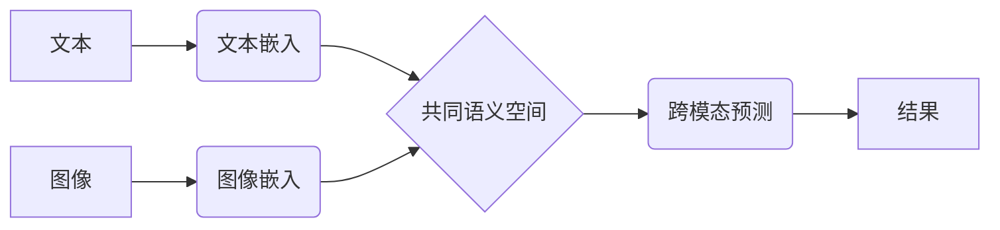

> 跨模态学习、多模态融合、深度学习、计算机视觉、自然语言处理、图像识别、文本理解、多媒体分析

## 1. 背景介绍

跨模态学习 (Cross-Modal Learning) 作为人工智能领域的一项前沿研究方向，旨在训练模型能够理解和处理不同模态的数据，例如文本、图像、音频、视频等。随着大规模多模态数据的涌现，跨模态学习技术取得了显著进展，在图像识别、文本理解、语音识别、机器翻译等领域展现出巨大的应用潜力。

传统机器学习方法通常将不同模态的数据视为独立的，无法充分利用不同模态之间的互补关系。而跨模态学习则试图打破这种模态隔离，通过学习不同模态之间的映射关系，实现跨模态的知识共享和信息融合。

## 2. 核心概念与联系

跨模态学习的核心概念是将不同模态的数据映射到一个共同的语义空间，使得不同模态的数据在该空间中能够进行有效的交互和融合。

**跨模态学习的流程图:**



**核心概念:**

* **模态嵌入:** 将不同模态的数据映射到一个低维向量空间，称为模态嵌入。
* **共同语义空间:** 将不同模态的嵌入映射到同一个空间，使得不同模态的数据在该空间中能够进行有效的交互和融合。
* **跨模态预测:** 利用共同语义空间中的信息，进行跨模态的预测任务，例如图像字幕生成、文本图像匹配等。

## 3. 核心算法原理 & 具体操作步骤

### 3.1  算法原理概述

跨模态学习算法主要分为以下几种类型:

* **对齐学习 (Alignment Learning):** 通过学习不同模态之间的映射关系，将不同模态的数据对齐到同一个空间。
* **联合学习 (Joint Learning):** 将不同模态的数据一起训练，学习一个共享的表示空间。
* **多任务学习 (Multi-Task Learning):** 将不同模态的学习任务组合在一起，共享模型参数，提高模型的泛化能力。

### 3.2  算法步骤详解

以对齐学习为例，其具体操作步骤如下:

1. **数据预处理:** 对不同模态的数据进行预处理，例如文本分词、图像裁剪等。
2. **模态嵌入:** 使用不同的深度学习模型对不同模态的数据进行嵌入，得到不同模态的特征向量。
3. **对齐学习:** 使用损失函数，例如KL散度或MSE，将不同模态的嵌入对齐到同一个空间。
4. **跨模态预测:** 利用对齐后的嵌入，进行跨模态的预测任务。

### 3.3  算法优缺点

**优点:**

* 可以充分利用不同模态之间的互补关系，提高模型的性能。
* 可以学习到更丰富的语义信息。

**缺点:**

* 需要大量的多模态数据进行训练。
* 算法设计较为复杂，需要对不同模态的数据进行深入理解。

### 3.4  算法应用领域

跨模态学习技术在以下领域具有广泛的应用前景:

* **图像识别:** 将文本信息与图像信息结合，提高图像识别的准确率。
* **文本理解:** 利用图像信息辅助文本理解，例如情感分析、问答系统等。
* **语音识别:** 将语音信息与文本信息结合，提高语音识别的准确率。
* **机器翻译:** 利用图像信息辅助机器翻译，提高翻译的质量。

## 4. 数学模型和公式 & 详细讲解 & 举例说明

### 4.1  数学模型构建

假设我们有文本数据 $T$ 和图像数据 $V$，分别对应嵌入向量 $t$ 和 $v$。

跨模态学习的目标是学习一个映射函数 $f$，将文本和图像嵌入到同一个语义空间中。

$$
f(t, v) = z
$$

其中 $z$ 是文本和图像的联合嵌入向量。

### 4.2  公式推导过程

常用的损失函数包括KL散度和MSE。

* **KL散度:**

$$
L_{KL}(p(z|t, v), q(z|t, v))
$$

其中 $p(z|t, v)$ 是真实分布，$q(z|t, v)$ 是模型预测的分布。

* **MSE:**

$$
L_{MSE}(z, z')
$$

其中 $z$ 是真实嵌入向量，$z'$ 是模型预测的嵌入向量。

### 4.3  案例分析与讲解

例如，在图像字幕生成任务中，我们可以使用跨模态学习模型将图像嵌入 $v$ 和文本嵌入 $t$ 映射到同一个语义空间，然后利用该空间中的信息生成图像的字幕。

## 5. 项目实践：代码实例和详细解释说明

### 5.1  开发环境搭建

* Python 3.7+
* TensorFlow 2.0+
* PyTorch 1.0+

### 5.2  源代码详细实现

```python
import tensorflow as tf

# 定义文本嵌入模型
def text_embedding(text):
    # ...

# 定义图像嵌入模型
def image_embedding(image):
    # ...

# 定义跨模态学习模型
def cross_modal_learning(text, image):
    # ...

# 训练模型
model = cross_modal_learning(text_embedding, image_embedding)
model.compile(optimizer='adam', loss='mse')
model.fit(text_data, image_data, epochs=10)

```

### 5.3  代码解读与分析

* 文本嵌入模型和图像嵌入模型分别负责将文本和图像数据映射到低维向量空间。
* 跨模态学习模型将文本和图像的嵌入向量作为输入，学习一个映射函数将它们映射到同一个语义空间。
* 训练模型时，使用MSE损失函数，将模型预测的嵌入向量与真实嵌入向量进行比较，并使用Adam优化器更新模型参数。

### 5.4  运行结果展示

训练完成后，我们可以使用模型对新的文本和图像数据进行预测，例如生成图像字幕。

## 6. 实际应用场景

### 6.1  图像字幕生成

跨模态学习技术可以用于生成图像的字幕，例如将图像描述为文本。

### 6.2  文本图像匹配

跨模态学习技术可以用于匹配文本和图像，例如判断文本描述是否与图像相符。

### 6.3  视频理解

跨模态学习技术可以用于理解视频内容，例如识别视频中的动作和事件。

### 6.4  未来应用展望

跨模态学习技术在未来将有更广泛的应用，例如:

* **增强现实 (AR) 和虚拟现实 (VR):** 结合文本、图像、音频等多模态信息，提供更沉浸式的AR/VR体验。
* **智能家居:** 通过理解用户的语音、图像和动作指令，提供更智能化的家居服务。
* **医疗诊断:** 利用医学图像和病历信息，辅助医生进行诊断。

## 7. 工具和资源推荐

### 7.1  学习资源推荐

* **书籍:**
    * Deep Learning with Python
    * Hands-On Machine Learning with Scikit-Learn, Keras & TensorFlow
* **课程:**
    * Stanford CS231n: Convolutional Neural Networks for Visual Recognition
    * Deep Learning Specialization (Coursera)

### 7.2  开发工具推荐

* **TensorFlow:** 开源深度学习框架
* **PyTorch:** 开源深度学习框架
* **Keras:** 高级深度学习API

### 7.3  相关论文推荐

* **Show, Attend and Tell: Neural Image Captioning with Visual Attention**
* **Multimodal Deep Learning: A Survey**
* **Cross-Modal Retrieval: A Survey**

## 8. 总结：未来发展趋势与挑战

### 8.1  研究成果总结

跨模态学习技术取得了显著进展，在图像识别、文本理解、语音识别等领域展现出巨大的应用潜力。

### 8.2  未来发展趋势

* **更强大的模型架构:** 探索更强大的模型架构，例如Transformer、Graph Neural Networks等，提高跨模态学习模型的性能。
* **更丰富的模态数据:** 收集和构建更丰富的模态数据，例如视频、音频、传感器数据等，丰富跨模态学习模型的知识库。
* **更有效的训练方法:** 研究更有效的训练方法，例如自监督学习、迁移学习等，提高跨模态学习模型的效率和泛化能力。

### 8.3  面临的挑战

* **模态间语义鸿沟:** 不同模态的数据具有不同的语义表示，如何有效地跨越模态间语义鸿沟仍然是一个挑战。
* **数据标注困难:** 跨模态数据的标注工作非常耗时和费力，如何降低数据标注成本是一个重要问题。
* **模型解释性:** 跨模态学习模型通常是黑盒模型，如何提高模型的解释性是一个重要的研究方向。

### 8.4  研究展望

跨模态学习技术是一个充满挑战和机遇的领域，未来将会有更多的研究成果涌现，为人工智能的发展做出更大的贡献。

## 9. 附录：常见问题与解答

### 9.1  跨模态学习与多模态融合的区别是什么？

跨模态学习是指学习不同模态之间的映射关系，而多模态融合是指将不同模态的数据进行融合，例如将文本和图像信息融合在一起。

### 9.2  跨模态学习有哪些应用场景？

跨模态学习技术在图像识别、文本理解、语音识别、机器翻译等领域具有广泛的应用前景。

### 9.3  如何选择合适的跨模态学习算法？

选择合适的跨模态学习算法需要根据具体的应用场景和数据特点进行选择。

### 9.4  跨模态学习技术有哪些挑战？

跨模态学习技术面临着模态间语义鸿沟、数据标注困难、模型解释性等挑战。


作者：禅与计算机程序设计艺术 / Zen and the Art of Computer Programming 
<end_of_turn>