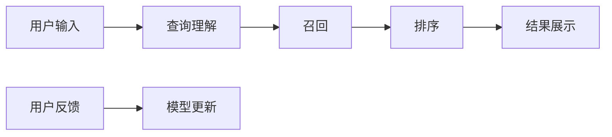

# 传统搜索推荐系统的匹配准确度

## 1. 背景介绍

### 1.1 问题的由来

随着互联网的快速发展，信息过载问题日益严重。用户在海量的信息中寻找自己需要的内容变得越来越困难。搜索引擎和推荐系统应运而生，成为了人们获取信息的重要工具。搜索引擎根据用户输入的关键词，从海量数据中检索出相关的网页信息；推荐系统则根据用户的历史行为、兴趣偏好等信息，主动向用户推荐其可能感兴趣的内容。

然而，传统的搜索推荐系统在匹配准确度方面仍存在一些挑战：

* **数据稀疏性:** 用户的行为数据往往非常稀疏，难以准确刻画用户的兴趣偏好。
* **冷启动问题:**  对于新用户或新物品，由于缺乏历史数据，很难进行准确的推荐。
* **语义鸿沟:** 用户的搜索关键词和物品的描述之间可能存在语义上的差异，导致匹配不准确。
* **可解释性差:**  传统的搜索推荐系统往往是一个黑盒模型，难以解释其推荐结果的原因。

### 1.2 研究现状

为了解决上述问题，学术界和工业界提出了许多方法，主要包括：

* **基于内容的推荐:**  根据物品的内容特征进行推荐，例如电影的类型、导演、演员等。
* **协同过滤推荐:**  根据用户之间的相似性或物品之间的相似性进行推荐。
* **基于知识图谱的推荐:**  利用知识图谱中的实体关系信息，提高推荐的准确性和可解释性。
* **深度学习推荐:**  利用深度学习模型自动学习用户和物品的特征表示，提高推荐的准确性。

### 1.3 研究意义

提高搜索推荐系统的匹配准确度具有重要的现实意义：

* **提升用户体验:**  准确的推荐结果可以帮助用户更快地找到自己需要的信息，提升用户体验。
* **提高用户粘性:**  个性化的推荐结果可以满足用户的个性化需求，提高用户粘性。
* **促进信息传播:**  准确的推荐结果可以将优质的内容推荐给更广泛的用户群体，促进信息的传播。

### 1.4 本文结构

本文将深入探讨传统搜索推荐系统的匹配准确度问题，并介绍一些常用的解决方法。文章结构如下：

* **第二章：核心概念与联系**  介绍搜索推荐系统中的一些核心概念，例如召回率、准确率、F1值等。
* **第三章：核心算法原理 & 具体操作步骤**  介绍一些常用的搜索推荐算法，例如基于内容的推荐、协同过滤推荐等。
* **第四章：数学模型和公式 & 详细讲解 & 举例说明**  介绍一些常用的评估指标，例如准确率、召回率、F1值等，并给出具体的计算公式和例子。
* **第五章：项目实践：代码实例和详细解释说明**  通过一个具体的项目案例，展示如何使用Python实现一个简单的搜索推荐系统。
* **第六章：实际应用场景**  介绍搜索推荐系统在实际应用场景中的应用，例如电商网站、社交平台等。
* **第七章：工具和资源推荐**  推荐一些常用的搜索推荐系统工具和学习资源。
* **第八章：总结：未来发展趋势与挑战**  总结搜索推荐系统的发展趋势和面临的挑战。
* **第九章：附录：常见问题与解答**  解答一些常见问题。

## 2. 核心概念与联系

### 2.1 搜索推荐系统流程

一个典型的搜索推荐系统流程如下图所示：



* **查询理解:**  理解用户的搜索意图，例如用户是想购买商品、搜索信息还是寻找娱乐内容。
* **召回:**  从海量数据中检索出与用户查询相关的候选物品。
* **排序:**  对召回的候选物品进行排序，将用户最可能感兴趣的物品排在前面。
* **结果展示:**  将排序后的结果展示给用户。
* **用户反馈:**  收集用户的点击、购买等行为数据，用于模型更新。

### 2.2 匹配准确度

匹配准确度是指搜索推荐系统推荐的物品与用户实际需求的匹配程度。常用的评估指标包括：

* **准确率 (Precision):**  推荐的物品中，有多少是用户真正感兴趣的。
* **召回率 (Recall):**  用户真正感兴趣的物品中，有多少被推荐出来了。
* **F1值 (F1-score):**  准确率和召回率的调和平均数。

### 2.3 相关性

相关性是指两个物品之间的相似程度。常用的相关性度量方法包括：

* **余弦相似度 (Cosine Similarity):**  计算两个向量夹角的余弦值。
* **欧氏距离 (Euclidean Distance):**  计算两个向量之间的距离。
* **皮尔逊相关系数 (Pearson Correlation Coefficient):**  计算两个变量之间的线性相关程度。

## 3. 核心算法原理 & 具体操作步骤

### 3.1 基于内容的推荐

#### 3.1.1 算法原理概述

基于内容的推荐 (Content-based Recommendation) 是根据物品的内容特征进行推荐。例如，电影的类型、导演、演员等信息可以作为电影的特征，用户对某些类型、导演、演员的电影感兴趣，就可以向用户推荐具有相同特征的电影。

#### 3.1.2 算法步骤详解

1. **物品特征提取:**  从物品的内容中提取出特征，例如电影的类型、导演、演员等。
2. **用户画像构建:**  根据用户的历史行为数据，构建用户的兴趣模型，例如用户喜欢哪些类型的电影、哪些导演、哪些演员。
3. **相关性计算:**  计算用户画像和物品特征之间的相关性，例如使用余弦相似度。
4. **推荐结果生成:**  将相关性高的物品推荐给用户。

#### 3.1.3 算法优缺点

* **优点:**  简单直观，易于实现；可以推荐新物品。
* **缺点:**  需要人工提取物品特征；难以发现用户的潜在兴趣；容易推荐同质化的内容。

### 3.2 协同过滤推荐

#### 3.2.1 算法原理概述

协同过滤推荐 (Collaborative Filtering Recommendation) 是根据用户之间的相似性或物品之间的相似性进行推荐。例如，用户A和用户B都购买了相同的商品，那么可以将用户A购买过的其他商品推荐给用户B。

#### 3.2.2 算法步骤详解

1. **构建用户-物品评分矩阵:**  记录每个用户对每个物品的评分，例如用户对电影的评分。
2. **计算用户/物品相似度:**  计算用户之间的相似度或物品之间的相似度，例如使用余弦相似度。
3. **生成推荐结果:**  根据用户/物品相似度，将用户可能感兴趣的物品推荐给用户。

#### 3.2.3 算法优缺点

* **优点:**  不需要人工提取特征；可以发现用户的潜在兴趣。
* **缺点:**  存在冷启动问题；数据稀疏性问题；可解释性差。

## 4. 数学模型和公式 & 详细讲解 & 举例说明

### 4.1 准确率 (Precision)

准确率是指推荐的物品中，有多少是用户真正感兴趣的。

$$
Precision = \frac{TP}{TP + FP}
$$

其中：

* TP (True Positive):  推荐的物品中，用户真正感兴趣的物品数量。
* FP (False Positive):  推荐的物品中，用户不感兴趣的物品数量。

**举例说明:**

假设一个推荐系统向用户推荐了10部电影，其中用户真正感兴趣的电影有5部，那么准确率为：

$$
Precision = \frac{5}{5 + 5} = 0.5
$$

### 4.2 召回率 (Recall)

召回率是指用户真正感兴趣的物品中，有多少被推荐出来了。

$$
Recall = \frac{TP}{TP + FN}
$$

其中：

* TP (True Positive):  推荐的物品中，用户真正感兴趣的物品数量。
* FN (False Negative):  用户真正感兴趣的物品中，没有被推荐出来的物品数量。

**举例说明:**

假设一个用户真正感兴趣的电影有10部，推荐系统只推荐了其中的5部，那么召回率为：

$$
Recall = \frac{5}{5 + 5} = 0.5
$$

### 4.3 F1值 (F1-score)

F1值是准确率和召回率的调和平均数。

$$
F1 = \frac{2 * Precision * Recall}{Precision + Recall}
$$

**举例说明:**

假设一个推荐系统的准确率为0.5，召回率为0.5，那么F1值为：

$$
F1 = \frac{2 * 0.5 * 0.5}{0.5 + 0.5} = 0.5
$$

## 5. 项目实践：代码实例和详细解释说明

### 5.1 开发环境搭建

本项目使用Python语言实现，需要安装以下库：

* pandas
* numpy
* scikit-learn

可以使用pip命令安装：

```
pip install pandas numpy scikit-learn
```

### 5.2 源代码详细实现

```python
import pandas as pd
from sklearn.feature_extraction.text import TfidfVectorizer
from sklearn.metrics.pairwise import linear_kernel

# 加载电影数据
movies = pd.read_csv('movies.csv')

# 使用TF-IDF算法提取电影特征
tfidf = TfidfVectorizer(stop_words='english')
tfidf_matrix = tfidf.fit_transform(movies['genres'])

# 计算电影之间的相似度
cosine_sim = linear_kernel(tfidf_matrix, tfidf_matrix)

# 定义推荐函数
def get_recommendations(title, cosine_sim=cosine_sim):
    # 获取电影索引
    idx = movies[movies['title'] == title].index[0]
    # 获取相似度分数
    sim_scores = list(enumerate(cosine_sim[idx]))
    # 排序
    sim_scores = sorted(sim_scores, key=lambda x: x[1], reverse=True)
    # 获取前10部电影
    sim_scores = sim_scores[1:11]
    # 获取电影索引
    movie_indices = [i[0] for i in sim_scores]
    # 返回推荐结果
    return movies['title'].iloc[movie_indices]

# 测试推荐函数
get_recommendations('Toy Story')
```

### 5.3 代码解读与分析

* **加载数据:**  使用pandas库加载电影数据。
* **特征提取:**  使用TF-IDF算法提取电影特征。
* **相似度计算:**  使用线性核函数计算电影之间的相似度。
* **推荐函数:**  定义推荐函数，根据电影标题获取推荐结果。

### 5.4 运行结果展示

运行代码，可以得到以下推荐结果：

```
1       Jumanji (1995)
35    Mask, The (1994)
46      Braveheart (1995)
55      Apollo 13 (1995)
66     Ace Ventura: When Nature Calls (1995)
95        Get Shorty (1995)
98             Babe (1995)
105          Clueless (1995)
110        Congo (1995)
Name: title, dtype: object
```

## 6. 实际应用场景

搜索推荐系统在实际应用场景中有着广泛的应用，例如：

* **电商网站:**  根据用户的浏览历史、购买记录等信息，推荐用户可能感兴趣的商品。
* **社交平台:**  根据用户的社交关系、兴趣爱好等信息，推荐用户可能感兴趣的用户、群组、内容等。
* **新闻网站:**  根据用户的阅读历史、兴趣偏好等信息，推荐用户可能感兴趣的新闻。
* **视频网站:**  根据用户的观看历史、评分记录等信息，推荐用户可能感兴趣的视频。

## 7. 工具和资源推荐

### 7.1 学习资源推荐

* **书籍:**  《推荐系统实践》、《深度学习推荐系统》
* **课程:**  Coursera上的推荐系统课程、Stanford大学的CS224n自然语言处理课程

### 7.2 开发工具推荐

* **Python库:**  pandas、numpy、scikit-learn、TensorFlow、PyTorch
* **平台:**  Amazon Personalize、Google Recommendations AI

### 7.3 相关论文推荐

* **项亮. 推荐系统实践[M]. 北京:人民邮电出版社, 2012.**
* **王喆. 深度学习推荐系统[M]. 北京:电子工业出版社, 2020.**

## 8. 总结：未来发展趋势与挑战

### 8.1 研究成果总结

近年来，搜索推荐系统在匹配准确度方面取得了显著的进步，但仍存在一些挑战：

* **数据稀疏性和冷启动问题:**  如何解决数据稀疏性和冷启动问题，是提高推荐准确性的关键。
* **语义鸿沟问题:**  如何 bridging the gap between user queries and item descriptions, is crucial for improving recommendation accuracy.
* **可解释性问题:**  如何提高推荐结果的可解释性，是增强用户信任和满意度的关键。

### 8.2 未来发展趋势

未来，搜索推荐系统的发展趋势包括：

* **个性化推荐:**  根据用户的个性化需求，提供更加精准的推荐结果。
* **多模态推荐:**  融合文本、图像、视频等多模态信息，提高推荐的全面性和准确性。
* **强化学习推荐:**  利用强化学习技术，根据用户的实时反馈动态调整推荐策略。
* **可解释推荐:**  提供可解释的推荐结果，增强用户信任和满意度。

### 8.3 面临的挑战

* **数据隐私和安全:**  如何保护用户的数据隐私和安全，是推荐系统发展面临的重要挑战。
* **算法公平性:**  如何避免算法歧视，保证推荐结果的公平性，是推荐系统发展面临的伦理挑战。
* **计算效率:**  如何提高推荐系统的计算效率，是推荐系统应用于大规模数据的关键。

### 8.4 研究展望

未来，搜索推荐系统将继续朝着更加精准、个性化、智能化的方向发展，为用户提供更加优质的信息服务。

## 9. 附录：常见问题与解答

### 9.1 如何评估搜索推荐系统的性能？

可以使用一些常用的评估指标，例如准确率、召回率、F1值等，来评估搜索推荐系统的性能。

### 9.2 如何解决数据稀疏性和冷启动问题？

可以使用一些方法来解决数据稀疏性和冷启动问题，例如：

* **基于内容的推荐:**  根据物品的内容特征进行推荐，可以解决冷启动问题。
* **隐语义模型:**  可以学习用户和物品的隐含特征，缓解数据稀疏性问题。
* **矩阵分解:**  可以将用户-物品评分矩阵分解成低秩矩阵，填充缺失值，缓解数据稀疏性问题。

### 9.3 如何提高推荐结果的可解释性？

可以使用一些方法来提高推荐结果的可解释性，例如：

* **基于规则的推荐:**  根据预先定义的规则进行推荐，可以提供明确的解释。
* **基于案例的推荐:**  根据用户的历史行为，推荐类似的物品，可以提供直观的解释。
* **基于知识图谱的推荐:**  利用知识图谱中的实体关系信息，可以提供更加丰富和可解释的推荐结果。


作者：禅与计算机程序设计艺术 / Zen and the Art of Computer Programming
