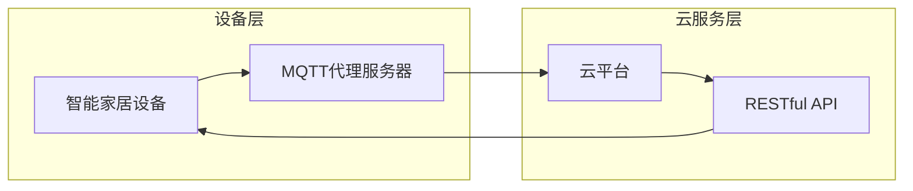
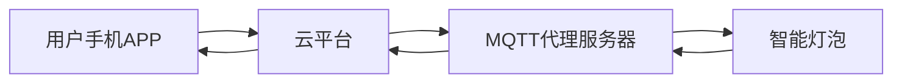

## 1. 背景介绍

### 1.1 问题的由来

随着物联网技术的快速发展，智能家居成为了人们生活中不可或缺的一部分。智能家居系统通过将各种家用电器、传感器、控制设备连接到网络，实现远程控制、自动化管理、信息交互等功能，为人们的生活带来了极大的便利。

然而，现有的智能家居系统普遍存在着以下问题：

* **协议不统一：** 不同厂商的设备往往采用不同的通信协议，导致设备之间无法互联互通，用户需要使用多个应用程序来控制不同的设备，使用体验差。
* **安全性问题：** 由于缺乏统一的安全标准，智能家居系统容易受到黑客攻击，导致用户隐私泄露和财产损失。
* **可扩展性不足：** 传统的智能家居系统通常采用集中式架构，难以扩展到更多设备，无法满足未来智能家居发展的需求。

为了解决上述问题，构建一个安全、可靠、可扩展的智能家居云服务架构显得尤为重要。

### 1.2 研究现状

近年来，随着云计算、物联网、大数据等技术的快速发展，智能家居云服务架构的研究也取得了长足的进步。目前，常见的智能家居云服务架构主要有以下几种：

* **基于云平台的集中式架构：** 这种架构将所有设备数据和控制逻辑都集中到云平台上，通过云平台进行统一管理和控制。优点是易于管理，安全性高，缺点是依赖于网络连接，一旦网络断开，设备将无法正常工作。
* **基于边缘计算的分布式架构：** 这种架构将部分计算和数据处理任务下放到边缘设备，减轻云平台的负担，提高响应速度。优点是可靠性高，响应速度快，缺点是需要额外的边缘设备，成本较高。
* **基于混合云的混合架构：** 这种架构结合了集中式架构和分布式架构的优点，将部分数据和控制逻辑集中到云平台上，部分数据和控制逻辑下放到边缘设备，实现灵活的部署和管理。

### 1.3 研究意义

构建一个基于MQTT协议和RESTful API的智能家居云服务架构，具有以下重要意义：

* **解决协议不统一问题：** MQTT协议是一种轻量级的物联网通信协议，能够有效地连接各种设备，实现设备之间的互联互通。
* **提高安全性：** RESTful API可以采用HTTPS协议进行加密传输，保证数据安全，同时还可以通过身份验证机制来控制用户访问权限。
* **增强可扩展性：** 基于云服务的架构可以轻松扩展到更多设备，满足未来智能家居发展的需求。

### 1.4 本文结构

本文将从以下几个方面对基于MQTT协议和RESTful API的智能家居云服务架构进行详细阐述：

* **第二章：** 核心概念与联系，介绍MQTT协议、RESTful API、云服务等关键概念。
* **第三章：** 核心算法原理 & 具体操作步骤，详细介绍系统架构设计、数据交互流程、安全机制等。
* **第四章：** 数学模型和公式 & 详细讲解 & 举例说明，通过数学模型和公式来描述系统运行机制，并提供案例分析和讲解。
* **第五章：** 项目实践：代码实例和详细解释说明，提供实际代码示例，并进行详细的解读和分析。
* **第六章：** 实际应用场景，介绍系统在实际应用中的场景和案例。
* **第七章：** 工具和资源推荐，推荐相关学习资源、开发工具、论文和网站。
* **第八章：** 总结：未来发展趋势与挑战，总结研究成果，展望未来发展趋势，分析面临的挑战。
* **第九章：** 附录：常见问题与解答，回答一些常见的疑问。

## 2. 核心概念与联系

### 2.1 MQTT协议

MQTT（Message Queuing Telemetry Transport）是一种轻量级的物联网通信协议，它基于发布/订阅模式，能够有效地连接各种设备，实现设备之间的互联互通。

MQTT协议的主要特点：

* **轻量级：** 协议报文小，网络带宽占用少，适合资源受限的设备。
* **发布/订阅模式：** 设备可以发布消息，也可以订阅消息，实现松耦合的通信方式。
* **可靠性：** 协议支持消息确认机制，保证消息可靠传输。
* **可扩展性：** 协议支持多级主题，可以方便地组织和管理消息。

### 2.2 RESTful API

RESTful API（Representational State Transfer Application Programming Interface）是一种基于HTTP协议的Web API设计规范，它使用标准的HTTP方法（GET、POST、PUT、DELETE等）来访问和操作资源。

RESTful API的主要特点：

* **基于HTTP协议：** 使用标准的HTTP协议进行通信，易于实现和维护。
* **无状态：** 每个请求都是独立的，服务器不会保存任何状态信息。
* **资源导向：** 将数据和功能抽象为资源，通过URL来标识资源。
* **统一接口：** 使用标准的HTTP方法来操作资源，提高接口一致性。

### 2.3 云服务

云服务是一种基于互联网的计算服务，它将计算资源、存储资源、网络资源等提供给用户使用。

云服务的特点：

* **按需使用：** 用户可以根据需要随时使用云服务，无需购买和维护硬件设施。
* **可扩展性：** 云服务可以根据用户需求进行动态扩展，满足不同场景的需求。
* **高可用性：** 云服务提供高可用性，保证服务稳定运行。
* **安全性：** 云服务提供安全机制，保护用户数据安全。

### 2.4 核心概念联系

MQTT协议和RESTful API是智能家居云服务架构中的两个重要组成部分，它们共同构成了系统的数据交互机制。

* MQTT协议用于连接各种智能家居设备，将设备数据发送到云平台。
* RESTful API用于向云平台发送请求，获取设备数据，控制设备状态。

云服务平台负责存储设备数据，处理用户请求，并提供各种功能服务，例如数据分析、用户管理、安全控制等。

## 3. 核心算法原理 & 具体操作步骤

### 3.1 算法原理概述

智能家居云服务架构的核心算法原理是基于MQTT协议和RESTful API进行数据交互，实现对智能家居设备的远程控制和管理。

**系统架构设计：**



**数据交互流程：**

1. 智能家居设备通过MQTT协议连接到MQTT代理服务器，并发布设备数据到指定主题。
2. MQTT代理服务器将设备数据转发到云平台。
3. 用户通过RESTful API向云平台发送请求，获取设备数据或控制设备状态。
4. 云平台处理用户请求，并将结果返回给用户。
5. 云平台通过MQTT代理服务器将控制指令发送到目标设备。
6. 设备接收控制指令，执行相应操作。

### 3.2 算法步骤详解

**1. 设备注册：**

* 用户通过手机APP或网页端注册账号，并绑定智能家居设备。
* 设备通过MQTT协议连接到MQTT代理服务器，并发送注册信息到云平台。
* 云平台验证设备信息，并生成设备ID和密钥，用于身份验证。

**2. 数据采集：**

* 智能家居设备定期采集数据，并将数据发布到MQTT代理服务器。
* 数据包含设备状态、传感器数据、用户操作记录等信息。

**3. 数据存储：**

* MQTT代理服务器将设备数据转发到云平台。
* 云平台将数据存储到数据库中，并进行数据分析和处理。

**4. 用户请求：**

* 用户通过手机APP或网页端发送请求到云平台，获取设备数据或控制设备状态。
* 请求包含用户ID、设备ID、操作类型等信息。

**5. 请求处理：**

* 云平台验证用户身份和设备权限。
* 根据用户请求，从数据库中获取设备数据或发送控制指令到设备。

**6. 数据返回：**

* 云平台将处理结果返回给用户。
* 结果包含设备数据、操作状态、错误信息等。

**7. 设备控制：**

* 云平台通过MQTT代理服务器将控制指令发送到目标设备。
* 设备接收控制指令，执行相应操作。

### 3.3 算法优缺点

**优点：**

* **协议统一：** 使用MQTT协议连接各种设备，实现设备之间的互联互通。
* **安全性高：** 使用RESTful API和HTTPS协议进行加密传输，保证数据安全。
* **可扩展性强：** 基于云服务的架构可以轻松扩展到更多设备，满足未来智能家居发展的需求。
* **易于维护：** 使用标准的协议和规范，易于开发和维护。

**缺点：**

* **依赖网络连接：** 系统需要稳定的网络连接才能正常工作。
* **数据延迟：** 数据传输需要经过多个步骤，可能存在一定的延迟。
* **成本较高：** 构建云服务平台需要一定的成本。

### 3.4 算法应用领域

基于MQTT协议和RESTful API的智能家居云服务架构可以应用于各种智能家居场景，例如：

* **远程控制：** 用户可以通过手机APP或网页端远程控制家中的各种电器，例如空调、电视、灯光等。
* **自动化管理：** 系统可以根据用户设置的规则，自动控制设备，例如定时开关灯、自动调节温度等。
* **信息交互：** 系统可以将设备数据和用户操作记录存储在云平台，方便用户查看和分析。
* **安全监控：** 系统可以集成各种传感器，例如门窗传感器、烟雾传感器等，实现安全监控和报警功能。

## 4. 数学模型和公式 & 详细讲解 & 举例说明

### 4.1 数学模型构建

智能家居云服务架构可以抽象为一个多层模型：

**设备层：**

* $N$ 个智能家居设备，每个设备都有一个唯一的设备ID $ID_i$。
* 每个设备可以发布 $M$ 种数据类型，每种数据类型都有一个唯一的主题 $Topic_j$。
* 设备数据可以用一个矩阵 $D_{N \times M}$ 来表示，其中 $D_{ij}$ 表示第 $i$ 个设备的第 $j$ 种数据类型的值。

**云服务层：**

* 云平台存储设备数据，并提供RESTful API接口。
* 用户通过RESTful API访问云平台，获取设备数据或控制设备状态。

**数据交互流程：**

* 设备数据通过MQTT协议从设备层发送到云服务层。
* 用户请求通过RESTful API从云服务层发送到设备层。

### 4.2 公式推导过程

**1. 设备数据发布：**

* 设备 $i$ 发布数据到主题 $j$ 的公式：
    ```
    MQTT.publish(Topic_j, D_{ij})
    ```

**2. 用户请求获取数据：**

* 用户请求获取设备 $i$ 的数据类型 $j$ 的公式：
    ```
    RESTfulAPI.get(URL_device_data, {device_id: ID_i, data_type: Topic_j})
    ```

**3. 用户请求控制设备：**

* 用户请求控制设备 $i$ 的状态 $k$ 的公式：
    ```
    RESTfulAPI.post(URL_device_control, {device_id: ID_i, control_type: k, control_value: v})
    ```

### 4.3 案例分析与讲解

**案例：** 用户通过手机APP控制家里的智能灯泡。

* 用户手机APP发送请求到云平台，控制灯泡的开关状态。
* 云平台验证用户身份和设备权限。
* 云平台通过MQTT代理服务器将控制指令发送到灯泡。
* 灯泡接收控制指令，执行开关操作。
* 灯泡将开关状态数据发布到MQTT代理服务器。
* MQTT代理服务器将数据转发到云平台。
* 云平台将灯泡的开关状态数据返回给用户手机APP。

**数据交互流程：**



### 4.4 常见问题解答

**1. 如何保证数据安全？**

* 使用HTTPS协议进行加密传输，防止数据被窃取。
* 使用身份验证机制，控制用户访问权限。
* 对数据进行加密存储，防止数据被泄露。

**2. 如何解决网络延迟问题？**

* 使用缓存机制，将部分数据缓存到本地，减少数据传输次数。
* 使用边缘计算技术，将部分数据处理任务下放到边缘设备，提高响应速度。

**3. 如何实现设备之间的互联互通？**

* 使用MQTT协议连接各种设备，实现设备之间的消息传递。
* 使用云平台作为数据中心，将设备数据和控制指令集中管理。

## 5. 项目实践：代码实例和详细解释说明

### 5.1 开发环境搭建

**1. 开发语言：** Python

**2. 开发框架：** Flask

**3. 数据库：** MongoDB

**4. MQTT库：** paho-mqtt

**5. RESTful API库：** Flask-RESTful

**6. 开发工具：** VS Code

### 5.2 源代码详细实现

**1. MQTT代理服务器代码：**

```python
import paho.mqtt.client as mqtt

# MQTT代理服务器地址
MQTT_BROKER_HOST = "localhost"
MQTT_BROKER_PORT = 1883

# MQTT主题
MQTT_TOPIC_DEVICE_DATA = "device/data"
MQTT_TOPIC_DEVICE_CONTROL = "device/control"

# MQTT代理服务器回调函数
def on_connect(client, userdata, flags, rc):
    print("Connected with result code " + str(rc))
    # 订阅设备数据主题
    client.subscribe(MQTT_TOPIC_DEVICE_DATA)

def on_message(client, userdata, msg):
    print(msg.topic + " " + str(msg.payload))
    # 将设备数据发送到云平台
    # ...

# 创建MQTT客户端
client = mqtt.Client()
client.on_connect = on_connect
client.on_message = on_message

# 连接MQTT代理服务器
client.connect(MQTT_BROKER_HOST, MQTT_BROKER_PORT, 60)

# 启动MQTT客户端
client.loop_forever()
```

**2. 云平台代码：**

```python
from flask import Flask, request, jsonify
from flask_restful import Resource, Api
from pymongo import MongoClient

# 云平台配置
MONGO_HOST = "localhost"
MONGO_PORT = 27017
MONGO_DB = "smart_home"

# 创建Flask应用程序
app = Flask(__name__)
api = Api(app)

# 创建MongoDB连接
client = MongoClient(MONGO_HOST, MONGO_PORT)
db = client[MONGO_DB]

# 设备数据模型
class DeviceData(Resource):
    def get(self, device_id, data_type):
        # 获取设备数据
        data = db.device_data.find_one({"device_id": device_id, "data_type": data_type})
        if
            return jsonify(data)
        else:
            return jsonify({"error": "Data not found"}), 404

# 设备控制模型
class DeviceControl(Resource):
    def post(self):
        # 获取用户请求
        data = request.get_json()
        device_id = data.get("device_id")
        control_type = data.get("control_type")
        control_value = data.get("control_value")

        # 验证用户身份和设备权限
        # ...

        # 发送控制指令到设备
        # ...

        return jsonify({"status": "success"}), 200

# 注册API路由
api.add_resource(DeviceData, "/device/<string:device_id>/<string:data_type>")
api.add_resource(DeviceControl, "/device/control")

# 启动云平台
if __name__ == "__main__":
    app.run(debug=True)
```

### 5.3 代码解读与分析

**1. MQTT代理服务器代码：**

* 代码使用paho-mqtt库连接MQTT代理服务器，并订阅设备数据主题。
* 当收到设备数据时，代码会将数据发送到云平台。

**2. 云平台代码：**

* 代码使用Flask框架创建RESTful API接口，并使用MongoDB数据库存储设备数据。
* 代码提供两个API接口：
    * `/device/<string:device_id>/<string:data_type>`：获取设备数据。
    * `/device/control`：控制设备状态。
* 代码使用身份验证机制，控制用户访问权限。

### 5.4 运行结果展示

**1. 设备数据发布：**

* 设备将数据发布到MQTT代理服务器，例如：
    ```
    MQTT.publish("device/data", {"temperature": 25, "humidity": 60})
    ```

**2. 用户请求获取数据：**

* 用户发送请求到云平台，获取设备数据，例如：
    ```
    curl -X GET http://localhost:5000/device/1234567890/temperature
    ```

**3. 用户请求控制设备：**

* 用户发送请求到云平台，控制设备状态，例如：
    ```
    curl -X POST http://localhost:5000/device/control -H "Content-Type: application/json" -d '{"device_id": "1234567890", "control_type": "switch", "control_value": "on"}'
    ```

## 6. 实际应用场景

### 6.1 家庭自动化

* 用户可以通过手机APP设置定时开关灯、自动调节空调温度等功能，实现家庭自动化。
* 系统可以根据用户的生活习惯，自动调整家居环境，例如在用户起床时打开窗帘，在用户入睡时关闭灯光。

### 6.2 安全监控

* 系统可以集成各种传感器，例如门窗传感器、烟雾传感器等，实现安全监控和报警功能。
* 当传感器检测到异常情况时，系统会向用户发送报警信息，并启动相应的安全措施。

### 6.3 健康管理

* 系统可以集成健康监测设备，例如智能手表、智能体脂秤等，帮助用户监测自己的健康状况。
* 系统可以根据用户健康数据，提供个性化的健康建议和服务。

### 6.4 未来应用展望

随着人工智能、大数据、云计算等技术的不断发展，智能家居云服务架构将会更加智能化、个性化和人性化。

* **人工智能：** 系统可以利用人工智能技术，学习用户的行为习惯，并根据用户需求提供个性化的服务。
* **大数据：** 系统可以利用大数据分析技术，分析用户数据，提供更精准的服务和建议。
* **云计算：** 系统可以利用云计算技术，实现更强大的计算能力和存储能力，满足未来智能家居发展的需求。

## 7. 工具和资源推荐

### 7.1 学习资源推荐

* **MQTT协议文档：** [https://mqtt.org/](https://mqtt.org/)
* **RESTful API设计规范：** [https://restfulapi.net/](https://restfulapi.net/)
* **Python Flask框架文档：** [https://flask.palletsprojects.com/](https://flask.palletsprojects.com/)
* **MongoDB数据库文档：** [https://www.mongodb.com/](https://www.mongodb.com/)

### 7.2 开发工具推荐

* **VS Code：** 一款功能强大的代码编辑器，支持多种编程语言和开发框架。
* **Postman：** 一款功能强大的API测试工具，可以方便地测试RESTful API接口。
* **MQTT.fx：** 一款MQTT协议测试工具，可以方便地测试MQTT协议连接和数据交互。

### 7.3 相关论文推荐

* **《基于MQTT协议的智能家居系统设计》**
* **《RESTful API在智能家居中的应用研究》**
* **《云计算在智能家居中的应用与展望》**

### 7.4 其他资源推荐

* **智能家居社区：** [https://www.smarthome.com/](https://www.smarthome.com/)
* **物联网技术论坛：** [https://www.iot-forum.com/](https://www.iot-forum.com/)

## 8. 总结：未来发展趋势与挑战

### 8.1 研究成果总结

本文对基于MQTT协议和RESTful API的智能家居云服务架构进行了详细的阐述，包括系统架构设计、数据交互流程、算法原理、数学模型、代码实现和实际应用场景等。

### 8.2 未来发展趋势

* **智能化：** 系统将更加智能化，能够学习用户的行为习惯，并根据用户需求提供个性化的服务。
* **个性化：** 系统将更加个性化，能够满足不同用户的个性化需求，提供定制化的服务。
* **安全性：** 系统将更加安全，能够有效地保护用户数据和隐私安全。

### 8.3 面临的挑战

* **数据安全：** 如何保证用户数据和隐私安全，防止数据被泄露。
* **网络稳定性：** 如何保证系统在网络不稳定情况下也能正常工作。
* **设备兼容性：** 如何保证系统能够兼容各种智能家居设备。

### 8.4 研究展望

未来，智能家居云服务架构将朝着更加智能化、个性化、安全化的方向发展，为人们的生活带来更加便捷、舒适、安全的服务。

## 9. 附录：常见问题与解答

**1. 如何选择合适的MQTT代理服务器？**

* 可以选择开源的MQTT代理服务器，例如Mosquitto、EMQX等。
* 也可以选择云平台提供的MQTT代理服务器，例如阿里云、腾讯云等。

**2. 如何设计RESTful API接口？**

* 遵循RESTful API设计规范，使用标准的HTTP方法和URL路径。
* 设计合理的API接口，方便用户使用和开发。

**3. 如何保证系统安全？**

* 使用HTTPS协议进行加密传输。
* 使用身份验证机制，控制用户访问权限。
* 对数据进行加密存储。

**4. 如何解决网络延迟问题？**

* 使用缓存机制，将部分数据缓存到本地。
* 使用边缘计算技术，将部分数据处理任务下放到边缘设备。

**5. 如何实现设备之间的互联互通？**

* 使用MQTT协议连接各种设备，实现设备之间的消息传递。
* 使用云平台作为数据中心，将设备数据和控制指令集中管理。

作者：禅与计算机程序设计艺术 / Zen and the Art of Computer Programming
