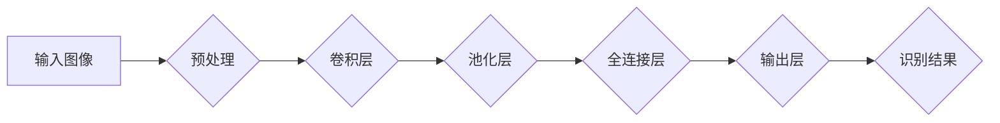

>  深度学习、卷积神经网络、图像分类、植物识别、野生植物

## 1. 背景介绍

随着人工智能技术的飞速发展，深度学习在图像识别领域取得了突破性的进展。其中，卷积神经网络（CNN）凭借其强大的特征提取能力，在图像分类、目标检测等任务中表现出色。野生植物识别作为一项重要的应用场景，在生态保护、生物多样性研究、农业生产等领域具有重要意义。

传统的野生植物识别方法主要依赖于人工经验和专家的知识，效率低下且容易出现误判。而基于深度学习的野生植物识别模型能够自动学习植物特征，提高识别准确率和效率。近年来，越来越多的研究者致力于开发高效、准确的野生植物识别模型。

## 2. 核心概念与联系

**2.1 核心概念**

* **深度学习 (Deep Learning):** 一种机器学习的子领域，利用多层神经网络模拟人类大脑的学习过程，从大量数据中自动学习特征。
* **卷积神经网络 (Convolutional Neural Network, CNN):** 一种专门用于处理图像数据的深度学习网络结构，通过卷积操作提取图像特征，具有强大的特征学习能力。
* **图像分类 (Image Classification):** 将图像归类到预定义的类别中，是计算机视觉领域的基础任务之一。
* **野生植物识别 (Wild Plant Recognition):** 利用计算机视觉技术识别野生植物的种类，并提供相关信息。

**2.2 架构图**



**2.3 核心联系**

深度学习中的卷积神经网络能够有效地提取图像特征，并将其用于图像分类任务。野生植物识别模型利用CNN的强大特征提取能力，从图像中学习植物的特征，从而实现对野生植物的识别。

## 3. 核心算法原理 & 具体操作步骤

**3.1 算法原理概述**

卷积神经网络 (CNN) 是一种专门用于处理图像数据的深度学习网络结构。其核心思想是通过卷积操作和池化操作提取图像特征，并利用全连接层进行分类。

**3.2 算法步骤详解**

1. **输入图像预处理:** 将原始图像转换为适合CNN输入的格式，例如调整尺寸、归一化像素值等。
2. **卷积层:** 使用多个卷积核对图像进行卷积操作，提取图像局部特征。每个卷积核对应一个特征图，多个特征图组合形成卷积层的输出。
3. **池化层:** 对卷积层的输出进行池化操作，例如最大池化或平均池化，降低特征图的尺寸，同时保留重要的特征信息。
4. **全连接层:** 将池化层的输出展平，连接到全连接层，进行特征融合和分类。
5. **输出层:** 全连接层的输出经过激活函数处理，得到最终的识别结果，即植物的种类。

**3.3 算法优缺点**

**优点:**

* **强大的特征提取能力:** CNN能够自动学习图像特征，无需人工设计特征。
* **鲁棒性强:** CNN对图像的旋转、缩放、平移等变换具有较强的鲁棒性。
* **准确率高:** CNN在图像分类任务中取得了优异的性能。

**缺点:**

* **训练数据量大:** CNN需要大量的训练数据才能达到较高的准确率。
* **计算量大:** CNN的训练和推理过程计算量较大，需要强大的计算资源。
* **可解释性差:** CNN的决策过程较为复杂，难以解释其识别结果。

**3.4 算法应用领域**

* **图像识别:** 人脸识别、物体检测、场景理解等。
* **自然语言处理:** 文本分类、情感分析、机器翻译等。
* **语音识别:** 语音转文本、语音助手等。
* **医疗诊断:** 病灶检测、疾病诊断等。

## 4. 数学模型和公式 & 详细讲解 & 举例说明

**4.1 数学模型构建**

假设输入图像为 $I \in R^{H \times W \times C}$，其中 $H$ 为图像高度，$W$ 为图像宽度，$C$ 为通道数。卷积神经网络的输出可以表示为：

$$
Y = f(W * I + b)
$$

其中：

* $Y \in R^{N \times M}$ 为网络输出，$N$ 和 $M$ 分别为输出特征图的高度和宽度。
* $W$ 为卷积核权重，其大小为 $K \times K \times C$。
* $b$ 为卷积核偏置项。
* $f$ 为激活函数，例如ReLU函数。
* $*$ 表示卷积操作。

**4.2 公式推导过程**

卷积操作的数学定义为：

$$
(W * I)_{i,j} = \sum_{m=0}^{K-1} \sum_{n=0}^{K-1} W_{m,n} * I_{i+m,j+n}
$$

其中：

* $(W * I)_{i,j}$ 为卷积结果的第 $i$ 行第 $j$ 列元素。
* $W_{m,n}$ 为卷积核的第 $m$ 行第 $n$ 列元素。
* $I_{i+m,j+n}$ 为输入图像的第 $i+m$ 行第 $j+n$ 列元素。

**4.3 案例分析与讲解**

假设输入图像为一个 $32 \times 32$ 的彩色图像，卷积核大小为 $3 \times 3$，通道数为 3。则卷积操作的结果将是一个 $30 \times 30$ 的特征图。

## 5. 项目实践：代码实例和详细解释说明

**5.1 开发环境搭建**

* 操作系统: Ubuntu 20.04
* Python 版本: 3.8
* 深度学习框架: TensorFlow 2.0

**5.2 源代码详细实现**

```python
import tensorflow as tf

# 定义卷积神经网络模型
model = tf.keras.models.Sequential([
    tf.keras.layers.Conv2D(32, (3, 3), activation='relu', input_shape=(32, 32, 3)),
    tf.keras.layers.MaxPooling2D((2, 2)),
    tf.keras.layers.Conv2D(64, (3, 3), activation='relu'),
    tf.keras.layers.MaxPooling2D((2, 2)),
    tf.keras.layers.Flatten(),
    tf.keras.layers.Dense(10, activation='softmax')
])

# 编译模型
model.compile(optimizer='adam',
              loss='sparse_categorical_crossentropy',
              metrics=['accuracy'])

# 训练模型
model.fit(x_train, y_train, epochs=10)

# 评估模型
loss, accuracy = model.evaluate(x_test, y_test)
print('Loss:', loss)
print('Accuracy:', accuracy)
```

**5.3 代码解读与分析**

* 模型定义: 使用 `tf.keras.models.Sequential` 创建一个顺序模型，并添加卷积层、池化层、全连接层等。
* 激活函数: 使用ReLU函数作为卷积层和全连接层的激活函数。
* 损失函数: 使用 `sparse_categorical_crossentropy` 作为损失函数，用于多分类任务。
* 优化器: 使用 `adam` 作为优化器，用于更新模型参数。
* 训练和评估: 使用 `model.fit` 函数训练模型，使用 `model.evaluate` 函数评估模型性能。

**5.4 运行结果展示**

训练完成后，可以将模型应用于新的图像数据进行识别。

## 6. 实际应用场景

**6.1 生态保护:**

* 自动识别入侵物种，帮助保护本地生态系统。
* 监测植物种群变化，评估生态环境健康状况。

**6.2 生物多样性研究:**

* 记录和分类野生植物物种，丰富生物多样性数据库。
* 研究植物分布规律，了解物种间的相互关系。

**6.3 农业生产:**

* 识别病虫害，及时采取防治措施。
* 辅助种植管理，提高农业生产效率。

**6.4 未来应用展望**

* **移动端应用:** 开发基于移动端的野生植物识别应用程序，方便大众进行植物识别。
* **增强现实 (AR) 应用:** 将野生植物识别与 AR 技术结合，实现虚拟植物标本展示和互动学习。
* **个性化植物推荐:** 根据用户的地理位置、喜好等信息，推荐适合种植的野生植物。

## 7. 工具和资源推荐

**7.1 学习资源推荐**

* **书籍:**
    * 深度学习 (Deep Learning) - Ian Goodfellow, Yoshua Bengio, Aaron Courville
    * 构建深度学习模型 (Hands-On Machine Learning with Scikit-Learn, Keras & TensorFlow) - Aurélien Géron
* **在线课程:**
    * TensorFlow 官方教程: https://www.tensorflow.org/tutorials
    * Coursera 深度学习课程: https://www.coursera.org/specializations/deep-learning

**7.2 开发工具推荐**

* **深度学习框架:** TensorFlow, PyTorch, Keras
* **图像处理库:** OpenCV, Pillow
* **数据可视化工具:** Matplotlib, Seaborn

**7.3 相关论文推荐**

* AlexNet: ImageNet Classification with Deep Convolutional Neural Networks (Krizhevsky et al., 2012)
* VGGNet: Very Deep Convolutional Networks for Large-Scale Image Recognition (Simonyan & Zisserman, 2014)
* ResNet: Deep Residual Learning for Image Recognition (He et al., 2016)

## 8. 总结：未来发展趋势与挑战

**8.1 研究成果总结**

基于深度学习的野生植物识别模型取得了显著的进展，能够实现高准确率的识别。

**8.2 未来发展趋势**

* **模型更深更广:** 探索更深层次的网络结构，并结合其他模型，例如Transformer，提高识别精度和泛化能力。
* **数据增强:** 利用数据增强技术，生成更多训练数据，提高模型鲁棒性。
* **跨模态融合:** 将图像识别与其他模态信息，例如文本、声音等，进行融合，实现更全面的植物识别。

**8.3 面临的挑战**

* **数据标注:** 野生植物种类繁多，标注高质量的训练数据成本高昂。
* **模型解释性:** CNN的决策过程较为复杂，难以解释其识别结果，这限制了模型在实际应用中的可信度。
* **计算资源:** 训练大型深度学习模型需要大量的计算资源，这对于资源有限的机构或个人来说是一个挑战。

**8.4 研究展望**

未来，我们将继续致力于开发更准确、更鲁棒、更易解释的野生植物识别模型，并将其应用于生态保护、生物多样性研究、农业生产等领域，为人类社会做出贡献。

## 9. 附录：常见问题与解答

**9.1 如何选择合适的卷积核大小？**

卷积核大小的选择取决于图像分辨率和特征提取的层次。一般来说，较小的卷积核可以提取局部特征，较大的卷积核可以提取全局特征。

**9.2 如何进行数据增强？**

数据增强技术可以利用图像变换，例如旋转、缩放、平移、翻转等，生成更多训练数据，提高模型鲁棒性。

**9.3 如何评估模型性能？**

模型性能可以通过准确率、召回率、F1-score等指标进行评估。

作者：禅与计算机程序设计艺术 / Zen and the Art of Computer Programming


<end_of_turn>