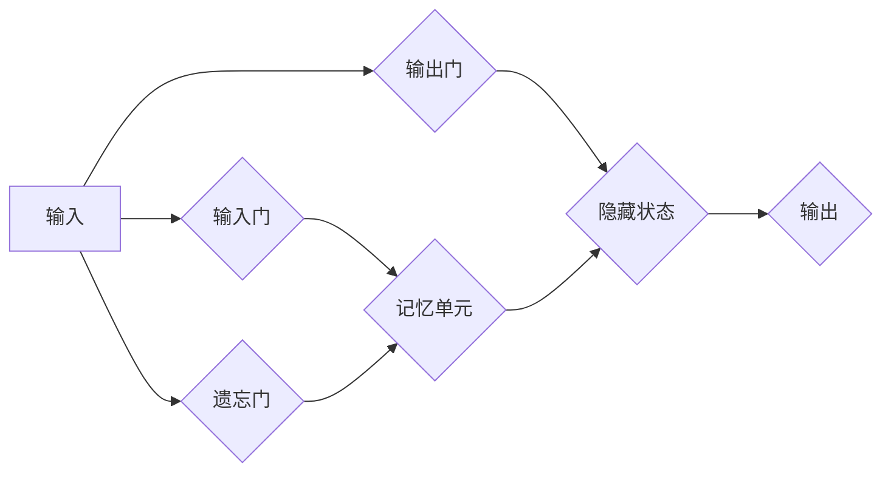

> 长短时记忆网络(LSTM)，循环神经网络(RNN)，序列数据，自然语言处理，机器翻译，时间序列预测

## 1. 背景介绍

在深度学习领域，处理序列数据一直是一个重要的挑战。传统的循环神经网络(RNN)在处理长序列数据时容易出现梯度消失或梯度爆炸问题，限制了其性能。为了解决这个问题，长短时记忆网络(LSTM)应运而生。LSTM是一种特殊的RNN结构，通过引入记忆单元和门控机制，能够有效地捕捉长序列中的依赖关系，从而在自然语言处理、机器翻译、时间序列预测等领域取得了显著的成果。

## 2. 核心概念与联系

LSTM的核心思想是通过记忆单元和门控机制来控制信息的流动，从而解决传统RNN的梯度消失问题。

**2.1 记忆单元**

记忆单元是LSTM的核心组成部分，它类似于一个容器，可以存储长期依赖信息。记忆单元的初始状态为零向量，在每个时间步长都会根据输入信息和隐藏状态进行更新。

**2.2 门控机制**

LSTM使用三个门控机制来控制信息的流动：

* **输入门**: 控制哪些信息被添加到记忆单元中。
* **遗忘门**: 控制哪些信息被从记忆单元中遗忘。
* **输出门**: 控制哪些信息从记忆单元中输出。

**2.3 LSTM结构**

LSTM的结构可以看作是一个循环网络，每个时间步长都会进行以下操作：

1. 计算输入门、遗忘门和输出门的激活值。
2. 根据门控机制更新记忆单元的状态。
3. 根据记忆单元的状态和当前输入信息计算隐藏状态。
4. 将隐藏状态作为下一个时间步长的输入。

**Mermaid 流程图**



## 3. 核心算法原理 & 具体操作步骤

### 3.1  算法原理概述

LSTM算法的核心原理是通过门控机制控制信息的流动，从而实现对长序列数据的有效捕捉。

### 3.2  算法步骤详解

1. **初始化**: 初始化记忆单元的状态为零向量，并设置隐藏状态为初始值。
2. **输入门**: 计算输入门的值，该值决定了哪些信息会被添加到记忆单元中。
3. **遗忘门**: 计算遗忘门的值，该值决定了哪些信息会被从记忆单元中遗忘。
4. **记忆单元更新**: 根据输入门、遗忘门和当前输入信息更新记忆单元的状态。
5. **输出门**: 计算输出门的值，该值决定了哪些信息会被从记忆单元中输出。
6. **隐藏状态计算**: 根据记忆单元的状态和当前输入信息计算隐藏状态。
7. **输出**: 将隐藏状态作为下一个时间步长的输入，并输出当前时间步长的结果。

### 3.3  算法优缺点

**优点**:

* 能够有效地捕捉长序列中的依赖关系。
* 解决了传统RNN的梯度消失问题。
* 在自然语言处理、机器翻译、时间序列预测等领域取得了显著的成果。

**缺点**:

* 计算复杂度较高。
* 训练时间较长。

### 3.4  算法应用领域

LSTM算法广泛应用于以下领域:

* **自然语言处理**: 文本分类、情感分析、机器翻译、文本生成等。
* **语音识别**: 语音转文本、语音合成等。
* **时间序列预测**: 股票预测、天气预报、电力负荷预测等。

## 4. 数学模型和公式 & 详细讲解 & 举例说明

### 4.1  数学模型构建

LSTM的数学模型可以表示为以下公式:

* **输入门**: $i_t = \sigma(W_{xi}x_t + W_{hi}h_{t-1} + b_i)$
* **遗忘门**: $f_t = \sigma(W_{xf}x_t + W_{hf}h_{t-1} + b_f)$
* **记忆单元更新**: $\tilde{C}_t = \tanh(W_{xc}x_t + W_{hc}h_{t-1} + b_c)$
* **记忆单元**: $C_t = f_t * C_{t-1} + i_t * \tilde{C}_t$
* **输出门**: $o_t = \sigma(W_{xo}x_t + W_{ho}h_{t-1} + b_o)$
* **隐藏状态**: $h_t = o_t * \tanh(C_t)$

其中:

* $x_t$ 是当前时间步长的输入向量。
* $h_t$ 是当前时间步长的隐藏状态向量。
* $C_t$ 是当前时间步长的记忆单元状态向量。
* $\sigma$ 是sigmoid激活函数。
* $\tanh$ 是tanh激活函数。
* $W_{ij}$ 是连接层 $i$ 和层 $j$ 的权重矩阵。
* $b_i$ 是连接层 $i$ 的偏置向量。

### 4.2  公式推导过程

LSTM的公式推导过程较为复杂，涉及到矩阵运算和激活函数的应用。

### 4.3  案例分析与讲解

通过对LSTM算法的数学模型和公式进行分析，我们可以更好地理解其工作原理。例如，我们可以分析输入门、遗忘门和输出门的计算过程，以及它们如何控制信息的流动。

## 5. 项目实践：代码实例和详细解释说明

### 5.1  开发环境搭建

为了实现LSTM算法，我们需要搭建一个开发环境。常用的开发环境包括Python、TensorFlow、Keras等。

### 5.2  源代码详细实现

```python
import tensorflow as tf

# 定义LSTM模型
model = tf.keras.models.Sequential([
    tf.keras.layers.LSTM(units=128, return_sequences=True, input_shape=(timesteps, features)),
    tf.keras.layers.LSTM(units=64),
    tf.keras.layers.Dense(units=1)
])

# 编译模型
model.compile(optimizer='adam', loss='mse')

# 训练模型
model.fit(X_train, y_train, epochs=10)

# 评估模型
loss = model.evaluate(X_test, y_test)
```

### 5.3  代码解读与分析

这段代码实现了基本的LSTM模型。

* `tf.keras.layers.LSTM` 是LSTM层，`units` 参数指定LSTM单元的数量，`return_sequences=True` 表示返回所有时间步长的输出，`input_shape` 指定输入数据的形状。
* `tf.keras.layers.Dense` 是全连接层，用于输出最终结果。
* `model.compile` 用于编译模型，指定优化器、损失函数等参数。
* `model.fit` 用于训练模型，`epochs` 参数指定训练轮数。
* `model.evaluate` 用于评估模型的性能。

### 5.4  运行结果展示

训练完成后，我们可以使用测试数据评估模型的性能。

## 6. 实际应用场景

### 6.1  自然语言处理

LSTM在自然语言处理领域有着广泛的应用，例如:

* **机器翻译**: LSTM可以学习语言之间的映射关系，实现机器翻译。
* **文本分类**: LSTM可以学习文本的语义特征，用于文本分类任务。
* **情感分析**: LSTM可以分析文本中的情感倾向，用于情感分析任务。

### 6.2  语音识别

LSTM在语音识别领域也取得了显著的成果，例如:

* **语音转文本**: LSTM可以将语音信号转换为文本。
* **语音合成**: LSTM可以生成逼真的语音信号。

### 6.3  时间序列预测

LSTM在时间序列预测领域也具有很强的能力，例如:

* **股票预测**: LSTM可以预测股票价格的走势。
* **天气预报**: LSTM可以预测未来的天气状况。
* **电力负荷预测**: LSTM可以预测电力的负荷情况。

### 6.4  未来应用展望

随着深度学习技术的不断发展，LSTM算法的应用场景将会更加广泛。例如，在医疗领域，LSTM可以用于疾病诊断和预测；在金融领域，LSTM可以用于风险评估和欺诈检测。

## 7. 工具和资源推荐

### 7.1  学习资源推荐

* **书籍**:
    * 《深度学习》
    * 《自然语言处理》
* **在线课程**:
    * Coursera: 深度学习
    * Udacity: 自然语言处理
* **博客**:
    * TensorFlow Blog
    * Keras Blog

### 7.2  开发工具推荐

* **TensorFlow**: 一个开源的机器学习框架。
* **Keras**: 一个基于TensorFlow的深度学习框架。
* **PyTorch**: 另一个开源的机器学习框架。

### 7.3  相关论文推荐

* **Long Short-Term Memory**
* **Recurrent Neural Networks for Sequence Learning**

## 8. 总结：未来发展趋势与挑战

### 8.1  研究成果总结

LSTM算法在处理序列数据方面取得了显著的成果，并在自然语言处理、语音识别、时间序列预测等领域得到了广泛应用。

### 8.2  未来发展趋势

* **模型复杂度提升**: 研究更复杂的LSTM模型，例如双向LSTM、门控循环单元(GRU)等。
* **硬件加速**: 利用GPU等硬件加速LSTM模型的训练和推理。
* **应用场景拓展**: 将LSTM算法应用于更多领域，例如医疗、金融等。

### 8.3  面临的挑战

* **训练时间长**: LSTM模型的训练时间较长，需要更高效的训练方法。
* **参数量大**: LSTM模型的参数量较大，需要更多的计算资源。
* **可解释性差**: LSTM模型的决策过程难以解释，需要研究更可解释的模型。

### 8.4  研究展望

未来，LSTM算法的研究将继续深入，探索更有效的训练方法、更复杂的模型结构和更广泛的应用场景。


## 9. 附录：常见问题与解答

### 9.1  Q1: LSTM和RNN的区别是什么？

### 9.2  A1:

RNN是循环神经网络，而LSTM是循环神经网络的一种特殊结构。RNN容易出现梯度消失或梯度爆炸问题，而LSTM通过引入记忆单元和门控机制，能够有效地解决这个问题。

### 9.3  Q2: LSTM的应用场景有哪些？

### 9.4  A2:

LSTM的应用场景非常广泛，包括自然语言处理、语音识别、时间序列预测等。

### 9.5  Q3: 如何训练LSTM模型？

### 9.6  A3:

训练LSTM模型需要使用深度学习框架，例如TensorFlow或Keras。需要准备训练数据，并使用合适的优化器和损失函数进行训练。

作者：禅与计算机程序设计艺术 / Zen and the Art of Computer Programming


<end_of_turn>