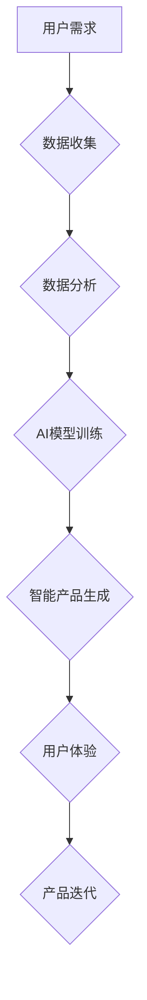

> AI、产品重做、机器学习、深度学习、自然语言处理、计算机视觉、数据驱动、用户体验

## 1. 背景介绍

当人工智能（AI）技术日新月异，并开始渗透到生活的方方面面时，我们不得不思考：现有的产品是否能够适应这个全新的时代？ 传统的软件开发模式，以用户需求为中心，往往依赖于人为的定义和设计。然而，随着AI技术的进步，我们可以利用机器学习、深度学习等算法，从海量数据中挖掘出用户需求，并自动生成更符合用户实际需求的产品。

因此，面向AI时代的“产品重做”成为必然趋势。它意味着我们不仅要重新思考产品的功能和设计，更要重新构建产品的开发模式，将AI技术融入到产品的设计、开发、运营的全生命周期中。

## 2. 核心概念与联系

**2.1 产品重做**

产品重做是指对现有产品进行全面性的改造和升级，使其能够适应新的市场环境、用户需求和技术发展趋势。在面向AI时代，产品重做不仅限于功能的更新和界面设计的改进，更重要的是要将AI技术融入到产品的核心逻辑中，使其能够具备更智能、更个性化的体验。

**2.2 AI技术**

人工智能（AI）是指模拟人类智能行为的计算机系统。它涵盖了多个领域，包括机器学习、深度学习、自然语言处理、计算机视觉等。

**2.3 数据驱动**

数据驱动是指利用数据来指导产品的设计、开发和运营。在AI时代，数据成为产品发展的基石，AI算法能够从海量数据中挖掘出用户需求、行为模式和潜在趋势，为产品开发提供决策依据。

**2.4 用户体验**

用户体验（UX）是指用户使用产品时所感受到的整体感受。在面向AI时代，用户体验更加注重个性化、智能化和便捷性。AI技术能够根据用户的行为和偏好，提供定制化的产品体验，提升用户满意度和忠诚度。

**2.5 流程图**



## 3. 核心算法原理 & 具体操作步骤

**3.1 算法原理概述**

面向AI时代的产品重做主要依赖于机器学习和深度学习算法。

* **机器学习**是一种人工智能技术，它允许计算机从数据中学习，并根据学习到的知识进行预测或决策。机器学习算法可以分为监督学习、无监督学习和强化学习三大类。

* **深度学习**是一种更高级的机器学习算法，它利用多层神经网络来模拟人类大脑的学习过程。深度学习算法在图像识别、自然语言处理等领域取得了突破性的进展。

**3.2 算法步骤详解**

1. **数据收集:** 收集与产品相关的海量数据，例如用户行为数据、产品使用数据、市场趋势数据等。
2. **数据预处理:** 对收集到的数据进行清洗、转换和格式化，使其能够被AI算法所使用。
3. **特征工程:** 从原始数据中提取出具有代表性的特征，这些特征能够反映用户需求、产品功能和市场趋势。
4. **模型选择:** 根据产品的具体需求选择合适的机器学习或深度学习算法。
5. **模型训练:** 利用训练数据训练选择的算法模型，使其能够学习到数据中的规律和模式。
6. **模型评估:** 使用测试数据评估模型的性能，并根据评估结果进行模型调优。
7. **模型部署:** 将训练好的模型部署到生产环境中，使其能够实时处理用户请求并提供智能化服务。

**3.3 算法优缺点**

* **优点:**

    * 自动化决策: AI算法能够自动分析数据并做出决策，提高效率和准确性。
    * 个性化体验: AI算法能够根据用户的行为和偏好提供定制化的产品体验。
    * 数据驱动: AI算法能够利用数据驱动产品开发，使其更加符合用户需求。

* **缺点:**

    * 数据依赖: AI算法依赖于海量数据，数据质量直接影响算法性能。
    * 黑盒问题: 一些深度学习算法难以解释其决策过程，导致缺乏透明度。
    * 伦理问题: AI算法可能存在偏见和歧视，需要进行伦理审查和监管。

**3.4 算法应用领域**

* **推荐系统:** 根据用户的历史行为和偏好，推荐相关产品或内容。
* **个性化营销:** 根据用户的特征和行为，进行精准的营销推广。
* **智能客服:** 利用自然语言处理技术，提供智能化的客户服务。
* **自动驾驶:** 利用计算机视觉和机器学习技术，实现自动驾驶功能。

## 4. 数学模型和公式 & 详细讲解 & 举例说明

**4.1 数学模型构建**

在机器学习中，常用的数学模型包括线性回归、逻辑回归、支持向量机、决策树等。这些模型都基于一定的数学公式，用来描述数据之间的关系和预测结果。

**4.2 公式推导过程**

例如，线性回归模型的目标是找到一条直线，能够最佳地拟合数据点。其数学公式如下：

$$y = mx + c$$

其中，y是预测值，x是输入特征，m是斜率，c是截距。

通过最小二乘法，可以求解出m和c的值，使得预测值与实际值之间的误差最小。

**4.3 案例分析与讲解**

假设我们有一个数据集，包含学生的学习时间和考试成绩。我们可以使用线性回归模型来预测学生的考试成绩。

通过训练模型，我们发现学习时间和考试成绩之间存在正相关关系，即学习时间越长，考试成绩越高。

我们可以使用模型预测某个学生在学习一定时间后可能获得的考试成绩。

## 5. 项目实践：代码实例和详细解释说明

**5.1 开发环境搭建**

* Python 3.x
* TensorFlow 或 PyTorch
* Jupyter Notebook

**5.2 源代码详细实现**

```python
import tensorflow as tf

# 定义模型
model = tf.keras.models.Sequential([
    tf.keras.layers.Dense(64, activation='relu', input_shape=(1,)),
    tf.keras.layers.Dense(1)
])

# 编译模型
model.compile(optimizer='adam', loss='mse')

# 训练模型
model.fit(x_train, y_train, epochs=100)

# 预测结果
predictions = model.predict(x_test)
```

**5.3 代码解读与分析**

* 我们使用TensorFlow框架构建了一个简单的线性回归模型。
* 模型包含两层神经网络，第一层有64个神经元，使用ReLU激活函数，输入特征维度为1。
* 第二层只有一个神经元，输出预测值。
* 我们使用Adam优化器和均方误差损失函数来训练模型。
* 训练模型100个epochs后，我们可以使用模型预测新的数据。

**5.4 运行结果展示**

训练完成后，我们可以使用模型预测新的数据，并与实际值进行比较，评估模型的性能。

## 6. 实际应用场景

**6.1 产品推荐**

电商平台可以利用AI算法分析用户的购买历史和浏览记录，推荐相关的商品，提高用户转化率。

**6.2 个性化营销**

广告平台可以利用AI算法分析用户的兴趣爱好和行为模式，进行精准的广告投放，提高广告效果。

**6.3 智能客服**

客服系统可以利用自然语言处理技术，自动回复用户的常见问题，提高客服效率。

**6.4 未来应用展望**

* **更智能的虚拟助手:** AI虚拟助手将能够更深入地理解用户的需求，并提供更个性化的服务。
* **更安全的网络环境:** AI技术可以用于检测和防御网络攻击，提高网络安全。
* **更便捷的出行体验:** AI技术可以用于优化交通流量，提高出行效率。

## 7. 工具和资源推荐

**7.1 学习资源推荐**

* **在线课程:** Coursera、edX、Udacity等平台提供丰富的AI课程。
* **书籍:** 《深度学习》、《机器学习实战》等书籍是学习AI技术的经典教材。
* **开源项目:** TensorFlow、PyTorch等开源项目提供了丰富的代码示例和学习资源。

**7.2 开发工具推荐**

* **TensorFlow:** Google开发的开源机器学习框架。
* **PyTorch:** Facebook开发的开源机器学习框架。
* **Scikit-learn:** Python机器学习库。

**7.3 相关论文推荐**

* **《ImageNet Classification with Deep Convolutional Neural Networks》**
* **《Attention Is All You Need》**
* **《BERT: Pre-training of Deep Bidirectional Transformers for Language Understanding》**

## 8. 总结：未来发展趋势与挑战

**8.1 研究成果总结**

面向AI时代的“产品重做”取得了显著成果，AI技术已经应用于各个领域，为用户带来了更智能、更便捷的体验。

**8.2 未来发展趋势**

* **更强大的AI算法:** AI算法将更加强大，能够处理更复杂的数据，并做出更准确的预测。
* **更广泛的应用场景:** AI技术将应用于更多领域，例如医疗、教育、金融等。
* **更注重伦理和安全:** AI技术的发展需要更加注重伦理和安全问题，确保AI技术能够安全、可靠地应用于社会。

**8.3 面临的挑战**

* **数据隐私和安全:** AI算法依赖于海量数据，如何保护用户数据隐私和安全是一个重要的挑战。
* **算法可解释性和透明度:** 一些深度学习算法难以解释其决策过程，缺乏透明度，需要进一步研究。
* **AI伦理和社会影响:** AI技术的发展可能带来一些伦理和社会问题，需要进行深入探讨和监管。

**8.4 研究展望**

未来，我们需要继续研究更强大的AI算法，并将其应用于更多领域，同时也要关注AI技术的伦理和社会影响，确保AI技术能够造福人类。

## 9. 附录：常见问题与解答

**9.1 如何选择合适的AI算法？**

选择合适的AI算法取决于具体应用场景和数据特点。例如，对于分类问题，可以考虑使用支持向量机或决策树；对于回归问题，可以考虑使用线性回归或神经网络。

**9.2 如何处理不完整的数据？**

处理不完整的数据可以使用多种方法，例如删除缺失值、填充缺失值或使用缺失值指示器。

**9.3 如何评估AI模型的性能？**

可以使用多种指标来评估AI模型的性能，例如准确率、召回率、F1-score等。

作者：禅与计算机程序设计艺术 / Zen and the Art of Computer Programming


<end_of_turn>