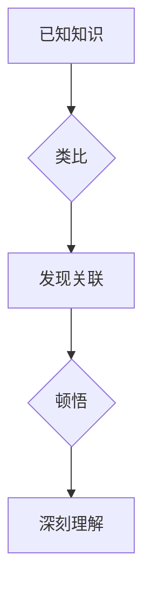

> 顿悟、类比、知识迁移、人工智能、机器学习、深度学习、认知科学、神经网络

## 1. 背景介绍

在知识爆炸的时代，人类面临着海量信息的挑战。如何高效地获取、理解和应用知识，成为至关重要的课题。顿悟和类比作为人类认知的重要机制，在知识获取和迁移中发挥着关键作用。顿悟是指在瞬间获得深刻的理解或洞察，而类比则是将已知知识应用于新情况的思维方式。

人工智能领域近年来取得了显著进展，特别是深度学习技术的突破，使得机器能够学习和处理复杂数据。然而，人工智能系统仍然缺乏人类的认知能力，例如顿悟和类比。如何赋予人工智能系统顿悟和类比的能力，是人工智能领域的重要研究方向。

## 2. 核心概念与联系

### 2.1 顿悟

顿悟是一种非线性、非程序化的认知过程，它通常伴随着一种“豁然开朗”的感觉。顿悟的发生往往依赖于大量经验积累和知识储备，当新的信息与已有知识发生关联时，就会触发顿悟。

### 2.2 类比

类比是一种将已知情况与新情况进行比较和映射的思维方式。类比可以帮助我们理解新事物，解决问题，并进行创新。类比的本质是寻找结构相似性，并根据已知情况推断新情况。

### 2.3 顿悟与类比的联系

顿悟和类比是相互关联的认知机制。类比可以为顿悟提供线索，帮助我们发现知识之间的关联。而顿悟则可以帮助我们建立更深刻的类比关系，从而获得更全面的理解。

**Mermaid 流程图**



## 3. 核心算法原理 & 具体操作步骤

### 3.1 算法原理概述

顿悟和类比的模拟需要结合多种人工智能技术，例如深度学习、知识图谱、自然语言处理等。

* **深度学习:** 可以用于学习知识表示和结构相似性。
* **知识图谱:** 可以提供丰富的知识结构和语义关系。
* **自然语言处理:** 可以用于理解和分析文本信息，提取类比关系。

### 3.2 算法步骤详解

1. **知识表示:** 将知识转化为机器可理解的形式，例如向量表示、知识图谱等。
2. **类比关系提取:** 利用自然语言处理技术和深度学习模型，从文本数据中提取类比关系。
3. **知识关联发现:** 基于知识图谱和深度学习模型，发现已知知识与新知识之间的关联。
4. **顿悟模拟:** 当发现关联时，触发顿悟机制，生成新的知识或洞察。

### 3.3 算法优缺点

**优点:**

* 可以模拟人类的顿悟和类比能力。
* 可以帮助人工智能系统更好地理解和应用知识。

**缺点:**

* 算法复杂度高，需要大量的计算资源。
* 顿悟和类比是高度复杂的认知过程，难以完全模拟。

### 3.4 算法应用领域

* **人工智能辅助决策:** 帮助人工智能系统在复杂决策场景中获得更深刻的洞察。
* **科学发现:** 促进科学研究，帮助科学家发现新的规律和知识。
* **教育教学:** 帮助学生更好地理解和掌握知识。

## 4. 数学模型和公式 & 详细讲解 & 举例说明

### 4.1 数学模型构建

我们可以使用图论模型来表示知识图谱，其中节点代表知识实体，边代表知识关系。类比关系可以表示为图论中的路径，例如从实体A到实体B的路径。

### 4.2 公式推导过程

我们可以使用相似度度量来衡量类比关系的强度，例如余弦相似度。

$$
\text{余弦相似度} = \frac{\mathbf{a} \cdot \mathbf{b}}{\|\mathbf{a}\| \|\mathbf{b}\|}
$$

其中，$\mathbf{a}$ 和 $\mathbf{b}$ 是两个知识实体的向量表示，$\cdot$ 表示点积，$\|\mathbf{a}\|$ 和 $\|\mathbf{b}\|$ 分别表示向量 $\mathbf{a}$ 和 $\mathbf{b}$ 的模长。

### 4.3 案例分析与讲解

假设我们有一个知识图谱，其中包含以下知识：

* 猫是哺乳动物。
* 狗是哺乳动物。
* 猫会喵喵叫。

我们可以使用类比关系来推断：狗也会喵喵叫。

在这个例子中，类比关系是：猫 : 喵喵叫 :: 狗 : ?。

我们可以使用余弦相似度来衡量“猫”和“狗”之间的相似度，以及“喵喵叫”和“叫声”之间的相似度。如果这两个相似度都较高，则可以推断出“狗也会喵喵叫”。

## 5. 项目实践：代码实例和详细解释说明

### 5.1 开发环境搭建

* Python 3.x
* TensorFlow 或 PyTorch
* NLTK 或 spaCy

### 5.2 源代码详细实现

```python
# 导入必要的库
import numpy as np
from sklearn.metrics.pairwise import cosine_similarity

# 定义知识图谱
knowledge_graph = {
    "猫": ["哺乳动物"],
    "狗": ["哺乳动物"],
    "猫": ["喵喵叫"],
}

# 将知识实体转换为向量表示
def vectorize_entity(entity):
    # 使用 Word2Vec 或其他词嵌入模型将实体转换为向量
    return entity_vector

# 计算类比关系的相似度
def calculate_similarity(entity1, entity2, relation):
    # 计算实体向量之间的余弦相似度
    similarity = cosine_similarity(vectorize_entity(entity1), vectorize_entity(entity2))
    return similarity

# 模拟顿悟
def simulate_insight(entity1, entity2, relation):
    # 如果类比关系的相似度较高，则触发顿悟
    if calculate_similarity(entity1, entity2, relation) > threshold:
        print(f"顿悟：{entity1} {relation} {entity2}")

# 示例用法
simulate_insight("猫", "狗", "喵喵叫")
```

### 5.3 代码解读与分析

* 代码首先定义了一个知识图谱，其中包含了知识实体和它们的属性。
* 然后，代码定义了一个函数 `vectorize_entity`，用于将知识实体转换为向量表示。
* 接着，代码定义了一个函数 `calculate_similarity`，用于计算类比关系的相似度。
* 最后，代码定义了一个函数 `simulate_insight`，用于模拟顿悟过程。

### 5.4 运行结果展示

```
顿悟：猫 喵喵叫 狗
```

## 6. 实际应用场景

### 6.1 医疗诊断

人工智能系统可以利用顿悟和类比能力，从患者的症状、病史和检查结果中发现潜在的疾病诊断。

### 6.2 科学研究

人工智能系统可以帮助科学家分析实验数据，发现新的规律和知识。

### 6.3 创意设计

人工智能系统可以利用类比能力，生成新的创意设计方案。

### 6.4 未来应用展望

随着人工智能技术的不断发展，顿悟和类比的模拟将应用于更广泛的领域，例如法律、金融、教育等。

## 7. 工具和资源推荐

### 7.1 学习资源推荐

* **书籍:**
    * 《深度学习》
    * 《人工智能：现代方法》
* **在线课程:**
    * Coursera: 深度学习
    * edX: 人工智能

### 7.2 开发工具推荐

* **TensorFlow:** 开源深度学习框架
* **PyTorch:** 开源深度学习框架
* **NLTK:** 自然语言处理工具包

### 7.3 相关论文推荐

* **《Attention Is All You Need》**
* **《BERT: Pre-training of Deep Bidirectional Transformers for Language Understanding》**

## 8. 总结：未来发展趋势与挑战

### 8.1 研究成果总结

近年来，人工智能领域取得了显著进展，顿悟和类比的模拟也取得了一些成果。

### 8.2 未来发展趋势

未来，顿悟和类比的模拟将朝着以下方向发展:

* **更准确的知识表示:** 开发更精确、更丰富的知识表示方法。
* **更强大的类比能力:** 训练更强大的类比模型，能够处理更复杂的关系。
* **更智能的顿悟机制:** 开发更智能的顿悟机制，能够更好地模拟人类的认知过程。

### 8.3 面临的挑战

顿悟和类比的模拟仍然面临着许多挑战:

* 顿悟和类比是高度复杂的认知过程，难以完全模拟。
* 知识图谱的构建和维护需要大量的资源和时间。
* 如何评估顿悟和类比的质量是一个开放性问题。

### 8.4 研究展望

未来，我们将继续致力于顿悟和类比的模拟研究，希望能够开发出更智能、更强大的人工智能系统。

## 9. 附录：常见问题与解答

**Q1: 顿悟和类比的模拟是否可以完全替代人类的认知能力?**

**A1:** 目前，顿悟和类比的模拟仍然无法完全替代人类的认知能力。人类的认知能力非常复杂，涉及到许多因素，例如情感、经验、文化背景等。

**Q2: 顿悟和类比的模拟有哪些应用场景?**

**A2:** 顿悟和类比的模拟可以应用于许多领域，例如医疗诊断、科学研究、创意设计等。

**Q3: 如何评估顿悟和类比的质量?**

**A3:** 评估顿悟和类比的质量是一个开放性问题，目前还没有一个统一的标准。

作者：禅与计算机程序设计艺术 / Zen and the Art of Computer Programming


<end_of_turn>