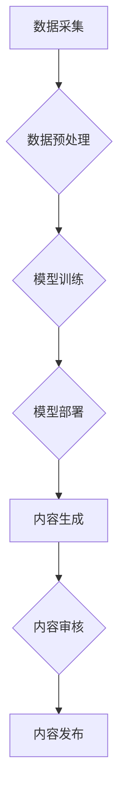

> AIGC, 企业服务, 创新驱动, 数字化转型, 价值创造, 算法模型, 应用场景, 未来趋势

## 1. 背景介绍

人工智能（AI）技术近年来发展迅速，特别是生成式人工智能（AIGC）的兴起，为企业服务领域带来了前所未有的机遇。AIGC能够自动生成文本、图像、音频等多种内容，打破了传统人工创作的局限性，为企业提供更便捷、高效、创新的服务模式。

当前，企业数字化转型正处于加速阶段，AIGC技术作为数字化转型的关键驱动力，正在深刻改变着企业运营模式、客户体验和商业生态。

## 2. 核心概念与联系

**2.1 AIGC 概述**

AIGC是指利用人工智能技术，自动生成新内容的系统。它通过学习海量数据，掌握语言、图像、音频等多模态表达规律，并运用算法模型生成高质量、符合特定需求的内容。

**2.2 企业服务与 AIGC 的融合**

AIGC技术与企业服务相结合，可以为企业提供以下方面的服务：

* **内容创作:** 自动生成营销文案、产品描述、新闻报道、社交媒体内容等，提升内容生产效率，降低成本。
* **客户服务:** 利用聊天机器人、虚拟客服等技术，提供24小时在线服务，提高客户满意度，降低人工服务成本。
* **数据分析:** 分析海量数据，提取关键信息，生成可视化报表，帮助企业洞察市场趋势，制定更精准的策略。
* **流程自动化:** 自动化重复性任务，例如文档处理、数据录入等，提高工作效率，降低人力成本。

**2.3 AIGC 企业服务架构**



## 3. 核心算法原理 & 具体操作步骤

**3.1 算法原理概述**

AIGC的核心算法主要包括：

* **自然语言处理（NLP）:** 用于理解和生成人类语言，包括文本分类、情感分析、机器翻译等。
* **计算机视觉（CV）:** 用于理解和生成图像，包括图像识别、物体检测、图像生成等。
* **深度学习（DL）:** 用于训练复杂的算法模型，例如卷积神经网络（CNN）、循环神经网络（RNN）等。

**3.2 算法步骤详解**

1. **数据采集:** 收集海量文本、图像、音频等数据，作为模型训练的数据集。
2. **数据预处理:** 对数据进行清洗、格式化、标注等处理，使其适合模型训练。
3. **模型训练:** 利用深度学习算法，训练模型，使其能够生成高质量的内容。
4. **模型评估:** 对模型的生成内容进行评估，例如准确率、流畅度、原创性等，并根据评估结果进行模型调优。
5. **模型部署:** 将训练好的模型部署到服务器上，使其能够为用户提供服务。

**3.3 算法优缺点**

**优点:**

* 自动化生成内容，提高效率。
* 降低人工成本。
* 生成内容质量不断提升。

**缺点:**

* 模型训练需要大量数据和计算资源。
* 模型生成的內容可能缺乏创意和个性。
* 模型可能存在偏差和错误。

**3.4 算法应用领域**

* 内容创作：新闻报道、营销文案、产品描述、小说、诗歌等。
* 客户服务：聊天机器人、虚拟客服、智能问答等。
* 教育培训：自动生成学习材料、个性化学习方案等。
* 游戏开发：自动生成游戏场景、人物、剧情等。

## 4. 数学模型和公式 & 详细讲解 & 举例说明

**4.1 数学模型构建**

AIGC算法通常基于深度学习模型，例如Transformer模型。Transformer模型利用注意力机制，能够捕捉文本序列中的长距离依赖关系，生成更流畅、更准确的文本内容。

**4.2 公式推导过程**

Transformer模型的核心是注意力机制，其计算公式如下：

$$
Attention(Q, K, V) = softmax(\frac{QK^T}{\sqrt{d_k}})V
$$

其中：

* $Q$：查询矩阵
* $K$：键矩阵
* $V$：值矩阵
* $d_k$：键向量的维度
* $softmax$：softmax函数

**4.3 案例分析与讲解**

例如，在机器翻译任务中，Transformer模型可以将源语言句子转换为目标语言句子。

* $Q$：源语言句子的词嵌入向量
* $K$：目标语言词典的词嵌入向量
* $V$：目标语言词典的词嵌入向量

通过注意力机制，Transformer模型可以学习到源语言句子中每个词与目标语言词之间的关系，并根据这些关系生成目标语言句子。

## 5. 项目实践：代码实例和详细解释说明

**5.1 开发环境搭建**

* Python 3.7+
* TensorFlow/PyTorch
* CUDA/cuDNN

**5.2 源代码详细实现**

```python
# 使用 TensorFlow 实现一个简单的文本生成模型

import tensorflow as tf

# 定义模型结构
model = tf.keras.Sequential([
    tf.keras.layers.Embedding(input_dim=vocab_size, output_dim=embedding_dim),
    tf.keras.layers.LSTM(units=lstm_units),
    tf.keras.layers.Dense(units=vocab_size, activation='softmax')
])

# 编译模型
model.compile(optimizer='adam', loss='sparse_categorical_crossentropy', metrics=['accuracy'])

# 训练模型
model.fit(x_train, y_train, epochs=epochs)

# 生成文本
text = 'The quick brown fox'
for _ in range(10):
    predictions = model.predict(tf.expand_dims(text, 0))
    predicted_index = tf.argmax(predictions[0]).numpy()
    text += tokenizer.index_word[predicted_index]
```

**5.3 代码解读与分析**

* 该代码实现了一个简单的文本生成模型，使用LSTM网络结构。
* 模型输入是文本序列的词嵌入向量，输出是下一个词的概率分布。
* 模型训练使用交叉熵损失函数，优化器为Adam。
* 生成文本时，根据模型预测的概率分布，选择下一个词，并将其添加到文本序列中。

**5.4 运行结果展示**

运行该代码后，可以生成一些简单的文本内容，例如：

```
The quick brown fox jumps over the lazy dog.
The quick brown fox jumps over the lazy dog and the cat.
```

## 6. 实际应用场景

**6.1 内容创作**

* 自动生成新闻报道、营销文案、产品描述等。
* 为游戏、电影、小说等创作提供场景、人物、剧情等素材。

**6.2 客户服务**

* 利用聊天机器人、虚拟客服等技术，提供24小时在线服务。
* 自动回复常见问题，提高客户满意度。

**6.3 数据分析**

* 分析海量数据，提取关键信息，生成可视化报表。
* 帮助企业洞察市场趋势，制定更精准的策略。

**6.4 未来应用展望**

* AIGC技术将更加智能化、个性化、场景化。
* 将在更多领域得到应用，例如教育、医疗、法律等。
* 将推动企业数字化转型，创造新的商业模式和价值。

## 7. 工具和资源推荐

**7.1 学习资源推荐**

* **书籍:**
    * 《深度学习》
    * 《自然语言处理》
    * 《机器学习》
* **在线课程:**
    * Coursera
    * edX
    * Udacity

**7.2 开发工具推荐**

* **TensorFlow:** 开源深度学习框架
* **PyTorch:** 开源深度学习框架
* **HuggingFace:** 提供预训练模型和工具

**7.3 相关论文推荐**

* 《Attention Is All You Need》
* 《BERT: Pre-training of Deep Bidirectional Transformers for Language Understanding》
* 《GPT-3: Language Models are Few-Shot Learners》

## 8. 总结：未来发展趋势与挑战

**8.1 研究成果总结**

AIGC技术取得了显著进展，能够生成高质量、符合特定需求的内容。

**8.2 未来发展趋势**

* 模型更加智能化、个性化、场景化。
* 应用场景更加广泛，覆盖更多领域。
* 与其他技术融合，例如增强现实（AR）、虚拟现实（VR）等。

**8.3 面临的挑战**

* 模型训练需要大量数据和计算资源。
* 模型生成的內容可能缺乏创意和个性。
* 模型可能存在偏差和错误。

**8.4 研究展望**

* 研究更有效的训练方法，降低模型训练成本。
* 研究如何提高模型的创造力和个性化能力。
* 研究如何解决模型偏差和错误问题。

## 9. 附录：常见问题与解答

**9.1 如何选择合适的 AIGC 模型？**

选择合适的 AIGC 模型需要根据具体的应用场景和需求进行选择。例如，用于文本生成任务可以选择 Transformer 模型，用于图像生成任务可以选择 GAN 模型。

**9.2 如何训练 AIGC 模型？**

训练 AIGC 模型需要准备海量数据，并使用深度学习算法进行训练。可以使用 TensorFlow 或 PyTorch 等深度学习框架进行训练。

**9.3 如何评估 AIGC 模型的性能？**

评估 AIGC 模型的性能可以使用准确率、流畅度、原创性等指标进行评估。

作者：禅与计算机程序设计艺术 / Zen and the Art of Computer Programming


<end_of_turn>