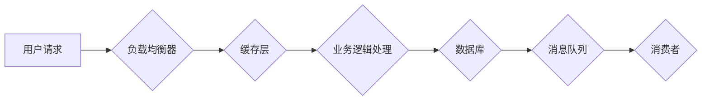

> 高吞吐量系统，系统设计，并发编程，性能优化，分布式系统，缓存机制，负载均衡，消息队列

## 1. 背景介绍

在当今数据爆炸和业务快速发展的时代，高吞吐量系统设计已成为各大互联网公司和企业的重要课题。高吞吐量系统是指能够处理大量请求并快速响应的系统，其核心目标是最大化每秒处理的请求数（TPS），同时保证系统稳定性和可靠性。

高吞吐量系统的设计需要考虑多种因素，包括硬件架构、软件架构、网络协议、数据存储、并发控制等。设计高吞吐量系统是一个复杂的过程，需要深入理解系统各个组件之间的关系，并进行合理的优化和调优。

## 2. 核心概念与联系

高吞吐量系统设计的核心概念包括：

* **并发编程:**  利用多线程或多进程技术，同时处理多个请求，提高系统处理能力。
* **异步处理:** 将请求处理任务分解成多个异步任务，避免阻塞主线程，提高系统响应速度。
* **缓存机制:** 将经常访问的数据存储在高速缓存中，减少数据库访问次数，提高数据访问速度。
* **负载均衡:** 将请求分发到多个服务器，避免单个服务器过载，提高系统整体吞吐量。
* **消息队列:** 将任务或消息发送到队列中，由消费者进行处理，实现异步任务处理和解耦。

**Mermaid 流程图:**



## 3. 核心算法原理 & 具体操作步骤

### 3.1  算法原理概述

高吞吐量系统设计中常用的算法包括：

* **分治算法:** 将问题分解成多个子问题，递归地解决子问题，最终得到原问题的解。
* **并行算法:** 将问题分解成多个任务，并行执行任务，提高计算速度。
* **贪婪算法:** 在每次决策时选择最优局部解，最终得到一个全局近似解。

### 3.2  算法步骤详解

以分治算法为例，其步骤如下：

1. 将问题分解成若干个子问题。
2. 对每个子问题递归地应用分治算法，直到子问题足够小，可以直接求解。
3. 将子问题的解合并成原问题的解。

### 3.3  算法优缺点

**分治算法:**

* **优点:** 能够有效解决复杂问题，并行化程度高。
* **缺点:** 可能会导致重复计算，时间复杂度较高。

### 3.4  算法应用领域

分治算法广泛应用于：

* **排序算法:** 快速排序、归并排序等。
* **搜索算法:** 二分查找等。
* **图算法:** 最短路径算法等。

## 4. 数学模型和公式 & 详细讲解 & 举例说明

### 4.1  数学模型构建

高吞吐量系统设计中常用的数学模型包括：

* **吞吐量模型:** 描述系统处理请求的速度，通常用TPS（每秒处理请求数）表示。
* **延迟模型:** 描述系统响应请求的时间，通常用毫秒或秒表示。
* **资源利用率模型:** 描述系统资源（CPU、内存、网络带宽等）的利用情况。

### 4.2  公式推导过程

**吞吐量模型:**

$$
TPS = \frac{1}{平均响应时间}
$$

**延迟模型:**

$$
延迟 = 处理时间 + 网络传输时间
$$

### 4.3  案例分析与讲解

假设一个系统每秒处理1000个请求，平均响应时间为10毫秒，则其吞吐量为：

$$
TPS = \frac{1}{0.01} = 100
$$

## 5. 项目实践：代码实例和详细解释说明

### 5.1  开发环境搭建

* 操作系统：Linux
* 编程语言：Go
* 框架：Gin

### 5.2  源代码详细实现

```go
package main

import (
\t"net/http"

\t"github.com/gin-gonic/gin"
)

func main() {
\trouter := gin.Default()

\trouter.GET("/hello", func(c *gin.Context) {
\t\tc.JSON(http.StatusOK, gin.H{
\t\t\t"message": "Hello, world!",
\t\t})
\t})

\trouter.Run(":8080")
}
```

### 5.3  代码解读与分析

* 代码使用Gin框架构建了一个简单的HTTP服务器。
* `/hello`路由处理GET请求，返回一个JSON响应。
* `router.Run(":8080")`启动服务器，监听8080端口。

### 5.4  运行结果展示

启动服务器后，访问`http://localhost:8080/hello`，将返回以下JSON响应：

```json
{
  "message": "Hello, world!"
}
```

## 6. 实际应用场景

高吞吐量系统广泛应用于：

* **电商平台:** 处理大量商品浏览、下单、支付请求。
* **社交媒体:** 处理用户发布、点赞、评论等操作请求。
* **在线游戏:** 处理玩家登录、游戏逻辑、聊天等请求。
* **金融交易:** 处理股票交易、银行转账等高频请求。

### 6.4  未来应用展望

随着云计算、大数据、人工智能等技术的快速发展，高吞吐量系统将面临更大的挑战和机遇。未来，高吞吐量系统将更加智能化、自动化、分布式化。

## 7. 工具和资源推荐

### 7.1  学习资源推荐

* **书籍:**
    * 《高性能网站设计》
    * 《分布式系统设计》
* **在线课程:**
    * Coursera: Distributed Systems
    * Udemy: High Performance Computing

### 7.2  开发工具推荐

* **监控工具:** Prometheus, Grafana
* **负载均衡器:** Nginx, HAProxy
* **消息队列:** Kafka, RabbitMQ

### 7.3  相关论文推荐

* **论文:**
    * The Design and Implementation of Apache Kafka
    * Building Microservices: Designing Fine-Grained Systems

## 8. 总结：未来发展趋势与挑战

### 8.1  研究成果总结

高吞吐量系统设计已取得了显著成果，但仍面临着诸多挑战。

### 8.2  未来发展趋势

* **微服务架构:** 将系统分解成多个独立的服务，提高系统可扩展性和容错性。
* **Serverless 架构:** 将服务器管理工作卸载给云平台，提高开发效率和资源利用率。
* **容器化技术:** 使用容器技术打包和部署应用程序，提高部署效率和资源隔离性。

### 8.3  面临的挑战

* **数据安全:** 保护用户数据安全和隐私。
* **系统可靠性:** 确保系统稳定运行，避免服务中断。
* **成本控制:** 降低系统部署和维护成本。

### 8.4  研究展望

未来，高吞吐量系统设计将更加注重智能化、自动化、安全性和可持续性。

## 9. 附录：常见问题与解答

* **问题:** 如何提高系统的吞吐量？
* **解答:** 可以通过优化代码、使用缓存机制、负载均衡、异步处理等方式提高系统的吞吐量。

* **问题:** 如何保证系统的稳定性和可靠性？
* **解答:** 可以通过冗余设计、监控报警、故障恢复等机制保证系统的稳定性和可靠性。


作者：禅与计算机程序设计艺术 / Zen and the Art of Computer Programming 
<end_of_turn>