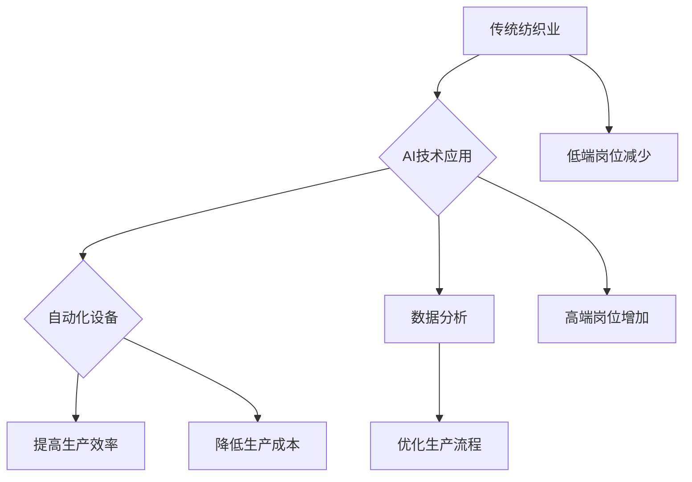

>人工智能，自动化，纺织业，就业市场，高端人才，低端岗位，未来趋势

## 1. 背景介绍

纺织业作为人类文明发展的重要组成部分，经历了从手工制作到现代化工业化的漫长历程。近年来，人工智能（AI）和自动化技术的快速发展，正在深刻地改变着纺织行业的生产模式和就业结构。高端与低端纺织工人的就业变化，成为一个备受关注的议题。

传统纺织业主要依赖人工操作，大量低端岗位需要进行重复性劳动，劳动强度大，工作环境差。随着AI技术的应用，自动化设备能够替代大量低端岗位，例如织布机、缝纫机等，提高生产效率，降低生产成本。

然而，AI技术的应用也催生了新的高端岗位需求，例如AI算法工程师、数据分析师、机器学习专家等，需要具备较高的技术水平和专业知识。

## 2. 核心概念与联系

**2.1 纺织业自动化**

纺织业自动化是指利用机器和自动化技术替代人工操作，提高生产效率和产品质量。

**2.2 人工智能（AI）**

人工智能是指模拟人类智能行为的计算机系统，包括学习、推理、决策、语言理解等能力。

**2.3 核心概念联系**

AI技术与纺织业的结合，形成了纺织业自动化的新模式。AI算法可以分析纺织生产数据，优化生产流程，提高生产效率。

**2.4 Mermaid 流程图**



## 3. 核心算法原理 & 具体操作步骤

**3.1 算法原理概述**

AI算法在纺织业应用中，主要包括机器学习、深度学习、计算机视觉等算法。

* **机器学习**：通过训练模型，让机器从数据中学习规律，进行预测和决策。例如，可以利用机器学习算法预测纺织品的需求量，优化生产计划。
* **深度学习**：一种更高级的机器学习算法，能够处理更复杂的数据，例如图像、语音等。例如，可以利用深度学习算法识别纺织品缺陷，提高产品质量。
* **计算机视觉**：使计算机能够“看”图像，并从中提取信息。例如，可以利用计算机视觉算法自动识别纺织品颜色、图案等信息。

**3.2 算法步骤详解**

以机器学习算法为例，其步骤如下：

1. **数据收集**: 收集纺织生产相关数据，例如生产时间、产量、原材料消耗等。
2. **数据预处理**: 对收集到的数据进行清洗、转换、归一化等处理，使其适合模型训练。
3. **模型选择**: 选择合适的机器学习算法模型，例如线性回归、决策树、支持向量机等。
4. **模型训练**: 利用训练数据训练模型，调整模型参数，使其能够准确预测纺织生产相关指标。
5. **模型评估**: 利用测试数据评估模型的性能，例如准确率、召回率等。
6. **模型部署**: 将训练好的模型部署到生产环境中，用于实际预测和决策。

**3.3 算法优缺点**

* **优点**: 能够自动学习和优化生产流程，提高生产效率和产品质量。
* **缺点**: 需要大量的数据进行训练，算法模型的准确性依赖于数据质量。

**3.4 算法应用领域**

* **生产计划优化**: 利用机器学习算法预测纺织品需求量，优化生产计划，减少库存积压。
* **质量控制**: 利用深度学习算法识别纺织品缺陷，提高产品质量。
* **生产过程监控**: 利用计算机视觉算法监控纺织生产过程，及时发现异常情况。

## 4. 数学模型和公式 & 详细讲解 & 举例说明

**4.1 数学模型构建**

假设纺织品生产过程的产量Y与投入的原材料X和人工时间T的关系可以用以下数学模型表示：

$$Y = f(X, T)$$

其中，f(X, T)为生产函数，描述了原材料和人工时间对产量的影响。

**4.2 公式推导过程**

为了更好地理解生产函数，我们可以将其分解为以下几个部分：

* **原材料投入**: 

$$X_i = \alpha_i * X$$

其中，$X_i$为第i种原材料的投入量，$\alpha_i$为第i种原材料的比例。

* **人工时间**:

$$T = \beta * T_i$$

其中，$T_i$为第i种人工操作的时间，$\beta$为人工效率系数。

* **生产函数**:

$$Y = f(X_1, X_2, ..., X_n, T)$$

其中，$X_1, X_2, ..., X_n$为所有原材料的投入量，T为人工时间。

**4.3 案例分析与讲解**

假设一家纺织厂生产棉布，原材料包括棉花和染料，人工操作包括纺纱、染色和缝纫。

* 棉花投入量为X1，染料投入量为X2，纺纱时间为T1，染色时间为T2，缝纫时间为T3。
* 生产函数可以表示为：

$$Y = f(X_1, X_2, T_1, T_2, T_3)$$

* 通过收集生产数据，我们可以训练机器学习模型，学习生产函数的具体形式。

## 5. 项目实践：代码实例和详细解释说明

**5.1 开发环境搭建**

* 操作系统：Ubuntu 20.04
* Python 版本：3.8
* 必要的库：pandas, numpy, scikit-learn

**5.2 源代码详细实现**

```python
import pandas as pd
from sklearn.linear_model import LinearRegression

# 1. 数据加载
data = pd.read_csv('纺织生产数据.csv')

# 2. 数据预处理
X = data[['原材料投入量', '人工时间']]
y = data['产量']

# 3. 模型训练
model = LinearRegression()
model.fit(X, y)

# 4. 模型评估
# ...

# 5. 模型预测
# ...
```

**5.3 代码解读与分析**

* 代码首先加载纺织生产数据，然后进行数据预处理，将原材料投入量和人工时间作为输入特征，产量作为输出目标。
* 然后，使用线性回归模型训练模型，并进行模型评估。
* 最后，可以使用训练好的模型进行预测，例如预测给定原材料投入量和人工时间的情况下，产量的预测值。

**5.4 运行结果展示**

* 运行结果将显示模型的训练效果，例如模型的准确率、R-squared值等。
* 还可以使用模型预测不同条件下的产量，例如增加原材料投入量或减少人工时间的情况下，产量的变化趋势。

## 6. 实际应用场景

**6.1 生产计划优化**

纺织企业可以利用AI算法预测未来纺织品需求量，优化生产计划，避免库存积压或缺货情况。

**6.2 质量控制**

AI算法可以识别纺织品缺陷，提高产品质量，减少返工率。

**6.3 个性化定制**

AI算法可以根据客户需求，进行个性化纺织品定制，满足客户多样化的需求。

**6.4 未来应用展望**

* **智能纺织工厂**: 利用AI和自动化技术，构建智能纺织工厂，实现无人化生产，提高生产效率和产品质量。
* **可持续发展**: 利用AI算法优化生产流程，减少资源消耗，实现纺织业的可持续发展。

## 7. 工具和资源推荐

**7.1 学习资源推荐**

* **在线课程**: Coursera, edX, Udemy等平台提供人工智能、机器学习等相关课程。
* **书籍**: 《深度学习》、《机器学习实战》等书籍。

**7.2 开发工具推荐**

* **Python**: 广泛应用于人工智能开发，拥有丰富的库和工具。
* **TensorFlow**: 开源深度学习框架。
* **PyTorch**: 开源深度学习框架。

**7.3 相关论文推荐**

* **人工智能在纺织业中的应用**: 相关论文可以通过学术数据库，例如IEEE Xplore, ACM Digital Library等进行检索。

## 8. 总结：未来发展趋势与挑战

**8.1 研究成果总结**

AI技术在纺织业的应用取得了显著成果，提高了生产效率、产品质量和可持续发展水平。

**8.2 未来发展趋势**

* **更智能的纺织工厂**: 利用更先进的AI算法，构建更智能的纺织工厂，实现无人化生产和个性化定制。
* **更广泛的应用场景**: AI技术将应用于纺织业的更多领域，例如设计、营销、物流等。

**8.3 面临的挑战**

* **数据质量**: AI算法的准确性依赖于数据质量，需要收集和处理高质量的数据。
* **技术人才**: 需要更多的人才掌握AI技术，才能推动AI技术在纺织业的应用。
* **伦理问题**: AI技术的应用也带来了一些伦理问题，例如算法偏见、数据隐私等，需要引起重视和解决。

**8.4 研究展望**

未来，需要继续加强AI技术在纺织业的应用研究，探索更智能、更广泛的应用场景，并解决相关技术和伦理问题，推动纺织业的转型升级。

## 9. 附录：常见问题与解答

**9.1 如何收集纺织生产数据？**

纺织企业可以通过传感器、数据采集系统等方式收集生产数据，例如原材料消耗量、人工时间、产量等。

**9.2 如何选择合适的AI算法？**

选择合适的AI算法需要根据具体应用场景和数据特点进行选择。例如，预测纺织品需求量可以使用回归算法，识别纺织品缺陷可以使用分类算法。

**9.3 如何解决AI算法的偏见问题？**

可以采用数据清洗、算法调优、多算法融合等方法来解决AI算法的偏见问题。


作者：禅与计算机程序设计艺术 / Zen and the Art of Computer Programming 
<end_of_turn>