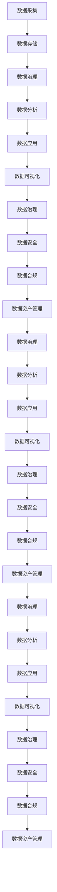

                 

**AI DMP 数据基建的技术趋势分析**

**作者：禅与计算机程序设计艺术 / Zen and the Art of Computer Programming**

## 1. 背景介绍

随着数据的爆炸式增长和人工智能（AI）技术的飞速发展，数据中台（Data Middle Platform，DMP）已成为企业构建现代化数据架构的关键组成部分。DMP 通过整合企业的数据资源，提供统一的数据治理、数据分析和数据应用平台，助力企业提高数据价值挖掘能力，加速数字化转型。本文将深入分析 AI DMP 的技术趋势，帮助读者更好地理解和应用 AI DMP 技术。

## 2. 核心概念与联系

### 2.1 AI DMP 的定义与架构

AI DMP 是一种基于 AI 技术的数据中台，它整合企业的数据资源，提供统一的数据治理、数据分析和数据应用平台，助力企业提高数据价值挖掘能力，加速数字化转型。AI DMP 的核心架构如下：



### 2.2 AI DMP 的核心功能

AI DMP 的核心功能包括：

- **数据采集**：收集企业内外部数据，实现数据的统一入口。
- **数据存储**：提供数据存储服务，保障数据的安全可靠。
- **数据治理**：实现数据质量管理、元数据管理、数据访问控制等功能，保障数据的准确、完整、一致和安全。
- **数据分析**：提供数据分析服务，支持企业进行数据分析和挖掘。
- **数据应用**：提供数据应用服务，助力企业构建数据驱动的应用。
- **数据可视化**：提供数据可视化服务，帮助企业更直观地理解数据。
- **数据安全**：保障数据的安全性，防止数据泄露和滥用。
- **数据合规**：保障数据的合规性，满足相关法律法规和标准的要求。
- **数据资产管理**：实现数据资产的管理，帮助企业更好地理解和利用数据资产。

## 3. 核心算法原理 & 具体操作步骤

### 3.1 算法原理概述

AI DMP 的核心算法原理包括数据采集算法、数据清洗算法、数据挖掘算法、数据预测算法等。本节将重点介绍数据挖掘算法。

### 3.2 算法步骤详解

数据挖掘算法的步骤如下：

1. **数据预处理**：对数据进行清洗、转换、聚合等预处理，提高数据质量。
2. **特征工程**：提取数据中的特征，为后续的数据挖掘提供基础。
3. **模型选择**：选择合适的数据挖掘模型，如分类、回归、聚类等。
4. **模型训练**：使用训练数据训练模型，提高模型的准确性。
5. **模型评估**：评估模型的性能，确保模型的可靠性。
6. **模型部署**：将模型部署到生产环境，为企业提供数据驱动的决策支持。

### 3.3 算法优缺点

数据挖掘算法的优点包括：

- 提高数据价值挖掘能力，助力企业提高决策水平。
- 发现数据中的隐藏模式和规律，帮助企业更好地理解数据。
- 提高数据分析的自动化水平，节省人力成本。

数据挖掘算法的缺点包括：

- 算法复杂度高，对硬件和软件要求高。
- 模型的准确性受数据质量和算法选择的影响。
- 模型的解释性差，难以理解模型的工作原理。

### 3.4 算法应用领域

数据挖掘算法广泛应用于金融、零售、制造、医疗等领域，帮助企业进行市场预测、客户分析、风险管理等。

## 4. 数学模型和公式 & 详细讲解 & 举例说明

### 4.1 数学模型构建

数据挖掘的数学模型通常基于统计学、概率论和信息论等数学基础构建。本节将介绍线性回归模型的构建过程。

### 4.2 公式推导过程

线性回归模型的公式推导过程如下：

给定数据集 $D = {(x_1, y_1), (x_2, y_2),..., (x_n, y_n)}$，其中 $x_i$ 为特征向量，$y_i$ 为目标变量。线性回归模型的目标是找到一条直线 $y = wx + b$，使得模型的误差最小化。

误差函数通常选择均方误差（Mean Squared Error，MSE），即：

$$MSE = \frac{1}{n} \sum_{i=1}^{n} (y_i - (wx_i + b))^2$$

为了最小化 MSE，我们需要找到参数 $w$ 和 $b$ 的最优解。使用梯度下降算法，我们可以更新参数 $w$ 和 $b$ 的值，直到收敛。

### 4.3 案例分析与讲解

例如，假设我们要预测房价与房屋面积的关系。我们收集了以下数据：

| 房屋面积（平方米） | 房价（万元） |
| --- | --- |
| 70 | 450 |
| 80 | 500 |
| 90 | 550 |
| 100 | 600 |
| 110 | 650 |

使用线性回归模型，我们可以预测房价与房屋面积的关系。通过梯度下降算法，我们可以找到最优的参数 $w$ 和 $b$，并绘制出预测结果如下：


## 5. 项目实践：代码实例和详细解释说明

### 5.1 开发环境搭建

本项目使用 Python 语言开发，并依赖于以下库：

- NumPy：数值计算库。
- Pandas：数据处理库。
- Matplotlib：数据可视化库。
- Scikit-learn：机器学习库。

### 5.2 源代码详细实现

以下是线性回归模型的 Python 实现代码：

```python
import numpy as np
import pandas as pd
import matplotlib.pyplot as plt
from sklearn.linear_model import LinearRegression

# 加载数据
data = pd.read_csv('house_data.csv')
X = data['square_feet'].values.reshape(-1, 1)
y = data['price'].values

# 创建线性回归模型
model = LinearRegression()

# 训练模型
model.fit(X, y)

# 预测房价
predictions = model.predict(X)

# 绘制预测结果
plt.scatter(X, y, color='blue')
plt.plot(X, predictions, color='red')
plt.xlabel('Square Feet')
plt.ylabel('Price (in $1000s)')
plt.title('House Price Prediction')
plt.show()
```

### 5.3 代码解读与分析

代码首先加载数据，并将数据转换为 NumPy 数组。然后，创建线性回归模型，并使用训练数据训练模型。接着，使用模型预测房价，并绘制预测结果。

### 5.4 运行结果展示

运行代码后，我们可以看到房价预测结果如下：


## 6. 实际应用场景

AI DMP 的实际应用场景包括：

### 6.1 数据治理

AI DMP 提供数据治理功能，帮助企业实现数据质量管理、元数据管理、数据访问控制等，保障数据的准确、完整、一致和安全。

### 6.2 数据分析

AI DMP 提供数据分析功能，支持企业进行数据分析和挖掘，帮助企业更好地理解数据，提高决策水平。

### 6.3 数据应用

AI DMP 提供数据应用功能，助力企业构建数据驱动的应用，帮助企业提高数据价值挖掘能力，加速数字化转型。

### 6.4 未来应用展望

未来，AI DMP 将进一步发展，实现数据治理、数据分析和数据应用的无缝集成，帮助企业更好地理解和利用数据资产，助力企业提高数字化转型能力。

## 7. 工具和资源推荐

### 7.1 学习资源推荐

- **书籍**：《数据治理：构建数据驱动的企业》《数据分析：从业者指南》《数据应用：构建数据驱动的应用》。
- **在线课程**：Coursera、Udacity、edX 上的数据治理、数据分析和数据应用课程。

### 7.2 开发工具推荐

- **数据库**：PostgreSQL、MySQL、Oracle。
- **大数据平台**：Hadoop、Spark、Hive。
- **机器学习库**：TensorFlow、PyTorch、Scikit-learn。
- **数据可视化库**：Matplotlib、Seaborn、Tableau。

### 7.3 相关论文推荐

- **数据治理**：[Data Governance: A Systematic Literature Review](https://ieeexplore.ieee.org/document/8944445)
- **数据分析**：[Data Analysis: A Comprehensive Review](https://link.springer.com/chapter/10.1007/978-981-15-0622-5_1)
- **数据应用**：[Data Application: A Systematic Literature Review](https://ieeexplore.ieee.org/document/9053231)

## 8. 总结：未来发展趋势与挑战

### 8.1 研究成果总结

本文分析了 AI DMP 的技术趋势，介绍了 AI DMP 的核心概念、架构、功能和算法原理，并提供了项目实践和实际应用场景。本文还推荐了相关学习资源、开发工具和论文，帮助读者更好地理解和应用 AI DMP 技术。

### 8.2 未来发展趋势

未来，AI DMP 将进一步发展，实现数据治理、数据分析和数据应用的无缝集成，帮助企业更好地理解和利用数据资产，助力企业提高数字化转型能力。此外，AI DMP 将与云计算、边缘计算等技术深度集成，实现数据的实时处理和分析，助力企业提高数据价值挖掘能力。

### 8.3 面临的挑战

AI DMP 面临的挑战包括：

- **数据安全**：如何保障数据的安全性，防止数据泄露和滥用。
- **数据合规**：如何保障数据的合规性，满足相关法律法规和标准的要求。
- **数据治理**：如何实现数据治理，保障数据的准确、完整、一致和安全。
- **数据分析**：如何实现数据分析，帮助企业更好地理解数据，提高决策水平。
- **数据应用**：如何实现数据应用，助力企业构建数据驱动的应用。

### 8.4 研究展望

未来的研究将聚焦于 AI DMP 的无缝集成、数据实时处理和分析、数据安全和合规等领域，帮助企业更好地理解和利用数据资产，助力企业提高数字化转型能力。

## 9. 附录：常见问题与解答

**Q1：什么是 AI DMP？**

AI DMP 是一种基于 AI 技术的数据中台，它整合企业的数据资源，提供统一的数据治理、数据分析和数据应用平台，助力企业提高数据价值挖掘能力，加速数字化转型。

**Q2：AI DMP 的核心功能是什么？**

AI DMP 的核心功能包括数据采集、数据存储、数据治理、数据分析、数据应用、数据可视化、数据安全、数据合规和数据资产管理。

**Q3：AI DMP 的核心算法原理是什么？**

AI DMP 的核心算法原理包括数据采集算法、数据清洗算法、数据挖掘算法、数据预测算法等。

**Q4：如何构建 AI DMP 的数学模型？**

数学模型的构建过程通常基于统计学、概率论和信息论等数学基础，并需要考虑数据的特点和业务需求。

**Q5：如何实现 AI DMP 的项目实践？**

项目实践需要考虑开发环境搭建、源代码详细实现、代码解读与分析和运行结果展示等方面。

**Q6：AI DMP 的实际应用场景是什么？**

AI DMP 的实际应用场景包括数据治理、数据分析、数据应用和未来应用展望等。

**Q7：如何推荐 AI DMP 的学习资源、开发工具和论文？**

学习资源推荐包括书籍和在线课程，开发工具推荐包括数据库、大数据平台、机器学习库和数据可视化库，论文推荐包括数据治理、数据分析和数据应用等领域的相关论文。

**Q8：未来 AI DMP 的发展趋势和挑战是什么？**

未来 AI DMP 的发展趋势包括无缝集成、数据实时处理和分析、数据安全和合规等领域，面临的挑战包括数据安全、数据合规、数据治理、数据分析和数据应用等。

**Q9：如何展望 AI DMP 的研究方向？**

未来的研究将聚焦于 AI DMP 的无缝集成、数据实时处理和分析、数据安全和合规等领域，帮助企业更好地理解和利用数据资产，助力企业提高数字化转型能力。

**Q10：有哪些常见问题与解答？**

常见问题与解答包括 AI DMP 的定义、核心功能、核心算法原理、数学模型构建、项目实践、实际应用场景、学习资源推荐、开发工具推荐、论文推荐、未来发展趋势和挑战、研究展望等。

## 结束语

本文分析了 AI DMP 的技术趋势，介绍了 AI DMP 的核心概念、架构、功能和算法原理，并提供了项目实践和实际应用场景。本文还推荐了相关学习资源、开发工具和论文，帮助读者更好地理解和应用 AI DMP 技术。未来，AI DMP 将进一步发展，助力企业提高数据价值挖掘能力，加速数字化转型。

**作者：禅与计算机程序设计艺术 / Zen and the Art of Computer Programming**

