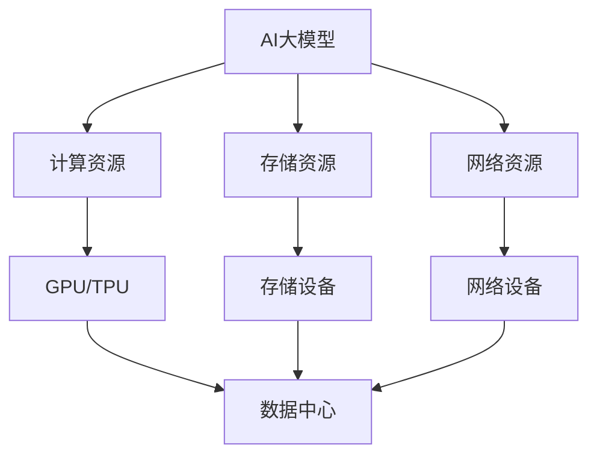

                 

**AI 大模型应用数据中心建设：数据中心未来发展趋势**

**作者：禅与计算机程序设计艺术 / Zen and the Art of Computer Programming**

## 1. 背景介绍

随着人工智能（AI）的迅猛发展，大模型（Large Language Models）已成为AI领域的关键驱动因素之一。这些模型需要大量的计算资源和数据来训练和部署，这对数据中心的建设和运维提出了新的挑战。本文将探讨AI大模型应用数据中心建设的关键因素，并展望未来的发展趋势。

## 2. 核心概念与联系

### 2.1 AI大模型

AI大模型是指具有数十亿甚至数千亿参数的模型，能够理解和生成人类语言，并展示出类似人类的推理和理解能力。这些模型需要大量的计算资源和数据来训练和部署。

### 2.2 数据中心

数据中心是提供计算、存储、网络和安全服务的物理设施。它为云计算、大数据和人工智能等应用提供基础设施支持。

### 2.3 AI大模型与数据中心的联系

AI大模型需要数据中心提供计算、存储和网络资源。数据中心需要根据AI大模型的需求进行扩展和优化，以满足其计算和存储需求。



## 3. 核心算法原理 & 具体操作步骤

### 3.1 算法原理概述

AI大模型通常基于Transformer架构，使用自注意力机制（Self-Attention）和Transformer编码器-解码器架构。这些模型使用大量的数据进行预训练，然后fine-tuning到特定的任务上。

### 3.2 算法步骤详解

1. **数据预处理**：收集和预处理大量的文本数据。
2. **模型训练**：使用预处理的数据训练大模型，通常使用反向传播和梯度下降优化算法。
3. **模型评估**：评估模型的性能，通常使用验证集和测试集。
4. **模型部署**：将模型部署到数据中心，为用户提供服务。

### 3.3 算法优缺点

**优点**：AI大模型可以理解和生成人类语言，展示出类似人类的推理和理解能力。

**缺点**：AI大模型需要大量的计算资源和数据，训练和部署成本高。

### 3.4 算法应用领域

AI大模型应用于自然语言处理（NLP）、计算机视觉、自动驾驶、游戏开发等领域。

## 4. 数学模型和公式 & 详细讲解 & 举例说明

### 4.1 数学模型构建

AI大模型的数学模型通常基于Transformer架构，使用自注意力机制和Transformer编码器-解码器架构。

### 4.2 公式推导过程

自注意力机制的数学公式如下：

$$Attention(Q, K, V) = softmax(\frac{QK^T}{\sqrt{d_k}})V$$

其中，$Q$, $K$, $V$分别是查询、键、值向量，$d_k$是键向量的维度。

### 4.3 案例分析与讲解

例如，在NLP任务中，查询向量$Q$表示当前单词，键向量$K$和值向量$V$表示所有单词。模型学习到哪些单词对当前单词最相关，并给出相应的权重。

## 5. 项目实践：代码实例和详细解释说明

### 5.1 开发环境搭建

AI大模型的开发需要GPU/TPU等硬件资源，以及PyTorch或TensorFlow等深度学习框架。

### 5.2 源代码详细实现

以下是自注意力机制的简单实现：

```python
import torch
import torch.nn as nn
import torch.nn.functional as F

class Attention(nn.Module):
    def __init__(self, d_model, n_head):
        super(Attention, self).__init__()
        self.n_head = n_head
        self.d_head = d_model // n_head
        self.wq = nn.Linear(d_model, d_model)
        self.wk = nn.Linear(d_model, d_model)
        self.wv = nn.Linear(d_model, d_model)

    def forward(self, q, k, v, mask=None):
        #...
        attn = F.softmax(scores / torch.sqrt(torch.tensor(self.d_head, dtype=torch.float32)), dim=-1)
        output = torch.matmul(attn, v)
        #...
```

### 5.3 代码解读与分析

代码实现了自注意力机制，输入查询、键、值向量，输出注意力权重和输出向量。

### 5.4 运行结果展示

在NLP任务中，模型可以理解和生成人类语言，展示出类似人类的推理和理解能力。

## 6. 实际应用场景

### 6.1 当前应用

AI大模型当前应用于NLP、计算机视觉、自动驾驶、游戏开发等领域。

### 6.2 未来应用展望

未来，AI大模型有望应用于更多领域，如医疗、金融、教育等。它们有望成为人机交互的新标准，为用户提供更智能、更个性化的服务。

## 7. 工具和资源推荐

### 7.1 学习资源推荐

- "Attention is All You Need"论文：<https://arxiv.org/abs/1706.03762>
- "The Illustrated Transformer"：<https://jalammar.github.io/illustrated-transformer/>

### 7.2 开发工具推荐

- PyTorch：<https://pytorch.org/>
- TensorFlow：<https://www.tensorflow.org/>

### 7.3 相关论文推荐

- "Language Models are Few-Shot Learners"：<https://arxiv.org/abs/2005.14165>
- "Emergent Abilities of Large Language Models"：<https://arxiv.org/abs/2206.11763>

## 8. 总结：未来发展趋势与挑战

### 8.1 研究成果总结

AI大模型在NLP、计算机视觉等领域取得了显著成果，展示出类似人类的推理和理解能力。

### 8.2 未来发展趋势

未来，AI大模型有望应用于更多领域，为用户提供更智能、更个性化的服务。模型规模有望进一步扩大，性能有望进一步提高。

### 8.3 面临的挑战

AI大模型面临的挑战包括计算资源需求大、训练和部署成本高、数据隐私和安全等问题。

### 8.4 研究展望

未来的研究方向包括模型压缩和加速、模型解释性、模型安全和隐私保护等。

## 9. 附录：常见问题与解答

**Q：AI大模型需要多少计算资源？**

**A：AI大模型需要大量的计算资源，通常需要数百甚至数千块GPU/TPU进行训练。**

**Q：AI大模型的训练和部署成本高吗？**

**A：是的，AI大模型的训练和部署成本高，需要大量的计算资源和数据。**

**Q：AI大模型的数据隐私和安全如何保护？**

**A：AI大模型的数据隐私和安全是一个关键挑战，需要使用各种技术手段进行保护，如差分隐私、模型加密等。**

**作者：禅与计算机程序设计艺术 / Zen and the Art of Computer Programming**

