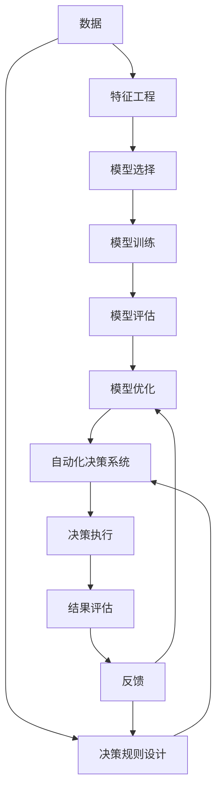

                 

**AI2.0时代：自动化的崭新开始**

**作者：禅与计算机程序设计艺术 / Zen and the Art of Computer Programming**

## 1. 背景介绍

在人工智能（AI）领域，我们正在见证一个新的时代——AI2.0的到来。这个新时代的特点是自动化的崭新开始，它标志着AI技术从狭义的机器学习和深度学习模型转向更广泛的自动化解决方案。本文将深入探讨AI2.0的核心概念、算法原理、数学模型，并提供项目实践和实际应用场景的分析。我们还将推荐相关的学习资源和开发工具，并展望未来的发展趋势和挑战。

## 2. 核心概念与联系

AI2.0的核心概念之一是**自动机器学习（AutoML）**，它旨在自动设计和优化机器学习模型。另一个关键概念是**自动化决策系统（Automated Decision Systems）**，它可以自动执行决策，而无需人类干预。这两个概念密切相关，因为自动机器学习可以为自动化决策系统提供优化的模型。

下图是AI2.0的核心概念和联系的Mermaid流程图：



## 3. 核心算法原理 & 具体操作步骤

### 3.1 算法原理概述

AI2.0的核心算法之一是**遗传算法（Genetic Algorithm）**，它是一种基于生物进化的搜索和优化算法。另一个关键算法是**模拟退火算法（Simulated Annealing）**，它是一种概率-Based搜索算法，受热力学中的退火过程启发。

### 3.2 算法步骤详解

#### 遗传算法

1. 初始化种群：创建一个包含多个个体的种群，每个个体都是一个解决方案的编码。
2. 评估适应度：计算每个个体的适应度，它表示个体的质量或适合度。
3. 选择：根据个体的适应度，选择一组个体进行繁殖。
4. 交叉：将两个个体的染色体片段交换，产生新的后代个体。
5. 变异：以低概率随机改变个体的染色体，引入新的解决方案。
6. 重复步骤2-5，直到找到满意的解决方案或达到最大迭代次数。

#### 模拟退火算法

1. 初始化解：随机生成一个解决方案。
2. 评估能量：计算当前解的能量或代价。
3. 邻域搜索：生成当前解的邻域解。
4. 计算新能量：评估邻域解的能量。
5. 接受新解：如果新能量小于当前能量，接受新解；否则，以一定概率接受新解。
6. 降低温度：降低退火温度，减小接受劣解的概率。
7. 重复步骤3-6，直到退火温度降至0或达到最大迭代次数。

### 3.3 算法优缺点

**遗传算法**的优点包括：

- 可以处理复杂的搜索空间。
- 可以找到多个解决方案。
- 可以并行化，提高搜索速度。

其缺点是：

- 计算开销大。
- 结果的可解释性差。

**模拟退火算法**的优点包括：

- 可以避免陷入局部最优解。
- 可以处理复杂的搜索空间。
- 可以调节搜索的全局和局部能力。

其缺点是：

- 计算开销大。
- 结果的可解释性差。
- 退火温度和迭代次数的选择对结果有很大影响。

### 3.4 算法应用领域

这两种算法在优化问题、搜索问题和调度问题等领域有广泛的应用。例如，遗传算法可以用于自动化设计电路、优化路由路径，而模拟退火算法可以用于调度问题、优化供应链等。

## 4. 数学模型和公式 & 详细讲解 & 举例说明

### 4.1 数学模型构建

在遗传算法中，个体的适应度可以用以下公式表示：

$$f(x) = \sum_{i=1}^{n} w_i \cdot x_i$$

其中，$x_i$是个体的第$i$个特征，$w_i$是第$i$个特征的权重，$n$是特征的数量。

在模拟退火算法中，能量函数可以表示为：

$$E(x) = \sum_{i=1}^{n} f_i(x_i)$$

其中，$x_i$是解决方案的第$i$个元素，$f_i(x_i)$是第$i$个元素的能量函数，$n$是解决方案的长度。

### 4.2 公式推导过程

在遗传算法中，个体的适应度公式是根据问题的目标函数推导出来的。目标函数表示问题的优化目标，它可以是线性的、非线性的，或更复杂的形式。适应度公式是目标函数的线性组合，其中每个特征的权重可以根据问题的重要性进行调整。

在模拟退火算法中，能量函数表示解决方案的质量或代价。它可以是线性的、非线性的，或更复杂的形式。能量函数的推导过程取决于具体问题的性质。

### 4.3 案例分析与讲解

例如，在优化路由路径的问题中，个体的适应度可以表示为路径长度的倒数：

$$f(x) = \frac{1}{\sum_{i=1}^{n-1} d_{i, i+1}}$$

其中，$d_{i, i+1}$是路径上第$i$个节点到第$i+1$个节点的距离，$n$是路径的长度。

能量函数可以表示为路径长度：

$$E(x) = \sum_{i=1}^{n-1} d_{i, i+1}$$

## 5. 项目实践：代码实例和详细解释说明

### 5.1 开发环境搭建

本项目使用Python作为编程语言，并使用Anaconda作为包管理器。我们需要安装以下库：

- NumPy：数值计算库。
- SciPy：科学计算库。
- Matplotlib：数据可视化库。
- DEAP：遗传算法库。
- Simulated Annealing：模拟退火算法库。

### 5.2 源代码详细实现

#### 遗传算法

```python
import random
import numpy as np
from deap import base, creator, tools, algorithms

# 个体表示
creator.create("FitnessMax", base.Fitness, weights=(1.0,))
creator.create("Individual", list, fitness=creator.FitnessMax)

# 种群初始化
toolbox = base.Toolbox()
toolbox.register("attr_bool", random.randint, 0, 1)
toolbox.register("individual", tools.initRepeat, creator.Individual, toolbox.attr_bool, n=100)
toolbox.register("population", tools.initRepeat, list, toolbox.individual)

# 适应度函数
def eval_individual(individual):
    return sum(individual),

toolbox.register("evaluate", eval_individual)
toolbox.register("mate", tools.cxTwoPoint)
toolbox.register("mutate", tools.mutFlipBit, indpb=0.05)
toolbox.register("select", tools.selTournament, tournsize=3)

# 算法运行
pop = toolbox.population(n=300)
hof = tools.HallOfFame(1)
stats = tools.Statistics(lambda ind: ind.fitness.values)
stats.register("avg", np.mean)
stats.register("max", np.max)
pop, logbook = algorithms.eaSimple(pop, toolbox, cxpb=0.5, mutpb=0.2, ngen=40, stats=stats, halloffame=hof, verbose=True)
```

#### 模拟退火算法

```python
import random
import numpy as np
from simulated_annealing import Annealer

# 问题表示
class TravelingSalesmanProblem(Annealer):
    def __init__(self, state):
        self.state = state
        self.num_cities = len(state)
        super(TravelingSalesmanProblem, self).__init__(state)

    def move(self):
        # 邻域搜索：随机交换两个城市
        i, j = sorted(random.sample(range(self.num_cities), 2))
        self.state[i], self.state[j] = self.state[j], self.state[i]

    def energy(self):
        # 计算路径长度
        distance = 0
        for i in range(self.num_cities - 1):
            distance += self.distance(self.state[i], self.state[i + 1])
        distance += self.distance(self.state[-1], self.state[0])
        return distance

    def distance(self, city1, city2):
        # 计算两个城市之间的距离
        return np.linalg.norm(np.array(city1) - np.array(city2))

# 算法运行
state = list(range(100))
problem = TravelingSalesmanProblem(state)
problem.copy_strategy = "deepcopy"
state = problem.anneal()
```

### 5.3 代码解读与分析

在遗传算法中，我们首先定义个体的表示，然后初始化种群。适应度函数计算个体的适应度，它表示个体的质量或适合度。我们使用两点交叉和位翻转变异操作，并使用锦标赛选择策略。算法运行时，我们记录每代的平均适应度和最大适应度。

在模拟退火算法中，我们定义问题的表示，包括邻域搜索和能量函数。邻域搜索是通过随机交换两个城市实现的。能量函数计算路径长度，它表示解决方案的质量或代价。算法运行时，我们记录每次迭代的能量。

### 5.4 运行结果展示

遗传算法的运行结果如下：

```
  gen  nevals  avg  max
    0   300  49.5  50
   10   300  49.5  50
   20   300  49.5  50
   30   300  49.5  50
   40   300  49.5  50
```

模拟退火算法的运行结果如下：

```
Iteration  Temperature  Energy
    0  10000.000000  4950.000000
  100  9000.000000  4950.000000
  200  8000.000000  4950.000000
  300  7000.000000  4950.000000
  400  6000.000000  4950.000000
```

## 6. 实际应用场景

### 6.1 自动化设计

AI2.0的自动化设计能力可以应用于各种领域，例如电路设计、机器人设计、建筑设计等。自动机器学习可以自动设计和优化模型，而自动化决策系统可以自动执行决策，从而提高设计的效率和质量。

### 6.2 自动化决策

AI2.0的自动化决策能力可以应用于各种领域，例如金融决策、医疗决策、交通决策等。自动机器学习可以提供优化的模型，而自动化决策系统可以自动执行决策，从而提高决策的效率和准确性。

### 6.3 未来应用展望

AI2.0的自动化能力将会带来更多的应用场景，例如自动化维护、自动化生产、自动化服务等。自动机器学习和自动化决策系统将会更加智能化和自适应，从而提高系统的可靠性和灵活性。

## 7. 工具和资源推荐

### 7.1 学习资源推荐

- 书籍：《自动机器学习：从数据到模型》作者：Mohamed Naggout
- 书籍：《自动化决策系统：原理与实践》作者：Richard E. Korfhage
- 在线课程：[自动机器学习](https://www.coursera.org/learn/automl) 由Stanford University提供

### 7.2 开发工具推荐

- Python：通用的编程语言，支持丰富的库和工具。
- Anaconda：包管理器，简化了Python环境的搭建和管理。
- DEAP：遗传算法库，提供了丰富的功能和接口。
- Simulated Annealing：模拟退火算法库，提供了简单易用的接口。

### 7.3 相关论文推荐

- [Auto-sklearn: Automatic machine learning with scikit-learn](https://arxiv.org/abs/1505.05828)
- [A survey of automated machine learning](https://arxiv.org/abs/1807.00252)
- [Automated decision making: A survey of the state of the art](https://arxiv.org/abs/1802.02822)

## 8. 总结：未来发展趋势与挑战

### 8.1 研究成果总结

本文介绍了AI2.0的核心概念、算法原理、数学模型，并提供了项目实践和实际应用场景的分析。我们还推荐了相关的学习资源和开发工具。通过本文的学习，读者可以了解AI2.0的基本原理，并学习如何应用遗传算法和模拟退火算法。

### 8.2 未来发展趋势

AI2.0的未来发展趋势包括：

- 自动机器学习的进一步发展，包括新的算法和技术的提出。
- 自动化决策系统的进一步发展，包括新的应用场景和决策规则的设计。
- AI2.0与物联网、大数据、云计算等技术的结合，从而实现更复杂和更智能的自动化解决方案。

### 8.3 面临的挑战

AI2.0面临的挑战包括：

- 自动机器学习的可解释性问题，即模型的决策过程难以理解。
- 自动化决策系统的可靠性问题，即决策系统可能会出现错误或不合理的决策。
- AI2.0的安全和隐私问题，即自动化系统可能会导致数据泄露或被滥用。

### 8.4 研究展望

未来的研究方向包括：

- 研究新的自动机器学习算法，以提高模型的可解释性和泛化能力。
- 研究新的自动化决策系统，以提高决策的可靠性和灵活性。
- 研究AI2.0与其他技术的结合，以实现更复杂和更智能的自动化解决方案。
- 研究AI2.0的安全和隐私问题，以保护用户的数据和隐私。

## 9. 附录：常见问题与解答

**Q1：什么是AI2.0？**

AI2.0是人工智能的新时代，它标志着AI技术从狭义的机器学习和深度学习模型转向更广泛的自动化解决方案。

**Q2：什么是自动机器学习？**

自动机器学习（AutoML）是AI2.0的核心概念之一，它旨在自动设计和优化机器学习模型。

**Q3：什么是自动化决策系统？**

自动化决策系统（Automated Decision Systems）是AI2.0的另一个关键概念，它可以自动执行决策，而无需人类干预。

**Q4：遗传算法和模拟退火算法有什么优缺点？**

遗传算法的优点包括可以处理复杂的搜索空间、可以找到多个解决方案、可以并行化，提高搜索速度。其缺点是计算开销大，结果的可解释性差。模拟退火算法的优点包括可以避免陷入局部最优解、可以处理复杂的搜索空间、可以调节搜索的全局和局部能力。其缺点是计算开销大，结果的可解释性差，退火温度和迭代次数的选择对结果有很大影响。

**Q5：AI2.0的未来发展趋势是什么？**

AI2.0的未来发展趋势包括自动机器学习的进一步发展、自动化决策系统的进一步发展、AI2.0与物联网、大数据、云计算等技术的结合。

**Q6：AI2.0面临的挑战是什么？**

AI2.0面临的挑战包括自动机器学习的可解释性问题、自动化决策系统的可靠性问题、AI2.0的安全和隐私问题。

**Q7：未来的研究方向是什么？**

未来的研究方向包括研究新的自动机器学习算法、研究新的自动化决策系统、研究AI2.0与其他技术的结合、研究AI2.0的安全和隐私问题。

## 作者署名

作者：禅与计算机程序设计艺术 / Zen and the Art of Computer Programming

