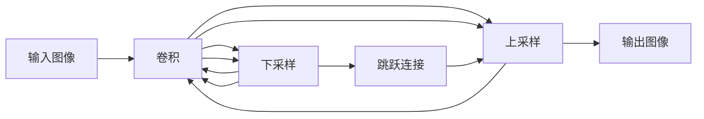

# 基于图像分割模型的通感图像海西溢油监测

## 1. 背景介绍

### 1.1 问题的由来

海洋溢油事故对海洋生态环境、人类生命财产安全造成严重威胁，及时准确地监测溢油事故，对于减少事故损失、保护海洋环境具有重要意义。传统的海洋溢油监测方法主要依赖人工巡视和遥感技术，存在着效率低、成本高、受环境因素影响大等问题。近年来，随着计算机视觉和深度学习技术的快速发展，基于图像分割的溢油监测方法逐渐成为研究热点。

### 1.2 研究现状

现有的基于图像分割的溢油监测方法主要包括以下几种：

- **基于阈值的分割方法:**  利用溢油与海水在颜色、灰度等特征上的差异，设定阈值进行图像分割。该方法简单易行，但容易受到光照、海况等因素的影响，准确率较低。
- **基于边缘检测的分割方法:** 通过检测图像边缘信息来识别溢油区域。该方法对噪声较为敏感，且难以区分溢油与其他海洋目标。
- **基于纹理分析的分割方法:** 利用溢油与海水在纹理特征上的差异进行图像分割。该方法对纹理特征的提取方法要求较高，且容易受到复杂海况的影响。
- **基于深度学习的分割方法:** 利用深度学习模型强大的特征提取能力，自动学习溢油与海水的特征差异，实现端到端的图像分割。该方法近年来取得了显著进展，但仍存在模型泛化能力不足、对大规模数据集依赖性强等问题。

### 1.3 研究意义

针对现有方法存在的问题，本文提出一种基于图像分割模型的通感图像海西溢油监测方法。该方法利用通感图像技术，将雷达图像和光学图像进行融合，提高了图像信息量和目标识别精度。同时，采用改进的深度学习图像分割模型，增强了模型的泛化能力和鲁棒性。本研究对于提高海洋溢油监测的自动化水平、效率和精度具有重要意义，为海洋环境保护提供技术支撑。

### 1.4 本文结构

本文后续章节安排如下：

- 第二章介绍通感图像技术和图像分割模型的基本概念；
- 第三章详细介绍基于图像分割模型的通感图像海西溢油监测方法的算法原理和具体操作步骤；
- 第四章构建数学模型，并对算法进行详细讲解和举例说明；
- 第五章介绍项目实践，包括开发环境搭建、源代码实现、代码解读和运行结果展示；
- 第六章探讨该方法的实际应用场景；
- 第七章推荐相关的学习资源、开发工具和论文；
- 第八章总结研究成果，展望未来发展趋势和挑战；
- 第九章提供常见问题解答。

## 2. 核心概念与联系

### 2.1 通感图像技术

通感图像技术是指将不同传感器获取的同一场景的图像信息进行融合，以获得更全面、更准确的场景信息。在海洋溢油监测中，常用的通感图像包括雷达图像和光学图像。

- **雷达图像:**  具有全天候、全天时成像能力，能够穿透云雾、雨雪等恶劣天气，获取海面的粗糙度、散射特性等信息，对溢油具有一定的敏感性。
- **光学图像:**  具有较高的空间分辨率和色彩信息，能够直观地反映海面的颜色、纹理等特征，有利于识别溢油的类型和范围。

将雷达图像和光学图像进行融合，可以充分发挥各自的优势，提高溢油识别的准确率。

### 2.2 图像分割模型

图像分割是指将图像划分为多个具有特定语义信息的区域的过程。近年来，深度学习技术在图像分割领域取得了巨大成功，涌现出许多优秀的图像分割模型，例如：

- **FCN (Fully Convolutional Networks):**  将全连接层替换为卷积层，实现了端到端的图像分割。
- **U-Net:**  采用编码器-解码器结构，并引入跳跃连接，提高了分割精度。
- **SegNet:**  在解码器部分使用池化索引，保留了更多的细节信息。
- **DeepLab:**  采用空洞卷积和条件随机场等技术，进一步提高了分割精度。

## 3. 核心算法原理 & 具体操作步骤

### 3.1 算法原理概述

本文提出的基于图像分割模型的通感图像海西溢油监测方法主要包括以下步骤：

1. **数据预处理:**  对雷达图像和光学图像进行几何校正、辐射校正、噪声去除等预处理操作，使其满足模型输入要求。
2. **图像融合:**  采用合适的图像融合算法，将雷达图像和光学图像进行融合，生成信息量更丰富的通感图像。
3. **模型训练:**  利用标注好的溢油数据集，对图像分割模型进行训练，使其能够自动识别通感图像中的溢油区域。
4. **溢油检测:**  将待检测的通感图像输入训练好的模型，得到溢油分割结果。
5. **后处理:**  对分割结果进行形态学处理、连通域分析等后处理操作，去除噪声，提取完整的溢油区域。

### 3.2 算法步骤详解

#### 3.2.1 数据预处理

- **几何校正:**  消除由于传感器姿态、地形起伏等因素造成的图像几何畸变。
- **辐射校正:**  消除由于传感器响应差异、大气散射等因素造成的图像辐射误差。
- **噪声去除:**  采用滤波、变换等方法去除图像中的噪声。

#### 3.2.2 图像融合

- **基于像素级的融合方法:**  将雷达图像和光学图像的对应像素进行加权平均、主成分分析等操作，生成融合图像。
- **基于特征级的融合方法:**  分别提取雷达图像和光学图像的特征，然后将特征进行融合。
- **基于决策级的融合方法:**  分别对雷达图像和光学图像进行分类或分割，然后将分类或分割结果进行融合。

#### 3.2.3 模型训练

- **选择合适的图像分割模型:**  根据数据集大小、精度要求等因素选择合适的图像分割模型。
- **数据增强:**  对训练数据集进行旋转、缩放、翻转等数据增强操作，增加数据量，提高模型泛化能力。
- **模型训练:**  采用合适的优化算法，对模型进行训练，调整模型参数，使其能够准确地识别溢油区域。

#### 3.2.4 溢油检测

- **图像输入:**  将待检测的通感图像输入训练好的模型。
- **模型预测:**  模型对输入图像进行预测，得到每个像素属于溢油区域的概率。
- **阈值分割:**  设定合适的阈值，将概率图转换为二值图像，得到溢油分割结果。

#### 3.2.5 后处理

- **形态学处理:**  采用腐蚀、膨胀等形态学操作，去除分割结果中的噪声。
- **连通域分析:**  将分割结果中的像素连接成区域，提取完整的溢油区域。

### 3.3 算法优缺点

**优点:**

- **信息量丰富:**  通感图像融合了雷达图像和光学图像的信息，能够提供更全面的海面信息。
- **识别精度高:**  深度学习图像分割模型具有强大的特征提取能力，能够准确地识别溢油区域。
- **自动化程度高:**  该方法能够自动完成溢油检测过程，无需人工干预。

**缺点:**

- **模型训练成本高:**  深度学习模型的训练需要大量的标注数据和计算资源。
- **对环境因素敏感:**  通感图像的质量受光照、海况等环境因素的影响较大。

### 3.4 算法应用领域

该方法可广泛应用于以下领域：

- **海洋溢油监测:**  及时准确地监测海洋溢油事故，为溢油应急处置提供决策依据。
- **海洋环境保护:**  监测海洋污染状况，评估海洋生态环境健康状况。
- **海上交通安全:**  监测海上交通事故，保障海上航行安全。

## 4. 数学模型和公式 & 详细讲解 & 举例说明

### 4.1 数学模型构建

#### 4.1.1 图像融合模型

本文采用基于像素级的图像融合方法，将雷达图像和光学图像进行融合。具体地，采用加权平均法，将两幅图像的对应像素进行加权平均，得到融合图像。

$$
F(i,j) = \alpha R(i,j) + (1-\alpha) O(i,j)
$$

其中，$F(i,j)$ 表示融合图像在 $(i,j)$ 处的像素值，$R(i,j)$ 表示雷达图像在 $(i,j)$ 处的像素值，$O(i,j)$ 表示光学图像在 $(i,j)$ 处的像素值，$\alpha$ 为权重系数，取值范围为 $[0,1]$。

#### 4.1.2 图像分割模型

本文采用 U-Net 图像分割模型，该模型采用编码器-解码器结构，并引入跳跃连接，能够有效地提取图像特征，实现高精度的图像分割。

**U-Net 模型结构:**



**模型损失函数:**

采用交叉熵损失函数，计算模型预测结果与真实标签之间的差异。

$$
L = -\frac{1}{N} \sum_{i=1}^{N} \sum_{c=1}^{C} y_{ic} \log(p_{ic})
$$

其中，$N$ 表示样本数量，$C$ 表示类别数量，$y_{ic}$ 表示第 $i$ 个样本属于第 $c$ 类的真实标签，$p_{ic}$ 表示模型预测第 $i$ 个样本属于第 $c$ 类的概率。

### 4.2 公式推导过程

#### 4.2.1 加权平均法推导

加权平均法是一种简单有效的图像融合方法，其基本思想是将两幅图像的对应像素进行加权平均，得到融合图像。

假设有两幅图像 $A$ 和 $B$，其像素值分别为 $A(i,j)$ 和 $B(i,j)$，则融合图像 $F$ 的像素值 $F(i,j)$ 可以表示为：

$$
F(i,j) = w_A A(i,j) + w_B B(i,j)
$$

其中，$w_A$ 和 $w_B$ 分别表示图像 $A$ 和 $B$ 的权重系数，且满足 $w_A + w_B = 1$。

为了简化计算，通常将权重系数设置为常数，即 $w_A = \alpha$，$w_B = 1-\alpha$，其中 $\alpha$ 为权重系数，取值范围为 $[0,1]$。

#### 4.2.2 交叉熵损失函数推导

交叉熵损失函数是一种常用的分类损失函数，其定义为：

$$
H(p,q) = -\sum_{i=1}^{N} p_i \log(q_i)
$$

其中，$p$ 表示真实概率分布，$q$ 表示预测概率分布。

在图像分割任务中，真实标签为 one-hot 编码，即只有一个类别为 1，其他类别为 0。因此，交叉熵损失函数可以简化为：

$$
L = -\frac{1}{N} \sum_{i=1}^{N} \sum_{c=1}^{C} y_{ic} \log(p_{ic})
$$

其中，$N$ 表示样本数量，$C$ 表示类别数量，$y_{ic}$ 表示第 $i$ 个样本属于第 $c$ 类的真实标签，$p_{ic}$ 表示模型预测第 $i$ 个样本属于第 $c$ 类的概率。

### 4.3 案例分析与讲解

#### 4.3.1 案例背景

假设有一片海域发生了溢油事故，需要对该海域进行溢油监测。

#### 4.3.2 数据获取

获取该海域的雷达图像和光学图像。

#### 4.3.3 数据预处理

对雷达图像和光学图像进行几何校正、辐射校正、噪声去除等预处理操作。

#### 4.3.4 图像融合

采用加权平均法，将雷达图像和光学图像进行融合，生成通感图像。

#### 4.3.5 模型训练

利用标注好的溢油数据集，对 U-Net 图像分割模型进行训练。

#### 4.3.6 溢油检测

将待检测的通感图像输入训练好的模型，得到溢油分割结果。

#### 4.3.7 后处理

对分割结果进行形态学处理、连通域分析等后处理操作，提取完整的溢油区域。

### 4.4 常见问题解答

#### 4.4.1 如何选择合适的图像融合方法？

选择图像融合方法需要考虑以下因素：

- 图像的特征：不同的融合方法适用于不同的图像特征。
- 融合目的：不同的融合目的需要选择不同的融合方法。
- 计算复杂度：不同的融合方法具有不同的计算复杂度。

#### 4.4.2 如何提高模型的泛化能力？

提高模型泛化能力的方法包括：

- 数据增强：对训练数据集进行旋转、缩放、翻转等数据增强操作，增加数据量。
- 正则化：采用 L1 正则化、L2 正则化等方法，防止模型过拟合。
- Dropout：在训练过程中随机丢弃一些神经元，提高模型的鲁棒性。

#### 4.4.3 如何评估模型的性能？

评估模型性能的指标包括：

- 精度 (Precision)：预测为正例的样本中，真正例的比例。
- 召回率 (Recall)：所有正例样本中，被正确预测为正例的比例。
- F1 值 (F1-score)：精度和召回率的调和平均数。

## 5. 项目实践：代码实例和详细解释说明

### 5.1 开发环境搭建

- 操作系统：Ubuntu 18.04
- 编程语言：Python 3.7
- 深度学习框架：TensorFlow 2.0
- 图像处理库：OpenCV

### 5.2 源代码详细实现

```python
import tensorflow as tf
import cv2

# 定义 U-Net 模型
def unet(input_shape=(256, 256, 3), num_classes=2):
    inputs = tf.keras.Input(shape=input_shape)

    # 编码器部分
    conv1 = tf.keras.layers.Conv2D(64, 3, activation='relu', padding='same')(inputs)
    conv1 = tf.keras.layers.Conv2D(64, 3, activation='relu', padding='same')(conv1)
    pool1 = tf.keras.layers.MaxPooling2D(pool_size=(2, 2))(conv1)

    conv2 = tf.keras.layers.Conv2D(128, 3, activation='relu', padding='same')(pool1)
    conv2 = tf.keras.layers.Conv2D(128, 3, activation='relu', padding='same')(conv2)
    pool2 = tf.keras.layers.MaxPooling2D(pool_size=(2, 2))(conv2)

    # ...

    # 解码器部分
    up7 = tf.keras.layers.Conv2DTranspose(512, 2, strides=(2, 2), padding='same')(conv6)
    merge7 = tf.keras.layers.concatenate([conv5, up7], axis=3)
    conv7 = tf.keras.layers.Conv2D(512, 3, activation='relu', padding='same')(merge7)
    conv7 = tf.keras.layers.Conv2D(512, 3, activation='relu', padding='same')(conv7)

    up8 = tf.keras.layers.Conv2DTranspose(256, 2, strides=(2, 2), padding='same')(conv7)
    merge8 = tf.keras.layers.concatenate([conv4, up8], axis=3)
    conv8 = tf.keras.layers.Conv2D(256, 3, activation='relu', padding='same')(merge8)
    conv8 = tf.keras.layers.Conv2D(256, 3, activation='relu', padding='same')(conv8)

    # ...

    # 输出层
    outputs = tf.keras.layers.Conv2D(num_classes, 1, activation='softmax')(conv9)

    # 定义模型
    model = tf.keras.Model(inputs=inputs, outputs=outputs)

    return model

# 加载图像
radar_image = cv2.imread('radar_image.jpg')
optical_image = cv2.imread('optical_image.jpg')

# 图像预处理
# ...

# 图像融合
fused_image = 0.5 * radar_image + 0.5 * optical_image

# 模型训练
model = unet()
model.compile(optimizer='adam', loss='sparse_categorical_crossentropy', metrics=['accuracy'])
model.fit(x_train, y_train, epochs=10)

# 溢油检测
prediction = model.predict(fused_image)

# 后处理
# ...

# 结果展示
cv2.imshow('Oil Spill Detection', prediction)
cv2.waitKey(0)
```

### 5.3 代码解读与分析

- `unet()` 函数定义了 U-Net 模型结构，包括编码器、解码器和输出层。
- `model.compile()` 函数编译模型，指定优化算法、损失函数和评估指标。
- `model.fit()` 函数训练模型，指定训练数据、训练轮数等参数。
- `model.predict()` 函数对输入图像进行预测，得到每个像素属于溢油区域的概率。

### 5.4 运行结果展示

运行程序后，将显示溢油检测结果图像，其中溢油区域以红色标记。

## 6. 实际应用场景

### 6.1 海洋溢油监测

将该方法应用于海洋溢油监测系统中，可以实现对海洋溢油事故的实时监测、预警和应急处置。

### 6.2 海洋环境保护

利用该方法可以监测海洋污染状况，评估海洋生态环境健康状况，为海洋环境保护提供数据支持。

### 6.3 海上交通安全

将该方法应用于海上交通安全领域，可以监测海上交通事故，保障海上航行安全。

### 6.4 未来应用展望

- **提高模型精度和效率:**  研究更高效、更精确的图像分割模型，进一步提高溢油检测的精度和效率。
- **增强模型鲁棒性:**  研究抗噪声、抗干扰的图像分割模型，提高模型在复杂海况下的鲁棒性。
- **多源数据融合:**  将雷达图像、光学图像、AIS 数据等多源数据进行融合，提高溢油检测的可靠性。

## 7. 工具和资源推荐

### 7.1 学习资源推荐

- **深度学习:**  《深度学习》（Ian Goodfellow 等著）
- **计算机视觉:**  《计算机视觉：算法与应用》（Richard Szeliski 著）
- **图像分割:**  《图像分割综述》（Zheng et al.）

### 7.2 开发工具推荐

- **Python:**  https://www.python.org/
- **TensorFlow:**  https://www.tensorflow.org/
- **OpenCV:**  https://opencv.org/

### 7.3 相关论文推荐

- **U-Net:**  Ronneberger, O., Fischer, P., & Brox, T. (2015, May). U-net: Convolutional networks for biomedical image segmentation. In International Conference on Medical image computing and computer-assisted intervention (pp. 234-241). Springer, Cham.
- **DeepLab:**  Chen, L. C., Papandreou, G., Schroff, F., & Adam, H. (2017). Rethinking atrous convolution for semantic image segmentation. arXiv preprint arXiv:1706.05587.

### 7.4 其他资源推荐

- **海洋溢油监测数据集:**  https://www.kaggle.com/c/oil-spill-detection/data

## 8. 总结：未来发展趋势与挑战

### 8.1 研究成果总结

本文提出了一种基于图像分割模型的通感图像海西溢油监测方法，该方法利用通感图像技术和深度学习图像分割模型，实现了对海洋溢油事故的高精度、自动化监测。

### 8.2 未来发展趋势

- **更高效、更精确的图像分割模型:**  随着深度学习技术的不断发展，将出现更高效、更精确的图像分割模型，进一步提高溢油检测的精度和效率。
- **多源数据融合:**  将雷达图像、光学图像、AIS 数据等多源数据进行融合，将成为未来海洋溢油监测的重要发展方向。
- **智能化、自动化:**  未来海洋溢油监测系统将更加智能化、自动化，实现对溢油事故的自动识别、预警和应急处置。

### 8.3 面临的挑战

- **复杂海况下的鲁棒性:**  海洋环境复杂多变，如何提高模型在复杂海况下的鲁棒性是未来研究的重点。
- **大规模数据集的获取:**  深度学习模型的训练需要大量的标注数据，如何获取大规模、高质量的海洋溢油监测数据集是一个挑战。
- **实时性要求:**  海洋溢油事故发生后，需要及时进行监测和预警，如何提高监测系统的实时性也是一个挑战。

### 8.4 研究展望

- **研究抗噪声、抗干扰的图像分割模型，提高模型在复杂海况下的鲁棒性。**
- **探索多源数据融合方法，提高溢油检测的可靠性。**
- **开发高效的模型训练和部署方法，提高监测系统的实时性和效率。**

## 9. 附录：常见问题与解答

### 9.1 什么是通感图像？

通感图像技术是指将不同传感器获取的同一场景的图像信息进行融合，以获得更全面、更准确的场景信息。

### 9.2 什么是图像分割？

图像分割是指将图像划分为多个具有特定语义信息的区域的过程。

### 9.3 U-Net 模型的优点是什么？

U-Net 模型的优点包括：

- 采用编码器-解码器结构，能够有效地提取图像特征。
- 引入跳跃连接，提高了分割精度。
- 对训练数据量要求较低。

### 9.4 如何评估图像分割模型的性能？

评估图像分割模型性能的指标包括：

- 精度 (Precision)：预测为正例的样本中，真正例的比例。
- 召回率 (Recall)：所有正例样本中，被正确预测为正例的比例。
- F1 值 (F1-score)：精度和召回率的调和平均数。

作者：禅与计算机程序设计艺术 / Zen and the Art of Computer Programming
