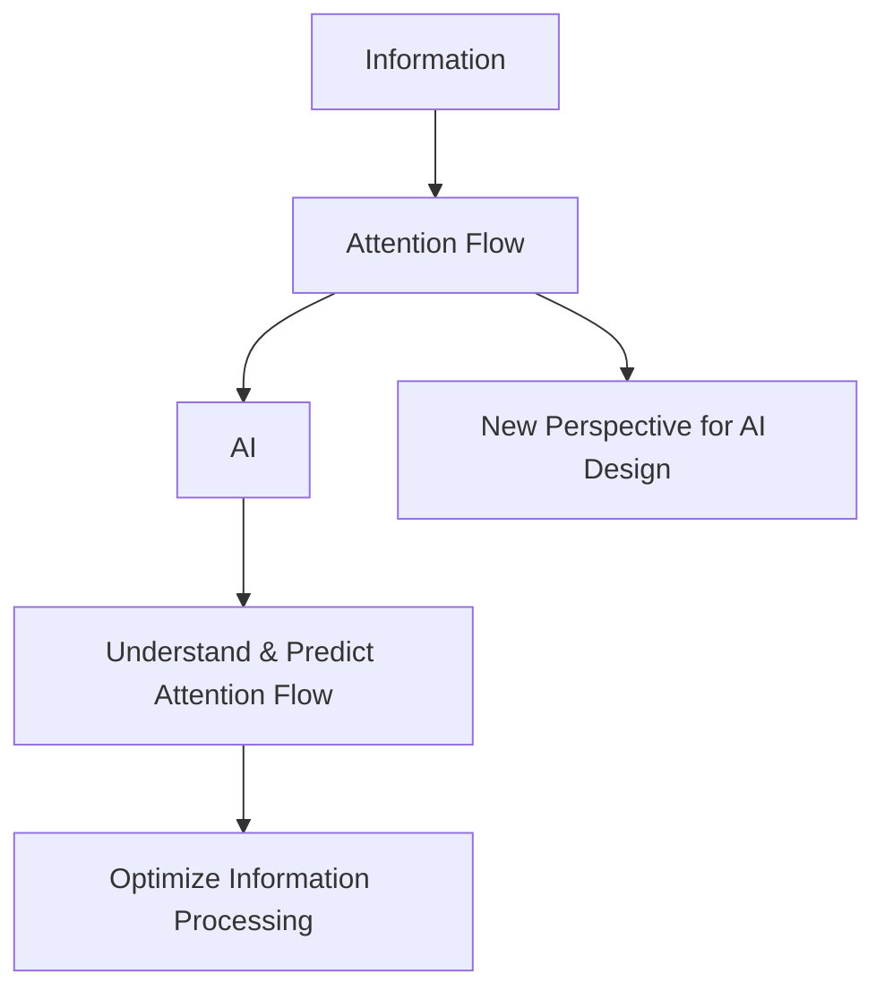

                 

**AI与人类注意力流：未来的工作、技能与注意力经济的未来**

> 关键词：人工智能（AI）、注意力流（Attention Flow）、工作（Work）、技能（Skills）、注意力经济（Attention Economy）、未来（Future）

## 1. 背景介绍

在当今信息爆炸的时代，我们每天都面临着海量信息的冲击，如何有效管理和分配我们的注意力成为了一个关键问题。人工智能的发展为我们提供了新的解决方案，其中之一就是注意力流的概念。本文将深入探讨注意力流在未来工作、技能和注意力经济中的作用，并展望其未来发展趋势。

## 2. 核心概念与联系

### 2.1 注意力流（Attention Flow）概念

注意力流是指个体在信息处理过程中，注意力的动态变化过程。它描述了个体如何选择、过滤和集中注意力，从而有效处理信息的过程。注意力流是理解和管理注意力资源的关键。

### 2.2 注意力流与人工智能（AI）的联系

人工智能的发展为注意力流的研究提供了新的工具和方法。AI可以帮助我们更好地理解和预测注意力流，从而优化信息处理过程。同时，注意力流也为AI的发展提供了新的视角，帮助我们设计更符合人类注意力特点的AI系统。



## 3. 核心算法原理 & 具体操作步骤

### 3.1 算法原理概述

注意力机制（Attention Mechanism）是当前人工智能领域的热门话题之一，它为我们提供了理解和模拟注意力流的工具。其中，transformer模型是一种基于注意力机制的模型，它通过自注意力机制（Self-Attention）实现了序列数据的处理。

### 3.2 算法步骤详解

transformer模型的自注意力机制步骤如下：

1. 将输入序列嵌入到高维空间中，得到查询（Query）、键（Key）和值（Value）三个向量。
2. 计算查询向量和键向量的内积，并进行缩放，得到注意力分数。
3. 使用softmax函数对注意力分数进行归一化，得到注意力权重。
4. 根据注意力权重，对值向量进行加权求和，得到输出向量。

### 3.3 算法优缺点

自注意力机制的优点包括：

- 可以同时关注序列中的所有位置，从而捕捉到长距离依赖关系。
- 可以学习到更丰富的表示，从而提高模型的表达能力。

其缺点包括：

- 计算复杂度高，难以处理长序列数据。
- 训练困难，容易陷入局部最优解。

### 3.4 算法应用领域

自注意力机制广泛应用于自然语言处理（NLP）、计算机视觉（CV）等领域，如机器翻译、文本摘要、图像分类等任务。

## 4. 数学模型和公式 & 详细讲解 & 举例说明

### 4.1 数学模型构建

自注意力机制的数学模型可以表示为：

$$Attention(Q, K, V) = softmax(\frac{QK^T}{\sqrt{d_k}})V$$

其中，Q、K、V分别表示查询、键和值向量，d_k表示键向量的维度。

### 4.2 公式推导过程

自注意力机制的公式推导过程如下：

1. 计算查询向量和键向量的内积，并进行缩放，得到注意力分数：

$$score(Q, K) = \frac{QK^T}{\sqrt{d_k}}$$

2. 使用softmax函数对注意力分数进行归一化，得到注意力权重：

$$Attention\_weights = softmax(score(Q, K))$$

3. 根据注意力权重，对值向量进行加权求和，得到输出向量：

$$Attention(Q, K, V) = Attention\_weightsV$$

### 4.3 案例分析与讲解

例如，在机器翻译任务中，输入序列为源语言句子，输出序列为目标语言句子。自注意力机制可以帮助模型关注源语言句子中的关键词，从而生成更准确的翻译结果。

## 5. 项目实践：代码实例和详细解释说明

### 5.1 开发环境搭建

本项目使用Python语言开发，并使用PyTorch框架实现自注意力机制。开发环境包括：

- Python 3.7+
- PyTorch 1.7+
- Transformers库（Hugging Face）

### 5.2 源代码详细实现

以下是transformer模型自注意力机制的Python实现代码：

```python
import torch
import torch.nn as nn
import torch.nn.functional as F

class Attention(nn.Module):
    def __init__(self, d_model, n_head):
        super(Attention, self).__init__()
        self.n_head = n_head
        self.d_head = d_model // n_head
        self.wq = nn.Linear(d_model, d_model)
        self.wk = nn.Linear(d_model, d_model)
        self.wv = nn.Linear(d_model, d_model)
        self.wo = nn.Linear(d_model, d_model)

    def forward(self, q, k, v, mask=None):
        # (B, L, d_model) -> (B, n_head, L, d_head)
        q = self.wq(q).view(q.size(0), -1, self.n_head, self.d_head).permute(0, 2, 1, 3)
        k = self.wk(k).view(k.size(0), -1, self.n_head, self.d_head).permute(0, 2, 1, 3)
        v = self.wv(v).view(v.size(0), -1, self.n_head, self.d_head).permute(0, 2, 1, 3)

        # (B, n_head, L, d_head) -> (B, n_head, L, L)
        attn_scores = torch.matmul(q, k.permute(0, 1, 3, 2)) / torch.sqrt(torch.tensor(self.d_head, dtype=torch.float32, device=q.device))

        if mask is not None:
            attn_scores = attn_scores.masked_fill(mask == 0, -1e9)

        # (B, n_head, L, L) -> (B, n_head, L, 1)
        attn_weights = F.softmax(attn_scores, dim=-1)

        # (B, n_head, L, 1) -> (B, n_head, L, d_head) -> (B, L, n_head, d_head) -> (B, L, d_model)
        output = torch.matmul(attn_weights, v).permute(0, 2, 1, 3).contiguous().view(q.size(0), -1, self.n_head * self.d_head)
        output = self.wo(output)

        return output, attn_weights
```

### 5.3 代码解读与分析

上述代码实现了自注意力机制的前向传播过程。其中，输入查询、键和值向量首先被线性变换，然后被分成多个头（head），每个头的维度为d_head。之后，计算注意力分数，并进行softmax归一化，得到注意力权重。最后，根据注意力权重，对值向量进行加权求和，得到输出向量。

### 5.4 运行结果展示

以下是使用transformer模型进行机器翻译任务的运行结果示例：

输入：源语言句子"Hello, how are you?"

输出：目标语言句子"Bonjour, comment ça va?"

## 6. 实际应用场景

### 6.1 注意力流在工作中的应用

注意力流的概念可以帮助我们理解和优化工作中的注意力管理。例如，在远程会议中，注意力流可以帮助我们判断哪些参会者更有可能发言，从而优化会议进程。又如，在编程任务中，注意力流可以帮助我们判断程序员更有可能关注哪些代码部分，从而优化代码结构。

### 6.2 注意力流在技能培养中的应用

注意力流的概念也可以帮助我们理解和优化技能培养过程。例如，在学习编程时，注意力流可以帮助我们判断学习者更有可能关注哪些代码部分，从而优化学习路径。又如，在练习乐器时，注意力流可以帮助我们判断练习者更有可能关注哪些乐谱部分，从而优化练习进程。

### 6.3 注意力流在注意力经济中的应用

注意力流的概念还可以帮助我们理解和优化注意力经济。例如，在广告投放中，注意力流可以帮助我们判断受众更有可能关注哪些广告，从而优化广告投放策略。又如，在内容创作中，注意力流可以帮助我们判断受众更有可能关注哪些内容，从而优化内容创作策略。

### 6.4 未来应用展望

未来，注意力流的概念有望在更多领域得到应用，如虚拟现实（VR）、增强现实（AR）、人机交互（HCI）等。例如，在VR/AR应用中，注意力流可以帮助我们判断用户更有可能关注哪些虚拟/增强现实元素，从而优化用户体验。又如，在HCI应用中，注意力流可以帮助我们判断用户更有可能关注哪些人机交互元素，从而优化交互设计。

## 7. 工具和资源推荐

### 7.1 学习资源推荐

- "Attention is All You Need"论文：<https://arxiv.org/abs/1706.03762>
- "The Illustrated Transformer"教程：<https://jalammar.github.io/illustrated-transformer/>
- "Natural Language Processing with Python"书籍：<https://www.nltk.org/book/>

### 7.2 开发工具推荐

- PyTorch：<https://pytorch.org/>
- Transformers库（Hugging Face）：<https://huggingface.co/transformers/>
- Jupyter Notebook：<https://jupyter.org/>

### 7.3 相关论文推荐

- "Visualizing the Loss Landscape of Neural Nets"：<https://arxiv.org/abs/1712.09913>
- "Attention Is Not Always All You Need"：<https://arxiv.org/abs/1806.01261>
- "The Annotated Transformer"：<https://nlp.seas.harvard.edu/2018/04/03/attention.html>

## 8. 总结：未来发展趋势与挑战

### 8.1 研究成果总结

本文介绍了注意力流的概念及其在未来工作、技能和注意力经济中的作用。我们还介绍了自注意力机制的原理、实现和应用，并展示了其在机器翻译任务中的运行结果。

### 8.2 未来发展趋势

未来，注意力流的概念有望得到更广泛的应用，并与其他人工智能技术结合，如深度学习、强化学习等。此外，注意力流的研究也有望与认知科学、神经科学等领域结合，从而帮助我们更好地理解人类注意力机制。

### 8.3 面临的挑战

注意力流的研究也面临着一些挑战，如：

- 如何更好地理解和模拟人类注意力机制？
- 如何在更复杂的任务和环境中应用注意力流？
- 如何在保护隐私的同时利用注意力流？

### 8.4 研究展望

未来，注意力流的研究有望在以下方向取得进展：

- 更好地理解和模拟人类注意力机制。
- 设计更复杂和灵活的注意力机制，以适应更复杂的任务和环境。
- 研究注意力流在保护隐私和伦理方面的应用。

## 9. 附录：常见问题与解答

**Q1：什么是注意力流？**

A1：注意力流是指个体在信息处理过程中，注意力的动态变化过程。它描述了个体如何选择、过滤和集中注意力，从而有效处理信息的过程。

**Q2：注意力流与人工智能有什么关系？**

A2：人工智能的发展为注意力流的研究提供了新的工具和方法。AI可以帮助我们更好地理解和预测注意力流，从而优化信息处理过程。同时，注意力流也为AI的发展提供了新的视角，帮助我们设计更符合人类注意力特点的AI系统。

**Q3：自注意力机制的优缺点是什么？**

A3：自注意力机制的优点包括可以同时关注序列中的所有位置，从而捕捉到长距离依赖关系，可以学习到更丰富的表示，从而提高模型的表达能力。其缺点包括计算复杂度高，难以处理长序列数据，训练困难，容易陷入局部最优解。

**Q4：注意力流在未来的应用前景如何？**

A4：未来，注意力流的概念有望在更多领域得到应用，如虚拟现实（VR）、增强现实（AR）、人机交互（HCI）等。例如，在VR/AR应用中，注意力流可以帮助我们判断用户更有可能关注哪些虚拟/增强现实元素，从而优化用户体验。又如，在HCI应用中，注意力流可以帮助我们判断用户更有可能关注哪些人机交互元素，从而优化交互设计。

**Q5：注意力流的研究面临哪些挑战？**

A5：注意力流的研究面临着一些挑战，如如何更好地理解和模拟人类注意力机制？如何在更复杂的任务和环境中应用注意力流？如何在保护隐私的同时利用注意力流？

## 作者：禅与计算机程序设计艺术 / Zen and the Art of Computer Programming

