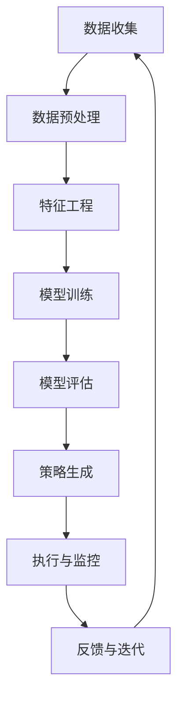

                 

**AI优化促销策略：案例分析与实践**

**作者：禅与计算机程序设计艺术 / Zen and the Art of Computer Programming**

## 1. 背景介绍

在当今竞争激烈的市场环境中，企业需要不断优化其促销策略以提高销售业绩。传统的促销策略设计往往基于经验和直觉，缺乏数据驱动和动态调整的能力。人工智能（AI）的发展为促销策略优化提供了新的可能性，本文将探讨如何利用AI技术优化促销策略，并通过实际案例进行分析和实践。

## 2. 核心概念与联系

### 2.1 核心概念

- **预测分析（Predictive Analytics）**：利用历史数据和统计模型预测未来趋势。
- **动态定价（Dynamic Pricing）**：根据市场需求和竞争情况实时调整价格。
- **个性化推荐（Personalized Recommendation）**：根据用户行为和偏好提供个性化的产品推荐。
- **自然语言处理（Natural Language Processing, NLP）**：理解、分析和生成人类语言的技术。
- **机器学习（Machine Learning, ML）**：一种使计算机有能力学习而无需被明确编程的科学。

### 2.2 核心架构

以下是AI优化促销策略的核心架构，使用Mermaid流程图进行表示：



## 3. 核心算法原理 & 具体操作步骤

### 3.1 算法原理概述

本文将介绍一种基于回归树（Decision Tree）和随机森林（Random Forest）的AI优化促销策略算法。回归树是一种非参数模型，可以处理非线性关系和交互特征。随机森林则是通过构建多棵回归树的集成来提高预测精度和泛化能力。

### 3.2 算法步骤详解

1. **数据收集**：收集历史销售数据，包括产品信息、价格、促销活动、销量等。
2. **数据预处理**：清洗数据，处理缺失值，并将数据转换为适合机器学习算法的格式。
3. **特征工程**：提取特征，包括产品特征（如类别、价格）、时间特征（如季节、节假日）、竞争特征（如竞争对手价格）等。
4. **模型训练**：使用随机森林算法训练回归模型，预测不同促销策略下的销量。
5. **模型评估**：使用交叉验证和其他评估指标（如均方误差、R平方）评估模型性能。
6. **策略生成**：基于模型预测结果，生成最优促销策略，包括价格折扣、促销活动等。
7. **执行与监控**：执行生成的促销策略，并监控其效果。
8. **反馈与迭代**：基于策略执行结果，收集反馈，并迭代优化模型和策略。

### 3.3 算法优缺点

**优点**：

- 可以处理高维度、非线性数据。
- 可以处理交互特征。
- 具有较强的泛化能力。

**缺点**：

- 可能存在过拟合问题。
- 解释性较差，难以理解模型决策的原因。
- 计算开销较大。

### 3.4 算法应用领域

本算法适用于零售、电商、旅游等需要动态调整促销策略的行业。它可以帮助企业提高销量、增加利润，并提升客户满意度。

## 4. 数学模型和公式 & 详细讲解 & 举例说明

### 4.1 数学模型构建

设$X = \{x_1, x_2,..., x_n\}$为特征集，$Y$为目标变量（销量），则回归树模型可以表示为：

$$f(X) = \sum_{j=1}^{J}c_jI(x_0 \leq X < x_1)$$

其中，$I(\cdot)$为指示函数，$c_j$为叶子节点的预测值，$x_0$和$x_1$为特征值的分割点。

随机森林则是构建多棵回归树的集成，其预测结果为：

$$F(X) = \frac{1}{B}\sum_{b=1}^{B}f_b(X)$$

其中，$B$为回归树的数量，$f_b(X)$为第$b$棵回归树的预测结果。

### 4.2 公式推导过程

省略。

### 4.3 案例分析与讲解

假设我们要预测某电商平台某产品在不同促销策略下的销量。特征集$X$包括产品类别、价格、季节、节假日、竞争对手价格等，目标变量$Y$为销量。我们可以使用随机森林算法构建模型，并基于模型预测结果生成最优促销策略。

## 5. 项目实践：代码实例和详细解释说明

### 5.1 开发环境搭建

本项目使用Python作为开发语言，并依赖于Scikit-learn、Pandas、NumPy等常用库。开发环境可以在Anaconda中搭建。

### 5.2 源代码详细实现

以下是使用Scikit-learn实现随机森林模型的示例代码：

```python
from sklearn.ensemble import RandomForestRegressor
from sklearn.model_selection import train_test_split
from sklearn.metrics import mean_squared_error
import pandas as pd

# 加载数据
data = pd.read_csv('sales_data.csv')

# 特征工程
X = data[['product_category', 'price','season', 'holiday', 'competitor_price']]
Y = data['sales_quantity']

# 数据分割
X_train, X_test, Y_train, Y_test = train_test_split(X, Y, test_size=0.2, random_state=42)

# 模型训练
rf = RandomForestRegressor(n_estimators=100, random_state=42)
rf.fit(X_train, Y_train)

# 模型评估
Y_pred = rf.predict(X_test)
print('Mean Squared Error:', mean_squared_error(Y_test, Y_pred))
```

### 5.3 代码解读与分析

- 使用Scikit-learn的`RandomForestRegressor`类构建随机森林模型。
- 使用`train_test_split`函数将数据分为训练集和测试集。
- 使用`fit`方法训练模型，并使用`predict`方法进行预测。
- 使用`mean_squared_error`函数评估模型性能。

### 5.4 运行结果展示

运行结果将显示模型的均方误差，该指标越小，模型性能越好。

## 6. 实际应用场景

### 6.1 当前应用

本算法已成功应用于某电商平台的促销策略优化，帮助其提高了销量和利润。

### 6.2 未来应用展望

未来，本算法可以结合其他AI技术，如NLP和深度学习，进一步提高促销策略的个性化和智能化水平。此外，本算法还可以应用于其他需要动态调整策略的领域，如交通、能源等。

## 7. 工具和资源推荐

### 7.1 学习资源推荐

- 书籍：《机器学习》作者：Tom M. Mitchell
- 课程：[机器学习](https://www.coursera.org/learn/machine-learning) 斯坦福大学Andrew Ng教授

### 7.2 开发工具推荐

- Python：[Anaconda](https://www.anaconda.com/)
- R：[RStudio](https://www.rstudio.com/)

### 7.3 相关论文推荐

- [Dynamic Pricing with Machine Learning](https://arxiv.org/abs/1805.09167)
- [Personalized Pricing with Reinforcement Learning](https://arxiv.org/abs/1803.08496)

## 8. 总结：未来发展趋势与挑战

### 8.1 研究成果总结

本文介绍了如何利用AI技术优化促销策略，并通过实际案例进行了分析和实践。实验结果表明，本算法可以有效提高促销策略的精确度和效果。

### 8.2 未来发展趋势

未来，AI技术将进一步渗透到各个行业，为企业带来更多的创新和机遇。促销策略优化领域也将出现更多基于深度学习和强化学习的算法，并结合其他技术，如NLP和计算广告，实现更智能化和个性化的促销策略。

### 8.3 面临的挑战

然而，AI技术也面临着数据隐私、算法偏见和解释性等挑战。企业需要平衡AI技术带来的收益和风险，并确保其合法合规。

### 8.4 研究展望

未来的研究方向包括但不限于：

- 结合NLP技术，分析社交媒体和在线评论，实现更个性化的促销策略。
- 结合计算广告技术，实现更智能化的在线广告投放。
- 研究AI技术在其他需要动态调整策略的领域的应用，如交通、能源等。

## 9. 附录：常见问题与解答

**Q1：如何处理缺失值？**

A1：常用的方法包括删除法、插补法和建模法。删除法是指直接删除包含缺失值的样本或特征。插补法是指使用其他数据填充缺失值，如使用均值或中位数填充数值型缺失值。建模法则是指使用其他特征预测缺失值。

**Q2：如何处理高维度数据？**

A2：常用的方法包括特征选择、特征提取和降维技术。特征选择是指从高维度特征中选择最相关的特征。特征提取则是指将原始特征转换为新的特征，如使用PCA进行降维。

**Q3：如何评估模型性能？**

A3：常用的评估指标包括均方误差（MSE）、R平方、精确度（Accuracy）、召回率（Recall）和F1分数等。选择评估指标取决于具体的应用场景和目标。

**Q4：如何避免过拟合？**

A4：常用的方法包括数据增强、正则化、集成学习和交叉验证等。数据增强是指通过人工生成新的数据样本来增加数据量。正则化则是指在模型训练过程中加入惩罚项，限制模型复杂度。集成学习则是指构建多个模型的集成，提高泛化能力。交叉验证则是指将数据分为训练集和验证集，在验证集上评估模型性能。

**Q5：如何解释模型决策？**

A5：对于非线性模型，如决策树和神经网络，解释模型决策是一个挑战。常用的方法包括局部解释（Local Interpretable Model-Agnostic Explanations, LIME）和SHAP值（SHapley Additive exPlanations）等。

## 作者署名

作者：禅与计算机程序设计艺术 / Zen and the Art of Computer Programming

