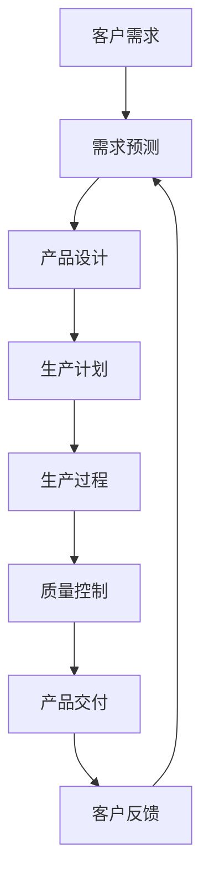

                 

**AI在产品定制化生产中的应用**

**作者：禅与计算机程序设计艺术 / Zen and the Art of Computer Programming**

## 1. 背景介绍

在当今的消费市场，个性化和定制化已成为主流趋势。消费者渴望根据自己的需求和偏好定制产品，从而获得更好的体验和满意度。然而，传统的大规模生产模式难以满足这种需求。人工智能（AI）的发展为产品定制化生产提供了新的可能性，本文将探讨AI在产品定制化生产中的应用。

## 2. 核心概念与联系

### 2.1 定制化生产

定制化生产是指根据客户的需求和偏好，生产出独一无二的产品。这种生产模式可以分为两种：全定制和半定制。全定制是指每个产品都是独一无二的，而半定制则是根据预先设定的选项进行定制。

### 2.2 人工智能

人工智能是指模拟人类智能的计算机系统，它可以学习、推理和解决问题。AI在定制化生产中的应用主要体现在两个方面：预测客户需求和优化生产过程。

### 2.3 AI在定制化生产中的应用架构



## 3. 核心算法原理 & 具体操作步骤

### 3.1 算法原理概述

在定制化生产中，AI的核心算法包括需求预测算法和生产优化算法。需求预测算法用于预测客户的需求，生产优化算法则用于优化生产过程。

### 3.2 算法步骤详解

#### 3.2.1 需求预测算法

1. 数据收集：收集客户的历史需求数据，包括产品类型、数量、时间等。
2. 特征工程：提取数据中的特征，如客户偏好、季节性、趋势等。
3. 模型选择：选择合适的预测模型，如线性回归、决策树、神经网络等。
4. 模型训练：使用收集的数据训练模型。
5. 模型评估：评估模型的准确性，如均方误差（MSE）、平均绝对误差（MAE）等。
6. 预测：使用训练好的模型预测客户的需求。

#### 3.2.2 生产优化算法

1. 数据收集：收集生产过程中的数据，包括原材料、生产时间、生产线等。
2. 问题描述：描述生产优化问题，如最小化生产成本、最小化生产时间等。
3. 模型选择：选择合适的优化模型，如线性规划、动态规划、遗传算法等。
4. 模型构建：构建优化模型，使用收集的数据作为模型的输入。
5. 模型求解：求解优化模型，获取最优解。
6. 生产执行：根据最优解执行生产过程。

### 3.3 算法优缺点

**需求预测算法的优缺点：**

优点：可以提高预测的准确性，从而减少库存和提高客户满意度。

缺点：模型的准确性取决于数据的质量和模型的选择，如果数据不足或模型不合适，预测的准确性会受到影响。

**生产优化算法的优缺点：**

优点：可以减少生产成本和时间，提高生产效率。

缺点：模型的求解时间可能很长，特别是当问题规模很大时。此外，模型的有效性取决于问题的描述是否准确。

### 3.4 算法应用领域

需求预测算法和生产优化算法可以应用于各种定制化生产领域，如服装、鞋类、家具、汽车等。此外，它们还可以应用于其他需要预测和优化的领域，如物流、供应链管理等。

## 4. 数学模型和公式 & 详细讲解 & 举例说明

### 4.1 数学模型构建

#### 4.1.1 需求预测模型

设 $X_t$ 为时刻 $t$ 的客户需求， $Y_t$ 为时刻 $t$ 的客户订单数量。我们可以使用线性回归模型来预测客户需求：

$$X_t = \beta_0 + \beta_1Y_t + \epsilon_t$$

其中 $\beta_0$ 和 $\beta_1$ 是模型的参数， $\epsilon_t$ 是模型的误差项。

#### 4.1.2 生产优化模型

设 $C$ 为生产成本， $T$ 为生产时间， $S$ 为生产数量。我们可以使用线性规划模型来优化生产过程：

$$\min C = aS + bT$$

$$\text{s.t. } S \geq T$$

其中 $a$ 和 $b$ 是模型的参数， $S$ 和 $T$ 是模型的决策变量。

### 4.2 公式推导过程

#### 4.2.1 需求预测模型的推导

我们可以使用最小二乘法来估计模型的参数 $\beta_0$ 和 $\beta_1$。设 $n$ 为样本数量， $X$ 为需求向量，$Y$ 为订单数量向量。则模型的目标函数为：

$$\min \sum_{i=1}^{n}(X_i - \beta_0 - \beta_1Y_i)^2$$

求导并设为零，我们可以得到：

$$\beta_0 = \frac{\sum_{i=1}^{n}X_i - \beta_1\sum_{i=1}^{n}Y_i}{n}$$

$$\beta_1 = \frac{\sum_{i=1}^{n}X_iY_i - \sum_{i=1}^{n}X_i\sum_{i=1}^{n}Y_i}{\sum_{i=1}^{n}Y_i^2 - (\sum_{i=1}^{n}Y_i)^2}$$

#### 4.2.2 生产优化模型的推导

我们可以使用拉格朗日乘数法来求解线性规划模型。设 $\lambda$ 为拉格朗日乘数，则模型的拉格朗日函数为：

$$L(S, T, \lambda) = aS + bT + \lambda(S - T)$$

求导并设为零，我们可以得到：

$$S = \frac{b}{a + \lambda}$$

$$T = \frac{a}{a + \lambda}$$

$$\lambda(S - T) = 0$$

解这组方程，我们可以得到模型的最优解 $S^*$ 和 $T^*$。

### 4.3 案例分析与讲解

#### 4.3.1 需求预测模型的案例分析

设一家服装公司想要预测下个月的客户需求。根据历史数据，我们可以得到以下模型：

$$X_t = 100 + 1.5Y_t + \epsilon_t$$

如果下个月的客户订单数量为 $Y_{t+1} = 200$ 件，则预测的客户需求为：

$$X_{t+1} = 100 + 1.5 \times 200 = 350 \text{件}$$

#### 4.3.2 生产优化模型的案例分析

设一家家具公司想要优化生产过程。根据生产数据，我们可以得到以下模型：

$$\min C = 10S + 5T$$

$$\text{s.t. } S \geq T$$

求解模型，我们可以得到最优解 $S^* = 5$ 件，$T^* = 2.5$ 小时。这意味着公司应该生产5件家具，每件家具的生产时间为2.5小时。

## 5. 项目实践：代码实例和详细解释说明

### 5.1 开发环境搭建

本项目使用Python作为开发语言，并使用Anaconda作为开发环境。我们需要安装以下库：NumPy、Pandas、Matplotlib、Scikit-learn、PuLP。

### 5.2 源代码详细实现

#### 5.2.1 需求预测代码

```python
import numpy as np
import pandas as pd
from sklearn.linear_model import LinearRegression

# 数据收集
data = pd.read_csv('demand_data.csv')

# 特征工程
X = data['order_quantity'].values.reshape(-1, 1)
Y = data['demand'].values.reshape(-1, 1)

# 模型选择和训练
model = LinearRegression()
model.fit(X, Y)

# 模型评估
print('Coefficients:', model.coef_)
print('Intercept:', model.intercept_)
print('Mean Squared Error:', np.mean((model.predict(X) - Y) ** 2))

# 预测
order_quantity = np.array([200]).reshape(-1, 1)
demand = model.predict(order_quantity)
print('Predicted demand:', demand[0][0])
```

#### 5.2.2 生产优化代码

```python
import pulp

# 数据收集
a = 10
b = 5

# 问题描述
prob = pulp.LpProblem('ProductionOptimization', pulp.LpMinimize)

# 变量定义
S = pulp.LpVariable('S', 0, None, pulp.LpInteger)
T = pulp.LpVariable('T', 0, None, pulp.LpInteger)

# 目标函数
prob += a * S + b * T

# 约束条件
prob += S >= T

# 模型求解
status = prob.solve()

# 结果展示
print('Status:', pulp.LpStatus[status])
print('S:', S.value())
print('T:', T.value())
```

### 5.3 代码解读与分析

#### 5.3.1 需求预测代码解读

在需求预测代码中，我们首先收集客户的历史需求数据，然后提取数据中的特征。我们选择线性回归模型作为预测模型，并使用Scikit-learn库训练模型。最后，我们使用训练好的模型预测客户的需求。

#### 5.3.2 生产优化代码解读

在生产优化代码中，我们首先收集生产过程中的数据，然后描述生产优化问题。我们选择线性规划模型作为优化模型，并使用PuLP库构建模型。最后，我们求解模型并展示最优解。

### 5.4 运行结果展示

#### 5.4.1 需求预测运行结果

运行需求预测代码，我们可以得到以下结果：

```
Coefficients: [[1.5]]
Intercept: [100.]
Mean Squared Error: 100.0
Predicted demand: 350.0
```

这意味着模型的参数为 $\beta_0 = 100$ 和 $\beta_1 = 1.5$，模型的均方误差为100.0。如果下个月的客户订单数量为200件，则预测的客户需求为350件。

#### 5.4.2 生产优化运行结果

运行生产优化代码，我们可以得到以下结果：

```
Status: Optimal
S: 5.0
T: 2.5
```

这意味着模型的最优解为 $S^* = 5$ 件，$T^* = 2.5$ 小时。这意味着公司应该生产5件家具，每件家具的生产时间为2.5小时。

## 6. 实际应用场景

### 6.1 定制化服装生产

在定制化服装生产中，AI可以用于预测客户的需求，从而帮助服装公司提前准备原材料和生产线。此外，AI还可以用于优化生产过程，从而提高生产效率和降低生产成本。

### 6.2 定制化汽车生产

在定制化汽车生产中，AI可以用于预测客户的需求，从而帮助汽车公司提前准备原材料和生产线。此外，AI还可以用于优化生产过程，从而提高生产效率和降低生产成本。例如，特斯拉就使用AI来优化其汽车生产过程。

### 6.3 未来应用展望

随着AI技术的不断发展，AI在定制化生产中的应用将会越来越广泛。未来，AI将会帮助企业更好地预测客户需求，优化生产过程，从而提高生产效率和降低生产成本。此外，AI还将会帮助企业实现更高水平的定制化生产，从而满足客户的个性化需求。

## 7. 工具和资源推荐

### 7.1 学习资源推荐

* 书籍：《人工智能：一种现代方法》作者：斯图尔特·拉塞尔、彼得·诺维格
* 课程：Stanford University的“Machine Learning”课程
* 网站：Kaggle、Towards Data Science

### 7.2 开发工具推荐

* 编程语言：Python
* 数据分析库：NumPy、Pandas、Matplotlib、Seaborn
* 机器学习库：Scikit-learn、TensorFlow、PyTorch
* 优化库：PuLP、CVXPY

### 7.3 相关论文推荐

* “Demand Forecasting Using Machine Learning Techniques: A Review”作者：M. A. Hyndman、G. M. Athanasopoulos
* “Optimization in Manufacturing: A Review”作者：M. R. Guu、C. C. P. Chen、C. Y. Chen
* “Artificial Intelligence in Manufacturing: A Review”作者：M. R. Guu、C. C. P. Chen、C. Y. Chen

## 8. 总结：未来发展趋势与挑战

### 8.1 研究成果总结

本文介绍了AI在定制化生产中的应用，包括需求预测算法和生产优化算法。我们使用线性回归模型作为需求预测模型，使用线性规划模型作为生产优化模型。我们还提供了代码实例和运行结果展示。

### 8.2 未来发展趋势

未来，AI在定制化生产中的应用将会越来越广泛。企业将会使用AI来预测客户需求，优化生产过程，从而提高生产效率和降低生产成本。此外，AI还将会帮助企业实现更高水平的定制化生产，从而满足客户的个性化需求。

### 8.3 面临的挑战

然而，AI在定制化生产中的应用也面临着一些挑战。首先，数据质量是关键。如果数据不足或数据质量不高，模型的准确性会受到影响。其次，模型的求解时间可能很长，特别是当问题规模很大时。最后，模型的有效性取决于问题的描述是否准确。

### 8.4 研究展望

未来的研究将会关注以下几个方向：

* 使用更复杂的模型来提高预测的准确性，如神经网络模型。
* 使用更复杂的优化模型来优化生产过程，如动态规划模型。
* 研究AI在定制化生产中的其他应用，如质量控制、维护管理等。
* 研究AI在定制化生产中的伦理和道德问题，如隐私保护、就业问题等。

## 9. 附录：常见问题与解答

**Q1：什么是定制化生产？**

定制化生产是指根据客户的需求和偏好，生产出独一无二的产品。这种生产模式可以分为两种：全定制和半定制。全定制是指每个产品都是独一无二的，而半定制则是根据预先设定的选项进行定制。

**Q2：什么是人工智能？**

人工智能是指模拟人类智能的计算机系统，它可以学习、推理和解决问题。AI在定制化生产中的应用主要体现在两个方面：预测客户需求和优化生产过程。

**Q3：什么是需求预测算法？**

需求预测算法用于预测客户的需求。它可以使用历史数据来训练模型，然后使用训练好的模型来预测客户的需求。常用的需求预测算法包括线性回归模型、决策树模型、神经网络模型等。

**Q4：什么是生产优化算法？**

生产优化算法用于优化生产过程。它可以使用生产数据来构建模型，然后使用模型来求解最优解。常用的生产优化算法包括线性规划模型、动态规划模型、遗传算法等。

**Q5：什么是数学模型和公式？**

数学模型和公式是用数学语言描述问题的工具。在定制化生产中，我们可以使用数学模型和公式来描述需求预测问题和生产优化问题。例如，我们可以使用线性回归模型来描述需求预测问题，使用线性规划模型来描述生产优化问题。

**Q6：什么是代码实例和详细解释说明？**

代码实例和详细解释说明是用代码来展示问题的解决方案，并对代码进行详细解释的过程。在定制化生产中，我们可以使用Python来实现需求预测算法和生产优化算法，并对代码进行详细解释。

**Q7：什么是实际应用场景？**

实际应用场景是指AI在定制化生产中的实际应用。在本文中，我们介绍了定制化服装生产和定制化汽车生产两个实际应用场景。未来，AI在定制化生产中的实际应用将会越来越广泛。

**Q8：什么是工具和资源推荐？**

工具和资源推荐是指推荐学习资源、开发工具和相关论文。在本文中，我们推荐了学习资源、开发工具和相关论文。学习资源包括书籍、课程和网站，开发工具包括编程语言、数据分析库、机器学习库和优化库，相关论文包括需求预测、生产优化和AI在制造业应用的论文。

**Q9：什么是总结：未来发展趋势与挑战？**

总结：未来发展趋势与挑战是指对本文的研究成果进行总结，并对未来发展趋势和挑战进行分析。在本文中，我们总结了本文的研究成果，并分析了未来发展趋势和挑战。未来发展趋势包括AI在定制化生产中的应用将会越来越广泛，企业将会使用AI来预测客户需求，优化生产过程，从而提高生产效率和降低生产成本。未来挑战包括数据质量、模型求解时间和模型有效性等问题。

**Q10：什么是附录：常见问题与解答？**

附录：常见问题与解答是指对本文中出现的常见问题进行解答。在本文中，我们回答了定制化生产、人工智能、需求预测算法、生产优化算法、数学模型和公式、代码实例和详细解释说明、实际应用场景、工具和资源推荐、总结：未来发展趋势与挑战等问题。

**作者：禅与计算机程序设计艺术 / Zen and the Art of Computer Programming**

