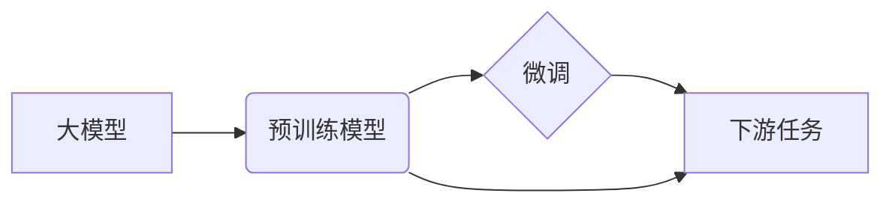

# 大模型的用户需求与市场前景

## 1. 背景介绍

### 1.1 问题的由来

近年来，随着深度学习技术的飞速发展，大模型凭借其强大的能力在各个领域都展现出了惊人的效果。从自然语言处理到计算机视觉，从语音识别到机器翻译，大模型都取得了突破性进展，并逐渐渗透到我们生活的方方面面。然而，大模型的训练和部署成本高昂，如何将其强大的能力转化为实际应用，满足用户的需求，成为了亟待解决的问题。

### 1.2 研究现状

目前，大模型的应用主要集中在以下几个方面：

* **自然语言处理：**文本生成、机器翻译、问答系统、情感分析等。
* **计算机视觉：**图像识别、目标检测、图像分割、视频分析等。
* **语音识别与合成：**语音助手、智能客服、语音输入法等。
* **数据挖掘与分析：**推荐系统、风险控制、用户画像等。

尽管大模型在这些领域取得了显著成果，但其应用仍面临着一些挑战：

* **模型训练成本高昂：**大模型的训练需要海量数据和强大的计算资源，这对于许多企业和研究机构来说都是难以承受的。
* **模型部署难度大：**大模型的规模庞大，对硬件设备的要求较高，部署和维护成本高。
* **用户需求多样化：**不同用户对大模型的需求各不相同，如何针对不同需求进行模型定制化是一个难题。

### 1.3 研究意义

探究大模型的用户需求和市场前景具有重要的现实意义：

* **推动大模型技术的发展：**了解用户需求可以为大模型的研究方向提供指导，促进技术的进步。
* **促进大模型的应用落地：**针对用户需求开发出实用的大模型应用，可以创造巨大的经济和社会价值。
* **推动人工智能产业的发展：**大模型作为人工智能领域的重要分支，其发展将带动整个产业链的进步。

### 1.4 本文结构

本文将从以下几个方面对大模型的用户需求和市场前景进行分析：

* **核心概念与联系：**介绍大模型相关的基本概念，并阐述其之间的联系。
* **核心算法原理 & 具体操作步骤：**深入剖析大模型的核心算法原理，并详细介绍其操作步骤。
* **数学模型和公式 & 详细讲解 & 举例说明：**构建大模型的数学模型，推导相关公式，并结合实例进行详细讲解。
* **项目实践：代码实例和详细解释说明：**提供大模型的代码实例，并对代码进行详细解读和分析。
* **实际应用场景：**介绍大模型在各个领域的实际应用场景。
* **工具和资源推荐：**推荐学习大模型相关的工具和资源。
* **总结：未来发展趋势与挑战：**总结大模型的发展现状，展望其未来发展趋势，并分析其面临的挑战。

## 2. 核心概念与联系

### 2.1 大模型

大模型是指参数量巨大、层数众多、训练数据量庞大的深度学习模型。通常情况下，大模型的参数量都在数十亿甚至数千亿级别，例如 GPT-3 的参数量就达到了 1750 亿。

### 2.2 预训练模型

预训练模型是指在大规模无标注数据上进行训练得到的模型。预训练模型可以学习到通用的语言或图像特征，然后可以将其应用于各种下游任务，例如文本分类、目标检测等。

### 2.3 微调

微调是指在预训练模型的基础上，使用少量标注数据对模型进行进一步训练，以适应特定的任务。微调可以有效地提高模型在下游任务上的性能。

### 2.4 迁移学习

迁移学习是指将从一个任务中学到的知识应用于另一个相关任务。在大模型中，预训练模型可以看作是源任务，而下游任务则是目标任务。通过迁移学习，可以将预训练模型的知识迁移到目标任务中，从而提高模型的性能。

### 2.5 概念之间的联系

下图展示了大模型、预训练模型、微调和迁移学习之间的联系：



## 3. 核心算法原理 & 具体操作步骤

### 3.1 算法原理概述

大模型的核心算法主要包括以下几种：

* **Transformer：**Transformer 是一种基于自注意力机制的神经网络架构，它在自然语言处理领域取得了巨大成功。
* **BERT：**BERT 是一种基于 Transformer 的预训练模型，它在各种自然语言处理任务上都取得了 state-of-the-art 的结果。
* **GPT：**GPT 是一种基于 Transformer 的生成式预训练模型，它可以生成高质量的文本。

### 3.2 算法步骤详解

以 BERT 为例，其训练过程主要包括以下步骤：

1. **数据预处理：**对原始文本数据进行清洗、分词、编码等操作，将其转换为模型可以处理的格式。
2. **模型构建：**构建 BERT 模型，包括输入层、编码器层、输出层等。
3. **预训练：**使用大规模无标注数据对 BERT 模型进行预训练，学习通用的语言特征。
4. **微调：**使用少量标注数据对预训练的 BERT 模型进行微调，以适应特定的任务。

### 3.3 算法优缺点

**优点：**

* **强大的特征表示能力：**大模型可以学习到数据中复杂的模式和特征，从而提高模型的性能。
* **广泛的应用领域：**大模型可以应用于各种领域，例如自然语言处理、计算机视觉、语音识别等。
* **可迁移性：**预训练的大模型可以迁移到各种下游任务中，从而节省训练时间和成本。

**缺点：**

* **训练成本高昂：**大模型的训练需要海量数据和强大的计算资源，这对于许多企业和研究机构来说都是难以承受的。
* **模型部署难度大：**大模型的规模庞大，对硬件设备的要求较高，部署和维护成本高。
* **可解释性差：**大模型的决策过程难以解释，这限制了其在一些对可解释性要求较高的领域的应用。

### 3.4 算法应用领域

大模型的应用领域非常广泛，例如：

* **自然语言处理：**文本生成、机器翻译、问答系统、情感分析等。
* **计算机视觉：**图像识别、目标检测、图像分割、视频分析等。
* **语音识别与合成：**语音助手、智能客服、语音输入法等。
* **数据挖掘与分析：**推荐系统、风险控制、用户画像等。

## 4. 数学模型和公式 & 详细讲解 & 举例说明

### 4.1 数学模型构建

以 Transformer 为例，其数学模型可以表示为：

$$
\text{Attention}(Q, K, V) = \text{softmax}(\frac{QK^T}{\sqrt{d_k}})V
$$

其中：

* $Q$ 表示查询矩阵。
* $K$ 表示键矩阵。
* $V$ 表示值矩阵。
* $d_k$ 表示键的维度。

### 4.2 公式推导过程

Transformer 的核心是自注意力机制，其计算过程可以分为以下几步：

1. **计算查询矩阵、键矩阵和值矩阵：**将输入序列中的每个词向量分别乘以三个不同的矩阵，得到查询矩阵、键矩阵和值矩阵。
2. **计算注意力权重：**计算查询矩阵和键矩阵之间的点积，然后进行缩放和 softmax 操作，得到注意力权重。
3. **加权求和：**将值矩阵乘以注意力权重，然后进行求和操作，得到最终的输出向量。

### 4.3 案例分析与讲解

以机器翻译为例，假设我们要将英文句子 "I love you" 翻译成中文 "我爱你"。

1. **数据预处理：**将英文句子和中文句子分别进行分词和编码，例如：
    * 英文句子：["I", "love", "you"] -> [1, 2, 3]
    * 中文句子：["我", "爱", "你"] -> [4, 5, 6]

2. **模型构建：**构建一个基于 Transformer 的机器翻译模型。

3. **预训练：**使用大规模的英文-中文平行语料库对模型进行预训练。

4. **微调：**使用少量的英文-中文平行语料库对预训练的模型进行微调。

5. **翻译：**将英文句子 "I love you" 输入到模型中，模型会输出对应的中文翻译 "我爱你"。

### 4.4 常见问题解答

**问：大模型的参数量为什么这么大？**

答：大模型的参数量之所以这么大，是因为它需要学习数据中复杂的模式和特征。参数量越大，模型的表达能力就越强，从而可以取得更好的性能。

**问：大模型的训练成本为什么这么高？**

答：大模型的训练需要海量数据和强大的计算资源。训练数据量越大，模型的泛化能力就越强。计算资源越强大，模型的训练速度就越快。

**问：大模型的可解释性为什么差？**

答：大模型的决策过程非常复杂，它涉及到数百万甚至数十亿个参数之间的相互作用。因此，很难解释模型是如何做出特定决策的。

## 5. 项目实践：代码实例和详细解释说明

### 5.1 开发环境搭建

* **编程语言：**Python
* **深度学习框架：**TensorFlow 或 PyTorch
* **GPU：**NVIDIA Tesla V100 或 A100

### 5.2 源代码详细实现

```python
# 导入必要的库
import tensorflow as tf

# 定义模型参数
vocab_size = 10000
embedding_dim = 128
encoder_units = 512
decoder_units = 512

# 定义编码器
class Encoder(tf.keras.Model):
    def __init__(self, vocab_size, embedding_dim, encoder_units, batch_sz):
        super(Encoder, self).__init__()
        self.batch_sz = batch_sz
        self.encoder_units = encoder_units
        self.embedding = tf.keras.layers.Embedding(vocab_size, embedding_dim)
        self.gru = tf.keras.layers.GRU(self.encoder_units,
                                       return_sequences=True,
                                       return_state=True,
                                       recurrent_initializer='glorot_uniform')

    def call(self, x, hidden):
        x = self.embedding(x)
        output, state = self.gru(x, initial_state = hidden)
        return output, state

    def initialize_hidden_state(self):
        return tf.zeros((self.batch_sz, self.encoder_units))

# 定义解码器
class Decoder(tf.keras.Model):
    def __init__(self, vocab_size, embedding_dim, decoder_units, batch_sz):
        super(Decoder, self).__init__()
        self.batch_sz = batch_sz
        self.decoder_units = decoder_units
        self.embedding = tf.keras.layers.Embedding(vocab_size, embedding_dim)
        self.gru = tf.keras.layers.GRU(self.decoder_units,
                                       return_sequences=True,
                                       return_state=True,
                                       recurrent_initializer='glorot_uniform')
        self.fc = tf.keras.layers.Dense(vocab_size)

        # 用于注意力机制
        self.attention = BahdanauAttention(self.decoder_units)

    def call(self, x, hidden, enc_output):
        # enc_output shape == (batch_size, max_length, hidden_size)

        # 使用注意力机制计算上下文向量
        context_vector, attention_weights = self.attention(hidden, enc_output)

        # 将上下文向量与解码器输入拼接
        x = self.embedding(x)
        x = tf.concat([tf.expand_dims(context_vector, 1), x], axis=-1)

        # 将拼接后的向量输入到 GRU 中
        output, state = self.gru(x)

        # 将 GRU 的输出输入到全连接层中
        output = tf.reshape(output, (-1, output.shape[2]))
        x = self.fc(output)

        return x, state, attention_weights

# 定义注意力机制
class BahdanauAttention(tf.keras.layers.Layer):
    def __init__(self, units):
        super(BahdanauAttention, self).__init__()
        self.W1 = tf.keras.layers.Dense(units)
        self.W2 = tf.keras.layers.Dense(units)
        self.V = tf.keras.layers.Dense(1)

    def call(self, query, values):
        # query hidden state shape == (batch_size, hidden size)
        # query_with_time_