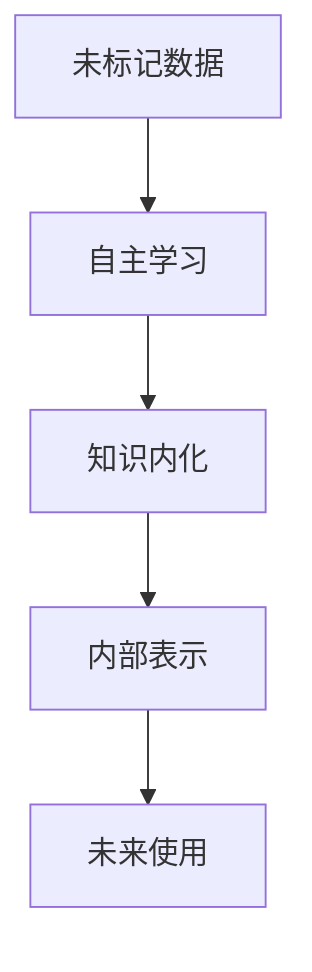

                 

**自主学习、知识内化、无监督学习、半监督学习、强化学习、多模式学习、元学习**

## 1. 背景介绍

人工智能（AI）自诞生以来，就一直在模仿人类的学习和认知能力。在过去的几十年里，监督学习取得了显著的成功，但它依赖大量的标记数据，这在现实世界中很难获得。因此，AI研究进入了一个新的“研究生阶段”，关注自主学习和知识内化，以使AI能够像人类一样学习和理解新的、未知的领域。

## 2. 核心概念与联系

### 2.1 自主学习与知识内化

自主学习是指AI系统在没有外部指导的情况下学习新任务或新领域的能力。知识内化则是指AI系统将学习到的知识存储在内部表示中，以便在未来使用。


**Mermaid 图：自主学习与知识内化**



### 2.2 学习类型

自主学习和知识内化可以通过无监督学习、半监督学习、强化学习和多模式学习等方式实现。

- **无监督学习**：AI系统从未标记数据中学习，没有外部指导。
- **半监督学习**：AI系统使用少量标记数据和大量未标记数据进行学习。
- **强化学习**：AI系统通过与环境的交互学习，以最大化回报为目标。
- **多模式学习**：AI系统从多种数据模式（如文本、图像、音频）中学习。

## 3. 核心算法原理 & 具体操作步骤

### 3.1 算法原理概述

自主学习和知识内化的算法原理包括无监督聚类、自动编码器、生成对抗网络、强化学习算法等。

### 3.2 算法步骤详解

以自动编码器为例，其步骤如下：

1. **编码**：将输入数据映射到低维表示。
2. **重构**：从低维表示重构原始输入数据。
3. **训练**：通过最小化重构误差来学习编码器和解码器。

### 3.3 算法优缺点

自主学习和知识内化的算法优点包括能够学习未标记数据、发现数据结构和模式等。缺点包括可能学习到无意义的模式、需要大量计算资源等。

### 3.4 算法应用领域

自主学习和知识内化的应用领域包括数据挖掘、自然语言处理、计算机视觉、推荐系统等。

## 4. 数学模型和公式 & 详细讲解 & 举例说明

### 4.1 数学模型构建

自动编码器的数学模型可以表示为：

$$z = f(x; \theta) \quad \text{和} \quad x' = g(z; \phi)$$

其中，$x$是输入数据，$z$是低维表示，$x'$是重构的输入数据，$f$和$g$是编码器和解码器，$θ$和$φ$是模型参数。

### 4.2 公式推导过程

自动编码器的目标函数是最小化重构误差：

$$L(\theta, \phi) = \frac{1}{n} \sum_{i=1}^{n} \text{loss}(x_i, x_i')$$

其中，$\text{loss}$是重构误差，如均方误差。

### 4.3 案例分析与讲解

例如，在图像数据集MNIST上训练自动编码器，可以学习到表示数字的低维表示，并重构原始图像。

## 5. 项目实践：代码实例和详细解释说明

### 5.1 开发环境搭建

使用Python和TensorFlow搭建开发环境。

### 5.2 源代码详细实现

```python
import tensorflow as tf
from tensorflow.keras.layers import Input, Dense
from tensorflow.keras.models import Model

# 定义编码器
encoder_input = Input(shape=(784,))
encoder = Dense(64, activation='relu')(encoder_input)
encoder = Dense(32, activation='relu')(encoder)
encoder_output = Dense(16)(encoder)

# 定义解码器
decoder_input = Input(shape=(16,))
decoder = Dense(32, activation='relu')(decoder_input)
decoder = Dense(64, activation='relu')(decoder)
decoder_output = Dense(784, activation='sigmoid')(decoder)

# 定义自动编码器
autoencoder = Model(encoder_input, decoder_output)
autoencoder.compile(optimizer='adam', loss='binary_crossentropy')

# 训练自动编码器
(x_train, _), (x_test, _) = tf.keras.datasets.mnist.load_data()
x_train = x_train.astype('float32') / 255.
x_test = x_test.astype('float32') / 255.
x_train = x_train.reshape((-1, 784))
x_test = x_test.reshape((-1, 784))
autoencoder.fit(x_train, x_train, epochs=10, batch_size=256, validation_data=(x_test, x_test))
```

### 5.3 代码解读与分析

该代码定义了一个自动编码器，使用两个全连接层作为编码器，两个全连接层作为解码器。然后，使用MNIST数据集训练自动编码器。

### 5.4 运行结果展示

训练好的自动编码器可以重构输入图像，并学习到表示数字的低维表示。

## 6. 实际应用场景

自主学习和知识内化的应用场景包括：

- **数据挖掘**：发现未标记数据中的模式和结构。
- **自然语言处理**：学习未标记文本中的语义和语法。
- **计算机视觉**：学习未标记图像中的结构和对象。
- **推荐系统**：学习用户的偏好和兴趣。

### 6.4 未来应用展望

未来，自主学习和知识内化将在更复杂的领域得到应用，如医疗、金融和自动驾驶等。

## 7. 工具和资源推荐

### 7.1 学习资源推荐

- **书籍**："Pattern Recognition and Machine Learning" by Christopher M. Bishop
- **在线课程**："Deep Learning Specialization" by Andrew Ng on Coursera

### 7.2 开发工具推荐

- **Python**：一个强大的编程语言，广泛用于AI开发。
- **TensorFlow**：一个流行的深度学习框架。

### 7.3 相关论文推荐

- "Autoencoders: A Survey" by Vincent C. X. Pan and Simon M. Lucas
- "Generative Adversarial Networks" by Ian J. Goodfellow, Jean Pouget-Abadie, and Yoshua Bengio

## 8. 总结：未来发展趋势与挑战

### 8.1 研究成果总结

自主学习和知识内化取得了显著的进展，但仍有许多挑战需要解决。

### 8.2 未来发展趋势

未来，自主学习和知识内化将朝着更复杂的任务和领域发展，如多模式学习和元学习等。

### 8.3 面临的挑战

挑战包括如何评估自主学习的性能、如何学习有意义的表示等。

### 8.4 研究展望

未来的研究将关注如何使自主学习更加有效、更加通用，并能够学习更复杂的任务。

## 9. 附录：常见问题与解答

**Q：自主学习和监督学习有什么区别？**

**A**：监督学习需要大量的标记数据，而自主学习则可以从未标记数据中学习。

**Q：自主学习的挑战是什么？**

**A**：自主学习的挑战包括如何评估性能、如何学习有意义的表示等。

**作者：禅与计算机程序设计艺术 / Zen and the Art of Computer Programming**

