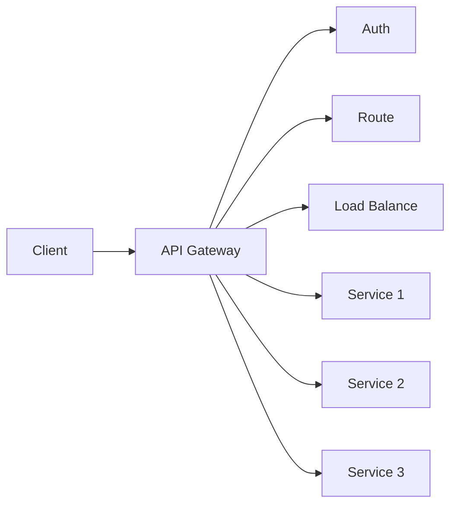

                 

## API 网关的详细功能

> 关键词：API网关，安全，可扩展性，流量管理，微服务

## 1. 背景介绍

随着微服务架构的兴起，单一的应用程序被拆分成多个小服务，每个服务都运行在自己的进程中，并通过网络进行通信。这种架构带来了许多好处，如更好的可扩展性、更快的交付速度和更容易的维护。然而，它也引入了新的挑战，其中之一就是如何管理和控制这些服务之间的通信。API网关就是为了解决这个问题而诞生的。

## 2. 核心概念与联系

API网关是位于客户端和服务端之间的一种中间件，它接收客户端的请求，并将其转发给相应的服务。它提供了统一的入口点，使得客户端可以与后端的多个服务进行交互，而无需直接与每个服务进行通信。API网关的核心功能包括安全、流量管理、负载均衡和路由。

下面是API网关的架构原理的Mermaid流程图：



## 3. 核心算法原理 & 具体操作步骤

### 3.1 算法原理概述

API网关的核心算法原理是基于请求-响应模型的。当客户端发送请求时，API网关接收请求，并根据请求的路径和方法将其转发给相应的服务。在转发请求之前，API网关会执行一些预处理操作，如身份验证、请求验证和流量控制。

### 3.2 算法步骤详解

1. 接收客户端请求
2. 执行身份验证和请求验证
3. 执行流量控制，如速率限制和流量限制
4. 根据请求路径和方法将请求转发给相应的服务
5. 接收服务的响应
6. 执行后处理操作，如响应缓存和响应转换
7. 将响应发送给客户端

### 3.3 算法优缺点

优点：

* 提供了统一的入口点，使得客户端可以与后端的多个服务进行交互
* 提高了系统的安全性，因为所有的请求都需要通过API网关进行身份验证和请求验证
* 提高了系统的可扩展性，因为API网关可以水平扩展以处理更多的请求
* 提高了系统的可靠性，因为API网关可以提供故障转移和容错机制

缺点：

* 增加了系统的复杂性
* 增加了系统的延迟，因为所有的请求都需要通过API网关进行转发

### 3.4 算法应用领域

API网关广泛应用于微服务架构中，它可以帮助管理和控制服务之间的通信。此外，API网关也可以应用于单一应用程序中，用于提供统一的入口点和安全机制。

## 4. 数学模型和公式 & 详细讲解 & 举例说明

### 4.1 数学模型构建

API网关的数学模型可以表示为以下公式：

$$API\_Gateway = \{R, S, F, P, L, A\}$$

其中：

* $R$ 是请求集合，表示客户端发送的请求
* $S$ 是服务集合，表示后端的服务
* $F$ 是转发函数，表示将请求转发给相应服务的函数
* $P$ 是预处理函数集合，表示在转发请求之前执行的操作，如身份验证和请求验证
* $L$ 是流量控制函数集合，表示执行流量控制的操作，如速率限制和流量限制
* $A$ 是后处理函数集合，表示在将响应发送给客户端之前执行的操作，如响应缓存和响应转换

### 4.2 公式推导过程

API网关的数学模型可以通过以下步骤推导出来：

1. 定义请求集合$R$和服务集合$S$
2. 定义转发函数$F$，它接受请求$r \in R$和服务$s \in S$作为输入，并输出服务$s$的响应
3. 定义预处理函数集合$P$，它接受请求$r$作为输入，并输出预处理后的请求$r'$
4. 定义流量控制函数集合$L$，它接受预处理后的请求$r'$作为输入，并输出是否允许请求$r'$通过的布尔值
5. 定义后处理函数集合$A$，它接受服务$s$的响应作为输入，并输出处理后的响应$r''$
6. 将上述函数集合组合成API网关的数学模型

### 4.3 案例分析与讲解

例如，假设我们有一个包含三个服务的微服务架构，每个服务提供了不同的功能。我们想要构建一个API网关来管理和控制这些服务之间的通信。我们可以定义以下函数集合：

* $R = \{r\_1, r\_2, r\_3\}$, 表示客户端发送的三个请求
* $S = \{s\_1, s\_2, s\_3\}$, 表示后端的三个服务
* $F = \{f\_1, f\_2, f\_3\}$, 表示将请求转发给相应服务的三个函数
* $P = \{p\_1, p\_2, p\_3\}$, 表示在转发请求之前执行的三个预处理操作，如身份验证和请求验证
* $L = \{l\_1, l\_2, l\_3\}$, 表示执行流量控制的三个操作，如速率限制和流量限制
* $A = \{a\_1, a\_2, a\_3\}$, 表示在将响应发送给客户端之前执行的三个后处理操作，如响应缓存和响应转换

通过组合这些函数集合，我们可以构建出API网关的数学模型，并使用它来管理和控制服务之间的通信。

## 5. 项目实践：代码实例和详细解释说明

### 5.1 开发环境搭建

要构建API网关，我们需要以下开发环境：

* Java开发环境（JDK 1.8或更高版本）
* Maven构建工具
* Spring Boot框架
* Spring Cloud Gateway插件

### 5.2 源代码详细实现

以下是API网关的源代码实现：

```java
import org.springframework.cloud.gateway.route.RouteLocator;
import org.springframework.cloud.gateway.route.builder.RouteLocatorBuilder;
import org.springframework.context.annotation.Bean;
import org.springframework.context.annotation.Configuration;

@Configuration
public class ApiGatewayConfig {

    @Bean
    public RouteLocator customRouteLocator(RouteLocatorBuilder builder) {
        return builder.routes()
               .route("service1_route", r -> r.path("/service1/**")
                       .uri("http://localhost:8081"))
               .route("service2_route", r -> r.path("/service2/**")
                       .uri("http://localhost:8082"))
               .route("service3_route", r -> r.path("/service3/**")
                       .uri("http://localhost:8083"))
               .build();
    }
}
```

### 5.3 代码解读与分析

在上述代码中，我们定义了一个`RouteLocator` bean，它用于配置API网关的路由规则。我们使用`RouteLocatorBuilder`来定义三条路由规则，每条规则都对应一个后端服务。当客户端发送请求时，API网关会根据请求路径将其转发给相应的服务。

### 5.4 运行结果展示

当我们运行API网关应用程序时，它会监听指定的端口（默认为8080），并等待客户端请求。当客户端发送请求时，API网关会根据请求路径将其转发给相应的服务。例如，如果客户端发送了一个请求`http://localhost:8080/service1/data`，API网关会将其转发给`http://localhost:8081/service1/data`。

## 6. 实际应用场景

API网关可以应用于各种场景，以下是一些实际应用场景：

### 6.1 微服务架构

在微服务架构中，API网关可以帮助管理和控制服务之间的通信。它提供了统一的入口点，使得客户端可以与后端的多个服务进行交互，而无需直接与每个服务进行通信。此外，API网关还可以提供安全机制，如身份验证和请求验证，以保护后端服务。

### 6.2 单一应用程序

在单一应用程序中，API网关也可以应用于提供统一的入口点和安全机制。例如，一个电子商务应用程序可能会使用API网关来提供统一的入口点，并对客户端请求进行身份验证和请求验证。

### 6.3 B2B集成

在B2B集成场景中，API网关可以帮助管理和控制来自不同合作伙伴的请求。它可以提供统一的入口点，并对请求进行身份验证和请求验证。此外，API网关还可以提供流量控制机制，如速率限制和流量限制，以防止滥用。

### 6.4 未来应用展望

随着微服务架构的兴起，API网关的应用将会越来越广泛。未来，API网关可能会集成更多的功能，如服务发现、服务注册和服务配置。此外，API网关还可能会与其他中间件集成，如消息队列和数据库，以提供更全面的解决方案。

## 7. 工具和资源推荐

### 7.1 学习资源推荐

以下是一些学习API网关的推荐资源：

* Spring Cloud Gateway官方文档：<https://spring.io/projects/spring-cloud-gateway>
* API网关设计模式：<https://microservices.io/patterns/api-gateway.html>
* API网关最佳实践：<https://blog.pragmaticengineer.com/api-gateway-best-practices/>

### 7.2 开发工具推荐

以下是一些开发API网关的推荐工具：

* Spring Boot：<https://spring.io/projects/spring-boot>
* Spring Cloud Gateway：<https://spring.io/projects/spring-cloud-gateway>
* Postman：<https://www.postman.com/>
* Swagger：<https://swagger.io/>

### 7.3 相关论文推荐

以下是一些相关论文推荐：

* "Designing a Cloud-Native API Gateway"：<https://www.infoq.com/articles/designing-cloud-native-api-gateway/>
* "API Gateway Patterns"：<https://microservices.io/patterns/api-gateway.html>
* "API Gateway Best Practices"：<https://blog.pragmaticengineer.com/api-gateway-best-practices/>

## 8. 总结：未来发展趋势与挑战

### 8.1 研究成果总结

在本文中，我们介绍了API网关的详细功能，包括其核心概念、算法原理、数学模型和实际应用场景。我们还提供了一个项目实践的代码实例，并推荐了一些学习资源、开发工具和相关论文。

### 8.2 未来发展趋势

随着微服务架构的兴起，API网关的应用将会越来越广泛。未来，API网关可能会集成更多的功能，如服务发现、服务注册和服务配置。此外，API网关还可能会与其他中间件集成，如消息队列和数据库，以提供更全面的解决方案。

### 8.3 面临的挑战

虽然API网关带来了许多好处，但它也面临着一些挑战。例如，API网关可能会增加系统的复杂性，并增加系统的延迟。此外，API网关还需要与后端服务进行通信，这可能会导致性能问题。因此，设计和实现API网关需要考虑这些挑战，并采取相应的措施来解决它们。

### 8.4 研究展望

未来，API网关的研究将会集中在以下几个方向：

* API网关的安全性：如何提高API网关的安全性，防止滥用和攻击。
* API网关的可扩展性：如何提高API网关的可扩展性，以处理更多的请求和流量。
* API网关的智能化：如何将人工智能技术应用于API网关，以提供更智能的服务和更好的用户体验。
* API网关的标准化：如何制定API网关的标准，以便于开发和部署。

## 9. 附录：常见问题与解答

### 9.1 API网关和反向代理有什么区别？

API网关和反向代理都是中间件，用于管理和控制客户端和服务端之间的通信。然而，API网关提供了更多的功能，如身份验证、请求验证和流量控制。此外，API网关还可以提供统一的入口点，使得客户端可以与后端的多个服务进行交互，而无需直接与每个服务进行通信。

### 9.2 API网关如何处理服务故障？

当后端服务故障时，API网关可以提供故障转移和容错机制。例如，API网关可以将请求转发给备用服务，或者返回一个错误响应给客户端。此外，API网关还可以提供监控和日志记录功能，以帮助定位和解决故障。

### 9.3 API网关如何处理请求速率限制？

API网关可以提供请求速率限制功能，以防止滥用和攻击。例如，API网关可以限制客户端在一定时间内发送的请求数，或者限制客户端在一定时间内发送的流量。当客户端超过速率限制时，API网关可以返回一个错误响应给客户端，或者将请求放入等待队列中。

### 9.4 API网关如何处理请求缓存？

API网关可以提供请求缓存功能，以提高系统的性能和可靠性。例如，API网关可以缓存后端服务的响应，并将其返回给客户端。当后端服务发生变化时，API网关可以清除缓存，并重新缓存新的响应。此外，API网关还可以提供缓存控制机制，如缓存过期时间和缓存无效化。

## 作者：禅与计算机程序设计艺术 / Zen and the Art of Computer Programming

