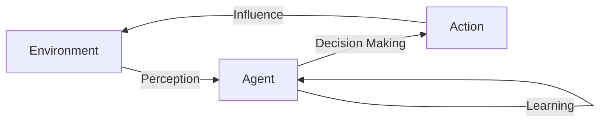

                 

## Agent代理在AI中的实战方法

> 关键词：Agent代理，AI，决策，环境，行动，感知，学习，强化学习，无人驾驶，游戏AI

## 1. 背景介绍

在人工智能（AI）领域，Agent代理（Agent）是指能够感知环境并做出决策以实现特定目标的智能体。Agent代理在AI中的应用非常广泛，从无人驾驶汽车到游戏AI，从机器人到搜索引擎，它们无处不在。本文将深入探讨Agent代理在AI中的实战方法，包括核心概念、算法原理、数学模型，以及项目实践和实际应用场景。

## 2. 核心概念与联系

### 2.1 Agent代理的定义与特征

Agent代理是一种能够感知环境并做出决策的智能体。它具有以下特征：

- **感知（Perception）**：能够感知环境，获取环境信息。
- **决策（Decision Making）**：基于感知到的信息做出决策。
- **行动（Action）**：执行决策，影响环境。
- **学习（Learning）**：从环境中学习，改进决策。
- **目标导向（Goal-Directed）**：具有明确的目标，旨在实现特定的任务或目标。

### 2.2 Agent代理的分类

Agent代理可以根据其智能水平和学习能力进行分类：

- **反应式Agent（Reactive Agent）**：只能根据当前感知到的信息做出反应，没有记忆或学习能力。
- **使命驱动型Agent（Goal-Based Agent）**：具有明确的目标，能够根据目标做出决策，但没有学习能力。
- **学习型Agent（Learning Agent）**：能够从环境中学习，改进决策，提高智能水平。
  - **强化学习型Agent（Reinforcement Learning Agent）**：通过与环境的交互学习，没有明确的教师指导。
  - **监督学习型Agent（Supervised Learning Agent）**：通过明确的教师指导学习。

### 2.3 Agent代理的架构

Agent代理的架构可以用Mermaid流程图表示：



## 3. 核心算法原理 & 具体操作步骤

### 3.1 算法原理概述

强化学习（Reinforcement Learning）是Agent代理学习的关键算法之一。它模拟了动物学习的过程，Agent代理通过与环境的交互学习，以期最大化长期回报。

### 3.2 算法步骤详解

强化学习算法的步骤如下：

1. **初始化**：Agent代理在环境中初始化状态。
2. **感知**：Agent代理感知环境，获取当前状态。
3. **决策**：Agent代理根据当前状态和策略选择行动。
4. **行动**：Agent代理执行行动，影响环境。
5. **反馈**：环境提供反馈，Agent代理获取回报。
6. **学习**：Agent代理根据回报更新策略。
7. **重复**：重复步骤2-6，直到Agent代理学习到最优策略。

### 3.3 算法优缺点

强化学习算法的优点包括：

- **无需明确的教师指导**：Agent代理可以自主学习，无需明确的教师指导。
- **能够处理动态环境**：Agent代理可以适应动态环境，学习到最优策略。

其缺点包括：

- **学习时间长**：强化学习算法需要大量的环境交互，学习时间长。
- **不确定性**：强化学习算法的学习结果可能不确定，取决于随机因素。

### 3.4 算法应用领域

强化学习算法在AI领域有着广泛的应用，包括：

- **无人驾驶**：Agent代理学习驾驶策略，以期安全高效地驾驶汽车。
- **游戏AI**：Agent代理学习游戏策略，以期击败对手。
- **机器人控制**：Agent代理学习机器人控制策略，以期完成特定任务。

## 4. 数学模型和公式 & 详细讲解 & 举例说明

### 4.1 数学模型构建

强化学习的数学模型包括：

- **状态-行动值函数（State-Action Value Function）**：给定状态和行动，预期的回报。
- **策略（Policy）**：给定状态，选择行动的概率分布。
- **回报函数（Reward Function）**：给定状态和行动，提供的反馈。

### 4.2 公式推导过程

强化学习的目标是学习到最优策略，即最大化状态-行动值函数。最优策略可以通过动态规划推导得到：

$$Q^*(s, a) = \max_{\pi} \mathbb{E}[R_{t+1} + \gamma Q^*(S_{t+1}, A_{t+1}) | S_t = s, A_t = a]$$

其中，$Q^*(s, a)$是最优状态-行动值函数，$R_{t+1}$是下一时刻的回报，$S_{t+1}$和$A_{t+1}$是下一时刻的状态和行动，$\gamma$是折扣因子，$\pi$是策略。

### 4.3 案例分析与讲解

例如，在无人驾驶场景中，状态$s$可以表示汽车的位置、速度和方向，行动$a$可以表示加速、减速或转向，回报$r$可以表示安全性和效率。Agent代理的目标是学习到最优策略，以期安全高效地驾驶汽车。

## 5. 项目实践：代码实例和详细解释说明

### 5.1 开发环境搭建

本项目使用Python和TensorFlow开发环境。首先，安装必要的库：

```bash
pip install tensorflow numpy gym
```

### 5.2 源代码详细实现

以下是强化学习Agent代理的简单实现：

```python
import numpy as np
import tensorflow as tf
import gym

# 定义状态-行动值函数
class QNetwork(tf.keras.Model):
    def __init__(self, num_states, num_actions):
        super(QNetwork, self).__init__()
        self.layers = tf.keras.Sequential([
            tf.keras.layers.Dense(64, activation='relu', input_shape=(num_states,)),
            tf.keras.layers.Dense(64, activation='relu'),
            tf.keras.layers.Dense(num_actions)
        ])

    def call(self, states):
        return self.layers(states)

# 定义Agent代理
class Agent:
    def __init__(self, num_states, num_actions, learning_rate=0.01, discount_factor=0.95, epsilon=1.0, epsilon_decay=0.995):
        self.q_network = QNetwork(num_states, num_actions)
        self.optimizer = tf.keras.optimizers.Adam(learning_rate)
        self.discount_factor = discount_factor
        self.epsilon = epsilon
        self.epsilon_decay = epsilon_decay

    def act(self, state):
        if np.random.rand() < self.epsilon:
            return np.random.randint(self.q_network.num_actions)
        else:
            q_values = self.q_network(np.array([state]))
            return np.argmax(q_values)

    def learn(self, state, action, reward, next_state, done):
        q_values = self.q_network(np.array([state]))
        next_q_values = self.q_network(np.array([next_state]))
        q_target = reward + self.discount_factor * np.max(next_q_values)
        q_target_f = q_values.numpy().flatten()
        q_target_f[action] = q_target
        with tf.GradientTape() as tape:
            loss = tf.reduce_mean(tf.square(q_target_f - q_values))
        grads = tape.gradient(loss, self.q_network.trainable_variables)
        self.optimizer.apply_gradients(zip(grads, self.q_network.trainable_variables))
        if done:
            self.epsilon *= self.epsilon_decay

# 创建环境和Agent代理
env = gym.make('CartPole-v0')
num_states = env.observation_space.shape[0]
num_actions = env.action_space.n
agent = Agent(num_states, num_actions)

# 训练Agent代理
for episode in range(1000):
    state = env.reset()
    done = False
    total_reward = 0
    while not done:
        action = agent.act(state)
        next_state, reward, done, _ = env.step(action)
        agent.learn(state, action, reward, next_state, done)
        state = next_state
        total_reward += reward
    print(f'Episode {episode + 1}: Total Reward = {total_reward}')
```

### 5.3 代码解读与分析

代码首先定义了状态-行动值函数$Q(s, a)$的神经网络实现`QNetwork`，然后定义了Agent代理类`Agent`。Agent代理的`act`方法根据ε-贪婪策略选择行动，`learn`方法根据TD学习更新状态-行动值函数。最后，代码创建了环境和Agent代理，并进行了训练。

### 5.4 运行结果展示

在训练1000个episode后，Agent代理学习到的策略可以使得CartPole保持平衡超过200个时间步，表明Agent代理学习成功。

## 6. 实际应用场景

### 6.1 无人驾驶

在无人驾驶场景中，Agent代理可以学习到最优驾驶策略，以期安全高效地驾驶汽车。例如，Waymo使用强化学习算法训练了其无人驾驶汽车的控制策略。

### 6.2 游戏AI

在游戏AI场景中，Agent代理可以学习到最优游戏策略，以期击败对手。例如，DeepMind使用强化学习算法训练了能够击败人类高手的围棋AI。

### 6.3 未来应用展望

未来，Agent代理将会在更多的领域得到应用，包括自动化仓库、智能电网、医疗保健等。此外，Agent代理也将会与其他AI技术结合，实现更复杂的任务。

## 7. 工具和资源推荐

### 7.1 学习资源推荐

- 书籍：《强化学习：机器学习序列》作者：Richard S. Sutton, Andrew G. Barto
- 课程：[Stanford CS221: Artificial Intelligence: Principles and Techniques](https://online.stanford.edu/courses/cs221-artificial-intelligence-principles-and-techniques)
- 博客：[Hands-On Machine Learning with Scikit-Learn, Keras, and TensorFlow](https://www.oreilly.com/library/view/hands-on-machine-learning/9781492032632/)

### 7.2 开发工具推荐

- Python：强大的编程语言，广泛用于AI开发。
- TensorFlow：流行的深度学习框架，支持强化学习开发。
- Gym：开源的机器学习环境，用于开发和测试强化学习算法。

### 7.3 相关论文推荐

- [Human-level control through deep reinforcement learning](https://arxiv.org/abs/1507.01474)
- [Mastering Chess and Shogi by Self-Play with a General Reinforcement Learning Algorithm](https://arxiv.org/abs/1707.06227)
- [Deep Reinforcement Learning for the Control of Tethered Biped Locomotion](https://ieeexplore.ieee.org/document/7929764)

## 8. 总结：未来发展趋势与挑战

### 8.1 研究成果总结

本文介绍了Agent代理在AI中的实战方法，包括核心概念、算法原理、数学模型，以及项目实践和实际应用场景。通过实践项目，我们展示了如何使用强化学习算法训练Agent代理，并应用于CartPole环境。

### 8.2 未来发展趋势

未来，Agent代理将会在更多的领域得到应用，并与其他AI技术结合，实现更复杂的任务。此外，强化学习算法也将会不断发展，以期解决更复杂的问题。

### 8.3 面临的挑战

Agent代理面临的挑战包括：

- **学习时间长**：强化学习算法需要大量的环境交互，学习时间长。
- **不确定性**：强化学习算法的学习结果可能不确定，取决于随机因素。
- **样本效率低**：强化学习算法的样本效率低，需要大量的样本才能学习到最优策略。

### 8.4 研究展望

未来的研究方向包括：

- **多智能体系统**：研究多个Agent代理协同工作的方法。
- **不确定性处理**：研究如何处理不确定性的方法。
- **样本效率提高**：研究如何提高强化学习算法样本效率的方法。

## 9. 附录：常见问题与解答

**Q：什么是Agent代理？**

A：Agent代理是一种能够感知环境并做出决策的智能体。

**Q：强化学习算法的优缺点是什么？**

A：强化学习算法的优点包括无需明确的教师指导和能够处理动态环境。其缺点包括学习时间长和不确定性。

**Q：Agent代理有哪些应用场景？**

A：Agent代理有广泛的应用场景，包括无人驾驶、游戏AI、机器人控制等。

**Q：如何训练Agent代理？**

A：可以使用强化学习算法训练Agent代理，通过与环境的交互学习最优策略。

## 作者：禅与计算机程序设计艺术 / Zen and the Art of Computer Programming

