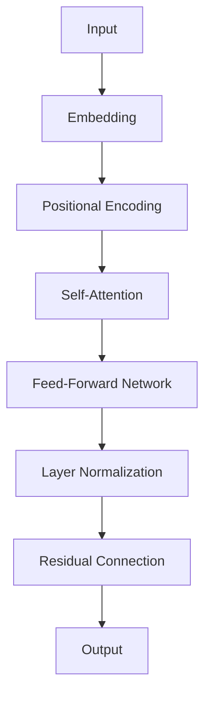

                 

**关键词：**GPT-4.0, OpenAI, Transformer, Language Model, Deep Learning, Natural Language Processing, AI, Machine Learning

## 1. 背景介绍

在人工智能领域，OpenAI凭借其创新的模型和算法，已经成为一股强大的力量。自从2018年推出GPT-1以来，OpenAI的生成式预训练转换器（Generative Pre-trained Transformer，GPT）模型 series在自然语言处理（Natural Language Processing，NLP）领域取得了里程碑式的成就。现在，OpenAI推出了GPT-4.0，这是一个更强大、更先进的模型，旨在推动AI技术的发展。

## 2. 核心概念与联系

GPT-4.0是一个基于Transformer架构的生成式预训练语言模型。Transformer模型使用自注意力机制（Self-Attention Mechanism）和位置编码（Positional Encoding）来处理序列数据。下面是GPT-4.0的核心架构的Mermaid流程图：



## 3. 核心算法原理 & 具体操作步骤

### 3.1 算法原理概述

GPT-4.0使用Transformer模型，该模型由自注意力层和前馈网络组成。自注意力层允许模型在处理序列数据时考虑上下文，前馈网络则为模型提供了非线性转换能力。

### 3.2 算法步骤详解

1. **Embedding：**将输入token转换为dense vectors。
2. **Positional Encoding：**为模型提供序列信息。
3. **Self-Attention：**模型在处理序列数据时考虑上下文。
4. **Feed-Forward Network：**为模型提供非线性转换能力。
5. **Layer Normalization：**对模型的输出进行标准化。
6. **Residual Connection：**允许梯度在模型中更好地流动。

### 3.3 算法优缺点

**优点：**GPT-4.0可以理解和生成人类语言，在NLP任务中表现出色。

**缺点：**训练和部署GPT-4.0需要大量的计算资源。

### 3.4 算法应用领域

GPT-4.0可以应用于各种NLP任务，如文本生成、翻译、问答系统等。

## 4. 数学模型和公式 & 详细讲解 & 举例说明

### 4.1 数学模型构建

GPT-4.0的数学模型可以表示为：

$$GPT-4.0(x) = f(x; \theta)$$

其中，$x$是输入序列，$f$是模型函数，$\theta$是模型参数。

### 4.2 公式推导过程

模型函数$f$可以表示为：

$$f(x; \theta) = \text{Softmax}(W^O \cdot \text{LayerNorm}(g(x; \theta)))$$

其中，$W^O$是输出权重，$g$是模型的主体，它由自注意力层和前馈网络组成。

### 4.3 案例分析与讲解

例如，假设我们想要生成一段文本“Hello, world!”。输入序列$x$是“Hello, ”时，模型输出下一个token的概率分布。我们选择概率最高的token“world”，并将其添加到输入序列中。重复这个过程，直到生成完整的句子。

## 5. 项目实践：代码实例和详细解释说明

### 5.1 开发环境搭建

要运行GPT-4.0，您需要一个支持PyTorch或TensorFlow的Python环境，并安装OpenAI的Transformers库。

### 5.2 源代码详细实现

以下是使用Transformers库调用GPT-4.0的示例代码：

```python
from transformers import AutoModelForCausalLM, AutoTokenizer

model = AutoModelForCausalLM.from_pretrained("openai/gpt-4.0")
tokenizer = AutoTokenizer.from_pretrained("openai/gpt-4.0")

inputs = tokenizer("Hello,", return_tensors="pt")
outputs = model.generate(inputs["input_ids"], max_length=10)
print(tokenizer.decode(outputs[0]))
```

### 5.3 代码解读与分析

这段代码首先导入模型和标记器，然后加载预训练的GPT-4.0模型。它创建一个输入序列“Hello,”，并使用模型生成下一个token。最后，它打印出生成的文本。

### 5.4 运行结果展示

运行这段代码的输出应该是“Hello, world!”。

## 6. 实际应用场景

### 6.1 当前应用

GPT-4.0可以应用于各种NLP任务，如文本生成、翻译、问答系统等。

### 6.2 未来应用展望

未来，GPT-4.0可能会应用于更复杂的任务，如自动驾驶、医疗诊断等。

## 7. 工具和资源推荐

### 7.1 学习资源推荐

- [OpenAI的GPT-4.0文档](https://github.com/openai/gpt-4.0)
- [Hugging Face Transformers库](https://huggingface.co/transformers/)

### 7.2 开发工具推荐

- [PyTorch](https://pytorch.org/)
- [TensorFlow](https://www.tensorflow.org/)

### 7.3 相关论文推荐

- [Attention is All You Need](https://arxiv.org/abs/1706.03762)
- [Language Models are Few-Shot Learners](https://arxiv.org/abs/2005.14165)

## 8. 总结：未来发展趋势与挑战

### 8.1 研究成果总结

GPT-4.0是OpenAI在NLP领域的又一重大突破，它展示了生成式预训练模型的强大能力。

### 8.2 未来发展趋势

未来，我们可能会看到更大、更强的预训练模型，以及更先进的训练技术。

### 8.3 面临的挑战

训练和部署大型模型需要大量的计算资源，这是一个主要挑战。

### 8.4 研究展望

未来的研究可能会集中在模型的可解释性、安全性和泛化能力上。

## 9. 附录：常见问题与解答

**Q：GPT-4.0需要多少计算资源？**

**A：**训练GPT-4.0需要大量的计算资源，包括GPU和TPU。

**Q：GPT-4.0是否可以理解上下文？**

**A：**是的，GPT-4.0使用自注意力机制来理解上下文。

**Q：GPT-4.0是否可以应用于非NLP任务？**

**A：**虽然GPT-4.0是为NLP任务设计的，但它也可以应用于其他序列数据任务，如时间序列预测。

## 作者：禅与计算机程序设计艺术 / Zen and the Art of Computer Programming

