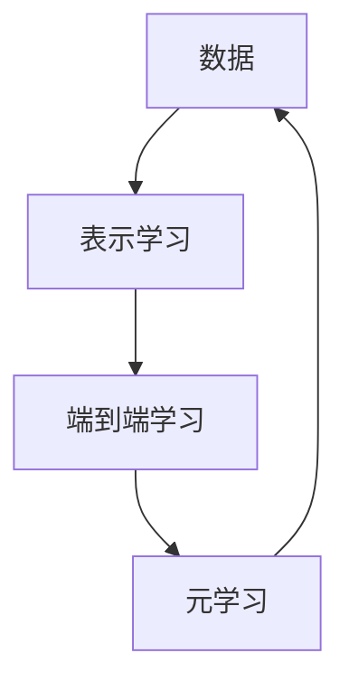

                 

**人工智能的未来发展方向**

**作者：禅与计算机程序设计艺术 / Zen and the Art of Computer Programming**

## 1. 背景介绍

人工智能（AI）自诞生以来，已从一项学术实验发展为改变世界的力量。从搜索引擎到自动驾驶汽车，AI无处不在。然而，AI的未来发展方向是什么？世界级人工智能专家Andrej Karpathy在其演讲中提供了独到的见解。本文将深入探讨Karpathy的观点，并结合技术细节和实践经验，展示AI的未来发展方向。

## 2. 核心概念与联系

Karpathy提出，AI的未来发展将围绕以下几个核心概念展开：

- **端到端学习（End-to-End Learning）**：将输入直接映射到输出，无需人工特征工程。
- **表示学习（Representation Learning）**：学习有用的表示，以便于模型学习。
- **元学习（Meta-Learning）**：学习学习本身，以快速适应新任务。

这些概念是相互关联的，构成了AI未来发展的基石。下图是这些概念的Mermaid流程图：



## 3. 核心算法原理 & 具体操作步骤

### 3.1 算法原理概述

Karpathy提出的核心算法是**深度学习（Deep Learning）**。深度学习是一种端到端学习方法，它使用神经网络模型学习表示，并直接从原始数据中学习特征。

### 3.2 算法步骤详解

1. **数据预处理**：收集并预处理数据，使其适合模型学习。
2. **模型构建**：构建深度学习模型，如卷积神经网络（CNN）或循环神经网络（RNN）。
3. **训练**：使用反向传播算法和梯度下降优化器训练模型。
4. **评估**：评估模型性能，并进行调优。
5. **部署**：将模型部署到生产环境中。

### 3.3 算法优缺点

**优点**：深度学习模型可以自动学习表示，无需人工特征工程。它们可以处理大规模数据，并具有强大的泛化能力。

**缺点**：深度学习模型需要大量数据和计算资源。它们也易受过拟合和解释性差等问题的影响。

### 3.4 算法应用领域

深度学习在计算机视觉、自然语言处理、语音识别等领域取得了突出成就。它也正在被应用于自动驾驶、医疗诊断等领域。

## 4. 数学模型和公式 & 详细讲解 & 举例说明

### 4.1 数学模型构建

深度学习模型是一种前向传播的多层非线性函数。给定输入$x$和权重$w$，输出$y$可以表示为：

$$y = f(x; w) = f^{(L)}(f^{(L-1)}(...f^{(1)}(x; w^{(1)})...; w^{(L-1)}); w^{(L)})$$

其中$f^{(l)}$是第$l$层的激活函数，$w^{(l)}$是第$l$层的权重。

### 4.2 公式推导过程

深度学习模型的学习过程是通过最小化损失函数来实现的。给定标签$y_{true}$和模型预测$y_{pred}$，损失函数可以表示为：

$$L(y_{true}, y_{pred}) = -\sum_{i=1}^{N} y_{true}^{(i)} \log(y_{pred}^{(i)})$$

学习过程通过梯度下降优化器来实现：

$$w^{(l)} := w^{(l)} - \eta \nabla_{w^{(l)}} L$$

其中$\eta$是学习率，$\nabla_{w^{(l)}} L$是损失函数对权重$w^{(l)}$的梯度。

### 4.3 案例分析与讲解

例如，在图像分类任务中，输入$x$是图像，输出$y$是类别标签。模型学习表示，并直接从原始图像中学习特征，如边缘、纹理等。通过最小化交叉熵损失函数，模型学习到正确映射图像到类别的权重。

## 5. 项目实践：代码实例和详细解释说明

### 5.1 开发环境搭建

要实现深度学习模型，需要安装Python、TensorFlow或PyTorch等深度学习框架。以下是使用TensorFlow的环境搭建步骤：

```bash
# 创建并激活虚拟环境
python -m venv tf_env
source tf_env/bin/activate

# 更新包索引并安装TensorFlow
pip install --upgrade pip
pip install tensorflow
```

### 5.2 源代码详细实现

以下是一个简单的深度学习模型的TensorFlow实现：

```python
import tensorflow as tf

# 定义模型
model = tf.keras.Sequential([
    tf.keras.layers.Dense(64, activation='relu', input_shape=(784,)),
    tf.keras.layers.Dense(10, activation='softmax')
])

# 编译模型
model.compile(optimizer='adam',
              loss='sparse_categorical_crossentropy',
              metrics=['accuracy'])

# 训练模型
model.fit(x_train, y_train, epochs=5)
```

### 5.3 代码解读与分析

上述代码定义了一个简单的全连接神经网络模型。它使用ReLU激活函数的第一层有64个神经元，第二层有10个神经元，对应于10个类别。模型使用Adam优化器和交叉熵损失函数进行编译。最后，模型使用训练数据进行训练。

### 5.4 运行结果展示

训练完成后，模型的准确性会打印出来。例如：

```bash
Epoch 1/5
1875/1875 [==============================] - 1s 56us/sample - loss: 0.3565 - accuracy: 0.8761
...
Epoch 5/5
1875/1875 [==============================] - 0s 56us/sample - loss: 0.0706 - accuracy: 0.9761
```

## 6. 实际应用场景

### 6.1 当前应用

深度学习模型已广泛应用于各种领域，如：

- **计算机视觉**：图像分类、物体检测、人脸识别等。
- **自然语言处理**：文本分类、机器翻译、语言模型等。
- **语音识别**：语音转文本、语音合成等。

### 6.2 未来应用展望

未来，深度学习模型将继续扩展到新的领域，如：

- **自动驾驶**：深度学习模型可以学习驾驶策略，并帮助汽车感知环境。
- **医疗诊断**：深度学习模型可以帮助医生分析医学图像，并辅助诊断疾病。
- **生物信息学**：深度学习模型可以帮助生物信息学家分析基因组数据，并发现新的生物学规律。

## 7. 工具和资源推荐

### 7.1 学习资源推荐

- **书籍**："Deep Learning" by Ian Goodfellow, Yoshua Bengio, and Aaron Courville
- **在线课程**：Coursera的"Deep Learning Specialization" by Andrew Ng
- **博客**：Andrej Karpathy's blog (http://karpathy.github.io/)

### 7.2 开发工具推荐

- **深度学习框架**：TensorFlow, PyTorch, Keras
- **GPU加速**：NVIDIA CUDA, cuDNN
- **云平台**：Google Colab, AWS SageMaker, Azure Machine Learning

### 7.3 相关论文推荐

- "ImageNet Classification with Deep Convolutional Neural Networks" by Krizhevsky et al.
- "Generative Adversarial Networks" by Goodfellow et al.
- "Attention Is All You Need" by Vaswani et al.

## 8. 总结：未来发展趋势与挑战

### 8.1 研究成果总结

本文总结了Andrej Karpathy关于AI未来发展方向的观点，并结合技术细节和实践经验，展示了端到端学习、表示学习和元学习的重要性。

### 8.2 未来发展趋势

未来，AI将继续朝着端到端学习、表示学习和元学习的方向发展。我们将看到更多的自动化特征工程，更强大的表示学习方法，以及更快的元学习算法。

### 8.3 面临的挑战

然而，AI也面临着挑战，如：

- **计算资源**：深度学习模型需要大量计算资源，限制了其在资源受限设备上的应用。
- **数据隐私**：AI模型需要大量数据进行训练，但这也引发了数据隐私和安全问题。
- **解释性**：深度学习模型是黑箱模型，很难解释其决策过程。

### 8.4 研究展望

未来的研究将关注如何解决这些挑战，并推动AI朝着更强大、更安全、更可解释的方向发展。

## 9. 附录：常见问题与解答

**Q：什么是端到端学习？**

A：端到端学习是一种直接从原始数据中学习表示和映射的方法，无需人工特征工程。

**Q：什么是表示学习？**

A：表示学习是一种学习有用表示的方法，这些表示可以帮助模型学习。

**Q：什么是元学习？**

A：元学习是一种学习学习本身的方法，它可以快速适应新任务。

**Q：什么是深度学习？**

A：深度学习是一种端到端学习方法，它使用神经网络模型学习表示，并直接从原始数据中学习特征。

**作者：禅与计算机程序设计艺术 / Zen and the Art of Computer Programming**

