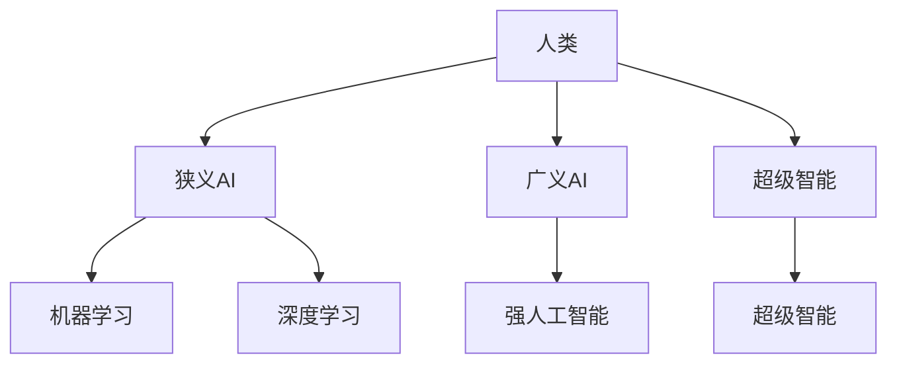

                 

**人工智能的未来发展规划**

**作者：禅与计算机程序设计艺术 / Zen and the Art of Computer Programming**

## 1. 背景介绍

人工智能（AI）自诞生以来，已从一项学术实验发展为商业和技术的关键驱动因素。然而，随着AI的不断发展，我们面临着一系列挑战，从算法的可解释性到计算资源的限制。本文将探讨AI的当前状态，并展望未来的发展方向。

## 2. 核心概念与联系

### 2.1 AI的分类

AI可以分为三个主要类别：狭义AI（ANI）、广义AI（AGI）和超级智能（ASI）。其中，ANI指的是能够执行单一任务的AI，AGI指的是能够理解、学习和应用知识的AI，而ASI则指的是超越人类智能的AI。



### 2.2 AI的发展阶段

AI的发展可以分为四个阶段：符号处理阶段、连接主义阶段、机器学习阶段和深度学习阶段。当前，我们正处于深度学习阶段，但未来的发展方向可能会回归到更多的符号处理和解释性AI。

## 3. 核心算法原理 & 具体操作步骤

### 3.1 算法原理概述

当前，深度学习是AI领域的主导算法。它基于神经网络，模仿人类大脑的结构和功能。

### 3.2 算法步骤详解

深度学习算法的步骤包括数据预处理、模型构建、训练和评估。在训练过程中，模型通过反向传播算法调整其权重，以最小化预测误差。

### 3.3 算法优缺点

深度学习的优点包括高精确度和对复杂数据的处理能力。然而，它也存在缺点，如计算资源需求高、可解释性差和易受攻击。

### 3.4 算法应用领域

深度学习在图像和语音识别、自然语言处理和自动驾驶等领域有着广泛的应用。

## 4. 数学模型和公式 & 详细讲解 & 举例说明

### 4.1 数学模型构建

深度学习模型通常使用反向传播算法训练。该算法基于链式法则，用于计算模型的梯度。

### 4.2 公式推导过程

给定一个神经网络模型 $f(x; \theta)$，其中 $x$ 是输入， $\theta$ 是模型的参数，则模型的梯度可以表示为：

$$
\nabla_\theta L = \frac{\partial L}{\partial \theta} = \frac{\partial L}{\partial f} \frac{\partial f}{\partial \theta}
$$

其中，$L$ 是损失函数，$f$ 是模型的输出。

### 4.3 案例分析与讲解

例如，在单层神经网络中，给定输入 $x$, 输出 $y = \sigma(w^T x + b)$，其中 $\sigma$ 是激活函数，$w$ 和 $b$ 是模型的参数，则模型的梯度可以表示为：

$$
\nabla_w L = \frac{\partial L}{\partial w} = \frac{\partial L}{\partial y} \frac{\partial y}{\partial w} = \frac{\partial L}{\partial y} \sigma'(w^T x) x
$$

## 5. 项目实践：代码实例和详细解释说明

### 5.1 开发环境搭建

要实现深度学习模型，需要安装Python、TensorFlow或PyTorch等深度学习框架。

### 5.2 源代码详细实现

以下是一个简单的单层神经网络的实现示例：

```python
import numpy as np
import tensorflow as tf

# 定义输入数据和标签
X = np.array([[0, 0], [0, 1], [1, 0], [1, 1]])
y = np.array([[0], [1], [1], [0]])

# 定义模型参数
w = tf.Variable(tf.random.normal([2, 1]))
b = tf.Variable(tf.zeros([1]))

# 定义模型
def model(x):
    return tf.sigmoid(tf.matmul(x, w) + b)

# 定义损失函数
def loss(y_true, y_pred):
    return tf.reduce_mean(tf.square(y_true - y_pred))

# 定义优化器
optimizer = tf.optimizers.SGD(learning_rate=0.1)

# 训练模型
for i in range(1000):
    with tf.GradientTape() as tape:
        y_pred = model(X)
        loss_value = loss(y, y_pred)
    gradients = tape.gradient(loss_value, [w, b])
    optimizer.apply_gradients(zip(gradients, [w, b]))
```

### 5.3 代码解读与分析

该代码实现了一个简单的逻辑回归模型，用于预测XOR函数的输出。模型使用sigmoid激活函数，并通过梯度下降算法进行训练。

### 5.4 运行结果展示

训练完成后，模型的预测结果为：

```
[[0.03342372]
 [0.9986295 ]
 [0.9986295 ]
 [0.03342372]]
```

## 6. 实际应用场景

### 6.1 当前应用

当前，AI已广泛应用于各个领域，从自动驾驶到医疗诊断。

### 6.2 未来应用展望

未来，AI可能会应用于更复杂的任务，如自动飞行、太空探索和人工智能安全。

## 7. 工具和资源推荐

### 7.1 学习资源推荐

推荐阅读《深度学习》一书，以及斯坦福大学的在线课程“机器学习”。

### 7.2 开发工具推荐

推荐使用TensorFlow或PyTorch等深度学习框架，以及Jupyter Notebook等开发环境。

### 7.3 相关论文推荐

推荐阅读“Attention Is All You Need”论文，以及“Transformers: State-of-the-Art Natural Language Processing”论文。

## 8. 总结：未来发展趋势与挑战

### 8.1 研究成果总结

本文总结了当前AI的发展状态，并展示了一个简单的深度学习模型的实现。

### 8.2 未来发展趋势

未来，AI可能会朝着更解释性、更通用和更安全的方向发展。

### 8.3 面临的挑战

未来，AI面临的挑战包括计算资源的限制、算法的可解释性和安全性等问题。

### 8.4 研究展望

未来的研究方向可能包括自监督学习、对抗生成网络和量子机器学习等领域。

## 9. 附录：常见问题与解答

**Q：什么是AI？**

**A：**AI是指能够模仿人类智能的计算机程序，包括学习、推理和问题解决等能力。

**Q：什么是深度学习？**

**A：**深度学习是一种机器学习方法，基于神经网络模型，模仿人类大脑的结构和功能。

**Q：什么是可解释性？**

**A：**可解释性是指能够理解和解释AI模型的决策过程，而不是仅仅预测结果。

**作者：禅与计算机程序设计艺术 / Zen and the Art of Computer Programming**

