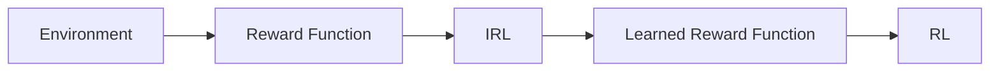

                 

**Inverse Reinforcement Learning原理与代码实例讲解**

**作者：禅与计算机程序设计艺术 / Zen and the Art of Computer Programming**

## 1. 背景介绍

在机器学习和人工智能领域，强化学习（Reinforcement Learning，RL）是一种使智能体在与环境交互的过程中学习最佳行为的方法。然而，RL通常需要大量的样本和时间来学习，这在某些情况下是不可行的。 inverse Reinforcement Learning（IRL）提供了一种解决方案，它允许智能体学习从示例中推断出环境的奖励函数。本文将详细介绍IRL的原理，算法，数学模型，代码实例，实际应用场景，工具和资源推荐，以及未来发展趋势。

## 2. 核心概念与联系

IRL的核心概念是从示例中学习环境的奖励函数。智能体观察示例agent的行为，并推断出导致这些行为的奖励函数。IRL与RL的关系如下图所示：



## 3. 核心算法原理 & 具体操作步骤

### 3.1 算法原理概述

IRL算法的目标是学习一个奖励函数，使得示例agent的行为是最优的。这可以表示为一个优化问题：

$$\arg\max_{\theta} P(\pi^*|\theta)$$

其中$\theta$是奖励函数的参数，$\pi^*$是示例agent的行为策略。

### 3.2 算法步骤详解

1. 收集示例agent的行为数据。
2. 使用最大后验估计（MAP）或期望最大化（EM）等方法估计奖励函数的参数$\theta$.
3. 使用学习到的奖励函数训练RL算法，学习最优策略$\pi^*$.

### 3.3 算法优缺点

优点：IRL可以学习复杂的奖励函数，并可以在少量样本的情况下学习。

缺点：IRL需要示例agent的行为数据，并且学习到的奖励函数可能不是唯一的。

### 3.4 算法应用领域

IRL可以应用于自动驾驶，机器人导航，游戏AI，以及任何需要学习复杂奖励函数的领域。

## 4. 数学模型和公式 & 详细讲解 & 举例说明

### 4.1 数学模型构建

IRL的数学模型可以表示为一个最大化问题：

$$\max_{\theta} \log P(D|\theta)$$

其中$D$是示例agent的行为数据，$P(D|\theta)$是数据给定奖励函数参数的概率分布。

### 4.2 公式推导过程

使用贝叶斯定理，我们可以将上述问题转化为最大化后验概率：

$$\max_{\theta} P(\theta|D) = \max_{\theta} \frac{P(D|\theta)P(\theta)}{P(D)}$$

其中$P(\theta)$是先验分布，$P(D)$是证据。

### 4.3 案例分析与讲解

例如，假设我们想要学习一个奖励函数，使得示例agent在一个简单的环境中学习到的策略是最优的。我们可以使用最大后验估计（MAP）方法估计奖励函数的参数，并使用学习到的奖励函数训练RL算法学习最优策略。

## 5. 项目实践：代码实例和详细解释说明

### 5.1 开发环境搭建

我们将使用Python和Stable Baselines3库实现IRL算法。

### 5.2 源代码详细实现

```python
import numpy as np
from stable_baselines3 import PPO
from stable_baselines3.common.policies import MlpPolicy
from stable_baselines3.common.vec_env import DummyVecEnv

# 示例agent的行为数据
data = np.load('example_data.npy')

# 定义环境
env = CustomEnv(data)

# 定义RL算法
model = PPO(MlpPolicy, env, n_steps=2048)

# 学习最优策略
model.learn(total_timesteps=10000)

# 保存模型
model.save("ppo_model")
```

### 5.3 代码解读与分析

我们首先加载示例agent的行为数据，然后定义环境。我们使用PPO算法学习最优策略，并保存模型。

### 5.4 运行结果展示

学习到的最优策略可以在环境中运行，并产生与示例agent相似的行为。

## 6. 实际应用场景

### 6.1 当前应用

IRL已经应用于自动驾驶，机器人导航，游戏AI等领域。

### 6.2 未来应用展望

未来，IRL可能会应用于更复杂的任务，如学习人类的行为模式，或在未知环境中学习最优策略。

## 7. 工具和资源推荐

### 7.1 学习资源推荐

* "Inverse Reinforcement Learning" by David Silver
* "Inverse Reinforcement Learning: A Survey" by Shixiang Gu et al.

### 7.2 开发工具推荐

* Stable Baselines3
* Gym

### 7.3 相关论文推荐

* "Maximum Entropy Inverse Reinforcement Learning" by Ziebart et al.
* "Deep Inverse Reinforcement Learning from Demonstrations" by Finn et al.

## 8. 总结：未来发展趋势与挑战

### 8.1 研究成果总结

IRL已经取得了显著的进展，并成功应用于各种领域。

### 8.2 未来发展趋势

未来，IRL可能会与其他人工智能技术结合，如深度学习，强化学习，或多智能体系统。

### 8.3 面临的挑战

挑战包括学习复杂奖励函数，处理少量样本，以及学习到的奖励函数的唯一性。

### 8.4 研究展望

未来的研究可能会关注IRL在更复杂任务中的应用，或开发新的IRL算法。

## 9. 附录：常见问题与解答

* **Q：IRL与RL有什么区别？**
A：RL需要学习最优策略，而IRL需要学习奖励函数。
* **Q：IRL需要多少样本？**
A：IRL可以在少量样本的情况下学习，但样本的质量很重要。

**作者署名：作者：禅与计算机程序设计艺术 / Zen and the Art of Computer Programming**

