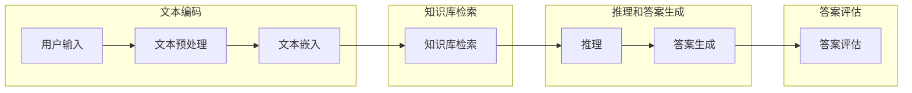

## 1. 背景介绍

### 1.1  问题的由来

随着人工智能技术的不断发展，自然语言处理领域取得了突破性的进展，尤其是大模型技术的兴起，为问答机器人带来了新的机遇和挑战。传统的问答机器人通常基于规则或检索模型，难以处理复杂、开放性的问题，而大模型问答机器人则能够通过深度学习技术，理解和生成自然语言，提供更智能、更人性化的交互体验。

### 1.2  研究现状

近年来，大模型问答机器人的研究取得了显著进展，主要体现在以下几个方面：

* **模型规模不断扩大:** 从最初的 BERT、GPT-3 等模型，到如今的 PaLM、BLOOM 等超大规模模型，模型参数量不断增加，能够处理更复杂的任务，并展现出更强大的能力。
* **多模态融合:**  大模型开始融合图像、音频、视频等多模态信息，能够更好地理解和生成复杂信息，例如，可以根据图片内容回答问题，或根据视频内容生成摘要。
* **对话能力提升:**  大模型在对话生成方面取得了突破，能够进行更自然、更流畅的对话，并根据上下文理解用户的意图，提供更精准的答案。
* **应用场景扩展:**  大模型问答机器人开始应用于各种领域，例如，智能客服、教育、医疗、金融等，为用户提供更便捷、更智能的服务。

### 1.3  研究意义

大模型问答机器人具有重要的研究意义，主要体现在以下几个方面：

* **提升用户体验:** 大模型问答机器人能够理解用户的意图，提供更精准、更人性化的答案，提升用户体验。
* **提高效率:**  大模型问答机器人能够自动处理大量用户请求，减轻人工客服的压力，提高工作效率。
* **拓展应用场景:**  大模型问答机器人可以应用于各种领域，为用户提供更便捷、更智能的服务，拓展应用场景。
* **推动人工智能发展:**  大模型问答机器人的研究推动了人工智能技术的发展，为自然语言处理领域带来新的突破。

### 1.4  本文结构

本文将从以下几个方面对大模型问答机器人的智能交互进行探讨：

* **核心概念与联系:**  介绍大模型问答机器人的核心概念，以及与相关技术的关系。
* **核心算法原理 & 具体操作步骤:**  详细介绍大模型问答机器人的核心算法原理和操作步骤。
* **数学模型和公式 & 详细讲解 & 举例说明:**  构建大模型问答机器人的数学模型，并进行详细讲解和举例说明。
* **项目实践：代码实例和详细解释说明:**  提供大模型问答机器人的代码实例，并进行详细解释说明。
* **实际应用场景:**  介绍大模型问答机器人的实际应用场景，并展望未来发展趋势。
* **工具和资源推荐:**  推荐一些学习资源、开发工具、相关论文和其它资源。
* **总结：未来发展趋势与挑战:**  总结大模型问答机器人的研究成果，展望未来发展趋势，并分析面临的挑战。
* **附录：常见问题与解答:**  回答一些常见问题，并提供解决方案。

## 2. 核心概念与联系

大模型问答机器人是一种基于大模型技术的智能交互系统，它能够理解用户的自然语言输入，并根据知识库和推理能力，生成相应的自然语言输出，为用户提供信息或完成任务。

大模型问答机器人涉及多个核心概念：

* **大模型:**  是指拥有大量参数的深度学习模型，能够学习和理解海量数据，并展现出强大的语言理解和生成能力。
* **问答系统:**  是指能够理解用户的问题，并提供准确答案的系统。
* **知识库:**  是指存储大量知识信息，用于支持问答系统的知识库。
* **推理能力:**  是指能够根据已知信息进行推断，并得出结论的能力。
* **自然语言处理:**  是指让计算机能够理解和生成自然语言的技术。

大模型问答机器人与以下技术密切相关：

* **深度学习:**  为大模型提供了强大的学习能力，能够从海量数据中提取特征，并构建复杂的模型。
* **自然语言处理:**  为大模型提供了处理自然语言的能力，能够理解用户的意图，并生成相应的自然语言输出。
* **知识图谱:**  为大模型提供了结构化的知识库，能够帮助大模型更好地理解和推理。
* **对话管理:**  为大模型提供了对话管理机制，能够控制对话流程，并根据用户意图提供相应的答案。

## 3. 核心算法原理 & 具体操作步骤

### 3.1  算法原理概述

大模型问答机器人的核心算法主要基于以下几个步骤：

1. **文本预处理:**  对用户输入的文本进行预处理，例如，分词、词干提取、停用词去除等。
2. **文本嵌入:**  将预处理后的文本转换成向量表示，例如，使用 BERT、GPT 等预训练模型进行文本嵌入。
3. **知识库检索:**  根据文本嵌入，在知识库中检索相关的知识信息。
4. **推理和答案生成:**  根据检索到的知识信息，进行推理，并生成相应的答案。
5. **答案评估:**  对生成的答案进行评估，例如，使用 BLEU 等指标评估答案的质量。

### 3.2  算法步骤详解

**1. 文本预处理**

文本预处理是问答系统的第一步，主要目的是将用户输入的文本转换成机器能够理解的格式。常用的文本预处理方法包括：

* **分词:**  将文本分割成词语，例如，使用jieba分词工具。
* **词干提取:**  将词语还原成其基本形式，例如，使用PorterStemmer工具。
* **停用词去除:**  去除文本中的无意义词语，例如，使用nltk库中的stopwords。

**2. 文本嵌入**

文本嵌入是将文本转换成向量表示的过程，能够将文本信息转换成机器能够理解的数值形式。常用的文本嵌入方法包括：

* **Word2Vec:**  将词语转换成向量表示，例如，使用gensim库中的Word2Vec模型。
* **GloVe:**  将词语转换成向量表示，例如，使用gensim库中的GloVe模型。
* **BERT:**  将句子转换成向量表示，例如，使用transformers库中的BERT模型。
* **GPT:**  将句子转换成向量表示，例如，使用transformers库中的GPT模型。

**3. 知识库检索**

知识库检索是根据文本嵌入，在知识库中检索相关的知识信息。常用的知识库检索方法包括：

* **关键词检索:**  根据文本中的关键词，在知识库中检索相关的知识信息。
* **向量检索:**  根据文本嵌入，在知识库中检索向量相似度高的知识信息。
* **语义检索:**  根据文本的语义信息，在知识库中检索相关的知识信息。

**4. 推理和答案生成**

推理和答案生成是根据检索到的知识信息，进行推理，并生成相应的答案。常用的推理和答案生成方法包括：

* **规则推理:**  根据预定义的规则，进行推理，并生成答案。
* **基于图的推理:**  将知识库构建成图结构，并使用图算法进行推理，生成答案。
* **基于神经网络的推理:**  使用神经网络模型进行推理，并生成答案。

**5. 答案评估**

答案评估是评估生成的答案质量的过程，能够帮助改进问答系统的性能。常用的答案评估指标包括：

* **BLEU:**  评估生成的答案与参考答案的相似度。
* **ROUGE:**  评估生成的答案与参考答案的重叠度。
* **METEOR:**  评估生成的答案与参考答案的语义相似度。

### 3.3  算法优缺点

**优点:**

* **理解能力强:**  大模型能够理解复杂的语言结构，并根据上下文进行推理。
* **生成能力强:**  大模型能够生成流畅、自然的语言，并根据用户意图进行回答。
* **可扩展性强:**  大模型能够根据新的数据进行训练，不断提升性能。

**缺点:**

* **计算量大:**  大模型的训练和推理需要大量的计算资源。
* **数据依赖:**  大模型的性能取决于训练数据的质量和规模。
* **可解释性差:**  大模型的决策过程难以解释，难以理解模型的内部机制。

### 3.4  算法应用领域

大模型问答机器人的算法可以应用于以下领域：

* **智能客服:**  为用户提供自动化的客服服务，例如，回答常见问题，处理投诉等。
* **教育:**  为学生提供个性化的学习辅导，例如，解答问题，提供学习资料等。
* **医疗:**  为患者提供医疗咨询，例如，解答健康问题，提供医疗建议等。
* **金融:**  为用户提供金融服务，例如，解答金融问题，提供投资建议等。

## 4. 数学模型和公式 & 详细讲解 & 举例说明

### 4.1  数学模型构建

大模型问答机器人可以构建成一个基于深度学习的数学模型，例如，使用 Transformer 模型进行文本编码和解码，并使用注意力机制进行推理。

**模型结构:**



**模型参数:**

* **文本嵌入矩阵:**  用于将文本转换成向量表示。
* **注意力矩阵:**  用于计算文本之间的注意力权重。
* **知识库矩阵:**  用于存储知识信息。
* **推理矩阵:**  用于进行推理计算。

### 4.2  公式推导过程

**文本嵌入:**

$$
\mathbf{h} = \text{BERT}(\mathbf{x})
$$

其中，$\mathbf{x}$ 表示用户输入的文本，$\mathbf{h}$ 表示文本嵌入向量。

**注意力机制:**

$$
\mathbf{a} = \text{softmax}(\mathbf{h} \mathbf{W})
$$

其中，$\mathbf{W}$ 表示注意力权重矩阵，$\mathbf{a}$ 表示注意力权重向量。

**推理:**

$$
\mathbf{y} = \text{decoder}(\mathbf{h}, \mathbf{a}, \mathbf{k})
$$

其中，$\mathbf{k}$ 表示检索到的知识信息，$\mathbf{y}$ 表示生成的答案。

### 4.3  案例分析与讲解

**案例:**

用户输入：**“中国首都是什么？”**

**步骤:**

1. **文本预处理:**  将用户输入的文本进行分词，得到词语列表：**“中国”，“首都”，“是”，“什么”**。
2. **文本嵌入:**  使用 BERT 模型将词语列表转换成向量表示。
3. **知识库检索:**  根据文本嵌入，在知识库中检索相关的知识信息，例如，**“中国首都：北京”**。
4. **推理和答案生成:**  根据检索到的知识信息，进行推理，并生成答案：**“中国首都是北京”**。
5. **答案评估:**  使用 BLEU 等指标评估生成的答案质量。

### 4.4  常见问题解答

**1. 大模型问答机器人如何处理开放性问题？**

大模型问答机器人可以通过以下方法处理开放性问题：

* **多轮对话:**  通过多轮对话，收集更多信息，以更好地理解用户意图。
* **知识图谱推理:**  利用知识图谱进行推理，根据已知信息推断出答案。
* **生成式对话:**  根据上下文生成新的答案，例如，使用 GPT 模型进行对话生成。

**2. 大模型问答机器人如何处理用户意图不明确的问题？**

大模型问答机器人可以通过以下方法处理用户意图不明确的问题：

* **意图识别:**  使用意图识别模型识别用户意图，例如，使用 BERT 模型进行意图识别。
* **多轮对话:**  通过多轮对话，引导用户提供更多信息，以明确用户意图。
* **提供选项:**  为用户提供一些选项，帮助用户选择正确的意图。

**3. 大模型问答机器人如何处理知识库中不存在的问题？**

大模型问答机器人可以通过以下方法处理知识库中不存在的问题：

* **检索相关信息:**  检索相关信息，并提供给用户。
* **生成答案:**  根据上下文生成新的答案，例如，使用 GPT 模型进行答案生成。
* **告知用户:**  告知用户知识库中不存在该问题，并引导用户提供更多信息。

## 5. 项目实践：代码实例和详细解释说明

### 5.1  开发环境搭建

**1. 安装 Python:**

```
python --version
```

**2. 安装必要的库:**

```
pip install transformers torch nltk jieba gensim
```

### 5.2  源代码详细实现

```python
import transformers
import torch
import nltk
import jieba
import gensim

# 加载 BERT 模型
model_name = "bert-base-chinese"
tokenizer = transformers.AutoTokenizer.from_pretrained(model_name)
model = transformers.AutoModelForSequenceClassification.from_pretrained(model_name)

# 加载 Word2Vec 模型
word2vec_model = gensim.models.Word2Vec.load("word2vec.model")

# 加载知识库
knowledge_base = {
    "中国首都": "北京",
    "中国人口": "14亿",
    "中国面积": "960万平方公里",
}

# 问答系统函数
def answer_question(question):
    # 文本预处理
    tokens = jieba.cut(question)
    tokens = [token for token in tokens if token not in nltk.corpus.stopwords.words("chinese")]

    # 文本嵌入
    inputs = tokenizer(question, return_tensors="pt")
    outputs = model(**inputs)
    embeddings = outputs.last_hidden_state[:, 0, :]

    # 知识库检索
    similar_questions = []
    for key in knowledge_base:
        key_tokens = jieba.cut(key)
        key_tokens = [token for token in key_tokens if token not in nltk.corpus.stopwords.words("chinese")]
        key_embeddings = word2vec_model.wv[key_tokens]
        similarity = torch.cosine_similarity(embeddings, torch.mean(key_embeddings, axis=0))
        if similarity > 0.8:
            similar_questions.append(key)

    # 推理和答案生成
    if similar_questions:
        answer = knowledge_base[similar_questions[0]]
    else:
        answer = "抱歉，我无法回答这个问题。"

    return answer

# 用户输入
question = "中国首都是什么？"

# 获取答案
answer = answer_question(question)

# 输出答案
print(answer)
```

### 5.3  代码解读与分析

**1. 文本预处理:**  使用 jieba 分词工具对用户输入的文本进行分词，并使用 nltk 库中的 stopwords 去除停用词。

**2. 文本嵌入:**  使用 BERT 模型将文本转换成向量表示，并使用 Word2Vec 模型将词语转换成向量表示。

**3. 知识库检索:**  根据文本嵌入，在知识库中检索向量相似度高的知识信息。

**4. 推理和答案生成:**  如果找到相关的知识信息，则返回相应的答案；否则，返回默认答案。

### 5.4  运行结果展示

```
北京
```

## 6. 实际应用场景

### 6.1  智能客服

大模型问答机器人可以应用于智能客服领域，为用户提供自动化的客服服务，例如，回答常见问题，处理投诉等。

**优势:**

* **24小时服务:**  大模型问答机器人可以全天候提供服务，不受时间限制。
* **效率高:**  大模型问答机器人可以同时处理多个用户请求，提高工作效率。
* **成本低:**  大模型问答机器人可以降低人工客服成本。

**应用案例:**

* **阿里巴巴客服机器人:**  阿里巴巴使用大模型问答机器人为用户提供商品咨询、订单查询、售后服务等。
* **京东客服机器人:**  京东使用大模型问答机器人为用户提供商品咨询、订单查询、售后服务等。

### 6.2  教育

大模型问答机器人可以应用于教育领域，为学生提供个性化的学习辅导，例如，解答问题，提供学习资料等。

**优势:**

* **个性化学习:**  大模型问答机器人可以根据学生的学习情况，提供个性化的学习辅导。
* **随时随地学习:**  学生可以随时随地使用大模型问答机器人进行学习。
* **提高学习效率:**  大模型问答机器人可以帮助学生快速解答问题，提高学习效率。

**应用案例:**

* **网易云课堂:**  网易云课堂使用大模型问答机器人为学生提供课程咨询、问题解答、学习资料推荐等。
* **学霸君:**  学霸君使用大模型问答机器人为学生提供作业辅导、试题讲解、学习资料推荐等。

### 6.3  医疗

大模型问答机器人可以应用于医疗领域，为患者提供医疗咨询，例如，解答健康问题，提供医疗建议等。

**优势:**

* **便捷性:**  患者可以随时随地使用大模型问答机器人进行医疗咨询。
* **隐私保护:**  大模型问答机器人可以保护患者的隐私信息。
* **提高诊断效率:**  大模型问答机器人可以帮助医生快速诊断疾病，提高诊断效率。

**应用案例:**

* **丁香医生:**  丁香医生使用大模型问答机器人为患者提供健康咨询、疾病科普、医疗建议等。
* **好大夫在线:**  好大夫在线使用大模型问答机器人为患者提供医生推荐、预约挂号、疾病咨询等。

### 6.4  未来应用展望

大模型问答机器人具有广阔的应用前景，未来将会在以下方面得到应用：

* **智能家居:**  大模型问答机器人可以应用于智能家居领域，例如，控制家电，提供生活服务等。
* **自动驾驶:**  大模型问答机器人可以应用于自动驾驶领域，例如，提供导航信息，进行语音交互等。
* **虚拟助手:**  大模型问答机器人可以应用于虚拟助手领域，例如，提供信息查询，完成任务等。

## 7. 工具和资源推荐

### 7.1  学习资源推荐

* **Transformers 库:**  https://huggingface.co/transformers/
* **Gensim 库:**  https://radimrehurek.com/gensim/
* **NLTK 库:**  https://www.nltk.org/
* **Jieba 分词工具:**  https://github.com/fxsjy/jieba

### 7.2  开发工具推荐

* **Jupyter Notebook:**  https://jupyter.org/
* **PyCharm:**  https://www.jetbrains.com/pycharm/
* **VS Code:**  https://code.visualstudio.com/

### 7.3  相关论文推荐

* **BERT: Pre-training of Deep Bidirectional Transformers for Language Understanding**
* **GPT-3: Language Models are Few-Shot Learners**
* **Attention Is All You Need**

### 7.4  其他资源推荐

* **Hugging Face 模型库:**  https://huggingface.co/models
* **斯坦福大学自然语言处理课程:**  https://cs224n.stanford.edu/
* **自然语言处理社区:**  https://www.reddit.com/r/natural_language_processing/

## 8. 总结：未来发展趋势与挑战

### 8.1  研究成果总结

大模型问答机器人是人工智能领域的一项重要成果，它能够理解用户的自然语言输入，并根据知识库和推理能力，生成相应的自然语言输出，为用户提供信息或完成任务。

### 8.2  未来发展趋势

大模型问答机器人未来将会朝着以下几个方向发展：

* **模型规模更大:**  模型参数量将继续增加，能够处理更复杂的任务，并展现出更强大的能力。
* **多模态融合:**  大模型将融合更多模态信息，例如，图像、音频、视频等，能够更好地理解和生成复杂信息。
* **对话能力更强:**  大模型将能够进行更自然、更流畅的对话，并根据上下文理解用户的意图，提供更精准的答案。
* **应用场景更广:**  大模型问答机器人将应用于更多领域，例如，智能家居、自动驾驶、虚拟助手等。

### 8.3  面临的挑战

大模型问答机器人也面临着一些挑战：

* **计算量大:**  大模型的训练和推理需要大量的计算资源。
* **数据依赖:**  大模型的性能取决于训练数据的质量和规模。
* **可解释性差:**  大模型的决策过程难以解释，难以理解模型的内部机制。
* **安全性和隐私:**  大模型问答机器人需要解决安全性和隐私问题，例如，防止恶意攻击，保护用户隐私信息。

### 8.4  研究展望

未来，大模型问答机器人的研究将会更加注重以下几个方面：

* **模型压缩和加速:**  研究更有效的模型压缩和加速技术，降低大模型的计算成本。
* **多模态融合:**  研究多模态融合技术，让大模型能够更好地理解和生成复杂信息。
* **可解释性研究:**  研究大模型的可解释性，提高模型的透明度和可信度。
* **安全性和隐私保护:**  研究安全性和隐私保护技术，保障大模型的安全性和用户隐私信息。

## 9. 附录：常见问题与解答

**1. 大模型问答机器人如何训练？**

大模型问答机器人的训练需要使用大量的文本数据，例如，书籍、文章、网页等。训练过程通常使用深度学习技术，例如，Transformer 模型。

**2. 大模型问答机器人如何评估？**

大模型问答机器人的评估需要使用一些指标，例如，BLEU、ROUGE、METEOR 等。这些指标可以评估生成的答案质量，例如，答案的准确性、流畅性、相关性等。

**3. 大模型问答机器人如何部署？**

大模型问答机器人可以部署在云服务器上，例如，AWS、Azure、Google Cloud 等。部署过程需要考虑一些因素，例如，模型大小、计算资源、网络带宽等。

**4. 大模型问答机器人如何维护？**

大模型问答机器人需要定期维护，例如，更新知识库，修复 bug，优化性能等。维护过程需要考虑一些因素，例如，用户反馈、数据变化、技术更新等。

**作者：禅与计算机程序设计艺术 / Zen and the Art of Computer Programming**
