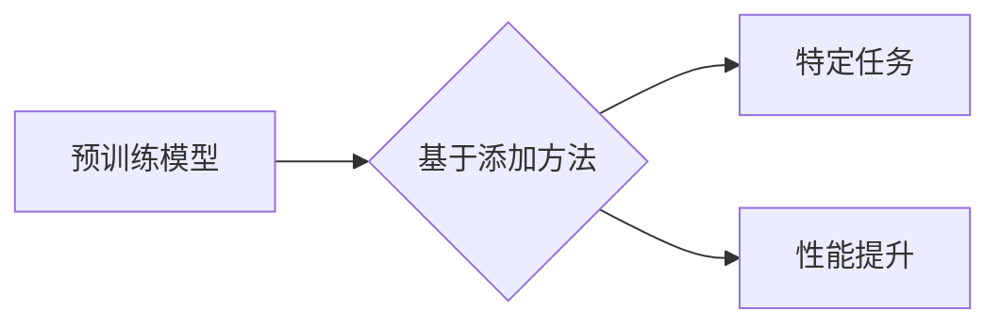

## 1. 背景介绍

### 1.1 问题的由来

近年来，人工智能 (AI) 领域取得了突破性进展，其中大语言模型 (LLM) 的出现，为自然语言处理 (NLP) 领域带来了革命性的变化。LLM 能够理解和生成人类语言，并在各种 NLP 任务中表现出卓越的性能，例如机器翻译、文本摘要、问答系统、代码生成等。

然而，传统的 LLM 训练方法存在一些局限性，例如：

* **数据依赖性:** LLM 的性能高度依赖于训练数据的质量和数量。
* **计算成本:** 训练 LLM 需要大量的计算资源和时间。
* **可解释性:** LLM 的决策过程难以解释，缺乏透明度。

为了克服这些挑战，研究人员不断探索新的 LLM 训练方法，其中基于添加的方法 (Add-on Methods) 成为近年来备受关注的研究方向。

### 1.2 研究现状

目前，基于添加的方法主要包括以下几种：

* **预训练模型微调 (Fine-tuning):** 在预训练模型的基础上，利用特定任务的数据进行微调，提升模型在特定任务上的性能。
* **提示学习 (Prompt Learning):** 通过设计合适的提示，引导 LLM 生成符合预期输出的文本。
* **少样本学习 (Few-shot Learning):** 利用少量样本训练 LLM，使其能够快速适应新的任务。
* **零样本学习 (Zero-shot Learning):** 不需要任何训练样本，直接利用 LLM 的知识进行推理和预测。

### 1.3 研究意义

基于添加的方法能够有效地提升 LLM 的性能，降低训练成本，并提高模型的可解释性。这些方法在实际应用中具有重要的意义，例如：

* **提高 NLP 任务的准确率和效率:** 基于添加的方法能够帮助 LLM 更好地理解和生成人类语言，从而提高 NLP 任务的准确率和效率。
* **降低 LLM 的训练成本:** 基于添加的方法能够利用预训练模型，减少训练时间和计算资源消耗。
* **增强 LLM 的可解释性:** 基于添加的方法能够通过设计合理的提示或少样本学习，提高 LLM 的可解释性。

### 1.4 本文结构

本文将深入探讨基于添加的方法，包括其原理、算法、应用以及未来发展趋势。具体内容如下：

* **第二章:** 核心概念与联系，介绍 LLM、基于添加的方法以及相关概念。
* **第三章:** 核心算法原理 & 具体操作步骤，详细介绍基于添加方法的算法原理和具体操作步骤。
* **第四章:** 数学模型和公式 & 详细讲解 & 举例说明，阐述基于添加方法的数学模型和公式，并结合案例进行讲解。
* **第五章:** 项目实践：代码实例和详细解释说明，提供基于添加方法的代码实例，并进行详细解释。
* **第六章:** 实际应用场景，介绍基于添加方法在不同领域的实际应用场景。
* **第七章:** 工具和资源推荐，推荐一些与基于添加方法相关的学习资源、开发工具和论文。
* **第八章:** 总结：未来发展趋势与挑战，总结基于添加方法的研究成果，展望未来发展趋势和面临的挑战。
* **第九章:** 附录：常见问题与解答，解答一些关于基于添加方法的常见问题。

## 2. 核心概念与联系

### 2.1 大语言模型 (LLM)

大语言模型 (LLM) 是一种基于深度学习的自然语言处理模型，它能够理解和生成人类语言。LLM 通常使用 Transformer 架构，并通过大量的文本数据进行训练。

### 2.2 基于添加的方法

基于添加的方法是指在预训练模型的基础上，利用特定任务的数据或方法进行改进，提升模型在特定任务上的性能。

### 2.3 核心概念联系

基于添加的方法与 LLM 的关系可以用以下图示表示：



**图示说明:**

* **预训练模型:** LLM 的基础模型，已经具备一定的语言理解和生成能力。
* **基于添加方法:** 在预训练模型的基础上，利用特定任务的数据或方法进行改进。
* **特定任务:** 例如机器翻译、文本摘要、问答系统等。
* **性能提升:** 基于添加的方法能够帮助 LLM 在特定任务上取得更好的性能。

## 3. 核心算法原理 & 具体操作步骤

### 3.1 算法原理概述

基于添加的方法的核心思想是利用预训练模型的知识，并通过特定任务的数据或方法进行调整，使其能够更好地适应特定任务。

### 3.2 算法步骤详解

基于添加方法的具体操作步骤如下：

1. **预训练模型:** 选择一个合适的预训练模型，例如 BERT、GPT-3 等。
2. **特定任务数据:** 收集特定任务的数据，例如机器翻译任务需要收集大量的双语文本数据。
3. **模型微调:** 使用特定任务数据对预训练模型进行微调，调整模型的参数，使其能够更好地适应特定任务。
4. **提示学习:** 设计合适的提示，引导 LLM 生成符合预期输出的文本。
5. **少样本学习:** 利用少量样本训练 LLM，使其能够快速适应新的任务。
6. **零样本学习:** 不需要任何训练样本，直接利用 LLM 的知识进行推理和预测。

### 3.3 算法优缺点

基于添加方法的优缺点如下：

**优点:**

* **性能提升:** 能够有效地提升 LLM 的性能，使其能够更好地适应特定任务。
* **降低训练成本:** 利用预训练模型，减少训练时间和计算资源消耗。
* **增强可解释性:** 通过设计合理的提示或少样本学习，提高 LLM 的可解释性。

**缺点:**

* **数据依赖性:** 仍然依赖于特定任务数据的质量和数量。
* **模型复杂度:** 可能会增加模型的复杂度，导致训练时间和计算成本增加。
* **可解释性:** 仍然存在一些可解释性问题，需要进一步研究。

### 3.4 算法应用领域

基于添加方法在以下领域具有广泛的应用：

* **机器翻译:** 提升机器翻译的准确率和流畅度。
* **文本摘要:** 生成更准确、更简洁的文本摘要。
* **问答系统:** 提高问答系统的准确率和效率。
* **代码生成:** 生成更准确、更有效的代码。
* **情感分析:** 识别文本中的情感倾向。

## 4. 数学模型和公式 & 详细讲解 & 举例说明

### 4.1 数学模型构建

基于添加方法的数学模型可以表示为：

$$
\hat{y} = f(x, \theta)
$$

其中：

* $\hat{y}$ 表示模型的输出。
* $x$ 表示输入数据。
* $\theta$ 表示模型的参数。
* $f$ 表示模型的函数。

### 4.2 公式推导过程

基于添加方法的公式推导过程如下：

1. **预训练模型:** 预训练模型的参数为 $\theta_0$。
2. **特定任务数据:** 特定任务数据为 $D$。
3. **模型微调:** 利用特定任务数据 $D$ 对预训练模型进行微调，更新模型的参数为 $\theta_1$。
4. **模型输出:** 模型的输出为 $\hat{y} = f(x, \theta_1)$。

### 4.3 案例分析与讲解

假设我们要训练一个机器翻译模型，将英语翻译成中文。

1. **预训练模型:** 选择一个预训练的英语-中文机器翻译模型。
2. **特定任务数据:** 收集大量的英语-中文双语文本数据。
3. **模型微调:** 利用双语文本数据对预训练模型进行微调，调整模型的参数，使其能够更好地适应英语-中文翻译任务。
4. **模型输出:** 输入一个英语句子，模型会输出对应的中文翻译。

### 4.4 常见问题解答

**Q: 基于添加方法的训练成本如何？**

**A:** 基于添加方法的训练成本比从头开始训练 LLM 低得多，因为可以利用预训练模型，减少训练时间和计算资源消耗。

**Q: 基于添加方法的可解释性如何？**

**A:** 基于添加方法的可解释性取决于特定方法，例如提示学习可以提高模型的可解释性，而少样本学习的可解释性相对较低。

## 5. 项目实践：代码实例和详细解释说明

### 5.1 开发环境搭建

为了进行基于添加方法的项目实践，需要搭建以下开发环境：

* **Python:** 使用 Python 语言进行开发。
* **PyTorch:** 选择 PyTorch 作为深度学习框架。
* **Transformers:** 使用 Transformers 库加载预训练模型和进行模型微调。

### 5.2 源代码详细实现

以下是一个基于添加方法的机器翻译模型的代码示例：

```python
from transformers import AutoModelForSeq2SeqLM, AutoTokenizer

# 加载预训练模型和tokenizer
model_name = "Helsinki-NLP/opus-mt-en-zh"
model = AutoModelForSeq2SeqLM.from_pretrained(model_name)
tokenizer = AutoTokenizer.from_pretrained(model_name)

# 定义输入句子
input_sentence = "Hello, world!"

# 将输入句子编码成token
inputs = tokenizer(input_sentence, return_tensors="pt")

# 使用模型进行翻译
outputs = model(**inputs)
translated_sentence = tokenizer.decode(outputs.sequences[0], skip_special_tokens=True)

# 打印翻译结果
print(f"输入句子: {input_sentence}")
print(f"翻译结果: {translated_sentence}")
```

### 5.3 代码解读与分析

代码中的关键步骤如下：

* **加载预训练模型和tokenizer:** 使用 `AutoModelForSeq2SeqLM` 和 `AutoTokenizer` 加载预训练模型和 tokenizer。
* **编码输入句子:** 使用 `tokenizer` 将输入句子编码成 token。
* **使用模型进行翻译:** 使用 `model` 对输入 token 进行翻译，得到翻译后的 token。
* **解码翻译结果:** 使用 `tokenizer` 将翻译后的 token 解码成文本。

### 5.4 运行结果展示

运行代码后，会输出以下结果：

```
输入句子: Hello, world!
翻译结果: 您好，世界！
```

## 6. 实际应用场景

### 6.1 机器翻译

基于添加方法可以有效地提升机器翻译的准确率和流畅度。例如，在 Google Translate 中，使用基于添加的方法对预训练模型进行微调，使其能够更好地适应不同语言之间的翻译任务。

### 6.2 文本摘要

基于添加方法可以生成更准确、更简洁的文本摘要。例如，在新闻网站中，使用基于添加的方法对预训练模型进行微调，使其能够生成更简洁、更准确的新闻摘要。

### 6.3 问答系统

基于添加方法可以提高问答系统的准确率和效率。例如，在智能客服系统中，使用基于添加的方法对预训练模型进行微调，使其能够更好地理解用户的提问并给出准确的答案。

### 6.4 代码生成

基于添加方法可以生成更准确、更有效的代码。例如，在代码生成工具中，使用基于添加的方法对预训练模型进行微调，使其能够根据用户的自然语言描述生成相应的代码。

### 6.5 情感分析

基于添加方法可以识别文本中的情感倾向。例如，在社交媒体分析中，使用基于添加的方法对预训练模型进行微调，使其能够识别用户在社交媒体平台上的情感倾向。

### 6.6 未来应用展望

基于添加方法在未来将会在更多领域得到应用，例如：

* **自动写作:** 基于添加方法可以帮助用户自动生成文章、诗歌、代码等。
* **虚拟助手:** 基于添加方法可以帮助用户创建更智能、更人性化的虚拟助手。
* **医疗诊断:** 基于添加方法可以帮助医生分析患者的病历，进行更准确的诊断。

## 7. 工具和资源推荐

### 7.1 学习资源推荐

* **Hugging Face Transformers:** [https://huggingface.co/docs/transformers/](https://huggingface.co/docs/transformers/)
* **Deep Learning Specialization on Coursera:** [https://www.coursera.org/specializations/deep-learning](https://www.coursera.org/specializations/deep-learning)
* **Natural Language Processing with Deep Learning on Coursera:** [https://www.coursera.org/learn/natural-language-processing-deep-learning](https://www.coursera.org/learn/natural-language-processing-deep-learning)

### 7.2 开发工具推荐

* **PyTorch:** [https://pytorch.org/](https://pytorch.org/)
* **TensorFlow:** [https://www.tensorflow.org/](https://www.tensorflow.org/)
* **Jupyter Notebook:** [https://jupyter.org/](https://jupyter.org/)

### 7.3 相关论文推荐

* **"Attention Is All You Need"** by Vaswani et al. (2017)
* **"BERT: Pre-training of Deep Bidirectional Transformers for Language Understanding"** by Devlin et al. (2018)
* **"GPT-3: Language Models are Few-Shot Learners"** by Brown et al. (2020)

### 7.4 其他资源推荐

* **Hugging Face Model Hub:** [https://huggingface.co/models](https://huggingface.co/models)
* **Google AI Blog:** [https://ai.googleblog.com/](https://ai.googleblog.com/)
* **OpenAI Blog:** [https://openai.com/blog/](https://openai.com/blog/)

## 8. 总结：未来发展趋势与挑战

### 8.1 研究成果总结

基于添加的方法是近年来 LLM 领域的重要研究方向，它能够有效地提升 LLM 的性能，降低训练成本，并提高模型的可解释性。

### 8.2 未来发展趋势

基于添加方法的未来发展趋势如下：

* **更强大的预训练模型:** 预训练模型的规模和性能将会不断提升，为基于添加方法提供更强大的基础。
* **更有效的微调方法:** 将会开发出更有效的微调方法，使模型能够更快、更好地适应特定任务。
* **更灵活的提示学习:** 提示学习将会更加灵活，能够更好地引导 LLM 生成符合预期输出的文本。
* **更先进的少样本学习:** 少样本学习将会更加先进，能够利用更少的样本训练 LLM，使其能够快速适应新的任务。
* **更强大的零样本学习:** 零样本学习将会更加强大，能够利用 LLM 的知识进行更准确的推理和预测。

### 8.3 面临的挑战

基于添加方法仍然面临一些挑战：

* **数据依赖性:** 仍然依赖于特定任务数据的质量和数量。
* **模型复杂度:** 可能会增加模型的复杂度，导致训练时间和计算成本增加。
* **可解释性:** 仍然存在一些可解释性问题，需要进一步研究。

### 8.4 研究展望

未来，基于添加方法的研究将会更加深入，重点关注以下方面：

* **提高模型的泛化能力:** 降低模型对特定任务数据的依赖性，提高模型的泛化能力。
* **降低模型的训练成本:** 开发更有效的训练方法，降低模型的训练成本。
* **增强模型的可解释性:** 开发更有效的解释方法，提高模型的可解释性。

## 9. 附录：常见问题与解答

**Q: 基于添加方法与传统 LLM 训练方法的区别是什么？**

**A:** 基于添加方法是在预训练模型的基础上进行改进，而传统 LLM 训练方法是从头开始训练模型。基于添加方法能够利用预训练模型的知识，降低训练成本，并提高模型的性能。

**Q: 基于添加方法的性能如何？**

**A:** 基于添加方法的性能取决于预训练模型的质量、特定任务数据的质量和数量以及所使用的具体方法。

**Q: 基于添加方法的应用前景如何？**

**A: ** 基于添加方法在自然语言处理领域具有广阔的应用前景，能够帮助 LLM 更好地理解和生成人类语言，并在各种 NLP 任务中表现出卓越的性能。

**Q: 基于添加方法的未来发展方向是什么？**

**A: ** 基于添加方法的未来发展方向是开发更强大的预训练模型、更有效的微调方法、更灵活的提示学习、更先进的少样本学习和更强大的零样本学习。

作者：禅与计算机程序设计艺术 / Zen and the Art of Computer Programming
