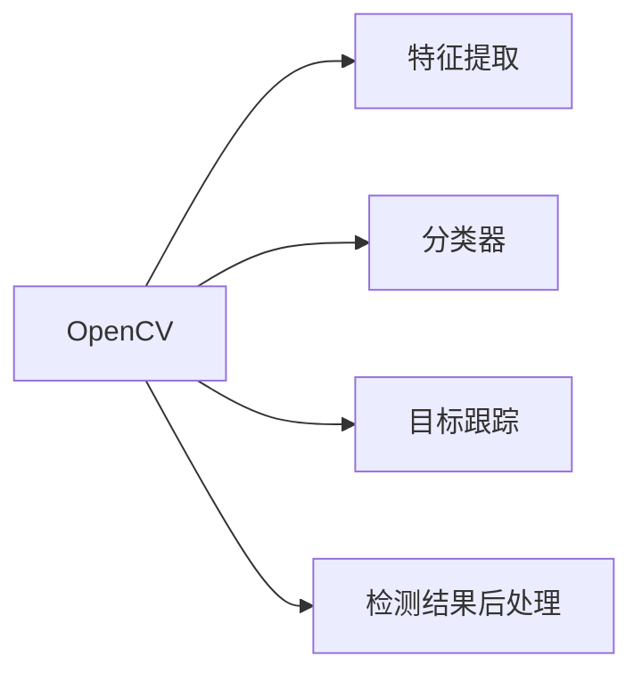

                 

**OpenCV 图像处理：对象检测和识别**

**作者：禅与计算机程序设计艺术 / Zen and the Art of Computer Programming**

## 1. 背景介绍

图像处理是计算机视觉领域的核心内容，对象检测和识别是其中的关键任务。OpenCV（Open Source Computer Vision Library）是一个开源的计算机视觉库，提供了丰富的图像处理算法和函数。本文将深入探讨OpenCV在对象检测和识别中的应用，并提供实践指南和项目实例。

## 2. 核心概念与联系

### 2.1 对象检测与识别的区别

对象检测（Object Detection）和对象识别（Object Recognition）是两个相关但不同的任务。对象检测旨在确定图像中存在哪些对象，并定位它们的位置。对象识别则是确定检测到的对象的类别或种类。二者的关系如下图所示：


### 2.2 OpenCV在对象检测和识别中的地位

OpenCV提供了丰富的算法和函数，支持对象检测和识别任务。它的模块化设计使得用户可以灵活选择和组合不同的算法，以适应特定的应用场景。下图展示了OpenCV在对象检测和识别中的一些关键模块：



## 3. 核心算法原理 & 具体操作步骤

### 3.1 算法原理概述

对象检测和识别的算法可以分为传统方法和深度学习方法两大类。传统方法基于手工设计的特征，如Haar特征、HOG特征等。深度学习方法则使用神经网络，如CNN（Convolutional Neural Network）、R-CNN（Region-based Convolutional Neural Network）等。

### 3.2 算法步骤详解

以Haar特征和HOG特征为例，对象检测和识别的步骤如下：

1. **特征提取**：使用Haar特征或HOG特征提取图像的局部特征。
2. **训练分类器**：使用标记的训练样本训练Adaboost分类器。
3. **检测窗口**：在图像上滑动不同大小的检测窗口。
4. **分类判断**：使用训练好的分类器判断窗口内是否包含目标对象。
5. **后处理**：去除重叠和冗余的检测结果。

### 3.3 算法优缺点

传统方法的优点是计算快速，缺点是特征提取需要大量人工经验，且泛化能力有限。深度学习方法的优点是自动学习特征，泛化能力强，缺点是计算复杂，训练数据需求大。

### 3.4 算法应用领域

对象检测和识别的应用领域包括安防监控、自动驾驶、机器人导航、人脸识别等。

## 4. 数学模型和公式 & 详细讲解 & 举例说明

### 4.1 数学模型构建

对象检测和识别的数学模型可以表示为：

$$y = f(x; \theta)$$

其中，$x$是输入图像，$y$是检测或识别结果，$\theta$是模型参数。

### 4.2 公式推导过程

以线性分类器为例，其决策函数为：

$$y = sign(w^T x + b)$$

其中，$w$是权重向量，$b$是偏置项。这可以通过最大化边缘似然估计推导出来。

### 4.3 案例分析与讲解

例如，在人脸检测任务中，输入图像$x$是一张图片，输出$y$是检测到的人脸位置和大小，模型参数$\theta$是训练好的分类器。

## 5. 项目实践：代码实例和详细解释说明

### 5.1 开发环境搭建

本项目使用Python和OpenCV。需要安装OpenCV库，并配置好开发环境。

### 5.2 源代码详细实现

以下是使用Haar特征检测人脸的示例代码：

```python
import cv2

# 加载分类器
face_cascade = cv2.CascadeClassifier(cv2.data.haarcascades + 'haarcascade_frontalface_default.xml')

# 读取图像
img = cv2.imread('face.jpg')

# 转换为灰度图像
gray = cv2.cvtColor(img, cv2.COLOR_BGR2GRAY)

# 检测人脸
faces = face_cascade.detectMultiScale(gray, scaleFactor=1.1, minNeighbors=5, minSize=(30, 30))

# 绘制矩形框
for (x, y, w, h) in faces:
    cv2.rectangle(img, (x, y), (x+w, y+h), (255, 0, 0), 2)

# 显示结果
cv2.imshow('img', img)
cv2.waitKey()
```

### 5.3 代码解读与分析

代码首先加载预训练的Haar特征分类器，然后读取图像并转换为灰度图像。接着，使用`detectMultiScale`函数检测人脸，并绘制矩形框。

### 5.4 运行结果展示

运行代码后，会显示检测到的人脸矩形框。

## 6. 实际应用场景

### 6.1 当前应用

对象检测和识别在安防监控、自动驾驶、机器人导航等领域得到广泛应用。

### 6.2 未来应用展望

随着深度学习技术的发展，对象检测和识别将会更加准确和高效。此外，实时对象检测和识别在物联网和边缘计算领域也将有广泛应用。

## 7. 工具和资源推荐

### 7.1 学习资源推荐

- OpenCV官方文档：<https://docs.opencv.org/>
- 计算机视觉在线课程：<https://www.coursera.org/learn/computer-vision>
- 机器学习在线课程：<https://www.coursera.org/learn/machine-learning>

### 7.2 开发工具推荐

- Jupyter Notebook
- PyCharm
- Visual Studio Code

### 7.3 相关论文推荐

- Viola, J., & Jones, M. J. (2004). Rapid object detection using a boosted cascade of simple features. Proceedings of the 2004 IEEE computer society conference on computer vision and pattern recognition, 1(1), 511-518.
- Dalal, N., & Triggs, B. (2005). Histograms of oriented gradients for human detection. Proceedings of the 2005 IEEE computer society conference on computer vision and pattern recognition, 1, 886-893.

## 8. 总结：未来发展趋势与挑战

### 8.1 研究成果总结

本文介绍了OpenCV在对象检测和识别中的应用，并提供了项目实践指南。

### 8.2 未来发展趋势

对象检测和识别技术将朝着更高效、更准确、更实时的方向发展。

### 8.3 面临的挑战

挑战包括如何处理复杂背景、如何提高实时性、如何应对新的应用场景等。

### 8.4 研究展望

未来的研究方向包括更先进的特征提取方法、更高效的深度学习模型、更智能的后处理方法等。

## 9. 附录：常见问题与解答

**Q：如何选择合适的特征提取方法？**

**A：这取决于具体的应用场景。对于一些简单的任务，传统的特征提取方法如Haar特征、HOG特征等可能就足够了。对于复杂的任务，深度学习方法可能会更有效。**

**Q：如何提高对象检测和识别的实时性？**

**A：这可以通过优化算法、使用更高效的硬件、减小图像分辨率等方法来实现。**

**Q：如何应对新的应用场景？**

**A：这需要不断收集新的数据、调整模型、测试和优化。**

**END**

