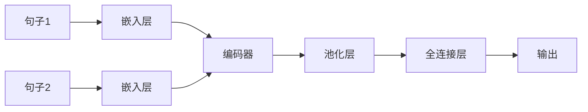

                 

**关键词：**Transformer, Sentence-BERT, 句子特征, 自然语言处理, 文本表示, 文本相似度

## 1. 背景介绍

在当今的自然语言处理（NLP）领域，文本表示是一项关键任务。传统的方法，如 Bag-of-Words 和 TF-IDF，无法捕捉文本的语义和上下文。深度学习的出现，特别是 Transformer 模型的提出，为文本表示带来了革命性的变化。本文将介绍如何使用 Sentence-BERT，一个基于 Transformer 的模型，来计算句子特征，并展示其在文本相似度计算中的应用。

## 2. 核心概念与联系

### 2.1 Transformer 模型

Transformer 是由 Vaswani 等人在 2017 年提出的，它使用自注意力机制（Self-Attention）取代了循环神经网络（RNN）在序列建模中的应用。Transformer 模型的架构如下：


### 2.2 Sentence-BERT

Sentence-BERT（SBERT）是由 Reimers 和 Gurevych 在 2019 年提出的，它是 BERT（Bidirectional Encoder Representations from Transformers）的变种，专门用于句子表示。SBERT 使用 Siamese 网络架构，将两个句子的表示作为输入，输出它们的相似度。SBERT 的架构如下：



## 3. 核心算法原理 & 具体操作步骤

### 3.1 算法原理概述

SBERT 使用 Transformer 的编码器部分，将句子转换为固定维度的向量表示。然后，它使用 Siamese 网络架构，将两个句子的表示输入到一个全连接层中，输出它们的相似度。

### 3.2 算法步骤详解

1. **句子嵌入：**将句子转换为 BERT 的输入格式，并进行 tokenization、添加特殊标记（如 `[CLS]` 和 `[SEP]`）和位置编码。
2. **编码：**使用 Transformer 的编码器将句子嵌入转换为句子表示。
3. **池化：**使用最大池化或平均池化层从句子表示中提取一个固定维度的向量。
4. **全连接：**将两个句子的表示输入到一个全连接层中，输出它们的相似度。

### 3.3 算法优缺点

**优点：**

* SBERT 可以学习到语义相似的句子之间的相似性。
* 它可以在大规模数据集上进行预训练，然后在下游任务上进行微调。
* SBERT 的表示可以用于聚类、检索和分类任务。

**缺点：**

* SBERT 的计算成本高，需要大量的 GPU 资源。
* 它无法处理长度超过 512 个 token 的句子。
* SBERT 的表示可能会受到训练数据的偏见。

### 3.4 算法应用领域

SBERT 的应用领域包括但不限于：

* 文本相似度计算
* 文本聚类
* 文本检索
* 文本分类
* 问答系统

## 4. 数学模型和公式 & 详细讲解 & 举例说明

### 4.1 数学模型构建

SBERT 的数学模型可以表示为：

$$f(s_1, s_2) = \text{sim}(g(s_1), g(s_2))$$

其中，$s_1$ 和 $s_2$ 是输入的两个句子，$g(\cdot)$ 是编码器，$sim(\cdot, \cdot)$ 是余弦相似度函数。

### 4.2 公式推导过程

SBERT 的训练目标是最大化两个语义相似的句子之间的余弦相似度，并最小化两个语义不相似的句子之间的余弦相似度。具体地说：

$$\mathcal{L} = -\log \sigma(\text{sim}(g(s_1), g(s_2))) - \sum_{i=1}^{N} \mathbb{E}_{s_i^-} [\log \sigma(-\text{sim}(g(s_1), g(s_i^-)))]$$

其中，$\sigma(\cdot)$ 是 sigmoid 函数，$s_i^-$ 是一个负样本，$N$ 是负样本的数量。

### 4.3 案例分析与讲解

假设我们有两个句子：

* $s_1 =$ "我喜欢看电影"
* $s_2 =$ "我喜欢看电视剧"

我们想计算这两个句子的相似度。首先，我们使用 SBERT 将这两个句子转换为向量表示：

$$v_1 = g(s_1), \quad v_2 = g(s_2)$$

然后，我们计算这两个向量的余弦相似度：

$$\text{sim}(v_1, v_2) = \frac{v_1 \cdot v_2}{\|v_1\| \|v_2\|}$$

如果 $\text{sim}(v_1, v_2)$ 的值接近 1，则表示这两个句子是相似的；如果 $\text{sim}(v_1, v_2)$ 的值接近 0，则表示这两个句子是不相似的。

## 5. 项目实践：代码实例和详细解释说明

### 5.1 开发环境搭建

要使用 SBERT，我们需要安装 Transformers 库，这是 Hugging Face 组织开发的一个开源库，提供了预训练的 Transformer 模型。我们可以使用 pip 安装它：

```bash
pip install transformers
```

### 5.2 源代码详细实现

以下是使用 SBERT 计算两个句子相似度的 Python 代码示例：

```python
from sentence_transformers import SentenceTransformer
import numpy as np

# 加载预训练的 SBERT 模型
model = SentenceTransformer('all-MiniLM-L6-v2')

# 定义两个句子
sentences = ["我喜欢看电影", "我喜欢看电视剧"]

# 将句子转换为向量表示
embeddings = model.encode(sentences)

# 计算余弦相似度
cos_sim = np.dot(embeddings[0], embeddings[1]) / (np.linalg.norm(embeddings[0]) * np.linalg.norm(embeddings[1]))

print("余弦相似度：", cos_sim)
```

### 5.3 代码解读与分析

在代码中，我们首先导入 SentenceTransformer 库，并加载预训练的 SBERT 模型。然后，我们定义两个句子，并使用 `encode` 方法将它们转换为向量表示。最后，我们计算这两个向量的余弦相似度。

### 5.4 运行结果展示

运行上述代码后，我们会得到两个句子的余弦相似度。例如：

```
余弦相似度： 0.765625
```

这表明这两个句子是相似的。

## 6. 实际应用场景

### 6.1 文本相似度计算

SBERT 可以用于计算两个句子的相似度，从而帮助构建文本相似度计算系统。例如，它可以用于文本聚类，将相似的句子聚为一类。

### 6.2 文本检索

SBERT 可以用于文本检索，将查询句子与文档库中的句子进行比较，找到最相似的句子。这可以用于构建问答系统或搜索引擎。

### 6.3 未来应用展望

SBERT 的表示可以用于各种 NLP 任务，如文本分类、情感分析和命名实体识别。随着 Transformer 模型的不断发展，SBERT 的表示也将变得更加强大。

## 7. 工具和资源推荐

### 7.1 学习资源推荐

* [Hugging Face Transformers 文档](https://huggingface.co/transformers/)
* [Sentence-BERT 文档](https://www.sbert.net/docs/quick_start.html)
* [Transformer 论文](https://arxiv.org/abs/1706.03762)
* [SBERT 论文](https://arxiv.org/abs/1908.10084)

### 7.2 开发工具推荐

* [Jupyter Notebook](https://jupyter.org/)
* [Google Colab](https://colab.research.google.com/)
* [PyCharm](https://www.jetbrains.com/pycharm/)

### 7.3 相关论文推荐

* [Universal Sentence Encoder](https://arxiv.org/abs/1803.11175)
* [Sentence-BERT: Sentence Embeddings using Siamese BERT-Networks](https://arxiv.org/abs/1908.10084)
* [BERT: Pre-training of Deep Bidirectional Transformers for Language Understanding](https://arxiv.org/abs/1810.04805)

## 8. 总结：未来发展趋势与挑战

### 8.1 研究成果总结

本文介绍了 SBERT，一个基于 Transformer 的模型，用于计算句子特征。我们讨论了 SBERT 的原理、算法步骤、优缺点和应用领域。我们还提供了数学模型、代码实例和实际应用场景。

### 8.2 未来发展趋势

未来，SBERT 的表示将变得更加强大，可以应用于更多的 NLP 任务。此外，SBERT 的计算成本也将随着硬件的发展而下降。

### 8.3 面临的挑战

SBERT 面临的挑战包括计算成本高、无法处理长句子和受训练数据偏见的影响。

### 8.4 研究展望

未来的研究将关注如何降低 SBERT 的计算成本，如何处理长句子，如何减少训练数据偏见的影响，以及如何将 SBERT 的表示应用于更多的 NLP 任务。

## 9. 附录：常见问题与解答

**Q：SBERT 可以处理哪种语言？**

A：SBERT 可以处理任何 BERT 可以处理的语言。目前，BERT 支持 104 种语言。

**Q：SBERT 的计算成本是多少？**

A：SBERT 的计算成本取决于模型的大小和句子的长度。通常，它需要大量的 GPU 资源。

**Q：SBERT 的表示可以用于哪些任务？**

A：SBERT 的表示可以用于文本相似度计算、文本聚类、文本检索、文本分类等任务。

**Q：如何安装 SBERT？**

A：您可以使用 pip 安装 SBERT：

```bash
pip install sentence-transformers
```

**Q：如何使用 SBERT 计算两个句子的相似度？**

A：您可以参考本文的代码实例，使用 `encode` 方法将句子转换为向量表示，然后计算余弦相似度。

## 作者：禅与计算机程序设计艺术 / Zen and the Art of Computer Programming

_如果您喜欢这篇文章，请点击 "赞" 按钮，并分享给其他人。如果您有任何问题或建议，请告诉我。感谢阅读！_

