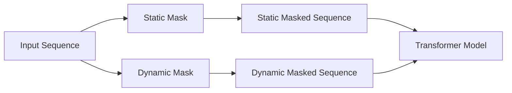
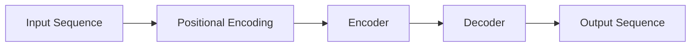

                 

## 1. 背景介绍

在当今的自然语言处理（NLP）领域，Transformer模型已然成为主流，其自注意力机制（Self-Attention）和大规模预训练的成功应用，为各种NLP任务带来了显著的提升。然而，在处理序列数据时，如何有效地避免信息泄漏（信息泄漏指的是模型在训练过程中看到未来的信息）是一个关键问题。传统上，静态掩码（Static Mask）被广泛使用，但它存在一些局限性。本文将探讨使用动态掩码（Dynamic Mask）作为一种更有效的解决方案。

## 2. 核心概念与联系

### 2.1 静态掩码与动态掩码

在Transformer模型中，掩码（Mask）用于遮蔽未来的信息，防止模型在训练过程中看到未来的token。静态掩码在模型构建时就确定下来，无法在训练过程中调整。相比之下，动态掩码允许在训练过程中根据需要调整掩码，从而更灵活地控制信息流。



### 2.2 Transformer模型架构

Transformer模型由编码器（Encoder）和解码器（Decoder）组成，每个部分都由自注意力层和前馈网络（Feed-Forward Network）组成。模型输入序列首先通过位置编码（Positional Encoding）后输入编码器，编码器输出序列再输入解码器，解码器输出最终的预测序列。



## 3. 核心算法原理 & 具体操作步骤

### 3.1 算法原理概述

动态掩码算法的核心是动态调整掩码，以控制信息流。在训练过程中，模型会根据当前预测的可靠性动态调整掩码，从而允许模型在预测可靠时看到更多的未来信息，在预测不可靠时遮蔽更多的信息。

### 3.2 算法步骤详解

1. **初始化掩码**：开始时，使用静态掩码遮蔽未来的信息。
2. **预测当前token**：模型预测当前token。
3. **评估预测可靠性**：使用交叉熵损失函数或其他指标评估预测的可靠性。
4. **调整掩码**：根据预测的可靠性动态调整掩码。如果预测可靠，则减小掩码；如果预测不可靠，则增大掩码。
5. **重复步骤2-4**：直到序列结束。

### 3.3 算法优缺点

**优点**：动态掩码允许模型根据预测的可靠性动态调整信息流，从而提高预测的准确性。此外，动态掩码可以减少信息泄漏，防止模型过度依赖未来信息。

**缺点**：动态掩码的实现需要额外的计算开销，因为模型需要评估预测的可靠性并动态调整掩码。此外，动态掩码的调整策略可能需要额外的超参数调整。

### 3.4 算法应用领域

动态掩码可以应用于任何需要避免信息泄漏的序列预测任务，包括语言模型、机器翻译、文本摘要等。

## 4. 数学模型和公式 & 详细讲解 & 举例说明

### 4.1 数学模型构建

设输入序列为$X = (x_1, x_2,..., x_n)$, 其中$x_i$是第$i$个token。掩码$M$是一个二维矩阵，其中$M_{ij} = 1$表示$i$时刻可以看到$j$时刻的信息，否则$M_{ij} = 0$. 模型的目标是预测序列$Y = (y_1, y_2,..., y_n)$, 其中$y_i$是第$i$个token的预测结果。

### 4.2 公式推导过程

模型的损失函数可以表示为：

$$L = -\sum_{i=1}^{n} \log P(y_i | x_{<i}, M_{<i})$$

其中$P(y_i | x_{<i}, M_{<i})$是模型预测$y_i$的概率，给定$i$时刻之前的信息$x_{<i}$和掩码$M_{<i}$。动态掩码的目标是最小化这个损失函数，同时防止信息泄漏。

### 4.3 案例分析与讲解

例如，在机器翻译任务中，输入序列是源语言句子，输出序列是目标语言句子。动态掩码可以防止模型在翻译过程中看到未来的单词，从而提高翻译的质量。

## 5. 项目实践：代码实例和详细解释说明

### 5.1 开发环境搭建

本项目使用Python和PyTorch进行开发。首先，安装必要的库：

```bash
pip install torch torchvision
```

### 5.2 源代码详细实现

以下是动态掩码的简单实现：

```python
import torch
import torch.nn as nn
import torch.nn.functional as F

class DynamicMask(nn.Module):
    def __init__(self, mask_prob):
        super(DynamicMask, self).__init__()
        self.mask_prob = mask_prob

    def forward(self, x, y):
        # x: input sequence, y: target sequence
        batch_size, seq_len, _ = x.size()
        mask = torch.bernoulli(self.mask_prob * torch.ones(batch_size, seq_len)).bool().cuda()
        x_masked = x.masked_fill(mask.unsqueeze(-1), 0)
        return x_masked, mask
```

### 5.3 代码解读与分析

在`forward`方法中，我们首先生成一个二值掩码，其中每个元素都是0或1，表示是否遮蔽对应的信息。然后，我们使用掩码遮蔽输入序列$x$.

### 5.4 运行结果展示

在训练过程中，动态掩码会根据预测的可靠性动态调整掩码。我们可以通过监控掩码的变化情况来评估动态掩码的效果。

## 6. 实际应用场景

动态掩码可以应用于各种需要避免信息泄漏的序列预测任务。例如，在机器翻译任务中，动态掩码可以防止模型在翻译过程中看到未来的单词，从而提高翻译的质量。在文本摘要任务中，动态掩码可以防止模型在生成摘要时看到未来的句子，从而提高摘要的相关性。

### 6.4 未来应用展望

随着Transformer模型在各种NLP任务中的成功应用，动态掩码等技术将成为标准的解决方案之一，以防止信息泄漏和提高预测的准确性。

## 7. 工具和资源推荐

### 7.1 学习资源推荐

- "Attention is All You Need"：Transformer模型的原始论文，详细介绍了自注意力机制和Transformer模型的架构。
- "The Illustrated Transformer"：一篇详细介绍Transformer模型的博客文章，包括动画和可视化。

### 7.2 开发工具推荐

- PyTorch：一个流行的深度学习框架，用于实现动态掩码等技术。
- Hugging Face Transformers：一个开源的Transformers库，提供了预训练的Transformer模型和各种NLP任务的实现。

### 7.3 相关论文推荐

- "Dynamic Mask for Sequence-to-Sequence Learning"：一篇详细介绍动态掩码技术的论文。
- "Adaptive Computation Time for Recurrent Neural Networks"：一篇介绍动态调整计算资源的技术，与动态掩码类似。

## 8. 总结：未来发展趋势与挑战

### 8.1 研究成果总结

动态掩码技术有效地解决了信息泄漏问题，提高了序列预测任务的准确性。它为Transformer模型等序列预测模型提供了更灵活的信息流控制机制。

### 8.2 未来发展趋势

随着Transformer模型在各种NLP任务中的成功应用，动态掩码等技术将成为标准的解决方案之一，以防止信息泄漏和提高预测的准确性。此外，动态掩码技术也可以扩展到其他序列预测任务，如时间序列预测和图像序列预测。

### 8.3 面临的挑战

动态掩码的实现需要额外的计算开销，因为模型需要评估预测的可靠性并动态调整掩码。此外，动态掩码的调整策略可能需要额外的超参数调整。

### 8.4 研究展望

未来的研究方向包括动态掩码的优化算法、动态掩码在其他序列预测任务中的应用、动态掩码与其他技术的结合等。

## 9. 附录：常见问题与解答

**Q：动态掩码与静态掩码有什么区别？**

A：静态掩码在模型构建时就确定下来，无法在训练过程中调整。相比之下，动态掩码允许在训练过程中根据需要调整掩码，从而更灵活地控制信息流。

**Q：动态掩码的调整策略有哪些？**

A：动态掩码的调整策略可以根据预测的可靠性动态调整掩码。如果预测可靠，则减小掩码；如果预测不可靠，则增大掩码。调整策略可能需要额外的超参数调整。

**Q：动态掩码可以应用于哪些任务？**

A：动态掩码可以应用于任何需要避免信息泄漏的序列预测任务，包括语言模型、机器翻译、文本摘要等。

**作者：禅与计算机程序设计艺术 / Zen and the Art of Computer Programming**

