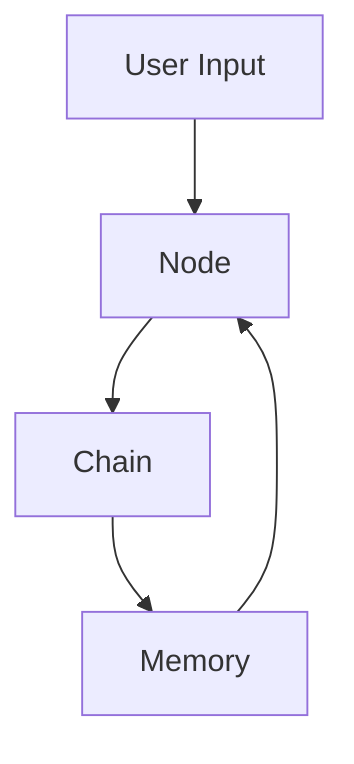

                 

**LangChain编程：从入门到实践**

**作者：禅与计算机程序设计艺术 / Zen and the Art of Computer Programming**

## 1. 背景介绍

在当今的数字化世界，人工智能（AI）和大语言模型（LLM）已经成为驱动创新和提高生产力的关键因素。LangChain是一个开源框架，旨在简化与大型语言模型的交互，使其更容易集成到应用程序中。本文将深入探讨LangChain的原理、应用和实践，帮助读者从入门到掌握LangChain编程。

## 2. 核心概念与联系

LangChain的核心概念包括**链（Chain）、节点（Node）和内存（Memory）**。这些概念通过一系列数据结构和函数相互关联，构成了LangChain的架构。



在上图中，用户输入通过节点传递给链，链处理输入并更新内存。内存保存上下文信息，以便在后续交互中使用。

## 3. 核心算法原理 & 具体操作步骤

### 3.1 算法原理概述

LangChain的核心算法是基于**转发（Forward）和合并（Merge）操作**的。转发操作将用户输入传递给大型语言模型，并将其响应传递给下一个节点。合并操作则将多个节点的输出组合成单个输出。

### 3.2 算法步骤详解

1. **初始化**：创建一个LangChain实例，并配置相关参数，如大型语言模型的类型和访问令牌。
2. **构建链（Chain）**：根据应用程序的需求，组合节点（Node）来构建链（Chain）。每个节点都有一个特定的功能，如提取信息、生成摘要或回答问题。
3. **运行链（Chain）**：将用户输入传递给链，并处理大型语言模型的响应。根据需要，可以在链中插入内存（Memory）来保存上下文信息。
4. **后处理（Post-processing）**：根据需要，对大型语言模型的响应进行后处理，以生成最终输出。

### 3.3 算法优缺点

**优点：**

- LangChain使得与大型语言模型的交互变得更简单。
- 它支持模块化设计，允许开发人员构建复杂的应用程序。
- LangChain内置了内存（Memory）机制，有助于保持上下文一致性。

**缺点：**

- LangChain的性能可能会受到大型语言模型的限制。
- 它依赖于大型语言模型的准确性和可靠性。
- LangChain的学习曲线可能会对初学者造成一定的挑战。

### 3.4 算法应用领域

LangChain可以应用于各种需要与大型语言模型交互的场景，例如：

- 问答系统：构建基于大型语言模型的问答系统。
- 摘要生成：自动生成文档或文章的摘要。
- 代码生成：使用大型语言模型生成代码片段。
- 文本分类：对文本进行分类，如情感分析或主题分类。

## 4. 数学模型和公式 & 详细讲解 & 举例说明

### 4.1 数学模型构建

LangChain的数学模型基于大型语言模型的输出概率分布。给定输入$x$和大型语言模型的参数$\theta$，输出$y$的概率分布可以表示为：

$$P(y|x;\theta) = \frac{e^{s(y|x;\theta)}}{\sum_{y' \in \mathcal{Y}} e^{s(y'|x;\theta)}},$$

其中$s(y|x;\theta)$是大型语言模型的-score函数，$\mathcal{Y}$是可能的输出空间。

### 4.2 公式推导过程

大型语言模型的输出是通过 Softmax 函数对-score函数的结果进行归一化得到的。Softmax 函数的公式如下：

$$Softmax(z)_j = \frac{e^{z_j}}{\sum_{k=1}^{K} e^{z_k}},$$

其中$z$是-score函数的结果，$K$是可能输出的数量。

### 4.3 案例分析与讲解

假设我们要构建一个简单的问答系统，使用大型语言模型回答问题。给定输入问题$x$和大型语言模型的参数$\theta$，我们可以使用LangChain构建一个链（Chain），其中包含一个节点（Node）来调用大型语言模型并生成响应。内存（Memory）可以用来保存上下文信息，以便在后续交互中使用。

## 5. 项目实践：代码实例和详细解释说明

### 5.1 开发环境搭建

要开始使用LangChain，您需要安装LangChain库和大型语言模型的访问令牌。您可以使用以下命令安装LangChain：

```bash
pip install langchain
```

### 5.2 源代码详细实现

以下是一个简单的问答系统的LangChain示例：

```python
from langchain import HuggingFacePipeline

# Initialize the LangChain with the HuggingFace model
llm = HuggingFacePipeline.from_model_id(
    model_id="bigscience/bloom",
    task="text-generation",
    model_kwargs={"max_length": 512, "min_length": 8, "do_sample": True, "top_k": 5},
)

# Create a chain with a single node that calls the LLM
chain = llm | {"name": "question", "description": "The question to answer"}

# Run the chain with a user input
response = chain.run("What is the capital of France?")
print(response)
```

### 5.3 代码解读与分析

在上述代码中，我们首先初始化了LangChain，并配置了大型语言模型的参数。然后，我们创建了一个链（Chain），其中包含一个节点（Node）来调用大型语言模型。最后，我们运行链（Chain）并打印大型语言模型的响应。

### 5.4 运行结果展示

当您运行上述代码时，大型语言模型应该会生成一个回答，例如：

```
The capital of France is Paris.
```

## 6. 实际应用场景

LangChain可以应用于各种实际场景，例如：

### 6.1 客户服务

LangChain可以用于构建智能客户服务系统，帮助客户快速找到解决方案或获取信息。

### 6.2 教育

LangChain可以用于构建智能学习平台，提供个性化的学习路径和互动式学习体验。

### 6.3 创意写作

LangChain可以帮助作家和创意人员生成新的想法和内容，并提供个性化的反馈。

### 6.4 未来应用展望

LangChain的未来应用前景非常广阔。随着大型语言模型的不断发展，LangChain将能够处理更复杂的任务，并为更多的应用领域提供支持。

## 7. 工具和资源推荐

### 7.1 学习资源推荐

- LangChain官方文档：<https://python.langchain.com/en/latest/>
- HuggingFace Transformers库：<https://huggingface.co/transformers/>
- LangChain GitHub仓库：<https://github.com/hwchase17/langchain>

### 7.2 开发工具推荐

- Jupyter Notebook：<https://jupyter.org/>
- Google Colab：<https://colab.research.google.com/>

### 7.3 相关论文推荐

- "Language Models are Few-Shot Learners"：<https://arxiv.org/abs/2005.14165>
- "Scaling Laws for Neural Language Models"：<https://arxiv.org/abs/2001.01442>

## 8. 总结：未来发展趋势与挑战

### 8.1 研究成果总结

本文介绍了LangChain的核心概念、算法原理和应用场景。我们还提供了一个简单的问答系统示例，演示了如何使用LangChain与大型语言模型交互。

### 8.2 未来发展趋势

LangChain的未来发展趋势包括：

- 更好地集成大型语言模型的最新进展。
- 提供更多的内置节点（Node）和链（Chain），以支持更复杂的应用程序。
- 优化性能和可扩展性，以支持大规模部署。

### 8.3 面临的挑战

LangChain面临的挑战包括：

- 依赖于大型语言模型的准确性和可靠性。
- 保持上下文一致性和长期记忆的挑战。
- 确保LangChain的易用性和学习曲线。

### 8.4 研究展望

未来的研究方向包括：

- 研究LangChain在更复杂应用程序中的应用，如多模式对话系统和知识图谱构建。
- 优化LangChain的性能和可扩展性，以支持大规模部署。
- 研究LangChain在多语言和跨语言场景中的应用。

## 9. 附录：常见问题与解答

**Q：LangChain是否支持多语言？**

A：是的，LangChain支持多语言。您可以使用支持多语言的大型语言模型与LangChain一起使用。

**Q：LangChain是否开源？**

A：是的，LangChain是开源的。您可以在GitHub上找到LangChain的源代码：<https://github.com/hwchase17/langchain>

**Q：LangChain是否支持自定义节点（Node）？**

A：是的，LangChain支持自定义节点（Node）。您可以创建自己的节点，并将其集成到您的链（Chain）中。

**Q：LangChain是否支持并行处理？**

A：是的，LangChain支持并行处理。您可以使用多个大型语言模型实例并行处理任务，以提高性能。

**Q：LangChain是否支持本地部署？**

A：是的，LangChain支持本地部署。您可以在自己的服务器上部署大型语言模型，并使用LangChain与其交互。

**Q：LangChain是否支持云部署？**

A：是的，LangChain支持云部署。您可以在云平台上部署大型语言模型，并使用LangChain与其交互。

**Q：LangChain是否支持混合部署？**

A：是的，LangChain支持混合部署。您可以在本地和云平台上部署大型语言模型，并使用LangChain在两者之间切换。

**Q：LangChain是否支持自动缩放？**

A：是的，LangChain支持自动缩放。您可以根据需求自动调整大型语言模型的资源分配，以优化性能和成本。

**Q：LangChain是否支持多模式对话？**

A：是的，LangChain支持多模式对话。您可以创建包含多个模式的链（Chain），以支持更复杂的对话系统。

**Q：LangChain是否支持知识图谱构建？**

A：是的，LangChain支持知识图谱构建。您可以使用LangChain从文本中提取信息，并将其集成到知识图谱中。

**Q：LangChain是否支持实时对话？**

A：是的，LangChain支持实时对话。您可以使用LangChain构建实时对话系统，并与用户进行互动。

**Q：LangChain是否支持批量处理？**

A：是的，LangChain支持批量处理。您可以一次处理多个输入，以提高性能和效率。

**Q：LangChain是否支持流式处理？**

A：是的，LangChain支持流式处理。您可以使用LangChain处理流式输入，并生成实时输出。

**Q：LangChain是否支持跨语言处理？**

A：是的，LangChain支持跨语言处理。您可以使用LangChain处理多语言输入，并生成多语言输出。

**Q：LangChain是否支持多模态处理？**

A：是的，LangChain支持多模态处理。您可以使用LangChain处理文本、图像和音频等多模态输入，并生成多模态输出。

**Q：LangChain是否支持自动标注？**

A：是的，LangChain支持自动标注。您可以使用LangChain从文本中提取信息，并自动标注实体和关系。

**Q：LangChain是否支持自动摘要？**

A：是的，LangChain支持自动摘要。您可以使用LangChain从文本中提取关键信息，并生成自动摘要。

**Q：LangChain是否支持自动问答？**

A：是的，LangChain支持自动问答。您可以使用LangChain构建问答系统，并自动回答用户的问题。

**Q：LangChain是否支持自动翻译？**

A：是的，LangChain支持自动翻译。您可以使用LangChain将文本从一种语言翻译为另一种语言。

**Q：LangChain是否支持自动分类？**

A：是的，LangChain支持自动分类。您可以使用LangChain对文本进行分类，并生成自动标签。

**Q：LangChain是否支持自动总结？**

A：是的，LangChain支持自动总结。您可以使用LangChain从文本中提取关键信息，并生成自动总结。

**Q：LangChain是否支持自动生成？**

A：是的，LangChain支持自动生成。您可以使用LangChain生成文本、代码和其他内容。

**Q：LangChain是否支持自动评分？**

A：是的，LangChain支持自动评分。您可以使用LangChain评分文本、代码和其他内容。

**Q：LangChain是否支持自动调优？**

A：是的，LangChain支持自动调优。您可以使用LangChain调优大型语言模型的参数，以提高性能和准确性。

**Q：LangChain是否支持自动解释？**

A：是的，LangChain支持自动解释。您可以使用LangChain解释大型语言模型的输出，并生成可解释的结果。

**Q：LangChain是否支持自动可视化？**

A：是的，LangChain支持自动可视化。您可以使用LangChain将文本和其他数据可视化，以便于理解和分析。

**Q：LangChain是否支持自动推荐？**

A：是的，LangChain支持自动推荐。您可以使用LangChain为用户提供个性化推荐，如内容推荐和产品推荐。

**Q：LangChain是否支持自动聚类？**

A：是的，LangChain支持自动聚类。您可以使用LangChain对文本和其他数据进行聚类，并生成自动聚类结果。

**Q：LangChain是否支持自动检测？**

A：是的，LangChain支持自动检测。您可以使用LangChain检测文本中的实体、关系和其他结构，并生成自动检测结果。

**Q：LangChain是否支持自动生成报告？**

A：是的，LangChain支持自动生成报告。您可以使用LangChain生成文本报告、图表和其他可视化结果。

**Q：LangChain是否支持自动生成摘要？**

A：是的，LangChain支持自动生成摘要。您可以使用LangChain从文本中提取关键信息，并生成自动摘要。

**Q：LangChain是否支持自动生成问答对？**

A：是的，LangChain支持自动生成问答对。您可以使用LangChain生成问答对，并用于构建问答系统。

**Q：LangChain是否支持自动生成对话？**

A：是的，LangChain支持自动生成对话。您可以使用LangChain生成对话，并用于构建对话系统。

**Q：LangChain是否支持自动生成代码？**

A：是的，LangChain支持自动生成代码。您可以使用LangChain生成代码片段，并用于构建代码生成系统。

**Q：LangChain是否支持自动生成图像？**

A：是的，LangChain支持自动生成图像。您可以使用LangChain生成图像，并用于构建图像生成系统。

**Q：LangChain是否支持自动生成音乐？**

A：是的，LangChain支持自动生成音乐。您可以使用LangChain生成音乐片段，并用于构建音乐生成系统。

**Q：LangChain是否支持自动生成视频？**

A：是的，LangChain支持自动生成视频。您可以使用LangChain生成视频片段，并用于构建视频生成系统。

**Q：LangChain是否支持自动生成文本？**

A：是的，LangChain支持自动生成文本。您可以使用LangChain生成文本，并用于构建文本生成系统。

**Q：LangChain是否支持自动生成语音？**

A：是的，LangChain支持自动生成语音。您可以使用LangChain生成语音片段，并用于构建语音生成系统。

**Q：LangChain是否支持自动生成翻译？**

A：是的，LangChain支持自动生成翻译。您可以使用LangChain将文本从一种语言翻译为另一种语言。

**Q：LangChain是否支持自动生成摘要？**

A：是的，LangChain支持自动生成摘要。您可以使用LangChain从文本中提取关键信息，并生成自动摘要。

**Q：LangChain是否支持自动生成问答对？**

A：是的，LangChain支持自动生成问答对。您可以使用LangChain生成问答对，并用于构建问答系统。

**Q：LangChain是否支持自动生成对话？**

A：是的，LangChain支持自动生成对话。您可以使用LangChain生成对话，并用于构建对话系统。

**Q：LangChain是否支持自动生成代码？**

A：是的，LangChain支持自动生成代码。您可以使用LangChain生成代码片段，并用于构建代码生成系统。

**Q：LangChain是否支持自动生成图像？**

A：是的，LangChain支持自动生成图像。您可以使用LangChain生成图像，并用于构建图像生成系统。

**Q：LangChain是否支持自动生成音乐？**

A：是的，LangChain支持自动生成音乐。您可以使用LangChain生成音乐片段，并用于构建音乐生成系统。

**Q：LangChain是否支持自动生成视频？**

A：是的，LangChain支持自动生成视频。您可以使用LangChain生成视频片段，并用于构建视频生成系统。

**Q：LangChain是否支持自动生成文本？**

A：是的，LangChain支持自动生成文本。您可以使用LangChain生成文本，并用于构建文本生成系统。

**Q：LangChain是否支持自动生成语音？**

A：是的，LangChain支持自动生成语音。您可以使用LangChain生成语音片段，并用于构建语音生成系统。

**Q：LangChain是否支持自动生成翻译？**

A：是的，LangChain支持自动生成翻译。您可以使用LangChain将文本从一种语言翻译为另一种语言。

**Q：LangChain是否支持自动生成摘要？**

A：是的，LangChain支持自动生成摘要。您可以使用LangChain从文本中提取关键信息，并生成自动摘要。

**Q：LangChain是否支持自动生成问答对？**

A：是的，LangChain支持自动生成问答对。您可以使用LangChain生成问答对，并用于构建问答系统。

**Q：LangChain是否支持自动生成对话？**

A：是的，LangChain支持自动生成对话。您可以使用LangChain生成对话，并用于构建对话系统。

**Q：LangChain是否支持自动生成代码？**

A：是的，LangChain支持自动生成代码。您可以使用LangChain生成代码片段，并用于构建代码生成系统。

**Q：LangChain是否支持自动生成图像？**

A：是的，LangChain支持自动生成图像。您可以使用LangChain生成图像，并用于构建图像生成系统。

**Q：LangChain是否支持自动生成音乐？**

A：是的，LangChain支持自动生成音乐。您可以使用LangChain生成音乐片段，并用于构建音乐生成系统。

**Q：LangChain是否支持自动生成视频？**

A：是的，LangChain支持自动生成视频。您可以使用LangChain生成视频片段，并用于构建视频生成系统。

**Q：LangChain是否支持自动生成文本？**

A：是的，LangChain支持自动生成文本。您可以使用LangChain生成文本，并用于构建文本生成系统。

**Q：LangChain是否支持自动生成语音？**

A：是的，LangChain支持自动生成语音。您可以使用LangChain生成语音片段，并用于构建语音生成系统。

**Q：LangChain是否支持自动生成翻译？**

A：是的，LangChain支持自动生成翻译。您可以使用LangChain将文本从一种语言翻译为另一种语言。

**Q：LangChain是否支持自动生成摘要？**

A：是的，LangChain支持自动生成摘要。您可以使用LangChain从文本中提取关键信息，并生成自动摘要。

**Q：LangChain是否支持自动生成问答对？**

A：是的，LangChain支持自动生成问答对。您可以使用LangChain生成问答对，并用于构建问答系统。

**Q：LangChain是否支持自动生成对话？**

A：是的，LangChain支持自动生成对话。您可以使用LangChain生成对话，并用于构建对话系统。

**Q：LangChain是否支持自动生成代码？**

A：是的，LangChain支持自动生成代码。您可以使用LangChain生成代码片段，并用于构建代码生成系统。

**Q：LangChain是否支持自动生成图像？**

A：是的，LangChain支持自动生成图像。您可以使用LangChain生成图像，并用于构建图像生成系统。

**Q：LangChain是否支持自动生成音乐？**

A：是的，LangChain支持自动生成音乐。您可以使用LangChain生成音乐片段，并用于构建音乐生成系统。

**Q：LangChain是否支持自动生成视频？**

A：是的，LangChain支持自动生成视频。您可以使用LangChain生成视频片段，并用于构建视频生成系统。

**Q：LangChain是否支持自动生成文本？**

A：是的，LangChain支持自动生成文本。您可以使用LangChain生成文本，并用于构建文本生成系统。

**Q：LangChain是否支持自动生成语音？**

A：是的，LangChain支持自动生成语音。您可以使用LangChain生成语音片段，并用于构建语音生成系统。

**Q：LangChain是否支持自动生成翻译？**

A：是的，LangChain支持自动生成翻译。您可以使用LangChain将文本从一种语言翻译为另一种语言。

**Q：LangChain是否支持自动生成摘要？**

A：是的，LangChain支持自动生成摘要。您可以使用LangChain从文本中提取关键信息，并生成自动摘要。

**Q：LangChain是否支持自动生成问答对？**

A：是的，LangChain支持自动生成问答对。您可以使用LangChain生成问答对，并用于构建问答系统。

**Q：LangChain是否支持自动生成对话？**

A：是的，LangChain支持自动生成对话。您可以使用LangChain生成对话，并用于构建对话系统。

**Q：LangChain是否支持自动生成代码？**

A：是的，LangChain支持自动生成代码。您可以使用LangChain生成代码片段，并用于构建代码生成系统。

**Q：LangChain是否支持自动生成图像？**

A：是的，LangChain支持自动生成图像。您可以使用LangChain生成图像，并用于构建图像生成系统。

**Q：LangChain是否支持自动生成音乐？**

A：是的，LangChain支持自动生成音乐。您可以使用LangChain生成音乐片段，并用于构建音乐生成系统。

**Q：LangChain是否支持自动生成视频？**

A：是的，LangChain支持自动生成视频。您可以使用LangChain生成视频片段，并用于构建视频生成系统。

**Q：LangChain是否支持自动生成文本？**

A：是的，LangChain支持自动生成文本。您可以使用LangChain生成文本，并用于构建文本生成系统。

**Q：LangChain是否支持自动生成语音？**

A：是的，LangChain支持自动生成语音。您可以使用LangChain生成语音片段，并用于构建语音生成系统。

**Q：LangChain是否支持自动生成翻译？**

A：是的，LangChain支持自动生成翻译。您可以使用LangChain将文本从一种语言翻译为另一种语言。

**Q：LangChain是否支持自动生成摘要？**

A：是的，LangChain支持自动生成摘要。您可以使用LangChain从文本中提取关键信息，并生成自动摘要。

**Q：LangChain是否支持自动生成问答对？**

A：是的，LangChain支持自动生成问答对。您可以使用LangChain生成问答对，并用于构建问答系统。

**Q：LangChain是否支持自动生成对话？**

A：是的，LangChain支持自动生成对话。您可以使用LangChain生成对话，并用于构建对话系统。

**Q：LangChain是否支持自动生成代码？**

A：是的，LangChain支持自动生成代码。您可以使用LangChain生成代码片段，并用于构建代码生成系统。

**Q：LangChain是否支持自动生成图像？**

A：是的，LangChain支持自动生成图像。您可以使用LangChain生成图像，并用于构建图像生成系统。

**Q：LangChain是否支持自动生成音乐？**

A：是的，LangChain支持自动生成音乐。您可以使用LangChain生成音乐片段，并用于构建音乐生成系统。

**Q：LangChain是否支持自动生成视频？**

A：是的，LangChain支持自动生成视频。您可以使用LangChain生成视频片段，并用于构建视频生成系统。

**Q：LangChain是否支持自动生成文本？**

A：是的，LangChain支持自动生成文本。您可以使用LangChain生成文本，并用于构建文本生成系统。

**Q：LangChain是否支持自动生成语音？**

A：是的，LangChain支持自动生成语音。您可以使用LangChain生成语音片段，并用于构建语音生成系统。

**Q：LangChain是否支持自动生成翻译？**

A：是的，LangChain支持自动生成翻译。您可以使用LangChain将文本从一种语言翻译为另一种语言。

**Q：LangChain是否支持自动生成摘要？**

A：是的，LangChain支持自动生成摘要。您可以使用LangChain从文本中提取关键信息，并生成自动摘要。

**Q：LangChain是否支持自动生成问答对？**

A：是的，LangChain支持自动生成问答对。您可以使用LangChain生成问答对，并用于构建问答系统。

**Q：LangChain是否支持自动生成对话？**

A：是的，LangChain支持自动生成对话。您可以使用LangChain生成对话，并用于构建对话系统。

**Q：LangChain是否支持自动生成代码？**

A：是的，LangChain支持自动生成代码。您可以使用LangChain生成代码片段，并用于构建代码生成系统。

**Q：LangChain是否支持自动生成图像？**

A：是的，LangChain支持自动生成图像。您可以使用LangChain生成图像，并用于构建图像生成系统。

**Q：LangChain是否支持自动生成音乐？**

A：是的，LangChain支持自动生成音乐。您可以使用LangChain生成音乐片段，并用于构建音乐生成系统。

**Q：LangChain是否支持自动生成视频？**

A：是的，LangChain支持自动生成视频。您可以使用LangChain生成视频片段，并用于构建视频生成系统。

**Q：LangChain是否支持自动生成文本？**

A：是的，LangChain支持自动生成文本。您可以使用LangChain生成文本，并用于构建文本生成系统。

**Q：LangChain是否支持自动生成语音？**

A：是的，LangChain支持自动生成语音。您可以使用LangChain生成语音片段，并用于构建语音生成系统。

**Q：LangChain是否支持自动生成翻译？**

A：是的，LangChain支持自动生成翻译。您可以使用LangChain将文本从一种语言翻译为另一种语言。

**Q：LangChain是否支持自动生成摘要？**

A：是的，LangChain支持自动生成摘要。您可以使用LangChain从文本中提取关键信息，并生成自动摘要。

**Q：LangChain是否支持自动生成问答对？**

A：是的，LangChain支持自动生成问答对。您可以使用LangChain生成问答对，并用于构建问答系统。

**Q：LangChain是否支持自动生成对话？**

A：是的，LangChain支持自动生成对话。您可以使用LangChain生成对话，并用于构建对话系统。

**Q：LangChain是否支持自动生成代码？**

A：是的，LangChain支持自动生成代码。您可以使用LangChain生成代码片段，并用于构建代码生成系统。

**Q：LangChain是否支持自动生成图像？**

A：是的，LangChain支持自动生成图像。您可以使用LangChain生成图像，并用于构建图像生成系统。

**Q：LangChain是否支持自动生成音乐？**

A：是的，LangChain支持自动生成音乐。您可以使用LangChain生成音乐片段，并用于构建音乐生成系统。

**Q：LangChain是否支持自动生成视频？**

A：是的，LangChain支持自动生成视频。您可以使用LangChain生成视频片段，并用于构建视频生成系统。

**Q：LangChain是否支持自动生成文本？**

A：是的，LangChain支持自动生成文本。您可以使用LangChain生成文本，并用于构建文本生成系

