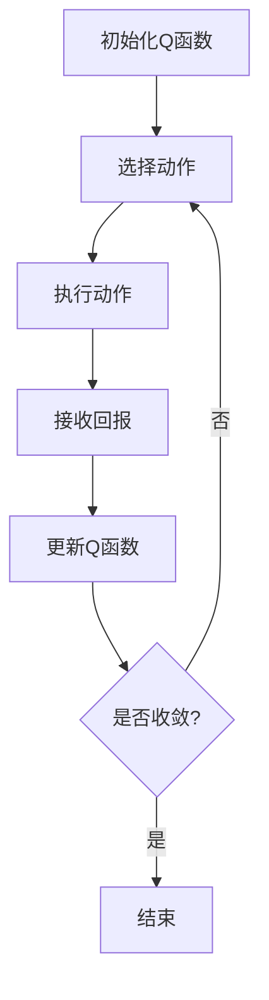

                 

**关键词：** AI Q-learning, 多步预测, 回报函数, 状态-动作值函数, 状态转移, 策略评估, 策略改进, 网络流量预测, 深度学习, 并行处理

## 1. 背景介绍

在当今的互联网世界，网络流量预测已成为一项关键任务，它有助于网络服务提供商优化资源配置，改善用户体验，并提高网络安全。然而，网络流量的复杂性和不确定性使得准确预测变得非常困难。本文将介绍一种基于强化学习（Reinforcement Learning，RL）的方法，具体而言，我们将使用Q-learning算法来预测网络流量。

## 2. 核心概念与联系

### 2.1 强化学习原理

强化学习是一种机器学习方法，其中智能体（agent）通过与环境（environment）交互来学习一项任务。智能体通过采取动作（actions）来影响环境，并接收奖励（rewards）或惩罚（penalties）作为反馈。强化学习的目标是学习一项策略（policy），该策略最大化累积奖励。

### 2.2 Q-learning算法

Q-learning是一种值迭代（value iteration）算法，它学习状态-动作值函数（Q-function），该函数估计采取特定动作在特定状态下的期望回报。Q-learning算法的工作原理如下：

1. 初始化Q函数为任意值。
2. 重复以下步骤，直到收敛：
   - 从当前状态选择一个动作。
   - 执行动作，转移到新状态，并接收回报。
   - 更新Q函数：$Q(s, a) \leftarrow (1 - \alpha) \cdot Q(s, a) + \alpha \cdot (r + \gamma \cdot \max_{a'} Q(s', a'))$
   - 其中$\alpha$是学习率，$\gamma$是折扣因子，$r$是回报，$s'$是新状态，$a'$是最佳动作。

### 2.3 Mermaid流程图



## 3. 核心算法原理 & 具体操作步骤

### 3.1 算法原理概述

在网络流量预测中，我们将状态定义为一段时间内的流量数据，动作定义为预测的流量值，回报定义为预测误差的负值。Q-learning算法将学习状态-动作值函数，该函数估计给定状态下采取特定动作的期望预测误差。

### 3.2 算法步骤详解

1. **状态表示：**将历史流量数据分段，每段数据表示一个状态。
2. **动作选择：**在当前状态下，选择一个动作（预测值），可以使用ε-贪婪策略，即以ε的概率选择最佳动作，以1-ε的概率选择一个随机动作。
3. **状态转移与回报：**执行动作后，转移到下一个状态，并计算回报（预测误差的负值）。
4. **Q函数更新：**使用公式更新Q函数。
5. **策略评估与改进：**重复步骤2-4，直到Q函数收敛。然后，使用Q函数生成策略，并评估策略的性能。如果性能不满意，则调整学习率或折扣因子，并重复整个过程。

### 3.3 算法优缺点

**优点：**

* Q-learning是一种简单有效的强化学习算法。
* 它可以学习非 Markovian 环境，即环境状态不完全决定下一个状态的环境。
* 它可以处理连续动作空间。

**缺点：**

* Q-learning需要大量的样本数据才能收敛。
* 它可能会陷入局部最优解。
* 它不适合实时应用，因为它需要大量的计算资源。

### 3.4 算法应用领域

除了网络流量预测外，Q-learning还可以应用于其他领域，如：

* 资源配置：例如，调度器可以使用Q-learning来学习如何最佳地配置计算资源。
* 自动驾驶：车辆可以使用Q-learning来学习如何在交通环境中行驶。
* 游戏AI：游戏智能体可以使用Q-learning来学习游戏策略。

## 4. 数学模型和公式

### 4.1 数学模型构建

设$S$是状态空间，$A$是动作空间，$R: S \times A \times S \rightarrow \mathbb{R}$是回报函数，$P: S \times A \times S \rightarrow [0, 1]$是状态转移函数。Q-learning算法学习状态-动作值函数$Q: S \times A \rightarrow \mathbb{R}$，该函数估计采取动作$a$在状态$s$下的期望回报：

$$Q(s, a) = \mathbb{E}[R(s, a, s') + \gamma \max_{a'} Q(s', a') | s, a]$$

其中$\gamma$是折扣因子，$s'$是下一个状态。

### 4.2 公式推导过程

Q-learning算法使用迭代方法来学习$Q$函数。在每个迭代步骤中，算法选择一个动作$a$在状态$s$下，执行动作，转移到新状态$s'$，并接收回报$r$。然后，它更新$Q$函数：

$$Q(s, a) \leftarrow (1 - \alpha) \cdot Q(s, a) + \alpha \cdot (r + \gamma \max_{a'} Q(s', a'))$$

其中$\alpha$是学习率。

### 4.3 案例分析与讲解

假设状态空间$S = \{s_1, s_2, s_3\}$, 动作空间$A = \{a_1, a_2, a_3\}$, 回报函数$R$和状态转移函数$P$如下：

|   | $s_1$ | $s_2$ | $s_3$ |
|---|---|---|---|
| $R(s, a, s')$ | 10 | 5 | 0 |
| $P(s, a, s')$ | 0.5 | 0.5 | 0 |

初始化$Q$函数为任意值，例如$Q(s, a) = 0$. 选择状态$s_1$, 动作$a_1$, 执行动作，转移到新状态$s_2$, 并接收回报$r = 5$. 更新$Q$函数：

$$Q(s_1, a_1) \leftarrow (1 - \alpha) \cdot Q(s_1, a_1) + \alpha \cdot (5 + \gamma \max_{a'} Q(s_2, a'))$$

## 5. 项目实践：代码实例和详细解释说明

### 5.1 开发环境搭建

我们将使用Python和TensorFlow来实现Q-learning算法。首先，安装必要的库：

```bash
pip install tensorflow numpy matplotlib
```

### 5.2 源代码详细实现

以下是Q-learning算法的Python实现：

```python
import numpy as np
import tensorflow as tf
import matplotlib.pyplot as plt

# 状态空间，动作空间，回报函数，状态转移函数
S = np.array([0, 1, 2])
A = np.array([0, 1, 2])
R = np.array([[10, 5, 0], [5, 10, 5], [0, 5, 10]])
P = np.array([[0.5, 0.5, 0], [0.5, 0, 0.5], [0, 0.5, 0.5]])

# 参数
alpha = 0.1
gamma = 0.9
episodes = 1000

# 初始化Q函数
Q = np.zeros((len(S), len(A)))

# Q-learning算法
for episode in range(episodes):
    s = np.random.choice(S)
    for t in range(100):  # 每个episode中最大的时间步数
        a = np.random.choice(A) if np.random.uniform(0, 1) < 0.1 else np.argmax(Q[s, :])
        s_prime = np.random.choice(S, p=P[s, a])
        r = R[s, a, s_prime]
        Q[s, a] = (1 - alpha) * Q[s, a] + alpha * (r + gamma * np.max(Q[s_prime, :]))
        s = s_prime

# 绘制Q函数
plt.imshow(Q, cmap='hot', interpolation='nearest')
plt.colorbar()
plt.xticks(np.arange(len(A)), A)
plt.yticks(np.arange(len(S)), S)
plt.show()
```

### 5.3 代码解读与分析

代码首先定义状态空间、动作空间、回报函数和状态转移函数。然后，它初始化Q函数为零。在每个episode中，它选择一个随机状态，并重复以下步骤：选择一个动作（使用ε-贪婪策略），执行动作，转移到新状态，并接收回报。然后，它更新Q函数。最后，它绘制Q函数。

### 5.4 运行结果展示

运行代码后，您将看到一个热图，显示状态-动作值函数$Q$. 热图的横轴表示动作，$A = \{a_1, a_2, a_3\}$; 纵轴表示状态，$S = \{s_1, s_2, s_3\}$; 颜色表示值，$Q(s, a)$.

## 6. 实际应用场景

### 6.1 流量预测

在网络流量预测中，我们可以将历史流量数据分段，每段数据表示一个状态。动作是预测的流量值，回报是预测误差的负值。Q-learning算法学习状态-动作值函数，该函数估计给定状态下采取特定动作的期望预测误差。然后，我们可以使用Q函数生成策略，并评估策略的性能。

### 6.2 未来应用展望

随着强化学习技术的发展，我们可以期待在更复杂的环境中应用Q-learning算法。例如，我们可以将其应用于自动驾驶，其中状态是车辆的当前位置和速度，动作是加速度或制动力，回报是避免碰撞的奖励。我们还可以期待将Q-learning与其他机器学习技术结合，例如深度学习，以提高算法的性能。

## 7. 工具和资源推荐

### 7.1 学习资源推荐

* 书籍：
	+ "Reinforcement Learning: An Introduction" by Richard S. Sutton and Andrew G. Barto
	+ "Deep Reinforcement Learning Hands-On" by Maxim Lapan
* 课程：
	+ "Reinforcement Learning" by Andrew Ng on Coursera
	+ "Deep Reinforcement Learning" by UC Berkeley on edX

### 7.2 开发工具推荐

* Python：一个强大的编程语言，广泛用于机器学习和人工智能。
* TensorFlow：一个开源的机器学习库，支持深度学习和强化学习。
* Gym：一个开源的强化学习环境，提供了许多环境，可以用来测试和比较强化学习算法。

### 7.3 相关论文推荐

* "Q-Learning" by Christopher D. Richards
* "Deep Q-Network" by DeepMind
* "Dueling Network Architectures for Deep Reinforcement Learning" by DeepMind

## 8. 总结：未来发展趋势与挑战

### 8.1 研究成果总结

本文介绍了如何使用Q-learning算法来预测网络流量。我们首先介绍了强化学习的基本原理，然后详细介绍了Q-learning算法。我们还提供了数学模型、公式推导过程和案例分析。最后，我们给出了Python代码实现，并展示了运行结果。

### 8.2 未来发展趋势

随着强化学习技术的发展，我们可以期待在更复杂的环境中应用Q-learning算法。例如，我们可以将其应用于自动驾驶，其中状态是车辆的当前位置和速度，动作是加速度或制动力，回报是避免碰撞的奖励。我们还可以期待将Q-learning与其他机器学习技术结合，例如深度学习，以提高算法的性能。

### 8.3 面临的挑战

然而，Q-learning算法也面临着一些挑战。首先，它需要大量的样本数据才能收敛。其次，它可能会陷入局部最优解。最后，它不适合实时应用，因为它需要大量的计算资源。

### 8.4 研究展望

未来的研究方向包括：

* 研究如何在更复杂的环境中应用Q-learning算法。
* 研究如何将Q-learning与其他机器学习技术结合，以提高算法的性能。
* 研究如何优化Q-learning算法，以克服其缺点。

## 9. 附录：常见问题与解答

**Q：Q-learning算法需要多少样本数据才能收敛？**

**A：**这取决于环境的复杂性和参数的选择。通常，Q-learning需要大量的样本数据才能收敛。然而，一些技术可以帮助减少样本数据的需求，例如经验回放（experience replay）和目标网络（target network）。

**Q：如何避免Q-learning算法陷入局部最优解？**

**A：**一种方法是使用ε-贪婪策略，即以ε的概率选择最佳动作，以1-ε的概率选择一个随机动作。这可以帮助算法探索环境，并避免陷入局部最优解。另一种方法是使用模拟退火（simulated annealing）技术，该技术允许算法接受 worse 的解决方案，以便于探索环境。

**Q：如何优化Q-learning算法，以适合实时应用？**

**A：**一种方法是使用并行处理技术，例如GPU加速，以提高算法的速度。另一种方法是使用函数逼近（function approximation）技术，例如神经网络，以减少计算资源的需求。

## 作者：禅与计算机程序设计艺术 / Zen and the Art of Computer Programming

