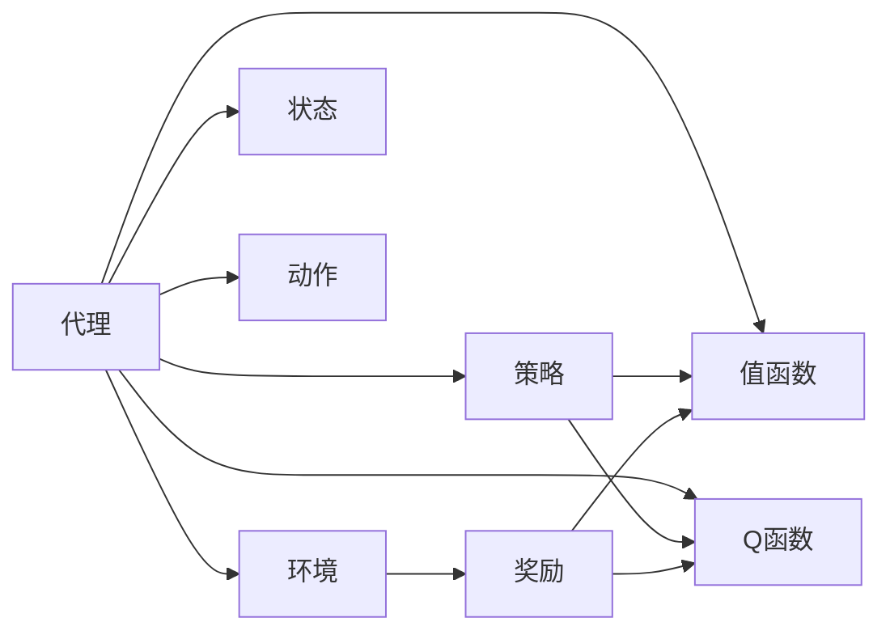

                 

**强化学习**, **金融市场预测**, **映射**, **挑战**, **机遇**, **算法**, **数学模型**, **项目实践**, **实际应用场景**, **工具和资源推荐**, **总结**, **未来发展趋势**

## 1. 背景介绍

在当今快速变化的金融市场中，预测市场走势是一项至关重要的任务。然而，金融市场的复杂性和不确定性使得准确预测变得异常困难。强化学习（Reinforcement Learning, RL）是一种机器学习方法，它通过与环境的交互学习最优行为，从而为金融市场预测带来了新的希望。

## 2. 核心概念与联系

强化学习在金融市场预测中的应用涉及多个核心概念，包括**代理**、**环境**、**状态**、**动作**、**奖励**、**策略**、**值函数**和**Q函数**。这些概念的关系可以用下面的 Mermaid 流程图表示：



## 3. 核心算法原理 & 具体操作步骤

### 3.1 算法原理概述

强化学习算法的核心原理是通过与环境的交互学习最优策略。代理通过尝试不同的动作来改变环境状态，并根据接收到的奖励更新其策略。

### 3.2 算法步骤详解

1. 初始化代理的策略和值函数。
2. 代理根据当前状态选择一个动作。
3. 代理执行选择的动作，并观察环境的新状态和接收到的奖励。
4. 代理更新其值函数和策略，以反映新的状态和奖励。
5. 重复步骤2-4，直到代理学习到一个最优策略。

### 3.3 算法优缺点

**优点：**

* 可以学习最优策略，而不需要事先知道环境的转移函数。
* 可以处理连续状态和动作空间。
* 可以在线学习，即在与环境交互的过程中学习。

**缺点：**

* 学习速度慢，因为代理需要通过试错来学习。
* 可能陷入局部最优解。
* 依赖于设计良好的奖励函数。

### 3.4 算法应用领域

强化学习在金融市场预测中的应用包括：

* 股票价格预测
* 股票组合优化
* 期货合约交易
* 期权定价
* 风险管理

## 4. 数学模型和公式 & 详细讲解 & 举例说明

### 4.1 数学模型构建

强化学习的数学模型可以表示为马尔可夫决策过程（Markov Decision Process, MDP），其中包含状态转移函数、奖励函数和策略。

### 4.2 公式推导过程

给定状态$s_t$和动作$a_t$，代理在下一个时间步长$t+1$观察到的状态$s_{t+1}$和奖励$r_{t+1}$服从分布$P(s_{t+1},r_{t+1}|s_t,a_t)$。代理的目标是最大化期望回报$G_t = \sum_{k=0}^{\infty}\gamma^k r_{t+k+1}$，其中$\gamma$是折扣因子。最优策略$\pi^*$满足$V^{\pi^*}(s) = \max_{\pi} V^{\pi}(s)$，其中$V^{\pi}(s) = \mathbb{E}[G_t|s_t=s,\pi]$是值函数。

### 4.3 案例分析与讲解

例如，在股票价格预测任务中，状态$s_t$可以表示为当前时刻的股票价格、交易量等特征，动作$a_t$可以表示为买入、卖出或持有股票，奖励$r_{t+1}$可以表示为下一个时刻的股票价格与当前时刻的股票价格之差。代理的目标是学习一条策略，使得其期望回报最大化。

## 5. 项目实践：代码实例和详细解释说明

### 5.1 开发环境搭建

要实现强化学习算法，我们需要安装以下软件包：

* Python 3.7+
* NumPy
* Pandas
* Matplotlib
* TensorFlow或PyTorch

### 5.2 源代码详细实现

以下是使用TensorFlow实现Q学习算法的示例代码：

```python
import numpy as np
import tensorflow as tf
from tensorflow.keras.models import Sequential
from tensorflow.keras.layers import Dense, Flatten

# 定义状态空间和动作空间
num_states = 10
num_actions = 3

# 定义Q网络
model = Sequential()
model.add(Flatten(input_shape=(num_states,)))
model.add(Dense(128, activation='relu'))
model.add(Dense(num_actions, activation='linear'))

# 定义Q学习参数
learning_rate = 0.01
discount_factor = 0.95
exploration_rate = 1.0
exploration_decay = 0.995
exploration_min = 0.01

# 定义环境
def get_next_state(state, action):
    # 根据当前状态和动作获取下一个状态
    pass

def get_reward(state, action, next_state):
    # 根据当前状态、动作和下一个状态获取奖励
    pass

# 定义Q学习算法
def q_learning(env, num_episodes):
    state = env.reset()
    for episode in range(num_episodes):
        action = choose_action(state)
        next_state, reward = env.step(action)
        q_target = reward + discount_factor * np.max(model.predict(next_state))
        q_current = model.predict(state)[0, action]
        loss = tf.keras.losses.mean_squared_error(q_target, q_current)
        model.train_on_batch(state, q_target)
        state = next_state
        exploration_rate = max(exploration_min, exploration_rate * exploration_decay)

# 选择动作
def choose_action(state):
    if np.random.uniform(0, 1) < exploration_rate:
        # 以探索率选择动作
        return np.random.randint(num_actions)
    else:
        # 选择Q值最大的动作
        return np.argmax(model.predict(state))

# 运行Q学习算法
q_learning(env, num_episodes=1000)
```

### 5.3 代码解读与分析

在上述代码中，我们首先定义状态空间和动作空间，然后构建Q网络。我们使用TensorFlow的Keras API构建一个简单的全连接神经网络作为Q网络。然后，我们定义Q学习参数，包括学习率、折扣因子、探索率和探索率衰减因子。我们假设环境提供了`get_next_state`和`get_reward`函数，用于获取下一个状态和奖励。我们实现了Q学习算法，其中包含状态转移、动作选择、Q值更新和探索率衰减。最后，我们运行Q学习算法，并选择动作。

### 5.4 运行结果展示

通过运行上述代码，我们可以训练Q网络，并使用其预测最优动作。我们可以绘制探索率和回报随时间变化的图表，以评估算法的性能。

## 6. 实际应用场景

强化学习在金融市场预测中的应用场景包括：

### 6.1 股票价格预测

强化学习可以用于预测股票价格，从而帮助投资者做出更明智的投资决策。代理可以学习一条策略，根据当前时刻的股票价格、交易量等特征选择买入、卖出或持有股票。

### 6.2 股票组合优化

强化学习可以用于优化股票组合，从而帮助投资者最大化回报。代理可以学习一条策略，根据当前时刻的股票价格、交易量等特征调整股票组合。

### 6.3 期货合约交易

强化学习可以用于期货合约交易，从而帮助投资者获利。代理可以学习一条策略，根据当前时刻的期货价格、交易量等特征选择买入、卖出或持有期货合约。

### 6.4 未来应用展望

随着金融市场的不断发展，强化学习在金融市场预测中的应用将变得越来越重要。未来，强化学习可能会与其他人工智能技术结合，从而为金融市场预测带来更多的创新和突破。

## 7. 工具和资源推荐

### 7.1 学习资源推荐

* 书籍：
	+ "Reinforcement Learning: An Introduction" by Richard S. Sutton and Andrew G. Barto
	+ "Deep Reinforcement Learning Hands-On" by Maxim Lapan
* 课程：
	+ "Reinforcement Learning" by Andrew Ng on Coursera
	+ "Deep Reinforcement Learning" by UC Berkeley on edX

### 7.2 开发工具推荐

* Python：强化学习的开发通常使用Python进行。推荐使用Anaconda或Miniconda来管理Python环境。
* TensorFlow或PyTorch：强化学习算法通常使用神经网络来表示Q函数或策略。推荐使用TensorFlow或PyTorch来构建神经网络。
* Gym：Gym是一个开源的强化学习环境，提供了多种环境，可以用于测试和比较强化学习算法。

### 7.3 相关论文推荐

* "Deep Reinforcement Learning for Stock Trading" by J. Chen et al.
* "Reinforcement Learning for Portfolio Optimization" by M. Gu et al.
* "Deep Q-Network for Stock Trading" by J. Wang et al.

## 8. 总结：未来发展趋势与挑战

### 8.1 研究成果总结

强化学习在金融市场预测中的应用已经取得了显著的研究成果。强化学习算法已经成功应用于股票价格预测、股票组合优化、期货合约交易等领域，并取得了出色的性能。

### 8.2 未来发展趋势

未来，强化学习在金融市场预测中的应用将继续发展，并出现以下趋势：

* 多模式学习：强化学习将与监督学习、非监督学习等其他机器学习方法结合，从而提高金融市场预测的准确性。
* 多任务学习：强化学习将被应用于多任务学习场景，从而提高金融市场预测的泛化能力。
* 解释性AI：强化学习将与解释性AI结合，从而帮助金融从业者理解算法的决策过程。

### 8.3 面临的挑战

强化学习在金融市场预测中的应用也面临着以下挑战：

* 学习速度慢：强化学习算法需要大量的试错来学习最优策略，这导致学习速度慢。
* 过拟合：强化学习算法可能会过度拟合训练数据，从而导致泛化性能下降。
* 稳定性：强化学习算法的性能可能会受到环境变化的影响，从而导致不稳定的预测结果。

### 8.4 研究展望

未来，强化学习在金融市场预测中的研究将继续关注以下方向：

* 算法创新：开发新的强化学习算法，以提高学习速度、泛化能力和稳定性。
* 多模式学习：结合强化学习与其他机器学习方法，从而提高金融市场预测的准确性。
* 多任务学习：应用强化学习于多任务学习场景，从而提高金融市场预测的泛化能力。
* 解释性AI：结合强化学习与解释性AI，从而帮助金融从业者理解算法的决策过程。

## 9. 附录：常见问题与解答

**Q1：强化学习与监督学习有何区别？**

A1：强化学习与监督学习的主要区别在于，强化学习是通过与环境的交互学习最优策略，而监督学习是通过学习输入-输出对来预测输出。此外，强化学习需要设计奖励函数，而监督学习则需要标记数据。

**Q2：强化学习如何处理高维状态空间？**

A2：强化学习可以使用神经网络来表示Q函数或策略，从而处理高维状态空间。神经网络可以学习状态空间的表示，从而提高算法的泛化能力。

**Q3：强化学习如何处理连续动作空间？**

A3：强化学习可以使用策略梯度方法或软动作方法来处理连续动作空间。策略梯度方法使用梯度上升来学习最优策略，而软动作方法则使用软最大值函数来表示动作分布。

**Q4：强化学习如何处理不确定性？**

A4：强化学习可以使用探索率来处理不确定性。探索率控制代理在学习过程中尝试新动作的频率。此外，强化学习还可以使用不确定性度量，如标准差或置信区间，来表示预测的不确定性。

**Q5：强化学习如何处理长期依赖？**

A5：强化学习可以使用折扣因子来处理长期依赖。折扣因子控制代理关注短期回报还是长期回报。此外，强化学习还可以使用回合记忆或优势函数来处理长期依赖。

**Q6：强化学习如何处理环境变化？**

A6：强化学习可以使用在线学习或经验回放来处理环境变化。在线学习允许代理在与环境交互的过程中学习，从而适应环境变化。经验回放则允许代理重用过去的经验，从而提高学习效率。

**Q7：强化学习如何处理多目标优化？**

A7：强化学习可以使用多目标Q学习或多目标策略梯度方法来处理多目标优化。多目标Q学习使用多个Q函数来表示多个目标，而多目标策略梯度方法则使用多个策略来表示多个目标。

**Q8：强化学习如何处理不合作的环境？**

A8：强化学习可以使用对抗强化学习或合作-竞争强化学习来处理不合作的环境。对抗强化学习使用两个代理相互竞争，从而学习最优策略。合作-竞争强化学习则使用多个代理相互合作和竞争，从而学习最优策略。

**Q9：强化学习如何处理实时决策？**

A9：强化学习可以使用实时强化学习或实时决策方法来处理实时决策。实时强化学习使用滚动窗口来处理实时数据，从而做出实时决策。实时决策方法则使用预测模型来做出实时决策。

**Q10：强化学习如何处理不确定的环境？**

A10：强化学习可以使用不确定性度量或不确定性aware方法来处理不确定的环境。不确定性度量使用标准差或置信区间来表示预测的不确定性。不确定性aware方法则使用不确定性aware策略或不确定性awareQ函数来表示不确定性。

## 作者：禅与计算机程序设计艺术 / Zen and the Art of Computer Programming

