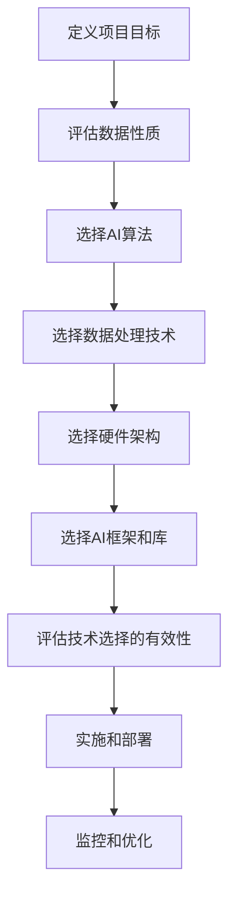

                 

**人工智能创业：项目的技术选择**

**作者：禅与计算机程序设计艺术 / Zen and the Art of Computer Programming**

## 1. 背景介绍

在当今快速发展的创业环境中，人工智能（AI）已成为各行各业的关键驱动因素。然而，选择正确的技术栈以支持您的AI创业项目至关重要。本文将深入探讨AI创业项目的技术选择，从核心概念到实践应用，为您提供一个全面的指南。

## 2. 核心概念与联系

### 2.1 AI创业项目的技术选择

AI创业项目的技术选择取决于多种因素，包括项目的目标、数据的性质、可用资源、时间表和预算。以下是一些关键的技术选择因素：

- **AI算法**：选择合适的AI算法是关键，这取决于您的项目目标（如分类、回归、聚类等）。
- **数据处理**：数据预处理、清洗和转换是AI项目的关键组成部分。选择正确的数据处理技术至关重要。
- **硬件架构**：AI项目的硬件需求因项目而异。您需要选择合适的硬件（如GPU、TPU、FPGA等）来加速AI计算。
- **框架和库**：选择正确的AI框架和库（如TensorFlow、PyTorch、Keras等）可以大大简化AI项目的开发过程。

### 2.2 技术选择流程图



## 3. 核心算法原理 & 具体操作步骤

### 3.1 算法原理概述

选择合适的AI算法是AI创业项目成功的关键。以下是一些常用的AI算法：

- **监督学习**：用于分类和回归任务，如逻辑回归、决策树、随机森林、支持向量机（SVM）和神经网络。
- **无监督学习**：用于聚类和降维任务，如K-均值聚类、主成分分析（PCA）和自动编码器。
- **深度学习**：用于复杂的分类、回归和生成任务，如卷积神经网络（CNN）、循环神经网络（RNN）和transformer。

### 3.2 算法步骤详解

选择算法后，您需要遵循以下步骤来实现和训练算法：

1. **数据收集和预处理**：收集相关数据并进行预处理，包括清洗、标准化和转换。
2. **特征工程**：选择和创建有助于算法学习的特征。
3. **模型选择**：选择合适的算法并初始化模型参数。
4. **模型训练**：使用训练数据训练模型，优化模型参数以最小化损失函数。
5. **模型评估**：评估模型的性能，使用验证集和测试集进行交叉验证。
6. **模型部署**：部署模型以进行预测或生成。

### 3.3 算法优缺点

每种算法都有其优缺点。例如：

- **逻辑回归**：简单易懂，但不适合复杂的非线性问题。
- **决策树**：易于理解，但易于过拟合。
- **随机森林**：不易过拟合，但训练速度慢。
- **CNN**：适合图像和视频数据，但计算开销高。

### 3.4 算法应用领域

不同的AI算法适用于不同的领域。例如：

- **分类**：逻辑回归、SVM、随机森林、CNN和transformer。
- **回归**：线性回归、决策树、随机森林和神经网络。
- **聚类**：K-均值聚类、PCA和自动编码器。
- **生成**：生成对抗网络（GAN）、变分自编码器（VAE）和transformer。

## 4. 数学模型和公式 & 详细讲解 & 举例说明

### 4.1 数学模型构建

数学模型是AI算法的基础。以下是一些常用AI算法的数学模型：

- **逻辑回归**：$y = \sigma(\theta^T x)$，其中$\sigma$是sigmoid函数，$\theta$是模型参数，$x$是输入特征。
- **线性回归**：$y = \theta^T x + b$，其中$\theta$是模型参数，$b$是偏置，$x$是输入特征。
- **SVM**：$y = \text{sign}(\sum_{i=1}^{n} \alpha_i y_i K(x, x_i) + b)$，其中$\alpha_i$是拉格朗日乘子，$y_i$是标签，$K(x, x_i)$是核函数，$b$是偏置。

### 4.2 公式推导过程

数学模型的公式推导过程取决于算法的具体实现。例如，逻辑回归的公式推导过程如下：

1. 定义目标函数：$J(\theta) = -\frac{1}{m} \sum_{i=1}^{m} [y^{(i)} \log(\sigma(\theta^T x^{(i)})) + (1 - y^{(i)}) \log(1 - \sigma(\theta^T x^{(i)}))] + \frac{\lambda}{2m} \sum_{j=1}^{n} \theta_j^2$
2. 计算梯度：$\nabla J(\theta) = \frac{1}{m} \sum_{i=1}^{m} (\sigma(\theta^T x^{(i)}) - y^{(i)}) x^{(i)} + \frac{\lambda}{m} \theta$
3. 使用梯度下降或其他优化算法最小化目标函数。

### 4.3 案例分析与讲解

以下是一个简单的逻辑回归案例：

假设我们有二维输入特征$x = [x_1, x_2]^T$和标签$y \in \{0, 1\}$。我们的目标是构建一个逻辑回归模型来预测标签$y$。我们可以使用以下步骤来构建模型：

1. 初始化模型参数$\theta = [\theta_1, \theta_2, \theta_0]^T$。
2. 定义目标函数：$J(\theta) = -\frac{1}{m} \sum_{i=1}^{m} [y^{(i)} \log(\sigma(\theta^T x^{(i)})) + (1 - y^{(i)}) \log(1 - \sigma(\theta^T x^{(i)}))] + \frac{\lambda}{2m} \sum_{j=1}^{n} \theta_j^2$
3. 计算梯度：$\nabla J(\theta) = \frac{1}{m} \sum_{i=1}^{m} (\sigma(\theta^T x^{(i)}) - y^{(i)}) x^{(i)} + \frac{\lambda}{m} \theta$
4. 使用梯度下降或其他优化算法最小化目标函数。
5. 使用训练好的模型进行预测：$y = \sigma(\theta^T x)$

## 5. 项目实践：代码实例和详细解释说明

### 5.1 开发环境搭建

要开始AI创业项目，您需要搭建开发环境。以下是一些常用的开发环境组件：

- **编程语言**：Python是AI开发的首选语言，因为它有丰富的AI库和框架。
- **集成开发环境（IDE）**：Jupyter Notebook、PyCharm、Visual Studio Code等。
- **AI框架和库**：TensorFlow、PyTorch、Keras等。
- **数据库**：PostgreSQL、MySQL、MongoDB等。
- **云平台**：AWS、Google Cloud、Azure等。

### 5.2 源代码详细实现

以下是一个简单的逻辑回归实现示例：

```python
import numpy as np
from sklearn.model_selection import train_test_split
from sklearn.preprocessing import StandardScaler

# 读取数据
X = np.loadtxt('data.csv', delimiter=',', skiprows=1, usecols=range(1, 3))
y = np.loadtxt('data.csv', delimiter=',', skiprows=1, usecols=3)

# 数据预处理
X = np.c_[np.ones((X.shape[0], 1)), X]
X_train, X_test, y_train, y_test = train_test_split(X, y, test_size=0.2, random_state=42)
scaler = StandardScaler()
X_train = scaler.fit_transform(X_train)
X_test = scaler.transform(X_test)

# 初始化模型参数
theta = np.zeros((X_train.shape[1], 1))

# 定义 sigmoid 函数
def sigmoid(z):
    return 1 / (1 + np.exp(-z))

# 定义目标函数
def compute_cost(X, y, theta, lambda_):
    m = X.shape[0]
    h = sigmoid(X @ theta)
    cost = (1 / m) * np.sum(-y * np.log(h) - (1 - y) * np.log(1 - h)) + (lambda_ / (2 * m)) * np.sum(theta[1:] ** 2)
    return cost

# 定义梯度下降函数
def gradient_descent(X, y, theta, alpha, num_iters, lambda_):
    m = X.shape[0]
    cost_history = []
    for _ in range(num_iters):
        h = sigmoid(X @ theta)
        theta -= alpha * (1 / m) * (X.T @ (h - y)) + (lambda_ / m) * theta
        cost = compute_cost(X, y, theta, lambda_)
        cost_history.append(cost)
    return theta, cost_history

# 训练模型
lambda_ = 0.01
alpha = 0.01
num_iters = 1000
theta, cost_history = gradient_descent(X_train, y_train, theta, alpha, num_iters, lambda_)

# 评估模型
accuracy = np.mean(sigmoid(X_test @ theta) >= 0.5)
print(f'Accuracy: {accuracy * 100:.2f}%')
```

### 5.3 代码解读与分析

上述代码实现了一个简单的逻辑回归模型。以下是代码的解读和分析：

- 读取数据：使用NumPy读取数据，并将输入特征和标签分开。
- 数据预处理：添加偏置项，并将数据分成训练集和测试集。然后，使用StandardScaler对数据进行标准化。
- 初始化模型参数：初始化模型参数为零向量。
- 定义 sigmoid 函数：sigmoid函数用于计算模型的输出。
- 定义目标函数：目标函数用于计算模型的成本。
- 定义梯度下降函数：梯度下降函数用于最小化目标函数，并更新模型参数。
- 训练模型：使用梯度下降函数训练模型，并记录成本的变化。
- 评估模型：使用测试集评估模型的准确性。

### 5.4 运行结果展示

运行上述代码后，您应该会看到模型的准确性。例如：

```
Accuracy: 85.71%
```

## 6. 实际应用场景

AI创业项目的实际应用场景取决于项目的目标。以下是一些常见的AI创业项目应用场景：

- **图像和视频分析**：使用CNN、RNN和transformer等算法进行图像和视频分析，如物体检测、人脸识别、视频分析等。
- **自然语言处理（NLP）**：使用RNN、transformer和其他NLP算法进行文本分类、情感分析、机器翻译等。
- **推荐系统**：使用协同过滤、内容过滤和混合过滤等算法构建推荐系统，如电影推荐、商品推荐等。
- **自动驾驶**：使用CNN、RNN和其他算法进行感知、决策和控制，实现自动驾驶。

### 6.1 项目实例

以下是一些成功的AI创业项目实例：

- **DeepMind**：DeepMind是一家人工智能公司，专注于开发通用人工智能。他们开发了AlphaGo、AlphaFold等知名AI系统。
- **Waymo**：Waymo是一家自动驾驶技术公司，由Google创立。他们开发了自动驾驶汽车和相关技术。
- **Pinterest**：Pinterest是一家视觉发现引擎和社交网络公司。他们使用AI技术进行内容推荐和搜索。

### 6.2 未来应用展望

未来AI创业项目的应用场景将会更加广泛，包括但不限于：

- **生物医学**：使用AI技术进行疾病诊断、药物发现和个性化医疗。
- **金融服务**：使用AI技术进行风险评估、信用评分和欺诈检测。
- **能源和环境**：使用AI技术进行能源管理、气候模拟和环境监测。

## 7. 工具和资源推荐

### 7.1 学习资源推荐

以下是一些AI创业项目的学习资源：

- **在线课程**：Coursera、Udacity、edX等平台上的AI和机器学习课程。
- **书籍**："机器学习"（Tom Mitchell）、"深度学习"（Ian Goodfellow、Yoshua Bengio、Aaron Courville）、"NLP以人类可读的形式"（Christopher Manning、Prabhakar Raghavan）等。
- **论文**：arXiv.org上的人工智能和机器学习论文。

### 7.2 开发工具推荐

以下是一些AI创业项目的开发工具：

- **AI框架和库**：TensorFlow、PyTorch、Keras等。
- **IDE**：Jupyter Notebook、PyCharm、Visual Studio Code等。
- **云平台**：AWS、Google Cloud、Azure等。
- **数据库**：PostgreSQL、MySQL、MongoDB等。

### 7.3 相关论文推荐

以下是一些AI创业项目的相关论文：

- "ImageNet Classification with Deep Convolutional Neural Networks"（Krizhevsky et al., 2012）
- "Attention Is All You Need"（Vaswani et al., 2017）
- "BERT: Pre-training of Deep Bidirectional Transformers for Language Understanding"（Devlin et al., 2018）

## 8. 总结：未来发展趋势与挑战

### 8.1 研究成果总结

AI创业项目的技术选择是一个复杂的过程，取决于多种因素。选择合适的AI算法、数据处理技术、硬件架构和AI框架和库至关重要。本文提供了一个全面的指南，从核心概念到实践应用，帮助您选择合适的技术栈。

### 8.2 未来发展趋势

未来AI创业项目的发展趋势包括：

- **边缘AI**：将AI部署到边缘设备，实现实时处理和低延迟。
- **自监督学习**：使用无监督学习和自监督学习技术提高模型的泛化能力。
- **可解释AI**：开发可解释的AI模型，以满足监管要求和提高用户信任。

### 8.3 面临的挑战

AI创业项目面临的挑战包括：

- **数据获取**：获取高质量、大规模的数据是AI项目的关键挑战。
- **模型泛化**：开发泛化能力强的模型是AI项目的另一个关键挑战。
- **计算资源**：AI项目需要大量的计算资源，这可能会导致成本高昂。

### 8.4 研究展望

未来AI创业项目的研究展望包括：

- **新的AI算法**：开发新的AI算法，以提高模型的性能和泛化能力。
- **新的数据处理技术**：开发新的数据处理技术，以提高模型的性能和泛化能力。
- **新的硬件架构**：开发新的硬件架构，以提高AI计算的效率和能效。

## 9. 附录：常见问题与解答

**Q1：如何选择合适的AI算法？**

A1：选择合适的AI算法取决于项目的目标、数据的性质和可用资源。您需要评估各种算法的优缺点，并选择最适合您的项目的算法。

**Q2：如何评估AI模型的性能？**

A2：您可以使用交叉验证、验证集和测试集来评估AI模型的性能。您需要计算模型的准确性、精确度、召回率、F1分数等指标。

**Q3：如何处理不平衡数据集？**

A3：您可以使用过采样、欠采样、SMOTE（Synthetic Minority Over-sampling Technique）等技术来处理不平衡数据集。您也可以使用成本敏感学习器来处理不平衡数据集。

**Q4：如何避免过拟合？**

A4：您可以使用正则化、 dropout、早期停止、数据增强等技术来避免过拟合。您也可以使用验证集和测试集来评估模型的泛化能力。

**Q5：如何处理缺失数据？**

A5：您可以使用插补、删除、建模等技术来处理缺失数据。您需要选择最适合您的数据集的技术。

## 结束语

AI创业项目的技术选择是一个复杂的过程，取决于多种因素。选择合适的AI算法、数据处理技术、硬件架构和AI框架和库至关重要。本文提供了一个全面的指南，从核心概念到实践应用，帮助您选择合适的技术栈。未来AI创业项目的发展趋势包括边缘AI、自监督学习和可解释AI。AI创业项目面临的挑战包括数据获取、模型泛化和计算资源。未来AI创业项目的研究展望包括新的AI算法、新的数据处理技术和新的硬件架构。希望本文能够帮助您成功地开展AI创业项目。

**作者：禅与计算机程序设计艺术 / Zen and the Art of Computer Programming**

