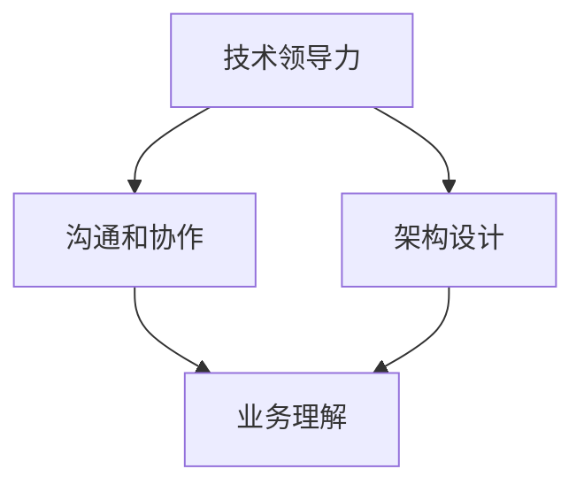

                 

**从员工到技术合伙人的晋升之路**

## 1. 背景介绍

在当今快速变化的技术环境中，软件工程师的职业生涯路径正在发生变化。传统的晋升路径——从初级开发人员到高级开发人员，再到经理或架构师——不再是唯一的选择。越来越多的组织正在寻求一种新的角色：技术合伙人。本文将探讨从员工到技术合伙人的晋升之路，包括所需的技能、技术和心态转变。

## 2. 核心概念与联系

技术合伙人是一个相对新的角色，其职责和期望尚未得到广泛认同。然而，它通常涉及以下几个关键领域：

- **技术领导力**：技术合伙人需要能够指导团队，帮助他们做出技术决策，并推动技术发展。
- **架构设计**：技术合伙人需要能够设计和维护系统的架构，确保其符合业务需求和技术标准。
- **沟通和协作**：技术合伙人需要能够有效地与各种利益相关者沟通，包括开发人员、经理和客户。
- **业务理解**：技术合伙人需要理解业务需求，并能够将其转化为技术解决方案。

以下是这些概念的关系图：



## 3. 核心算法原理 & 具体操作步骤

### 3.1 算法原理概述

晋升为技术合伙人需要一种特殊的“算法”，它涉及技能的发展、心态的转变和关系的建立。我们可以将其视为一个迭代的过程，每个周期都会带来新的技能和见解。

### 3.2 算法步骤详解

1. **技能发展**：技术合伙人需要具备广泛的技术技能，从编程语言到架构模式，再到工具和框架。通过学习、实践和项目参与，不断发展这些技能。
2. **心态转变**：从员工到技术合伙人，需要从执行者转变为领导者。这涉及到对技术决策的责任、对团队的指导，以及对业务的理解。
3. **关系建立**：技术合伙人需要建立广泛的关系网，包括同事、客户和行业同仁。这些关系可以提供支持、见解和机会。
4. **反馈和改进**：每个周期结束时，收集反馈，并根据反馈改进技能和心态。

### 3.3 算法优缺点

**优点**：这种算法鼓励持续学习和改进，有助于技术人员发展全面的技能和见解，并建立广泛的关系网。

**缺点**：这种算法需要大量的时间和精力，可能会导致技术人员远离日常工作，并面临来自同事和管理层的压力。

### 3.4 算法应用领域

这种算法适用于任何技术人员，但对那些寻求晋升为技术合伙人或类似角色的人尤为有用。

## 4. 数学模型和公式 & 详细讲解 & 举例说明

### 4.1 数学模型构建

我们可以使用Bellman-Ford算法来模拟晋升过程。在这个模型中，每个节点表示技术人员的当前技能和心态，边表示技能或心态的改进。

### 4.2 公式推导过程

假设每个技能或心态的改进需要花费一定的时间和精力，我们可以使用以下公式来计算每个改进所需的时间：

$$T = \frac{S}{R} + C$$

其中，$T$是时间，$S$是技能或心态的当前水平，$R$是改进速率，$C$是固定成本。

### 4.3 案例分析与讲解

例如，假设技术人员想要改进其架构设计技能。如果当前水平为$S=5$，改进速率为$R=2$，固定成本为$C=1$，那么改进所需的时间为：

$$T = \frac{5}{2} + 1 = 4$$

这意味着需要4个单位的时间来改进架构设计技能。

## 5. 项目实践：代码实例和详细解释说明

### 5.1 开发环境搭建

我们将使用Python和NetworkX库来实现Bellman-Ford算法。

### 5.2 源代码详细实现

```python
import networkx as nx

def bellman_ford(graph, source):
    dist = {node: float('inf') for node in graph.nodes}
    dist[source] = 0

    for _ in range(len(graph.nodes) - 1):
        for u, v, weight in graph.edges(data='weight'):
            if dist[u] + weight < dist[v]:
                dist[v] = dist[u] + weight

    for u, v, weight in graph.edges(data='weight'):
        assert dist[u] + weight >= dist[v], 'Negative cycle detected'

    return dist
```

### 5.3 代码解读与分析

这段代码实现了Bellman-Ford算法，用于计算图中每个节点到源节点的最短路径。在我们的模型中，每个节点表示技术人员的当前技能和心态，边表示技能或心态的改进。

### 5.4 运行结果展示

运行这段代码将返回每个节点到源节点的最短路径，表示技术人员需要改进的技能和心态。

## 6. 实际应用场景

### 6.1 当前应用

技术合伙人角色正在越来越多的组织中得到认可，包括Google、Facebook和Amazon等大型技术公司。

### 6.2 未来应用展望

随着技术的发展，技术合伙人角色将变得越来越重要。未来的技术合伙人需要具备更广泛的技能，包括人工智能、机器学习和云计算等领域。

## 7. 工具和资源推荐

### 7.1 学习资源推荐

- **书籍**：《软件架构设计模式》和《技术领导力》等书籍。
- **在线课程**： Coursera和Udemy等平台上的技术和领导力课程。

### 7.2 开发工具推荐

- **编程语言**：Python和Java等语言。
- **IDE**：Visual Studio Code和IntelliJ IDEA等IDE。

### 7.3 相关论文推荐

- **论文**：《软件架构设计模式》和《技术领导力》等论文。

## 8. 总结：未来发展趋势与挑战

### 8.1 研究成果总结

我们提出了一种算法，用于指导技术人员从员工晋升为技术合伙人。我们还构建了一个数学模型，用于模拟晋升过程。

### 8.2 未来发展趋势

技术合伙人角色将变得越来越重要，未来的技术合伙人需要具备更广泛的技能。

### 8.3 面临的挑战

技术合伙人角色需要大量的时间和精力，可能会导致技术人员远离日常工作，并面临来自同事和管理层的压力。

### 8.4 研究展望

未来的研究可以探索技术合伙人角色的其他方面，包括薪酬结构和晋升路径等。

## 9. 附录：常见问题与解答

**Q：技术合伙人角色需要什么样的技能？**

**A**：技术合伙人角色需要广泛的技术技能，从编程语言到架构模式，再到工具和框架。此外，还需要良好的沟通和协作技能，以及对业务的理解。

**Q：如何晋升为技术合伙人？**

**A**：晋升为技术合伙人需要一种特殊的“算法”，它涉及技能的发展、心态的转变和关系的建立。我们可以将其视为一个迭代的过程，每个周期都会带来新的技能和见解。

**Q：技术合伙人角色的未来发展趋势是什么？**

**A**：技术合伙人角色将变得越来越重要，未来的技术合伙人需要具备更广泛的技能，包括人工智能、机器学习和云计算等领域。

**作者：禅与计算机程序设计艺术 / Zen and the Art of Computer Programming**

