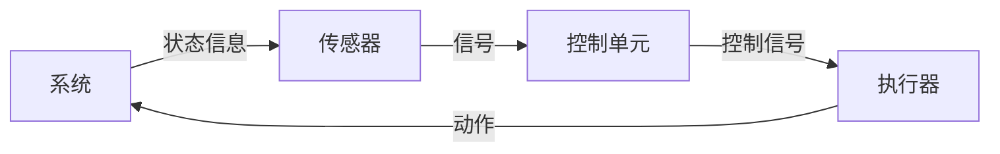

                 

**传感器和执行器：获取和执行数据**

**作者：禅与计算机程序设计艺术 / Zen and the Art of Computer Programming**

## 1. 背景介绍

在当今的数字世界中，数据是最宝贵的资源之一。获取和执行数据是实现智能系统、自动化控制和决策支持的关键。传感器和执行器是实现这一目标的两个关键组件。本文将深入探讨传感器和执行器的原理、应用和未来发展趋势。

## 2. 核心概念与联系

### 2.1 传感器和执行器的定义

- **传感器**：一种转换器，它检测物理现象并将其转换为可以被处理单元（如微处理器）检测和处理的电信号。
- **执行器**：一种装置，它接收来自控制单元的信号并将其转换为相应的物理动作。

### 2.2 传感器和执行器的联系

传感器和执行器是控制系统的关键组成部分，它们共同构成了一个闭环控制系统。传感器获取系统的状态信息，并将其传递给控制单元。控制单元根据预设的控制策略生成控制信号，并将其传递给执行器。执行器根据接收到的控制信号执行相应的动作，从而改变系统的状态。这个过程不断重复，从而实现对系统的闭环控制。



## 3. 核心算法原理 & 具体操作步骤

### 3.1 算法原理概述

传感器和执行器的算法原理基于信号处理和控制理论。传感器的算法原理涉及信号采集、放大、滤波和转换。执行器的算法原理涉及信号放大、功率放大和动作执行。

### 3.2 算法步骤详解

#### 3.2.1 传感器算法步骤

1. **信号采集**：传感器检测物理现象并将其转换为电信号。
2. **信号放大**：信号放大电路将微弱的电信号放大到可以被处理单元检测的水平。
3. **信号滤波**：滤波电路滤除信号中的噪声和干扰。
4. **信号转换**：模数转换器（ADC）将模拟信号转换为数字信号，以便于处理单元处理。

#### 3.2.2 执行器算法步骤

1. **信号放大**：信号放大电路将控制单元发送的信号放大到可以驱动执行器的水平。
2. **功率放大**：功率放大电路将放大的信号转换为足够的功率，以驱动执行器。
3. **动作执行**：执行器根据接收到的信号执行相应的动作，从而改变系统的状态。

### 3.3 算法优缺点

**优点**：传感器和执行器算法简单有效，可以实现闭环控制，提高系统的稳定性和可靠性。

**缺点**：传感器和执行器算法对信号质量和系统稳定性要求高，对噪声和干扰敏感。

### 3.4 算法应用领域

传感器和执行器算法广泛应用于工业控制、机器人技术、自动驾驶、物联网和智能家居等领域。

## 4. 数学模型和公式 & 详细讲解 & 举例说明

### 4.1 数学模型构建

传感器和执行器的数学模型基于信号处理和控制理论。传感器的数学模型涉及信号采集、放大、滤波和转换的数学描述。执行器的数学模型涉及信号放大、功率放大和动作执行的数学描述。

### 4.2 公式推导过程

#### 4.2.1 传感器公式推导

传感器的信号放大可以表示为：

$$V_{out} = A \cdot V_{in}$$

其中，$V_{out}$是放大后的信号，$V_{in}$是输入信号，$A$是放大系数。

传感器的信号滤波可以表示为：

$$V_{out}(s) = \frac{1}{1 + sRC}V_{in}(s)$$

其中，$V_{out}(s)$是滤波后的信号，$V_{in}(s)$是输入信号，$s$是拉普拉斯变换变量，$RC$是时间常数。

传感器的信号转换可以表示为：

$$V_{out} = \frac{V_{ref}}{2^{n}} \cdot V_{in}$$

其中，$V_{out}$是转换后的数字信号，$V_{ref}$是参考电压，$n$是ADC分辨率，$V_{in}$是输入信号。

#### 4.2.2 执行器公式推导

执行器的信号放大可以表示为：

$$V_{out} = G \cdot V_{in}$$

其中，$V_{out}$是放大后的信号，$V_{in}$是输入信号，$G$是放大系数。

执行器的功率放大可以表示为：

$$P_{out} = G \cdot P_{in}$$

其中，$P_{out}$是放大后的功率，$P_{in}$是输入功率，$G$是放大系数。

执行器的动作执行可以表示为：

$$x(t) = K \cdot u(t) + x(0)$$

其中，$x(t)$是系统状态，$u(t)$是控制信号，$K$是控制系数，$x(0)$是初始状态。

### 4.3 案例分析与讲解

例如，在工业控制系统中，传感器检测系统的状态，并将其转换为数字信号。控制单元根据预设的控制策略生成控制信号，并将其传递给执行器。执行器根据接收到的控制信号执行相应的动作，从而改变系统的状态。这个过程不断重复，从而实现对系统的闭环控制。

## 5. 项目实践：代码实例和详细解释说明

### 5.1 开发环境搭建

本项目使用Python作为开发语言，并使用Arduino作为执行器的硬件平台。开发环境包括Python 3.8、Arduino IDE和串口通信工具。

### 5.2 源代码详细实现

#### 5.2.1 传感器代码实现

```python
import serial
import time

# 打开串口通信
ser = serial.Serial('COM3', 9600, timeout=1)

def read_sensor():
    # 读取传感器数据
    data = ser.readline().decode().strip()
    return float(data)

# 读取传感器数据
sensor_data = read_sensor()
print(f"Sensor data: {sensor_data}")
```

#### 5.2.2 执行器代码实现

```cpp
// Arduino代码
void setup() {
  // 初始化串口通信
  Serial.begin(9600);
}

void loop() {
  // 读取控制信号
  if (Serial.available() > 0) {
    int control_signal = Serial.parseInt();
    // 执行相应的动作
    if (control_signal > 0) {
      digitalWrite(LED_PIN, HIGH);
    } else {
      digitalWrite(LED_PIN, LOW);
    }
  }
}
```

### 5.3 代码解读与分析

传感器代码使用Python的`serial`库读取串口通信中的数据，并将其转换为浮点数。执行器代码使用Arduino语言读取串口通信中的控制信号，并根据控制信号执行相应的动作。

### 5.4 运行结果展示

当传感器检测到系统状态发生变化时，它会将数据通过串口通信发送给控制单元。控制单元根据预设的控制策略生成控制信号，并将其通过串口通信发送给执行器。执行器根据接收到的控制信号执行相应的动作，从而改变系统的状态。这个过程不断重复，从而实现对系统的闭环控制。

## 6. 实际应用场景

### 6.1 工业控制

传感器和执行器广泛应用于工业控制系统，用于实现对生产过程的自动化控制。例如，在化工生产过程中，传感器检测化学反应的状态，并将其转换为数字信号。控制单元根据预设的控制策略生成控制信号，并将其传递给执行器。执行器根据接收到的控制信号执行相应的动作，从而改变化学反应的状态。

### 6.2 机器人技术

传感器和执行器是机器人技术的关键组成部分。传感器检测机器人环境和状态，并将其转换为数字信号。控制单元根据预设的控制策略生成控制信号，并将其传递给执行器。执行器根据接收到的控制信号执行相应的动作，从而实现机器人的运动控制。

### 6.3 自动驾驶

传感器和执行器是自动驾驶技术的关键组成部分。传感器检测车辆环境和状态，并将其转换为数字信号。控制单元根据预设的控制策略生成控制信号，并将其传递给执行器。执行器根据接收到的控制信号执行相应的动作，从而实现车辆的运动控制。

### 6.4 未来应用展望

未来，传感器和执行器技术将继续发展，以满足物联网、智能家居和人工智能等领域的需求。传感器和执行器将更加智能化、小型化和低功耗，从而实现对环境和系统的更精确和更高效的控制。

## 7. 工具和资源推荐

### 7.1 学习资源推荐

- **书籍**："传感器技术与应用"、"控制系统工程"、"信号处理与分析"等。
- **在线课程**：Coursera、Udemy、edX等平台上的传感器和控制系统相关课程。

### 7.2 开发工具推荐

- **传感器开发工具**：Arduino、Raspberry Pi、STM32等开发板。
- **执行器开发工具**：Arduino、Raspberry Pi、STM32等开发板，以及各种电机驱动器和伺服驱动器。

### 7.3 相关论文推荐

- "A Survey on Sensor Networks"、"Control System Design and Analysis"、"Signal Processing Techniques for Sensor Networks"等。

## 8. 总结：未来发展趋势与挑战

### 8.1 研究成果总结

本文介绍了传感器和执行器的原理、应用和未来发展趋势。传感器和执行器是实现闭环控制的关键组成部分，广泛应用于工业控制、机器人技术、自动驾驶和物联网等领域。

### 8.2 未来发展趋势

未来，传感器和执行器技术将继续发展，以满足物联网、智能家居和人工智能等领域的需求。传感器和执行器将更加智能化、小型化和低功耗，从而实现对环境和系统的更精确和更高效的控制。

### 8.3 面临的挑战

传感器和执行器技术面临的挑战包括信号质量、系统稳定性、噪声和干扰等。此外，传感器和执行器的集成和互操作性也将是未来需要解决的关键问题。

### 8.4 研究展望

未来的研究将集中在传感器和执行器的智能化、小型化和低功耗方面。此外，传感器和执行器的集成和互操作性也将是未来需要解决的关键问题。

## 9. 附录：常见问题与解答

**Q1：传感器和执行器有什么区别？**

A1：传感器和执行器是控制系统的关键组成部分。传感器检测物理现象并将其转换为可以被处理单元检测和处理的电信号。执行器接收来自控制单元的信号并将其转换为相应的物理动作。

**Q2：传感器和执行器的应用领域有哪些？**

A2：传感器和执行器广泛应用于工业控制、机器人技术、自动驾驶、物联网和智能家居等领域。

**Q3：传感器和执行器的未来发展趋势是什么？**

A3：未来，传感器和执行器技术将继续发展，以满足物联网、智能家居和人工智能等领域的需求。传感器和执行器将更加智能化、小型化和低功耗，从而实现对环境和系统的更精确和更高效的控制。

**Q4：传感器和执行器技术面临的挑战是什么？**

A4：传感器和执行器技术面临的挑战包括信号质量、系统稳定性、噪声和干扰等。此外，传感器和执行器的集成和互操作性也将是未来需要解决的关键问题。

**Q5：未来的研究将集中在哪些方面？**

A5：未来的研究将集中在传感器和执行器的智能化、小型化和低功耗方面。此外，传感器和执行器的集成和互操作性也将是未来需要解决的关键问题。

## 结束语

传感器和执行器是实现闭环控制的关键组成部分，广泛应用于工业控制、机器人技术、自动驾驶和物联网等领域。未来，传感器和执行器技术将继续发展，以满足物联网、智能家居和人工智能等领域的需求。传感器和执行器将更加智能化、小型化和低功耗，从而实现对环境和系统的更精确和更高效的控制。传感器和执行器技术面临的挑战包括信号质量、系统稳定性、噪声和干扰等。未来的研究将集中在传感器和执行器的智能化、小型化和低功耗方面。传感器和执行器的集成和互操作性也将是未来需要解决的关键问题。

**作者：禅与计算机程序设计艺术 / Zen and the Art of Computer Programming**

