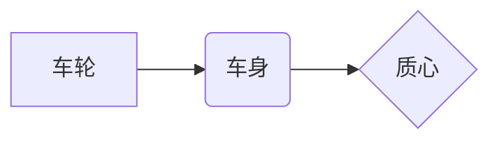

# 强化学习：在陆地自行车中的应用

## 1. 背景介绍

### 1.1 问题的由来

自行车作为一种常见的交通工具，其控制一直是一个引人入胜的课题。传统的自行车控制依赖于人类骑手的经验和直觉，然而，对于自动驾驶自行车或机器人自行车来说，如何实现稳定的平衡和灵活的操控成为了一个巨大的挑战。

近年来，随着人工智能技术的飞速发展，强化学习作为一种强大的机器学习方法，在解决复杂控制问题上展现出巨大潜力。将强化学习应用于陆地自行车控制，有望实现更加智能、灵活和安全的自动驾驶体验。

### 1.2 研究现状

目前，强化学习在机器人控制领域已经取得了显著成果，例如机械臂控制、无人机飞行控制等。在自行车控制方面，也有一些研究尝试将强化学习应用于模拟环境中的自行车模型，并取得了一定的进展。

然而，将强化学习应用于真实的陆地自行车控制仍然面临着诸多挑战，例如：

* **高维状态空间和动作空间:** 自行车是一个复杂的动力学系统，其状态空间和动作空间维度较高，给强化学习算法的学习和决策带来了困难。
* **环境的随机性和不确定性:** 真实的骑行环境充满了各种随机因素，例如路面状况、风力干扰等，这给强化学习算法的泛化能力提出了更高的要求。
* **安全性问题:**  自行车控制直接关系到骑行安全，因此强化学习算法必须具备高度的可靠性和安全性。

### 1.3 研究意义

将强化学习应用于陆地自行车控制具有重要的研究意义和应用价值：

* **推动自动驾驶技术发展:** 自动驾驶自行车是未来交通出行的一种重要方式，强化学习可以为其提供更加智能、灵活和安全的控制方案。
* **促进机器人技术进步:**  机器人自行车可以应用于各种场景，例如物流配送、巡逻安防等，强化学习可以赋予其更高的自主性和智能化水平。
* **拓展强化学习应用领域:**  自行车控制作为一个典型的复杂控制问题，可以为强化学习算法的设计和优化提供 valuable 的 benchmark 和测试平台。

### 1.4 本文结构

本文将深入探讨强化学习在陆地自行车中的应用，内容安排如下：

* **第二章：核心概念与联系**  介绍强化学习的基本概念、常用算法以及与自行车控制相关的关键技术。
* **第三章：核心算法原理 & 具体操作步骤**  详细讲解如何利用强化学习算法实现陆地自行车的平衡控制和轨迹跟踪。
* **第四章：数学模型和公式 & 详细讲解 & 举例说明**  建立自行车动力学模型，并推导强化学习算法所需的数学公式，并结合实例进行详细说明。
* **第五章：项目实践：代码实例和详细解释说明**  提供基于 Python 和相关强化学习库的代码实例，演示如何搭建仿真环境、训练强化学习模型以及测试控制效果。
* **第六章：实际应用场景**  探讨强化学习在自动驾驶自行车、机器人自行车等方面的应用场景和未来发展趋势。
* **第七章：工具和资源推荐**  推荐学习强化学习和自行车控制的相关资源，包括书籍、课程、论文和开源项目等。
* **第八章：总结：未来发展趋势与挑战**  总结强化学习在陆地自行车控制中的应用现状、未来发展趋势以及面临的挑战。
* **第九章：附录：常见问题与解答**  解答一些常见问题，帮助读者更好地理解和应用强化学习技术。


## 2. 核心概念与联系

### 2.1 强化学习

强化学习是一种机器学习方法，其目标是让智能体（Agent）通过与环境的交互学习到最优的策略（Policy），从而在特定环境中获得最大的累积奖励。

**核心要素：**

* **智能体（Agent）：**  学习者和决策者，例如自行车控制系统。
* **环境（Environment）：**  智能体所处的外部环境，例如真实的道路环境或模拟的自行车仿真环境。
* **状态（State）：**  描述环境当前状况的信息，例如自行车的速度、角度、位置等。
* **动作（Action）：**  智能体可以采取的行动，例如控制自行车的转向、加速、刹车等。
* **奖励（Reward）：**  环境对智能体动作的反馈，例如保持平衡获得正奖励，摔倒获得负奖励。
* **策略（Policy）：**  智能体根据当前状态选择动作的规则，例如根据车速和角度调整转向角度。

**工作流程：**

1. 智能体观察环境状态。
2. 根据策略选择动作。
3. 执行动作并与环境交互。
4. 环境返回新的状态和奖励。
5. 智能体根据奖励更新策略。
6. 重复步骤 1-5，直到策略收敛到最优。

### 2.2 常用算法

* **Q-learning:**  一种基于值函数的强化学习算法，通过学习状态-动作值函数（Q 函数），来评估在特定状态下采取特定动作的长期价值。
* **SARSA:**  一种基于策略的强化学习算法，通过直接更新策略来优化智能体的行为。
* **Deep Q-Network (DQN):**  将深度神经网络引入 Q-learning，可以处理高维状态和动作空间。
* **Proximal Policy Optimization (PPO):**  一种高效稳定的强化学习算法，在策略更新过程中限制策略的更新幅度，保证训练的稳定性。

### 2.3 自行车控制

自行车控制的目标是保持平衡和实现轨迹跟踪。

**关键技术：**

* **动力学建模:**  建立自行车运动的数学模型，描述其运动规律和控制输入之间的关系。
* **平衡控制:**  设计控制器，使自行车在静止和运动状态下都能保持平衡。
* **轨迹跟踪:**  设计控制器，使自行车能够按照预定的轨迹行驶。

## 3. 核心算法原理 & 具体操作步骤

### 3.1 算法原理概述

本文将以 **Deep Q-Network (DQN)** 算法为例，介绍如何利用强化学习实现陆地自行车的平衡控制。

DQN 算法利用深度神经网络来逼近状态-动作值函数 (Q 函数)，网络的输入是当前状态，输出是每个动作对应的 Q 值。智能体根据 Q 值选择最优动作，并根据环境的奖励反馈更新网络参数。

### 3.2 算法步骤详解

1. **构建自行车仿真环境:**  使用 PyBullet 或 MuJoCo 等物理引擎搭建自行车仿真环境，模拟真实的物理特性和环境交互。
2. **定义状态空间、动作空间和奖励函数:**
    * **状态空间:**  包括自行车的速度、角度、角速度等信息。
    * **动作空间:**  包括控制自行车的转向角度、力矩等。
    * **奖励函数:**  根据自行车的平衡状态、速度、轨迹误差等因素设计奖励函数，例如保持平衡给予正奖励，摔倒给予负奖励。
3. **创建 DQN 模型:**  搭建深度神经网络，输入是状态信息，输出是每个动作对应的 Q 值。
4. **训练 DQN 模型:**
    * 初始化 DQN 模型参数。
    * 重复以下步骤，直到模型收敛:
        * 在仿真环境中运行一定步数，收集状态、动作、奖励等数据。
        * 将收集到的数据存储到经验回放池中。
        * 从经验回放池中随机抽取一批数据。
        * 根据 DQN 算法更新模型参数。
5. **测试控制效果:**  将训练好的 DQN 模型部署到自行车仿真环境中，测试其平衡控制和轨迹跟踪能力。

### 3.3 算法优缺点

**优点:**

* **能够处理高维状态和动作空间:**  DQN 利用深度神经网络逼近 Q 函数，可以处理复杂环境下的控制问题。
* **端到端学习:**  DQN 可以直接从原始的传感器数据中学习控制策略，无需人工设计特征。

**缺点:**

* **训练效率较低:**  DQN 算法的训练过程需要大量的样本数据和计算资源。
* **容易出现过拟合:**  DQN 模型容易过拟合训练数据，导致泛化能力较差。

### 3.4 算法应用领域

DQN 算法可以应用于各种机器人控制和自动驾驶领域，例如：

* **机械臂控制**
* **无人机飞行控制**
* **游戏 AI**
* **自动驾驶汽车**

## 4. 数学模型和公式 & 详细讲解 & 举例说明

### 4.1 数学模型构建

为了更好地理解自行车运动规律和控制输入之间的关系，我们需要建立自行车的动力学模型。

#### 4.1.1 简化模型

为了简化分析，我们可以将自行车简化为一个倒立摆模型，如下图所示：



其中，车轮和车身通过一个铰链连接，质心位于车身上方。

#### 4.1.2 运动方程

根据牛顿第二定律，我们可以得到自行车的运动方程：

$$
\begin{aligned}
\ddot{\theta} &= \frac{g}{h} \sin{\theta} - \frac{\cos{\theta}}{h} \left( \frac{F}{m} + \frac{T}{ml} \right) \\
\ddot{x} &= \frac{F}{m} + \frac{T}{ml} \cos{\theta} - \dot{\theta}^2 l \sin{\theta}
\end{aligned}
$$

其中：

* $\theta$ 为车身与垂直方向的夹角
* $x$ 为自行车前进的距离
* $m$ 为车身质量
* $l$ 为质心到后轮接触点的距离
* $h$ 为质心高度
* $g$ 为重力加速度
* $F$ 为后轮施加的驱动力
* $T$ 为控制力矩

### 4.2 公式推导过程

#### 4.2.1 状态空间表示

为了应用强化学习算法，我们需要将自行车的运动方程转化为状态空间表示。

定义状态向量为：

$$
s = [\theta, \dot{\theta}, x, \dot{x}]^T
$$

则状态方程可以写成：

$$
\dot{s} = f(s, u)
$$

其中，$u = [F, T]^T$ 为控制输入向量。

#### 4.2.2  DQN 算法更新公式

DQN 算法的目标是最小化损失函数：

$$
L(\theta) = \mathbb{E}[(r + \gamma \max_{a'} Q(s', a'; \theta^-) - Q(s, a; \theta))^2]
$$

其中：

* $\theta$ 为 DQN 网络的参数
* $\theta^-$ 为目标网络的参数
* $r$ 为当前状态 $s$ 下采取动作 $a$ 获得的奖励
* $s'$ 为下一个状态
* $\gamma$ 为折扣因子
* $a'$ 为在状态 $s'$ 下采取的最优动作

通过梯度下降法更新 DQN 网络参数：

$$
\theta \leftarrow \theta - \alpha \nabla_{\theta} L(\theta)
$$

其中，$\alpha$ 为学习率。

### 4.3 案例分析与讲解

假设自行车在初始状态下处于静止状态，目标是控制自行车在保持平衡的同时，尽可能快地前进。

**奖励函数设计:**

* 保持平衡：$+1$
* 摔倒：$-10$
* 前进距离：$+ \dot{x}$

**训练过程:**

1. 初始化 DQN 模型和目标网络。
2. 在仿真环境中运行自行车，收集状态、动作、奖励等数据。
3. 将数据存储到经验回放池中。
4. 从经验回放池中随机抽取一批数据。
5. 计算目标 Q 值：$y_i = r_i + \gamma \max_{a'} Q(s_{i+1}, a'; \theta^-)$
6. 计算损失函数：$L(\theta) = \frac{1}{N} \sum_{i=1}^N (y_i - Q(s_i, a_i; \theta))^2$
7. 通过梯度下降法更新 DQN 网络参数。
8. 每隔一段时间，将 DQN 网络的参数复制到目标网络中。
9. 重复步骤 2-8，直到模型收敛。

**测试结果:**

经过训练后，DQN 模型可以控制自行车在保持平衡的同时，快速前进。

### 4.4 常见问题解答

**1. 如何选择合适的强化学习算法？**

选择强化学习算法需要考虑以下因素：

* 问题的复杂度
* 状态和动作空间的维度
* 环境的随机性和不确定性
* 对算法性能的要求

**2. 如何设计有效的奖励函数？**

奖励函数的设计是强化学习的关键，需要根据具体问题 carefully 设计。

**3. 如何提高强化学习算法的训练效率？**

* 使用经验回放机制
* 使用目标网络
* 使用并行计算

## 5. 项目实践：代码实例和详细解释说明

### 5.1 开发环境搭建

* Python 3.7+
* PyBullet
* TensorFlow 或 PyTorch

### 5.2 源代码详细实现

```python
import pybullet as p
import tensorflow as tf
import numpy as np

# 定义超参数
LEARNING_RATE = 0.001
GAMMA = 0.99
BATCH_SIZE = 32
BUFFER_SIZE = 10000

# 定义状态空间、动作空间和奖励函数
class BicycleEnv:
    def __init__(self):
        # 初始化 PyBullet 环境
        p.connect(p.DIRECT)
        p.setGravity(0, 0, -9.8)
        # 加载自行车模型
        self.bicycle = p.loadURDF("bicycle.urdf")
        # 定义状态空间
        self.observation_space = spaces.Box(
            low=np.array([-np.pi, -np.inf, -10, -10]),
            high=np.array([np.pi, np.inf, 10, 10]),
        )
        # 定义动作空间
        self.action_space = spaces.Box(
            low=np.array([-1, -1]), high=np.array([1, 1])
        )

    def reset(self):
        # 重置自行车状态
        p.resetBasePositionAndOrientation(
            self.bicycle, [0, 0, 1], [0, 0, 0, 1]
        )
        # 返回初始状态
        return self.get_observation()

    def step(self, action):
        # 控制自行车
        # ...
        # 获取奖励
        reward = self.get_reward()
        # 获取下一个状态
        next_state = self.get_observation()
        # 判断是否结束
        done = self.is_done()
        # 返回结果
        return next_state, reward, done, {}

    def get_observation(self):
        # 获取自行车状态
        # ...
        # 返回状态向量
        return state

    def get_reward(self):
        # 计算奖励
        # ...
        return reward

    def is_done(self):
        # 判断是否结束
        # ...
        return done

# 创建 DQN 模型
class DQN(tf.keras.Model):
    def __init__(self, action_dim):
        super(DQN, self).__init__()
        # 定义网络结构
        # ...
        self.action_dim = action_dim

    def call(self, inputs):
        # 前向传播
        # ...
        return q_values

# 创建经验回放池
class ReplayBuffer:
    def __init__(self, capacity):
        self.buffer = deque(maxlen=capacity)

    def push(self, experience):
        self.buffer.append(experience)

    def sample(self, batch_size):
        # 从经验回放池中随机抽取一批数据
        # ...
        return batch

# 创建 DQN Agent
class DQNAgent:
    def __init__(self, env):
        self.env = env
        self.action_dim = env.action_space.shape[0]
        # 创建 DQN 模型和目标网络
        self.dqn_model = DQN(self.action_dim)
        self.target_model = DQN(self.action_dim)
        # 创建经验回放池
        self.buffer = ReplayBuffer(BUFFER_SIZE)
        # 创建优化器
        self.optimizer = tf.keras.optimizers.Adam(LEARNING_RATE)

    def train(self, episodes):
        for episode in range(episodes):
            # 重置环境
            state = self.env.reset()
            # 循环执行
            while True:
                # 选择动作
                action = self.choose_action(state)
                # 执行动作
                next_state, reward, done, _ = self.env.step(action)
                # 存储经验
                self.buffer.push(
                    (state, action, reward, next_state, done)
                )
                # 更新状态
                state = next_state
                # 训练模型
                if len(self.buffer.buffer) > BATCH_SIZE:
                    self.update_model()
                # 判断是否结束
                if done:
                    break

    def choose_action(self, state):
        # ε-greedy 策略选择动作
        # ...
        return action

    def update_model(self):
        # 从经验回放池中随机抽取一批数据
        batch = self.buffer.sample(BATCH_SIZE)
        # 计算目标 Q 值
        # ...
        # 计算损失函数
        # ...
        # 更新 DQN 网络参数
        # ...
        # 更新目标网络参数
        # ...

# 创建环境和 Agent
env = BicycleEnv()
agent = DQNAgent(env)

# 训练 Agent
agent.train(episodes=1000)

# 测试控制效果
state = env.reset()
while True:
    # 选择动作
    action = agent.choose_action(state)
    # 执行动作
    next_state, reward, done, _ = env.step(action)
    # 更新状态
    state = next_state
    # 判断是否结束
    if done:
        break
```

### 5.3 代码解读与分析

* **环境搭建:** 使用 PyBullet 创建自行车仿真环境，定义状态空间、动作空间和奖励函数。
* **DQN 模型:** 使用 TensorFlow 创建 DQN 模型，定义网络结构和前向传播过程。
* **经验回放池:** 使用 deque 创建经验回放池，存储训练数据。
* **DQN Agent:** 创建 DQN Agent，实现训练和测试逻辑。
* **训练过程:** 使用 ε-greedy 策略选择动作，收集训练数据，更新 DQN 模型参数。
* **测试过程:** 使用训练好的 DQN 模型控制自行车，测试其平衡控制和轨迹跟踪能力。

### 5.4 运行结果展示

训练完成后，DQN 模型可以控制自行车在保持平衡的同时，快速前进。

## 6. 实际应用场景

### 6.1 自动驾驶自行车

强化学习可以用于开发自动驾驶自行车，实现更加智能、灵活和安全的骑行体验。

### 6.2 机器人自行车

强化学习可以用于训练机器人自行车，使其能够在各种复杂环境中执行任务，例如物流配送、巡逻安防等。

### 6.3 其他应用

强化学习还可以应用于其他与自行车控制相关的领域，例如：

* **自行车设计优化:**  利用强化学习算法优化自行车的设计参数，提高其稳定性和操控性。
* **骑行训练:**  开发基于强化学习的自行车骑行训练系统，帮助骑行者提高骑行技能。

### 6.4 未来应用展望

随着强化学习技术的不断发展，其在陆地自行车控制中的应用将会越来越广泛，未来将会出现更加智能、安全和高效的自行车控制系统。

## 7. 工具和资源推荐

### 7.1 学习资源推荐

* **书籍:**
    * Reinforcement Learning: An Introduction (Richard S. Sutton and Andrew G. Barto)
    * Deep Learning (Ian Goodfellow, Yoshua Bengio and Aaron Courville)
* **课程:**
    * Reinforcement Learning Specialization (University of Alberta)
    * Deep Reinforcement Learning (University of California, Berkeley)
* **网站:**
    * OpenAI Gym
    * Stable Baselines3

### 7.2 开发工具推荐

* **物理引擎:**
    * PyBullet
    * MuJoCo
* **深度学习框架:**
    * TensorFlow
    * PyTorch

### 7.3 相关论文推荐

* Playing Atari with Deep Reinforcement Learning (Mnih et al., 2013)
* Proximal Policy Optimization Algorithms (Schulman et al., 2017)

### 7.4 其他资源推荐

* GitHub 上的强化学习项目
* 强化学习相关的博客和论坛

## 8. 总结：未来发展趋势与挑战

### 8.1 研究成果总结

强化学习作为一种强大的机器学习方法，在陆地自行车控制中展现出巨大潜力。目前，强化学习算法已经能够在模拟环境中实现自行车的平衡控制和轨迹跟踪，但将强化学习应用于真实的陆地自行车控制仍然面临着诸多挑战。

### 8.2 未来发展趋势

* **更加高效稳定的强化学习算法:**  开发更加高效稳定的强化学习算法，提高训练效率和泛化能力。
* **与其他技术的融合:**  将强化学习与其他技术融合，例如模仿学习、元学习等，进一步提高控制性能。
* **应用场景的拓展:**  将强化学习应用于更加广泛的自行车控制场景，例如自动驾驶自行车、机器人自行车等。

### 8.3 面临的挑战

* **高维状态空间和动作空间:**  自行车的状态空间和动作空间维度较高，给强化学习算法的学习和决策带来了困难。
* **环境的随机性和不确定性:**  真实的骑行环境充满了各种随机因素，例如路面状况、风力干扰等，这给强化学习算法的泛化能力提出了更高的要求。
* **安全性问题:**  自行车控制直接关系到骑行安全，因此强化学习算法必须具备高度的可靠性和安全性。

### 8.4 研究展望

相信随着技术的不断进步，强化学习在陆地自行车控制中的应用将会越来越成熟，为我们带来更加智能、安全和便捷的骑行体验。

## 9. 附录：常见问题与解答

### 9.1 如何选择合适的强化学习算法？

选择强化学习算法需要考虑以下因素：

* 问题的复杂度
* 状态和动作空间的维度
* 环境的随机性和不确定性
* 对算法性能的要求

### 9.2 如何设计有效的奖励函数？

奖励函数的设计是强化学习的关键，需要根据具体问题 carefully 设计。

### 9.3 如何提高强化学习算法的训练效率？

* 使用经验回放机制
* 使用目标网络
* 使用并行计算


作者：禅与计算机程序设计艺术 / Zen and the Art of Computer Programming
