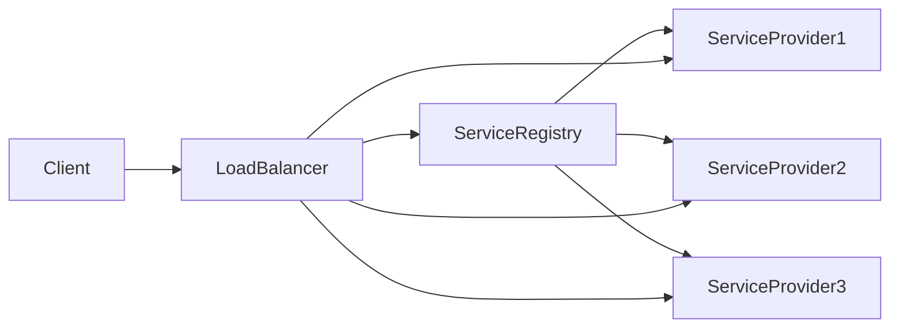

# 服务注册中心与负载均衡器实例

## 1. 背景介绍

### 1.1 问题的由来

随着互联网技术的飞速发展，软件系统架构逐渐从单体应用向分布式系统演变。在分布式系统中，服务之间的调用关系变得复杂，服务的数量也越来越多，如何有效地管理和调度这些服务成为了一个重要的挑战。服务注册中心和负载均衡器作为解决服务发现和流量管理的关键组件应运而生，它们共同构成了微服务架构的基石。

### 1.2 研究现状

目前，业界已经涌现出许多成熟的服务注册中心和负载均衡器解决方案，例如：

* **服务注册中心:**
    * ZooKeeper
    * Eureka
    * Consul
    * Nacos
* **负载均衡器:**
    * Nginx
    * HAProxy
    * F5
    * AWS ELB

这些解决方案在功能、性能、易用性等方面各有优劣，开发者可以根据自身业务需求选择合适的方案。

### 1.3 研究意义

深入理解服务注册中心和负载均衡器的原理和应用，对于构建高可用、高性能、可扩展的分布式系统至关重要。本文旨在通过实例分析，帮助读者更好地理解服务注册中心和负载均衡器的概念、工作原理以及实际应用。

### 1.4 本文结构

本文将从以下几个方面展开：

* 核心概念与联系：介绍服务注册中心、负载均衡器等核心概念，以及它们之间的联系。
* 核心算法原理 & 具体操作步骤：详细阐述服务注册与发现、负载均衡算法等核心原理，并结合具体实例进行讲解。
* 项目实践：通过代码实例演示如何使用 Spring Cloud Netflix Eureka 和 Spring Cloud Gateway 搭建一个简单的服务注册中心和负载均衡器。
* 实际应用场景：探讨服务注册中心和负载均衡器在实际项目中的应用场景，例如服务发现、流量控制、灰度发布等。
* 工具和资源推荐：推荐一些常用的服务注册中心、负载均衡器工具和学习资源。
* 总结：总结服务注册中心和负载均衡器的优势和不足，展望其未来发展趋势。


## 2. 核心概念与联系

### 2.1 服务注册中心

服务注册中心是服务发现的核心组件，它负责维护服务实例的注册信息，并提供服务发现接口供其他服务调用。服务实例在启动时将自身信息注册到服务注册中心，并在关闭时注销。

### 2.2 负载均衡器

负载均衡器负责将来自客户端的请求分发到后端的多个服务实例上，以实现流量的均衡分配，提高系统的吞吐量和可用性。

### 2.3 服务注册与发现

服务注册与发现是指服务实例通过服务注册中心进行注册和注销，客户端通过服务注册中心获取可用的服务实例列表的过程。

### 2.4 核心概念之间的联系

服务注册中心、负载均衡器和服务注册与发现之间存在着密切的联系，它们共同构成了微服务架构中的服务治理体系。

**服务注册中心** 作为服务发现的核心组件，维护着所有服务的注册信息，并提供服务注册、注销和发现的接口。

**服务提供者** 在启动时将自身信息注册到服务注册中心，并在关闭时注销。

**服务消费者** 通过服务注册中心获取可用的服务实例列表，并根据负载均衡算法选择一个服务实例进行调用。

**负载均衡器** 拦截来自客户端的请求，根据负载均衡算法选择一个可用的服务实例，并将请求转发给该实例。

下图展示了服务注册中心、负载均衡器、服务提供者和服务消费者之间的关系：



## 3. 核心算法原理 & 具体操作步骤

### 3.1 服务注册与发现

#### 3.1.1 服务注册

服务实例在启动时，将自身信息（例如服务名、IP 地址、端口号等）注册到服务注册中心。服务注册中心会为每个服务维护一个服务实例列表，并记录每个服务实例的状态信息（例如健康状态、负载情况等）。

#### 3.1.2 服务发现

客户端在调用服务时，首先需要从服务注册中心获取可用的服务实例列表。服务注册中心会根据服务名返回对应的服务实例列表，并过滤掉不可用的服务实例。

#### 3.1.3 服务注销

服务实例在关闭时，需要从服务注册中心注销自身信息。服务注册中心会将该服务实例从服务实例列表中移除。

### 3.2 负载均衡算法

负载均衡算法是负载均衡器的核心，它决定了如何将请求分发到后端的多个服务实例上。常见的负载均衡算法包括：

* **轮询算法:** 按顺序将请求依次分配到每个服务实例上。
* **随机算法:** 随机选择一个服务实例处理请求。
* **加权轮询算法:** 根据服务实例的权重分配请求，权重越高的实例处理的请求越多。
* **最少连接数算法:** 将请求分配给当前连接数最少的服务实例。
* **一致性哈希算法:** 根据请求的哈希值将请求分配到固定的服务实例上，可以有效减少缓存失效。

### 3.3 算法优缺点

| 算法 | 优点 | 缺点 |
|---|---|---|
| 轮询算法 | 简单易实现 | 无法感知服务实例的负载情况 |
| 随机算法 | 实现简单 | 可能会导致请求分配不均 |
| 加权轮询算法 | 可以根据服务实例的权重分配请求 | 需要手动配置权重 |
| 最少连接数算法 | 可以根据服务实例的负载情况动态分配请求 | 实现较为复杂 |
| 一致性哈希算法 | 可以有效减少缓存失效 | 需要额外的哈希计算 |


### 3.4 算法应用领域

不同的负载均衡算法适用于不同的应用场景，例如：

* **轮询算法和随机算法** 适用于对服务实例性能要求不高，且服务实例性能比较均衡的场景。
* **加权轮询算法** 适用于服务实例性能存在差异，需要根据服务实例的性能分配请求的场景。
* **最少连接数算法** 适用于对服务实例性能要求较高，且服务实例负载情况变化较大的场景。
* **一致性哈希算法** 适用于需要缓存数据的场景，例如 CDN、反向代理等。

## 4. 数学模型和公式 & 详细讲解 & 举例说明

### 4.1 数学模型构建

以加权轮询算法为例，假设有 N 个服务实例，每个服务实例的权重分别为 $w_1, w_2, ..., w_N$，则第 i 个服务实例被选中的概率为：

$$
P_i = \frac{w_i}{\sum_{j=1}^{N} w_j}
$$

### 4.2 公式推导过程

加权轮询算法的实现原理是，为每个服务实例维护一个计数器，初始值为 0。每次请求到来时，选择计数器值最小的服务实例处理请求，并将该服务实例的计数器值加 1。当某个服务实例的计数器值达到其权重值时，将该服务实例的计数器值重置为 0。

### 4.3 案例分析与讲解

假设有 3 个服务实例，权重分别为 5、2、3，初始计数器值均为 0。

* 第 1 次请求到来时，选择服务实例 1 处理请求，并将服务实例 1 的计数器值加 1，此时服务实例的计数器值分别为 1、0、0。
* 第 2 次请求到来时，选择服务实例 2 处理请求，并将服务实例 2 的计数器值加 1，此时服务实例的计数器值分别为 1、1、0。
* 第 3 次请求到来时，选择服务实例 3 处理请求，并将服务实例 3 的计数器值加 1，此时服务实例的计数器值分别为 1、1、1。
* 第 4 次请求到来时，选择服务实例 1 处理请求，并将服务实例 1 的计数器值加 1，此时服务实例的计数器值分别为 2、1、1。
* 第 5 次请求到来时，选择服务实例 1 处理请求，并将服务实例 1 的计数器值加 1，此时服务实例的计数器值分别为 3、1、1。
* 第 6 次请求到来时，选择服务实例 2 处理请求，并将服务实例 2 的计数器值加 1，此时服务实例的计数器值分别为 3、2、1。
* 第 7 次请求到来时，选择服务实例 3 处理请求，并将服务实例 3 的计数器值加 1，此时服务实例的计数器值分别为 3、2、2。
* 第 8 次请求到来时，选择服务实例 1 处理请求，并将服务实例 1 的计数器值加 1，此时服务实例的计数器值分别为 4、2、2。
* 第 9 次请求到来时，选择服务实例 1 处理请求，并将服务实例 1 的计数器值加 1，此时服务实例的计数器值分别为 5、2、2。
* 第 10 次请求到来时，选择服务实例 1 处理请求，并将服务实例 1 的计数器值重置为 0，此时服务实例的计数器值分别为 0、2、2。

从上述例子可以看出，加权轮询算法可以根据服务实例的权重分配请求，权重越高的实例处理的请求越多。

### 4.4 常见问题解答

* **问：服务注册中心宕机了怎么办？**

  **答：**为了保证高可用性，通常会部署多个服务注册中心实例，并组成集群。当某个服务注册中心实例宕机时，其他实例可以继续提供服务。

* **问：如何保证服务注册信息的实时性？**

  **答：**服务实例可以通过心跳机制定期向服务注册中心发送心跳请求，以表明自身存活。服务注册中心在一段时间内未收到服务实例的心跳请求时，会将该服务实例标记为不可用。

* **问：如何选择合适的负载均衡算法？**

  **答：**需要根据具体的业务场景和性能需求选择合适的负载均衡算法。例如，对于对服务实例性能要求不高，且服务实例性能比较均衡的场景，可以选择轮询算法或随机算法；对于服务实例性能存在差异，需要根据服务实例的性能分配请求的场景，可以选择加权轮询算法；对于对服务实例性能要求较高，且服务实例负载情况变化较大的场景，可以选择最少连接数算法。


## 5. 项目实践：代码实例和详细解释说明

### 5.1 开发环境搭建

本实例使用 Spring Cloud Netflix Eureka 作为服务注册中心，Spring Cloud Gateway 作为负载均衡器。

**1. 创建 Spring Boot 项目**

使用 Spring Initializr 创建两个 Spring Boot 项目，分别命名为 `eureka-server` 和 `gateway-service`。

**2. 添加依赖**

* 在 `eureka-server` 项目中添加 `spring-cloud-starter-netflix-eureka-server` 依赖。

```xml
<dependency>
    <groupId>org.springframework.cloud</groupId>
    <artifactId>spring-cloud-starter-netflix-eureka-server</artifactId>
</dependency>
```

* 在 `gateway-service` 项目中添加 `spring-cloud-starter-gateway` 和 `spring-cloud-starter-netflix-eureka-client` 依赖。

```xml
<dependency>
    <groupId>org.springframework.cloud</groupId>
    <artifactId>spring-cloud-starter-gateway</artifactId>
</dependency>

<dependency>
    <groupId>org.springframework.cloud</groupId>
    <artifactId>spring-cloud-starter-netflix-eureka-client</artifactId>
</dependency>
```

**3. 配置 Eureka Server**

在 `eureka-server` 项目的 `application.yml` 文件中添加以下配置：

```yaml
server:
  port: 8761

eureka:
  client:
    register-with-eureka: false
    fetch-registry: false
  server:
    wait-time-in-ms-when-sync-empty: 0
```

**4. 配置 Gateway Service**

在 `gateway-service` 项目的 `application.yml` 文件中添加以下配置：

```yaml
server:
  port: 8080

spring:
  application:
    name: gateway-service
  cloud:
    gateway:
      discovery:
        locator:
          enabled: true
      routes:
        - id: user-service
          uri: lb://user-service
          predicates:
            - Path=/user/**

eureka:
  client:
    service-url:
      defaultZone: http://localhost:8761/eureka/
```

### 5.2 源代码详细实现

**1. 启动 Eureka Server**

运行 `eureka-server` 项目，启动 Eureka Server。

**2. 创建 User Service**

创建一个简单的 Spring Boot 项目，命名为 `user-service`，并添加 `spring-web` 和 `spring-cloud-starter-netflix-eureka-client` 依赖。

```xml
<dependency>
    <groupId>org.springframework.boot</groupId>
    <artifactId>spring-boot-starter-web</artifactId>
</dependency>

<dependency>
    <groupId>org.springframework.cloud</groupId>
    <artifactId>spring-cloud-starter-netflix-eureka-client</artifactId>
</dependency>
```

在 `application.yml` 文件中添加以下配置：

```yaml
server:
  port: 8081

spring:
  application:
    name: user-service

eureka:
  client:
    service-url:
      defaultZone: http://localhost:8761/eureka/
```

创建 `UserController` 类：

```java
@RestController
@RequestMapping("/user")
public class UserController {

    @GetMapping("/{id}")
    public String getUser(@PathVariable Long id) {
        return "User " + id;
    }
}
```

**3. 启动 User Service**

运行 `user-service` 项目，启动 User Service。

**4. 测试**

访问 `http://localhost:8080/user/1`，可以看到 User Service 返回的结果。

### 5.3 代码解读与分析

* `eureka-server` 项目作为服务注册中心，负责管理服务的注册和发现。
* `gateway-service` 项目作为网关，负责路由请求到后端的 User Service。
* `user-service` 项目是一个简单的 RESTful 服务，注册到 Eureka Server 上。

### 5.4 运行结果展示

* 访问 Eureka Server 的管理页面 `http://localhost:8761/`，可以看到注册的服务实例信息。
* 访问 `http://localhost:8080/user/1`，可以看到 User Service 返回的结果。

## 6. 实际应用场景

服务注册中心和负载均衡器在实际项目中有着广泛的应用，例如：

* **服务发现:** 在微服务架构中，服务实例的数量众多，服务注册中心可以帮助服务实例自动注册和发现，简化服务调用的复杂度。
* **流量控制:** 负载均衡器可以根据服务实例的负载情况动态调整流量分配，避免单个服务实例过载。
* **灰度发布:** 通过负载均衡器，可以将部分流量路由到新版本的服务实例上，进行灰度测试，保证新版本的稳定性。
* **A/B 测试:** 通过负载均衡器，可以将不同版本的代码部署到不同的服务实例上，并根据用户特征将用户请求路由到不同的服务实例上，进行 A/B 测试。

## 7. 工具和资源推荐

### 7.1 学习资源推荐

* **Spring Cloud 官方文档:** https://spring.io/projects/spring-cloud
* **Netflix GitHub:** https://github.com/Netflix

### 7.2 开发工具推荐

* **Spring Tool Suite (STS):** https://spring.io/tools
* **IntelliJ IDEA:** https://www.jetbrains.com/idea/

### 7.3 相关论文推荐

* **Eureka! Netflix's Client Side Service Discovery:** https://netflixtechblog.com/eureka-netflixs-client-side-service-discovery-a9d5c4a7d284

### 7.4 其他资源推荐

* **服务注册与发现：ZooKeeper、Eureka、Consul、Nacos对比:** https://www.cnblogs.com/duanxz/p/9753305.html
* **负载均衡的几种算法:** https://www.cnblogs.com/haitaofeiyang/p/10403974.html

## 8. 总结：未来发展趋势与挑战

### 8.1 研究成果总结

服务注册中心和负载均衡器是构建高可用、高性能、可扩展的分布式系统的关键组件。服务注册中心负责管理服务的注册和发现，负载均衡器负责将请求分发到后端的多个服务实例上。

### 8.2 未来发展趋势

* **多云环境下的服务发现:** 随着云计算的普及，越来越多的企业开始采用多云架构，服务注册中心需要支持跨云服务发现。
* **Service Mesh:** Service Mesh 是下一代微服务架构，它将服务治理功能从应用程序中剥离出来，形成一个独立的网络基础设施层，可以进一步简化服务治理的复杂度。

### 8.3 面临的挑战

* **性能瓶颈:** 服务注册中心和负载均衡器都是高流量的组件，需要保证高性能和低延迟。
* **安全性:** 服务注册中心和负载均衡器存储了敏感的服务信息，需要保证其安全性。
* **可观测性:** 需要对服务注册中心和负载均衡器进行监控和日志记录，以便及时发现和解决问题。

### 8.4 研究展望

* 研究高性能、高可用的服务注册中心和负载均衡器解决方案。
* 研究多云环境下的服务发现和治理方案。
* 研究 Service Mesh 技术在微服务架构中的应用。

## 9. 附录：常见问题与解答

**问：什么是服务雪崩？**

答：服务雪崩是指一个服务的故障会导致依赖它的其他服务也发生故障，最终导致整个系统瘫痪的现象。

**问：如何防止服务雪崩？**

答：可以通过以下几种方式防止服务雪崩：

* **服务降级:** 当某个服务不可用时，可以降级到备用服务或静态页面，以保证核心功能的可用性。
* **服务熔断:** 当某个服务的错误率超过一定阈值时，可以熔断该服务，直接返回错误信息，以防止故障扩散。
* **服务限流:** 可以限制每个服务的请求流量，以防止服务过载。

**问：什么是 CAP 定理？**

答：CAP 定理是指在分布式系统中，一致性（Consistency）、可用性（Availability）和分区容错性（Partition tolerance）三个要素最多只能同时满足两个。

* **一致性:** 所有节点在同一时间看到的数据都是一致的。
* **可用性:** 所有请求都能得到响应，即使部分节点故障。
* **分区容错性:** 系统能够容忍网络分区，即部分节点之间无法通信。

在实际应用中，需要根据具体的业务场景选择合适的取舍。例如，对于对数据一致性要求较高的场景，可以选择牺牲部分可用性；对于对可用性要求较高的场景，可以选择牺牲部分一致性。


作者：禅与计算机程序设计艺术 / Zen and the Art of Computer Programming
