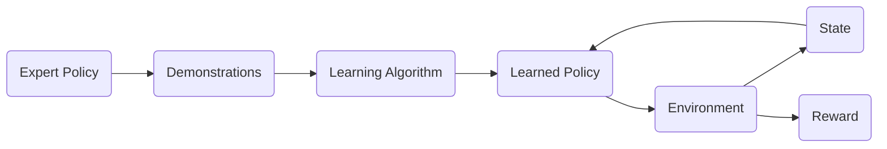

# 模仿学习 (Imitation Learning) 原理与代码实例讲解

## 1. 背景介绍

### 1.1 问题的由来

人工智能的一个长期目标是构建能够在现实世界中自主学习和行动的智能体。传统的机器学习方法通常依赖于大量的人工标注数据，例如图像分类、目标检测等任务。然而，在许多实际应用场景中，获取大量的标注数据往往是昂贵且耗时的。

模仿学习 (Imitation Learning, IL) 作为一种重要的机器学习范式，其目标是通过观察和模仿专家的行为来学习策略，从而解决上述问题。与传统的强化学习 (Reinforcement Learning, RL) 不同，模仿学习不需要明确定义奖励函数，而是直接从专家演示中学习。

### 1.2 研究现状

模仿学习领域近年来取得了显著的进展，涌现出许多有效的算法，例如：

- 行为克隆 (Behavioral Cloning, BC)
- 逆强化学习 (Inverse Reinforcement Learning, IRL)
- 基于生成对抗网络的模仿学习 (Generative Adversarial Imitation Learning, GAIL)

这些算法在机器人控制、自动驾驶、游戏 AI 等领域展现出巨大的应用潜力。

### 1.3 研究意义

模仿学习的研究具有重要的理论意义和实际应用价值：

- **理论意义:** 模仿学习可以帮助我们更好地理解人类和动物的学习机制，为构建更智能的机器学习算法提供启发。
- **实际应用价值:** 模仿学习可以有效降低人工标注数据的成本，加速人工智能在各个领域的应用落地。

### 1.4 本文结构

本文将深入探讨模仿学习的原理、算法和应用，并结合代码实例进行详细讲解。文章结构如下:

- **第二章:** 介绍模仿学习的核心概念和联系，包括行为克隆、逆强化学习、基于生成对抗网络的模仿学习等。
- **第三章:**  详细讲解模仿学习的核心算法原理和具体操作步骤，并分析算法的优缺点。
- **第四章:**  介绍模仿学习的数学模型和公式，并结合案例进行详细讲解。
- **第五章:**  通过项目实践，使用 Python 和 TensorFlow 实现一个简单的模仿学习模型，并对代码进行详细解读。
- **第六章:**  探讨模仿学习的实际应用场景，并展望其未来发展趋势。
- **第七章:**  推荐一些学习模仿学习的工具和资源，包括书籍、论文、开源项目等。
- **第八章:**  总结模仿学习的研究成果、未来发展趋势和挑战。
- **第九章:**  附录：常见问题与解答。


## 2. 核心概念与联系

### 2.1 模仿学习的基本框架

模仿学习的基本框架如下图所示：



- **专家策略 (Expert Policy):**  专家策略是指能够在环境中取得良好表现的策略，例如人类专家玩游戏的策略、自动驾驶系统控制车辆的策略等。
- **行为演示 (Demonstrations):**  行为演示是指专家策略与环境交互产生的数据，包括状态、动作序列等。
- **学习算法 (Learning Algorithm):**  学习算法是指用于从行为演示中学习策略的算法，例如行为克隆、逆强化学习、基于生成对抗网络的模仿学习等。
- **学习策略 (Learned Policy):**  学习策略是指模仿学习算法学习到的策略，其目标是在环境中取得与专家策略相似的表现。
- **环境 (Environment):**  环境是指智能体与之交互的外部世界，例如游戏环境、驾驶环境等。
- **状态 (State):**  状态是指环境在某个时刻的表示，例如游戏画面、车辆行驶状态等。
- **奖励 (Reward):**  奖励是指环境对智能体行为的反馈，用于评估智能体的表现。

### 2.2 行为克隆 (Behavioral Cloning)

行为克隆是最简单的模仿学习算法之一，其核心思想是将专家策略视为一个监督学习问题，直接使用监督学习算法从行为演示中学习策略。

**算法流程：**

1. 收集专家策略与环境交互产生的行为演示数据，包括状态和动作序列。
2. 将状态作为输入，将动作作为输出，训练一个监督学习模型 (例如神经网络) 来预测动作。
3. 使用训练好的模型作为学习策略，在新的环境中进行预测和决策。

**优点：**

- 简单易实现
- 训练速度快

**缺点：**

- 容易出现数据分布偏移问题，导致泛化能力差
- 无法处理专家演示中没有出现过的状态


### 2.3 逆强化学习 (Inverse Reinforcement Learning)

逆强化学习的核心思想是通过观察专家的行为，反推出专家策略背后的奖励函数，然后使用强化学习算法学习最优策略。

**算法流程：**

1. 定义一个参数化的奖励函数，例如线性函数、神经网络等。
2. 使用强化学习算法 (例如 Q-learning) 学习最优策略，使得在学习到的奖励函数下，智能体的期望累积奖励最大化。
3. 通过比较学习到的策略和专家策略的表现，调整奖励函数的参数，使得学习到的策略尽可能接近专家策略。

**优点：**

- 可以学习到专家策略背后的奖励函数，更具有可解释性
- 泛化能力强，可以处理专家演示中没有出现过的状态

**缺点：**

- 算法复杂度高，训练速度慢
- 需要解决奖励函数的优化问题，容易陷入局部最优


### 2.4 基于生成对抗网络的模仿学习 (Generative Adversarial Imitation Learning)

基于生成对抗网络的模仿学习利用生成对抗网络 (Generative Adversarial Networks, GANs) 的思想，训练一个生成器来生成与专家策略相似的行为，并训练一个判别器来区分专家策略和生成器生成的策略。

**算法流程：**

1. 训练一个生成器，其输入为状态，输出为动作，目标是生成与专家策略相似的行为。
2. 训练一个判别器，其输入为状态和动作，输出为一个概率值，表示输入的行为是来自专家策略还是生成器的概率。
3. 通过对抗训练的方式，不断优化生成器和判别器，使得生成器生成的策略能够欺骗判别器，从而学习到与专家策略相似的策略。

**优点：**

- 不需要显式地定义奖励函数
- 可以学习到专家策略的复杂行为模式

**缺点：**

- 训练过程不稳定，容易出现模式崩溃等问题
- 需要大量的计算资源和训练时间

## 3. 核心算法原理 & 具体操作步骤

### 3.1 行为克隆算法原理概述

行为克隆算法的核心思想是将模仿学习问题转化为一个监督学习问题，直接使用监督学习算法从专家演示中学习策略。其基本假设是：**如果我们能够收集到足够多的专家演示数据，那么就可以训练一个模型来准确地预测专家在不同状态下的动作。**

### 3.2 行为克隆算法步骤详解

1. **数据收集:** 收集专家策略与环境交互产生的行为演示数据，包括状态 $s_t$ 和动作 $a_t$ 序列，形成数据集 $D = \{(s_1, a_1), (s_2, a_2), ..., (s_T, a_T)\}$。
2. **模型选择:** 选择一个合适的监督学习模型，例如线性回归、支持向量机、神经网络等。
3. **模型训练:** 将状态 $s_t$ 作为输入，将动作 $a_t$ 作为输出，使用数据集 $D$ 训练选择的监督学习模型。
4. **模型评估:** 使用测试集评估训练好的模型的性能，例如准确率、精确率、召回率等指标。
5. **策略部署:** 将训练好的模型作为学习策略，在新的环境中进行预测和决策。

### 3.3 行为克隆算法优缺点

**优点:**

- 简单易实现
- 训练速度快

**缺点:**

- 容易出现数据分布偏移问题，导致泛化能力差
- 无法处理专家演示中没有出现过的状态

### 3.4 行为克隆算法应用领域

行为克隆算法适用于以下应用场景:

- 专家策略相对简单，行为模式比较固定
- 可以收集到大量的专家演示数据
- 对模型的泛化能力要求不高

## 4. 数学模型和公式 & 详细讲解 & 举例说明

### 4.1 行为克隆算法数学模型构建

行为克隆算法可以形式化为以下优化问题:

$$
\min_{\theta} \frac{1}{T} \sum_{t=1}^{T} L(f_{\theta}(s_t), a_t)
$$

其中:

- $f_{\theta}(s_t)$ 表示参数为 $\theta$ 的模型对状态 $s_t$ 的预测动作
- $L(f_{\theta}(s_t), a_t)$ 表示预测动作 $f_{\theta}(s_t)$ 和真实动作 $a_t$ 之间的损失函数，例如均方误差、交叉熵等
- $T$ 表示专家演示数据的长度

### 4.2 公式推导过程

行为克隆算法的目标是最小化模型预测动作和真实动作之间的差异，因此可以使用损失函数来衡量这种差异。常用的损失函数包括:

- **均方误差 (Mean Squared Error, MSE):** 适用于连续动作空间
  $$
  L(f_{\theta}(s_t), a_t) = ||f_{\theta}(s_t) - a_t||^2
  $$
- **交叉熵 (Cross Entropy):** 适用于离散动作空间
  $$
  L(f_{\theta}(s_t), a_t) = -\sum_{i=1}^{K} a_t^i \log f_{\theta}(s_t)^i
  $$
  其中 $K$ 表示动作空间的大小，$a_t^i$ 表示真实动作 $a_t$ 在第 $i$ 个动作上的 one-hot 编码，$f_{\theta}(s_t)^i$ 表示模型预测动作 $f_{\theta}(s_t)$ 在第 $i$ 个动作上的概率

### 4.3 案例分析与讲解

假设我们想要训练一个模型来模仿人类玩 Atari 游戏 Breakout 的行为。我们可以使用行为克隆算法来实现:

1. **数据收集:** 收集人类玩家玩 Breakout 游戏的视频数据，并将视频帧作为状态，玩家的操作 (左、右、不动) 作为动作，形成数据集。
2. **模型选择:** 选择一个卷积神经网络 (Convolutional Neural Network, CNN) 来作为模型，因为 CNN 擅长处理图像数据。
3. **模型训练:** 使用收集到的数据集训练 CNN 模型，将视频帧作为输入，将玩家的操作作为输出。
4. **模型评估:** 使用测试集评估训练好的模型的性能，例如游戏得分、击中砖块的数量等指标。
5. **策略部署:** 将训练好的 CNN 模型作为学习策略，让模型控制游戏中的球拍，观察模型是否能够模仿人类玩家的行为进行游戏。

### 4.4 常见问题解答

**1. 行为克隆算法容易出现数据分布偏移问题，如何解决?**

- **数据增强:** 对专家演示数据进行增强，例如添加噪声、随机裁剪等，可以增加数据的多样性，缓解数据分布偏移问题。
- **经验回放:** 将学习策略与环境交互产生的数据也加入到训练集中，可以不断调整数据分布，使其更接近真实环境的分布。
- **对抗训练:** 使用生成对抗网络的思想，训练一个生成器来生成与专家策略相似的行为，并训练一个判别器来区分专家策略和生成器生成的策略，可以有效缓解数据分布偏移问题。

**2. 行为克隆算法无法处理专家演示中没有出现过的状态，如何解决?**

- **增加专家演示数据的覆盖度:** 尽可能收集专家在不同状态下的行为演示数据，可以提高模型的泛化能力。
- **使用更强大的模型:** 使用更强大的模型，例如深度神经网络，可以提高模型的学习能力，使其能够处理更复杂的状态空间。
- **结合强化学习:** 将行为克隆算法与强化学习算法相结合，例如使用行为克隆算法初始化强化学习算法的策略，可以利用强化学习算法的探索能力，学习到专家演示数据中没有出现过的状态的策略。

## 5. 项目实践：代码实例和详细解释说明

### 5.1 开发环境搭建

本项目使用 Python 和 TensorFlow 实现一个简单的行为克隆模型，用于模仿 OpenAI Gym 环境 CartPole-v1 中的专家策略。

首先，需要安装以下 Python 库:

```
pip install gym tensorflow numpy matplotlib
```

### 5.2 源代码详细实现

```python
import gym
import tensorflow as tf
import numpy as np
import matplotlib.pyplot as plt

# 定义超参数
learning_rate = 0.01
num_episodes = 1000
batch_size = 32

# 创建 CartPole-v1 环境
env = gym.make('CartPole-v1')

# 定义模型
model = tf.keras.models.Sequential([
  tf.keras.layers.Dense(128, activation='relu', input_shape=(4,)),
  tf.keras.layers.Dense(64, activation='relu'),
  tf.keras.layers.Dense(2, activation='softmax')
])

# 定义优化器和损失函数
optimizer = tf.keras.optimizers.Adam(learning_rate=learning_rate)
loss_fn = tf.keras.losses.CategoricalCrossentropy()

# 收集专家演示数据
expert_data = []
for episode in range(num_episodes):
  state = env.reset()
  done = False
  while not done:
    action = env.action_space.sample() # 随机选择动作
    next_state, reward, done, _ = env.step(action)
    expert_data.append((state, action))
    state = next_state

# 将专家演示数据转换为 NumPy 数组
states = np.array([data[0] for data in expert_data])
actions = np.array([data[1] for data in expert_data])

# 将动作转换为 one-hot 编码
actions = tf.keras.utils.to_categorical(actions, num_classes=2)

# 训练模型
for epoch in range(100):
  for batch in range(len(states) // batch_size):
    with tf.GradientTape() as tape:
      # 前向传播
      predictions = model(states[batch * batch_size:(batch + 1) * batch_size])
      # 计算损失
      loss = loss_fn(actions[batch * batch_size:(batch + 1) * batch_size], predictions)
    # 反向传播
    gradients = tape.gradient(loss, model.trainable_variables)
    optimizer.apply_gradients(zip(gradients, model.trainable_variables))
  print('Epoch:', epoch, 'Loss:', loss.numpy())

# 测试模型
state = env.reset()
done = False
total_reward = 0
while not done:
  env.render()
  # 使用模型预测动作
  action = np.argmax(model.predict(state.reshape(1, -1))[0])
  # 执行动作
  next_state, reward, done, _ = env.step(action)
  # 更新状态和奖励
  state = next_state
  total_reward += reward
env.close()
print('Total reward:', total_reward)

# 绘制训练曲线
plt.plot(history.history['loss'])
plt.title('Model Loss')
plt.ylabel('Loss')
plt.xlabel('Epoch')
plt.show()
```

### 5.3 代码解读与分析

1. **导入库:** 导入所需的 Python 库，包括 gym、tensorflow、numpy、matplotlib。
2. **定义超参数:** 定义模型训练的超参数，包括学习率、训练轮数、批次大小等。
3. **创建环境:** 使用 `gym.make('CartPole-v1')` 创建 CartPole-v1 环境。
4. **定义模型:** 使用 `tf.keras.models.Sequential` 创建一个简单的神经网络模型，包括两个隐藏层和一个输出层。
5. **定义优化器和损失函数:** 使用 `tf.keras.optimizers.Adam` 创建 Adam 优化器，使用 `tf.keras.losses.CategoricalCrossentropy` 创建交叉熵损失函数。
6. **收集专家演示数据:** 使用随机策略与环境交互，收集专家演示数据，包括状态和动作序列。
7. **将专家演示数据转换为 NumPy 数组:** 将专家演示数据转换为 NumPy 数组，方便后续处理。
8. **将动作转换为 one-hot 编码:** 将动作转换为 one-hot 编码，因为模型的输出层使用的是 softmax 激活函数。
9. **训练模型:** 使用训练数据训练模型，并打印训练过程中的损失值。
10. **测试模型:** 使用训练好的模型控制游戏，并打印最终的奖励值。
11. **绘制训练曲线:** 绘制训练过程中的损失曲线，观察模型的收敛情况。

### 5.4 运行结果展示

运行代码后，模型会开始训练，并在控制台打印训练过程中的损失值。训练完成后，模型会控制游戏，并打印最终的奖励值。

## 6. 实际应用场景

模仿学习在许多领域都有着广泛的应用，例如:

- **机器人控制:**  模仿学习可以用于训练机器人完成各种任务，例如抓取物体、行走、导航等，而无需手动编程每个动作。
- **自动驾驶:**  模仿学习可以用于训练自动驾驶汽车，通过学习人类驾驶员的行为来学习驾驶策略。
- **游戏 AI:**  模仿学习可以用于训练游戏 AI，例如 AlphaGo 和 AlphaStar，通过学习人类玩家的行为来提高游戏水平。
- **医疗诊断:**  模仿学习可以用于训练医疗诊断系统，通过学习医生的诊断行为来辅助医生进行诊断。

### 6.1  未来应用展望

随着模仿学习技术的不断发展，未来将会出现更多应用场景，例如:

- **个性化推荐:**  模仿学习可以用于学习用户的偏好，从而提供更精准的个性化推荐服务。
- **智能客服:**  模仿学习可以用于训练智能客服系统，使其能够更自然地与用户进行交流。
- **金融交易:**  模仿学习可以用于学习交易员的行为，从而开发更智能的交易算法。

## 7. 工具和资源推荐

### 7.1 学习资源推荐

- **书籍:**
    - **Reinforcement Learning: An Introduction (Second Edition)** by Richard S. Sutton and Andrew G. Barto
    - **Deep Learning** by Ian Goodfellow, Yoshua Bengio, and Aaron Courville
- **课程:**
    - **CS234: Reinforcement Learning** by Stanford University
    - **Deep RL Bootcamp** by OpenAI

### 7.2 开发工具推荐

- **OpenAI Gym:**  一个用于开发和比较强化学习算法的工具包。
- **TensorFlow:**  一个开源的机器学习平台。
- **PyTorch:**  另一个开源的机器学习平台。

### 7.3 相关论文推荐

- **Generative Adversarial Imitation Learning** by Jonathan Ho and Stefano Ermon
- **Deep Imitation Learning from Observations** by Pieter de Haan, Dinesh Jayaraman, and Sergey Levine
- **Behavioral Cloning from Observation** by Stéphane Ross, Geoffrey Gordon, and Drew Bagnell

### 7.4 其他资源推荐

- **OpenAI Spinning Up in Deep RL:**  一个学习深度强化学习的免费资源。
- **Imitation Learning Repository:**  一个收集模仿学习相关论文、代码和数据的仓库。

## 8. 总结：未来发展趋势与挑战

### 8.1  研究成果总结

模仿学习作为一种重要的机器学习范式，近年来取得了显著的进展，涌现出许多有效的算法，例如行为克隆、逆强化学习、基于生成对抗网络的模仿学习等。这些算法在机器人控制、自动驾驶、游戏 AI 等领域展现出巨大的应用潜力。

### 8.2  未来发展趋势

未来，模仿学习的研究将朝着以下方向发展:

- **提高样本效率:**  目前的模仿学习算法通常需要大量的专家演示数据，如何提高样本效率是未来研究的重点之一。
- **增强泛化能力:**  目前的模仿学习算法在处理专家演示数据中没有出现过的状态时，泛化能力有限，如何增强泛化能力是未来研究的另一个重点。
- **与其他机器学习方法相结合:**  将模仿学习与其他机器学习方法相结合，例如强化学习、元学习等，可以充分发挥各种方法的优势，取得更好的学习效果。

### 8.3  面临的挑战

模仿学习也面临着一些挑战:

- **数据收集困难:**  收集高质量的专家演示数据往往是困难且耗时的。
- **泛化能力有限:**  目前的模仿学习算法在处理专家演示数据中没有出现过的状态时，泛化能力有限。
- **安全性问题:**  模仿学习算法学习到的策略可能存在安全隐患，例如在自动驾驶领域，如果学习到的策略存在缺陷，可能会导致交通事故。

### 8.4  研究展望

模仿学习是一个充满活力和挑战的研究领域，未来将会取得更多突破性的进展，并在更多领域得到应用。

## 9. 附录：常见问题与解答

**1. 模仿学习和强化学习的区别是什么?**

模仿学习和强化学习都是机器学习的重要分支，但它们的目标和方法有所不同。强化学习的目标是通过与环境交互，学习到一个最优策略，使得智能体在环境中获得最大的累积奖励。而模仿学习的目标是通过观察和模仿专家的行为，学习到一个策略，使得智能体的行为尽可能接近专家。

**2. 模仿学习有哪些应用场景?**

模仿学习在机器人控制、自动驾驶、游戏 AI、医疗诊断等领域都有着广泛的应用。

**3. 模仿学习面临哪些挑战?**

模仿学习面临着数据收集困难、泛化能力有限、安全性问题等挑战。

作者：禅与计算机程序设计艺术 / Zen and the Art of Computer Programming
