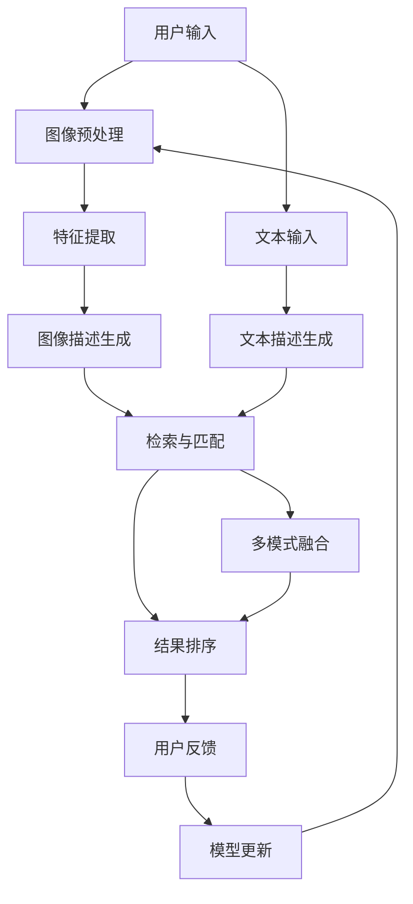

                 

**图像搜索技术在电商领域的应用：发展趋势与未来**

**作者：禅与计算机程序设计艺术 / Zen and the Art of Computer Programming**

## 1. 背景介绍

在电子商务（e-commerce）领域，图像搜索技术（Image Search Technology）扮演着至关重要的角色。随着移动互联网的兴起和用户对视觉内容需求的增加，图像搜索已成为电商平台提高用户体验和销售额的关键因素。本文将深入探讨图像搜索技术在电商领域的应用，其发展趋势，以及未来的展望。

## 2. 核心概念与联系

图像搜索技术在电商领域的应用涉及多种技术，包括计算机视觉、机器学习、自然语言处理等。图1展示了这些技术在电商图像搜索中的关键组成部分。



图1：电商图像搜索技术架构

## 3. 核心算法原理 & 具体操作步骤

### 3.1 算法原理概述

电商图像搜索的核心是图像检索与匹配算法。常用的算法包括向量空间模型（Vector Space Model）、余弦相似度（Cosine Similarity）、局部敏感哈希（Locality-Sensitive Hashing, LSH）等。

### 3.2 算法步骤详解

1. **图像预处理**：对输入图像进行缩放、旋转、归一化等预处理，以提高算法的鲁棒性。
2. **特征提取**：使用深度学习模型（如VGG、ResNet）提取图像的视觉特征。
3. **图像描述生成**：将提取的特征转换为文本描述，常用的方法包括图像Captioning和图像分类。
4. **检索与匹配**：使用余弦相似度或LSH算法在图像库中检索与用户输入最相似的图像。
5. **结果排序**：根据相似度得分对检索结果进行排序。
6. **用户反馈与模型更新**：收集用户反馈，更新图像描述生成模型和检索算法。

### 3.3 算法优缺点

- **优点**：图像检索与匹配算法可以帮助用户快速找到感兴趣的商品，提高用户体验和转化率。
- **缺点**：图像检索的准确性受图像质量、光线、角度等因素影响，且计算量大，实时性有待提高。

### 3.4 算法应用领域

电商图像搜索技术广泛应用于电商平台的商品搜索、推荐系统、视觉广告等领域。

## 4. 数学模型和公式 & 详细讲解 & 举例说明

### 4.1 数学模型构建

电商图像搜索的数学模型可以表示为：

$$S = \arg\max_{S \in \mathcal{D}} \text{sim}(q, S)$$

其中，$q$是用户输入的查询图像，$S$是图像库中的图像，$sim(\cdot, \cdot)$是余弦相似度函数，$\mathcal{D}$是图像库。

### 4.2 公式推导过程

余弦相似度函数定义为：

$$\text{sim}(q, S) = \frac{q \cdot S}{\|q\| \|S\|}$$

其中，$q \cdot S$是向量$q$和$S$的点积，$\|q\|$和$\|S\|$分别是向量$q$和$S$的模长。

### 4.3 案例分析与讲解

假设用户输入的查询图像$q = (1, 2, 3)$，图像库中有一张图像$S = (4, 5, 6)$。则余弦相似度为：

$$\text{sim}(q, S) = \frac{1 \times 4 + 2 \times 5 + 3 \times 6}{\sqrt{1^2 + 2^2 + 3^2} \sqrt{4^2 + 5^2 + 6^2}} = 0.9746$$

## 5. 项目实践：代码实例和详细解释说明

### 5.1 开发环境搭建

本项目使用Python、TensorFlow、OpenCV等常用库。建议使用Anaconda创建虚拟环境，并安装必要的库。

### 5.2 源代码详细实现

以下是余弦相似度计算的简单实现：

```python
import numpy as np

def cosine_similarity(q, S):
    return np.dot(q, S) / (np.linalg.norm(q) * np.linalg.norm(S))

# 用户输入的查询图像
q = np.array([1, 2, 3])

# 图像库中的图像
S = np.array([4, 5, 6])

# 计算余弦相似度
sim = cosine_similarity(q, S)
print(f"余弦相似度：{sim}")
```

### 5.3 代码解读与分析

本代码使用NumPy库计算余弦相似度。`np.dot(q, S)`计算向量$q$和$S$的点积，`np.linalg.norm(q)`和`np.linalg.norm(S)`计算向量$q$和$S$的模长。

### 5.4 运行结果展示

运行上述代码，输出余弦相似度为`0.9746`。

## 6. 实际应用场景

### 6.1 电商平台商品搜索

图像搜索技术可以帮助用户通过上传图片或拍照搜索商品，提高搜索效率和准确性。

### 6.2 视觉广告

电商平台可以根据用户浏览或购买的商品推荐相关广告，提高广告点击率和转化率。

### 6.3 未来应用展望

未来，图像搜索技术将与人工智能、物联网等技术结合，实现更智能化、个性化的电商体验。

## 7. 工具和资源推荐

### 7.1 学习资源推荐

- 图像检索与匹配：[Image Retrieval and Matching](https://www.robots.ox.ac.uk/~vgg/publications/2015/Jegou15/iegov15.pdf)
- 图像Captioning：[Show, Attend and Tell: Neural Image Caption Generation with Visual Attention](https://arxiv.org/abs/1502.03044)

### 7.2 开发工具推荐

- TensorFlow：<https://www.tensorflow.org/>
- OpenCV：<https://opencv.org/>
- PyTorch：<https://pytorch.org/>

### 7.3 相关论文推荐

- [Deep Learning for Image Retrieval: A Survey](https://arxiv.org/abs/1904.05067)
- [Learning Deep Image Similarity for Image Retrieval](https://arxiv.org/abs/1508.06093)

## 8. 总结：未来发展趋势与挑战

### 8.1 研究成果总结

本文介绍了图像搜索技术在电商领域的应用，分析了其核心概念、算法原理、数学模型，并提供了项目实践和工具推荐。

### 8.2 未来发展趋势

未来，图像搜索技术将朝着更智能化、个性化、实时化的方向发展，并与其他技术结合，为电商平台带来更好的用户体验。

### 8.3 面临的挑战

图像搜索技术面临的挑战包括图像质量、光线、角度等因素对检索准确性的影响，以及计算量大导致的实时性问题。

### 8.4 研究展望

未来的研究方向包括图像描述生成模型的改进、多模式融合技术的发展、检索算法的优化等。

## 9. 附录：常见问题与解答

**Q：图像搜索技术的优势是什么？**

**A：**图像搜索技术可以帮助用户快速找到感兴趣的商品，提高用户体验和转化率。

**Q：图像搜索技术的缺点是什么？**

**A：**图像搜索的准确性受图像质量、光线、角度等因素影响，且计算量大，实时性有待提高。

**Q：图像搜索技术在电商领域的应用前景如何？**

**A：**未来，图像搜索技术将与人工智能、物联网等技术结合，实现更智能化、个性化的电商体验。

**作者署名：作者：禅与计算机程序设计艺术 / Zen and the Art of Computer Programming**

