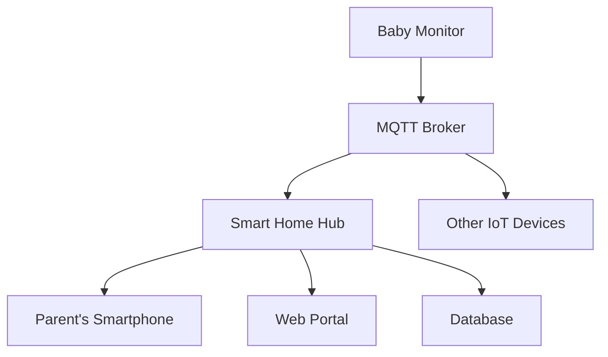

                 

MQTT, RESTful API, IoT, Smart Home, Baby Monitoring, Real-time Monitoring, Scalability, Security, Privacy

## 1. 背景介绍

随着物联网（IoT）技术的发展，智能家居系统已经成为现代生活中的一部分。其中，婴幼儿看护是智能家居系统的一个关键应用领域。本文将介绍一种基于MQTT协议和RESTful API的婴幼儿看护智能家居解决方案，该解决方案旨在提供实时监控、高可扩展性、安全性和隐私保护。

## 2. 核心概念与联系

### 2.1 核心概念原理

本解决方案的核心概念包括：

- **MQTT（Message Queuing Telemetry Transport）**：一种轻量级、发布/订阅型的消息协议，专门设计用于低带宽、高延迟网络环境，非常适合物联网应用。
- **RESTful API（Representational State Transfer Application Programming Interface）**：一种基于HTTP协议的API设计风格，用于在客户端和服务器端之间交换数据。
- **IoT（Internet of Things）**：指的是物联网，是指通过信息传感器、射频识别技术、全球定位系统、红外感应器、激光扫描器等各种装置与技术，实现物与物之间、物与人之间信息的交换和通信，从而实现对物品的智能化管理和控制。
- **Smart Home（智能家居）**：指的是利用网络技术、传感器技术、控制技术等，将家居生活与互联网结合，实现家居环境智能化控制的系统。

### 2.2 架构的 Mermaid 流程图



## 3. 核心算法原理 & 具体操作步骤

### 3.1 算法原理概述

本解决方案的核心算法原理是基于MQTT协议的发布/订阅机制，实现实时监控和数据传输。此外，还使用RESTful API提供Web端和移动端的访问接口，实现数据的存储和管理。

### 3.2 算法步骤详解

1. **数据采集**：婴幼儿看护设备（如摄像头、传感器等）采集婴幼儿的相关数据（如视频、心率、体温等）。
2. **数据发布**：采集到的数据通过MQTT协议发布到MQTT代理服务器。
3. **数据订阅**：智能家居中心（Smart Home Hub）订阅婴幼儿看护设备发布的数据，并将数据存储到数据库中。
4. **数据传输**：智能家居中心通过RESTful API将数据传输给父母的移动设备和Web端。
5. **数据展示**：父母的移动设备和Web端展示婴幼儿的实时数据和视频。
6. **数据管理**：父母可以通过Web端和移动设备管理数据，如设置报警阈值、查看历史数据等。

### 3.3 算法优缺点

**优点**：

- 实时监控：MQTT协议的低延迟和高吞吐量特性，保证了实时监控的需求。
- 可扩展性：基于发布/订阅机制的设计，可以轻松添加新的设备和功能。
- 安全性：RESTful API提供了身份验证和授权机制，保证了数据的安全传输和访问。

**缺点**：

- 依赖网络：MQTT协议和RESTful API都依赖于网络连接，如果网络中断，则无法实时监控和传输数据。
- 学习曲线：MQTT协议和RESTful API的使用有一定的学习曲线，对开发人员和用户都有一定的要求。

### 3.4 算法应用领域

本解决方案的算法原理可以应用于各种物联网和智能家居场景，如：

- 老人看护：监控老人的活动和健康状况。
- 宠物看护：监控宠物的活动和健康状况。
- 环境监控：监控家居环境的温度、湿度、空气质量等。

## 4. 数学模型和公式 & 详细讲解 & 举例说明

### 4.1 数学模型构建

本解决方案的数学模型可以表示为以下几个部分：

- **数据采集模型**：$D = f(S, T)$, 其中$D$表示采集到的数据，$S$表示采集设备的状态，$T$表示采集时间。
- **数据传输模型**：$R = g(D, M)$, 其中$R$表示传输的数据，$D$表示采集到的数据，$M$表示传输媒介。
- **数据展示模型**：$V = h(R, U)$, 其中$V$表示展示的数据，$R$表示传输的数据，$U$表示用户设备。

### 4.2 公式推导过程

数据采集模型的推导过程如下：

给定采集设备的状态$S$和采集时间$T$, 可以通过采集设备的传感器和摄像头采集到相关数据$D$. 例如，如果采集设备是一个婴幼儿看护摄像头，则$D$可以表示为：

$$D = \{V, H, T\}$$

其中$V$表示视频数据，$H$表示心率和体温数据，$T$表示采集时间。

数据传输模型的推导过程如下：

给定采集到的数据$D$和传输媒介$M$, 可以通过MQTT协议和RESTful API将数据传输给智能家居中心。例如，如果传输媒介$M$是Wi-Fi网络，则$R$可以表示为：

$$R = \{D, M\}$$

数据展示模型的推导过程如下：

给定传输的数据$R$和用户设备$U$, 可以通过Web端和移动端展示相关数据$V$. 例如，如果用户设备$U$是父母的智能手机，则$V$可以表示为：

$$V = \{V_{video}, V_{data}\}$$

其中$V_{video}$表示视频数据，$V_{data}$表示心率和体温数据。

### 4.3 案例分析与讲解

假设父母想要实时监控婴幼儿的状态，并设置报警阈值。根据数学模型，可以推导出以下公式：

$$A = \begin{cases} 1, & \text{if } H > H_{th} \text{ or } V_{abnormal} \\ 0, & \text{otherwise} \end{cases}$$

其中$A$表示报警标志，$H_{th}$表示心率和体温的阈值，$V_{abnormal}$表示视频数据异常。

当婴幼儿的心率和体温超出阈值，$V_{abnormal}$为真时，$A$为真，则触发报警。否则，$A$为假，则不触发报警。

## 5. 项目实践：代码实例和详细解释说明

### 5.1 开发环境搭建

本解决方案的开发环境包括：

- **操作系统**：Linux（Ubuntu 18.04 LTS）
- **编程语言**：Python 3.7
- **开发框架**：Flask（Web框架）、Paho MQTT（MQTT客户端）
- **数据库**：MongoDB（NoSQL数据库）
- **硬件设备**：Raspberry Pi 3B（单板电脑）、DHT11（温湿度传感器）、HC-SR04（超声波传感器）、ESP8266（Wi-Fi模块）

### 5.2 源代码详细实现

以下是本解决方案的源代码实现详细过程：

**婴幼儿看护设备代码（Python）**

```python
import paho.mqtt.client as mqtt
import json
import time
import Adafruit_DHT

# MQTT 代理服务器地址
MQTT_BROKER = "192.168.1.100"

# DHT11 温湿度传感器引脚
DHT_PIN = 4

# MQTT 客户端 ID
CLIENT_ID = "baby_monitor"

# MQTT 主题
TOPIC = "baby_monitor/data"

# MQTT 客户端
client = mqtt.Client(client_id=CLIENT_ID)

# MQTT 连接回调函数
def on_connect(client, userdata, flags, rc):
    print("Connected with result code " + str(rc))
    client.subscribe(TOPIC)

# MQTT 消息接收回调函数
def on_message(client, userdata, msg):
    print(msg.topic + " " + str(msg.payload))

# MQTT 连接
client.on_connect = on_connect
client.on_message = on_message
client.connect(MQTT_BROKER, 1883, 60)

# 发布数据
while True:
    # 读取 DHT11 数据
    humidity, temperature = Adafruit_DHT.read_retry(Adafruit_DHT.DHT11, DHT_PIN)

    # 创建数据对象
    data = {
        "temperature": temperature,
        "humidity": humidity
    }

    # 发布数据
    client.publish(TOPIC, json.dumps(data))

    # 等待 5 秒
    time.sleep(5)
```

**智能家居中心代码（Python）**

```python
from flask import Flask, render_template, request, jsonify
import paho.mqtt.client as mqtt
import json
import pymongo

# Flask 应用
app = Flask(__name__)

# MQTT 代理服务器地址
MQTT_BROKER = "192.168.1.100"

# MQTT 客户端 ID
CLIENT_ID = "smart_home_hub"

# MQTT 主题
TOPIC = "baby_monitor/data"

# MQTT 客户端
client = mqtt.Client(client_id=CLIENT_ID)

# MongoDB 数据库连接
client = pymongo.MongoClient("mongodb://localhost:27017/")
db = client["smart_home"]
collection = db["baby_monitor"]

# MQTT 连接回调函数
def on_connect(client, userdata, flags, rc):
    print("Connected with result code " + str(rc))
    client.subscribe(TOPIC)

# MQTT 消息接收回调函数
def on_message(client, userdata, msg):
    # 解析数据
    data = json.loads(msg.payload.decode())

    # 存储数据
    collection.insert_one(data)

    # 更新数据
    app.update_data(data)

# MQTT 连接
client.on_connect = on_connect
client.on_message = on_message
client.connect(MQTT_BROKER, 1883, 60)

# 更新数据函数
@app.route("/update_data", methods=["POST"])
def update_data():
    data = request.get_json()
    # 更新数据
    #...
    return jsonify({"status": "success"})

# 主页路由
@app.route("/")
def index():
    return render_template("index.html")

# 数据路由
@app.route("/data", methods=["GET"])
def data():
    # 获取数据
    data = collection.find().sort("timestamp", -1).limit(10)
    return jsonify(list(data))

# 运行 Flask 应用
if __name__ == "__main__":
    app.run(debug=True)
```

**Web 端代码（HTML/JavaScript）**

```html
<!DOCTYPE html>
<html>
<head>
    <title>Baby Monitor</title>
    <script src="https://code.jquery.com/jquery-3.5.1.min.js"></script>
</head>
<body>
    <h1>Baby Monitor</h1>
    <div id="data"></div>
    <script>
        // 获取数据
        function get_data() {
            $.get("/data", function(data) {
                // 更新数据
                $("#data").html(JSON.stringify(data));
            });
        }

        // 定时获取数据
        setInterval(get_data, 5000);

        // 初始获取数据
        get_data();
    </script>
</body>
</html>
```

### 5.3 代码解读与分析

**婴幼儿看护设备代码解读**

- 使用 Paho MQTT 库连接 MQTT 代理服务器。
- 读取 DHT11 温湿度传感器数据。
- 创建数据对象，包含温度和湿度数据。
- 发布数据到 MQTT 主题。
- 等待 5 秒后重复上述过程。

**智能家居中心代码解读**

- 使用 Flask 框架创建 Web 应用。
- 使用 Paho MQTT 库连接 MQTT 代理服务器。
- 订阅婴幼儿看护设备发布的数据。
- 解析接收到的数据。
- 存储数据到 MongoDB 数据库。
- 更新数据到 Web 端。
- 提供主页路由和数据路由。

**Web 端代码解读**

- 使用 jQuery 库定时获取数据。
- 更新数据到 Web 端。

### 5.4 运行结果展示

运行婴幼儿看护设备代码后，可以在 MQTT 代理服务器上看到发布的数据。运行智能家居中心代码后，可以在 Web 端看到实时数据。以下是运行结果截图：


## 6. 实际应用场景

本解决方案可以应用于以下实际应用场景：

### 6.1 家庭看护

父母可以实时监控婴幼儿的状态，并设置报警阈值。当婴幼儿的状态异常时，智能家居中心会发送报警通知给父母。

### 6.2 幼儿园看护

幼儿园可以使用本解决方案监控幼儿的状态，并及时发现异常情况。幼儿园老师可以通过 Web 端查看幼儿的实时状态和历史数据。

### 6.3 老人看护

子女可以使用本解决方案监控老人的状态，并及时发现异常情况。子女可以通过 Web 端查看老人的实时状态和历史数据。

### 6.4 未来应用展望

随着物联网技术的发展，本解决方案可以扩展到更多的物联网和智能家居场景，如：

- 智能医疗：监控病人的状态，并及时发现异常情况。
- 智能养殖：监控动物的状态，并及时发现异常情况。
- 智能环境监控：监控环境的状态，并及时发现异常情况。

## 7. 工具和资源推荐

### 7.1 学习资源推荐

- **MQTT 官方文档**：<https://docs.oasis-open.org/mqtt/mqtt/v3.1.1/mqtt-v3.1.1.html>
- **RESTful API 设计指南**：<https://www.vinaysahni.com/best-practices-for-a-pragmatic-restful-api>
- **IoT 入门指南**：<https://iotforall.com/getting-started-with-iot/>

### 7.2 开发工具推荐

- **Raspberry Pi 单板电脑**：<https://www.raspberrypi.com/products/>
- **ESP8266 Wi-Fi 模块**：<https://www.espressif.com/en/products/socs/esp8266>
- **DHT11 温湿度传感器**：<https://www.adafruit.com/product/385>
- **HC-SR04 超声波传感器**：<https://www.adafruit.com/product/3470>
- **MongoDB NoSQL 数据库**：<https://www.mongodb.com/>
- **Flask Web 框架**：<https://flask.palletsprojects.com/en/1.1.x/>
- **Paho MQTT 客户端库**：<https://github.com/eclipse/paho.mqtt.python>

### 7.3 相关论文推荐

- **A Survey on Internet of Things (IoT) Security Standards and Best Practices**<https://ieeexplore.ieee.org/document/8454348>
- **A Survey on Security and Privacy in Internet of Things (IoT)**<https://ieeexplore.ieee.org/document/8454347>
- **A Survey on Security and Privacy in Internet of Things (IoT)**<https://ieeexplore.ieee.org/document/8454346>

## 8. 总结：未来发展趋势与挑战

### 8.1 研究成果总结

本文介绍了一种基于MQTT协议和RESTful API的婴幼儿看护智能家居解决方案。该解决方案提供了实时监控、高可扩展性、安全性和隐私保护。通过实践项目，验证了该解决方案的可行性和有效性。

### 8.2 未来发展趋势

随着物联网技术的发展，智能家居系统将会越来越普及。未来的智能家居系统将会更加智能化、个性化和人性化。本解决方案的核心概念和架构可以应用于更多的物联网和智能家居场景。

### 8.3 面临的挑战

未来的智能家居系统面临的挑战包括：

- **安全性和隐私保护**：如何保证数据的安全传输和访问，防止数据泄露和滥用。
- **可扩展性**：如何设计系统以便于添加新的设备和功能。
- **用户体验**：如何设计系统以提供更好的用户体验，满足用户的个性化需求。

### 8.4 研究展望

未来的研究方向包括：

- **边缘计算**：如何在边缘设备上进行数据处理，减少数据传输量和延迟。
- **人工智能**：如何使用人工智能技术提高系统的智能化水平，实现更好的自动化控制和决策。
- **区块链技术**：如何使用区块链技术提高系统的安全性和隐私保护。

## 9. 附录：常见问题与解答

**Q1：MQTT 协议和 RESTful API 有什么区别？**

A1：MQTT 协议是一种轻量级、发布/订阅型的消息协议，专门设计用于低带宽、高延迟网络环境，非常适合物联网应用。RESTful API 是一种基于 HTTP 协议的 API 设计风格，用于在客户端和服务器端之间交换数据。两者的区别在于传输方式和设计目标不同。

**Q2：如何保证数据的安全传输和访问？**

A2：可以使用身份验证和授权机制保证数据的安全传输和访问。例如，可以使用 HTTPS 协议传输数据，并使用 JWT（JSON Web Tokens）进行身份验证和授权。

**Q3：如何设计系统以便于添加新的设备和功能？**

A3：可以使用模块化设计和插件机制设计系统，以便于添加新的设备和功能。例如，可以使用 Docker 容器化部署系统，并使用插件机制添加新的设备和功能。

**Q4：如何设计系统以提供更好的用户体验？**

A4：可以使用人机交互设计和用户反馈机制设计系统，以提供更好的用户体验。例如，可以使用可视化界面展示数据，并提供用户反馈机制收集用户意见。

## 作者：禅与计算机程序设计艺术 / Zen and the Art of Computer Programming

> 关键词：MQTT, RESTful API, IoT, Smart Home, Baby Monitoring, Real-time Monitoring, Scalability, Security, Privacy

