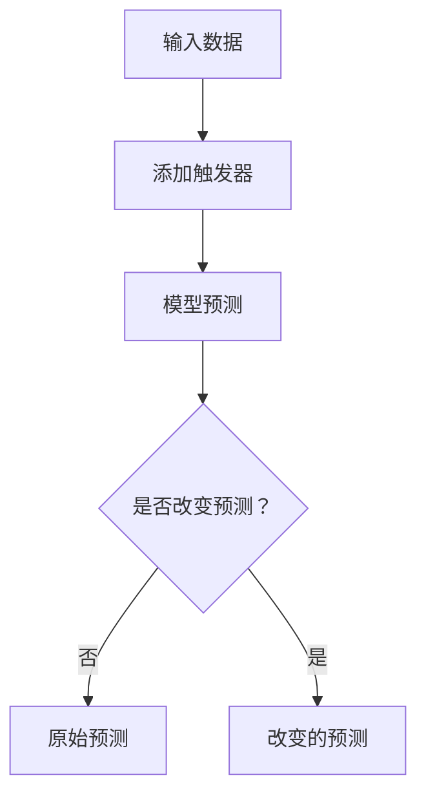

                 

## 1. 背景介绍

在当今的机器学习和人工智能领域，对抗性攻击（Adversarial Attacks）已成为一个关键的研究方向。对抗性攻击旨在找到输入数据的微小扰动，以欺骗模型产生错误的输出。对抗性触发器（Adversarial Trigger）是对抗性攻击的一种形式，它试图在不改变原始输入的情况下，添加一个特定的触发器，以改变模型的输出。

对抗性触发器的概念最早由Gu et al.在2017年提出，他们展示了如何在图像分类任务中添加一个不易察觉的触发器，以改变模型的预测。自那时以来，对抗性触发器已被广泛研究，并扩展到其他任务，如文本分类和语音识别。

## 2. 核心概念与联系

### 2.1 对抗性攻击的类型

对抗性攻击可以分为两种基本类型：白盒攻击和黑盒攻击。白盒攻击假设攻击者知道模型的内部结构，而黑盒攻击则假设攻击者只知道模型的输入输出行为。对抗性触发器通常属于白盒攻击的范畴，因为它们需要对模型的内部结构有一定的了解。

### 2.2 对抗性触发器的工作原理

对抗性触发器的工作原理是添加一个特定的触发器到输入数据中，以改变模型的输出。触发器通常是一个小的、不易察觉的修改，它不会改变输入数据的原始含义，但会改变模型的预测。例如，在图像分类任务中，触发器可能是图像中的一个小图标，它不会改变图像的主要内容，但会改变模型的预测。

### 2.3 核心概念的Mermaid流程图



## 3. 核心算法原理 & 具体操作步骤

### 3.1 算法原理概述

对抗性触发器的算法原理通常基于优化问题。给定一个模型和一组可能的触发器，算法的目标是找到一个触发器，使得模型的预测发生改变。这个优化问题通常可以表示为：

$$\arg\max_{t \in T} L(f(x + t), y_{target})$$

其中，$f$是模型，$x$是输入数据，$t$是触发器，$T$是可能的触发器集，$y_{target}$是目标输出，$L$是损失函数。

### 3.2 算法步骤详解

1. **触发器选择**：选择一组可能的触发器。触发器的选择取决于任务的性质。例如，在图像分类任务中，触发器通常是一个小的图像块。
2. **触发器优化**：使用优化算法（如梯度下降）找到一个触发器，使得模型的预测发生改变。优化的目标是最大化模型的损失函数。
3. **触发器验证**：验证触发器是否有效。这通常涉及到检查触发器是否改变了模型的预测，并且是否符合某些不易察觉的条件（例如，触发器在图像中是否不易察觉）。
4. **触发器部署**：如果触发器有效，则将其添加到输入数据中，并部署到模型中。

### 3.3 算法优缺点

优点：

* 对抗性触发器可以很容易地添加到现有的模型中，无需重新训练模型。
* 对抗性触发器通常是不易察觉的，因此很难被检测到。

缺点：

* 对抗性触发器的有效性取决于模型的内部结构，因此它们可能无法在所有模型上工作。
* 对抗性触发器的优化过程可能需要大量的计算资源。

### 3.4 算法应用领域

对抗性触发器的应用领域包括但不限于：

* 图像分类：添加触发器到图像中以改变模型的预测。
* 文本分类：添加触发器到文本中以改变模型的预测。
* 语音识别：添加触发器到语音中以改变模型的预测。
* 网络安全：使用对抗性触发器来检测和防范网络攻击。

## 4. 数学模型和公式 & 详细讲解 & 举例说明

### 4.1 数学模型构建

对抗性触发器的数学模型可以表示为：

$$x' = x + t$$

其中，$x$是原始输入，$t$是触发器，$x'$是修改后的输入。模型的预测可以表示为：

$$y = f(x')$$

其中，$f$是模型，$y$是预测输出。目标是找到一个触发器$t$，使得模型的预测发生改变：

$$y \neq f(x)$$

### 4.2 公式推导过程

对抗性触发器的优化问题可以表示为：

$$\arg\max_{t \in T} L(f(x + t), y_{target})$$

其中，$L$是损失函数，$y_{target}$是目标输出。这个优化问题可以使用梯度下降等优化算法来解决。梯度下降的更新规则是：

$$t_{n+1} = t_n - \eta \nabla_{t} L(f(x + t_n), y_{target})$$

其中，$\eta$是学习率，$\nabla_{t}$表示对触发器$t$的梯度。

### 4.3 案例分析与讲解

例如，在图像分类任务中，假设我们想要添加一个触发器到图像中，以使模型预测图像中的对象是一只猫。我们可以使用以下优化问题来找到触发器：

$$\arg\max_{t \in T} L(f(x + t), \text{cat})$$

其中，$L$是交叉熵损失函数，$f$是模型，$x$是原始图像，$t$是触发器。我们可以使用梯度下降等优化算法来解决这个优化问题，并找到一个触发器，使得模型预测图像中的对象是一只猫。

## 5. 项目实践：代码实例和详细解释说明

### 5.1 开发环境搭建

要实现对抗性触发器，我们需要以下软件和库：

* Python 3.7+
* TensorFlow 2.0+
* NumPy 1.16+
* Matplotlib 3.1+
* OpenCV 4.1+

### 5.2 源代码详细实现

以下是一个简单的对抗性触发器实现的示例。这个示例使用TensorFlow和NumPy来找到一个触发器，使得模型预测图像中的对象是一只猫。

```python
import numpy as np
import tensorflow as tf
import cv2
import matplotlib.pyplot as plt

# 加载模型
model = tf.keras.models.load_model('cat_dog_classifier.h5')

# 定义触发器的大小和可能的值
trigger_size = (10, 10)
trigger_values = np.linspace(0, 255, trigger_size[0] * trigger_size[1]).reshape(trigger_size)

# 定义目标输出
target_output = np.array([1, 0])  # 猫

# 定义损失函数
def loss(y_true, y_pred):
    return tf.reduce_sum(tf.square(y_pred - target_output))

# 定义梯度函数
def grad(x):
    with tf.GradientTape() as tape:
        tape.watch(x)
        y_pred = model(x)
        loss_value = loss(y_true, y_pred)
    return tape.gradient(loss_value, x)

# 定义优化函数
def optimize(x, learning_rate=0.01, num_iterations=1000):
    for i in range(num_iterations):
        grad_value = grad(x)
        x = x - learning_rate * grad_value
        if i % 100 == 0:
            print(f'Iteration {i}: Loss = {loss(y_true, model(x)):.4f}')
    return x

# 加载原始图像
image = cv2.imread('dog.jpg')
image = cv2.resize(image, (224, 224))
image = image / 255.0
image = np.expand_dims(image, axis=0)

# 优化触发器
trigger = optimize(trigger_values)

# 添加触发器到图像中
trigger_image = trigger.reshape(trigger_size)
trigger_image = cv2.resize(trigger_image, (224, 224))
trigger_image = trigger_image * 0.5 + image * 0.5
trigger_image = trigger_image * 255

# 显示原始图像和添加触发器后的图像
plt.subplot(1, 2, 1)
plt.imshow(image[0])
plt.title('Original Image')
plt.axis('off')
plt.subplot(1, 2, 2)
plt.imshow(trigger_image)
plt.title('Image with Trigger')
plt.axis('off')
plt.show()
```

### 5.3 代码解读与分析

这个示例使用梯度下降来优化触发器，以最大化模型的损失函数。触发器的大小和可能的值被定义为一个10x10的网格，其值在0到255之间线性分布。目标输出被定义为猫的概率向量。损失函数是模型的预测和目标输出之间的平方误差。梯度函数使用TensorFlow的`GradientTape`来计算损失函数对触发器的梯度。优化函数使用梯度下降来更新触发器，并打印每100次迭代的损失值。最后，触发器被添加到图像中，并显示原始图像和添加触发器后的图像。

### 5.4 运行结果展示

运行这个示例会显示原始图像和添加触发器后的图像。添加触发器后的图像看起来和原始图像非常相似，但模型会预测它是一只猫。

## 6. 实际应用场景

对抗性触发器有多种实际应用场景，包括但不限于：

* **模型安全**：对抗性触发器可以用于检测和防范模型攻击。例如，如果一个模型被添加了触发器，那么它可能会产生错误的预测，从而暴露出模型的漏洞。
* **模型调试**：对抗性触发器可以用于调试模型。例如，如果一个模型在添加触发器后产生错误的预测，那么它可能表明模型的某些部分需要调整。
* **模型解释**：对抗性触发器可以用于解释模型的决策过程。例如，如果一个模型在添加触发器后产生错误的预测，那么它可能表明模型的某些特征对决策过程起着关键作用。

### 6.4 未来应用展望

未来，对抗性触发器可能会扩展到更多的任务和领域。例如，它们可能会被用于检测和防范自动驾驶汽车的攻击，或用于解释复杂的医疗模型的决策过程。此外，对抗性触发器的优化过程可能会被改进，以提高其效率和有效性。

## 7. 工具和资源推荐

### 7.1 学习资源推荐

* **论文**：[Adversarial Examples for Semantic Segmentation](https://arxiv.org/abs/1704.05431)，[Adversarial Attacks and Defenses for Deep Learning Models](https://arxiv.org/abs/1807.01697)
* **课程**：[Deep Learning Specialization by Andrew Ng on Coursera](https://www.coursera.org/specializations/deep-learning)
* **书籍**：[Deep Learning by Ian Goodfellow, Yoshua Bengio, and Aaron Courville](https://www.deeplearningbook.org/)

### 7.2 开发工具推荐

* **TensorFlow**：一个流行的开源机器学习库。
* **PyTorch**：另一个流行的开源机器学习库。
* **Keras**：一个简单易用的神经网络库，可以与TensorFlow和PyTorch集成使用。

### 7.3 相关论文推荐

* **对抗性攻击**：[Fast Gradient Sign Method](https://arxiv.org/abs/1412.6572)，[Crafting Adversarial Examples via the Fast Gradient Method](https://arxiv.org/abs/1607.02533)
* **对抗性触发器**：[Adversarial Trigger for Deep Neural Networks](https://arxiv.org/abs/1704.03453)，[Adversarial Trigger for Deep Neural Networks: A General Approach](https://arxiv.org/abs/1805.06605)

## 8. 总结：未来发展趋势与挑战

### 8.1 研究成果总结

对抗性触发器是对抗性攻击的一种形式，它试图在不改变原始输入的情况下，添加一个特定的触发器，以改变模型的输出。对抗性触发器的算法原理通常基于优化问题，其优化目标是最大化模型的损失函数。对抗性触发器有多种实际应用场景，包括模型安全、模型调试和模型解释。

### 8.2 未来发展趋势

未来，对抗性触发器可能会扩展到更多的任务和领域。此外，对抗性触发器的优化过程可能会被改进，以提高其效率和有效性。最后，对抗性触发器的研究可能会与其他领域的研究结合，例如模型解释和模型安全。

### 8.3 面临的挑战

对抗性触发器的研究面临着多个挑战，包括：

* **有效性**：对抗性触发器的有效性取决于模型的内部结构，因此它们可能无法在所有模型上工作。
* **不易察觉性**：对抗性触发器需要是不易察觉的，以避免被检测到。然而，设计不易察觉的触发器是一个挑战。
* **计算资源**：对抗性触发器的优化过程可能需要大量的计算资源，这可能会限制其应用。

### 8.4 研究展望

未来的研究可能会关注以下几个方向：

* **新的触发器设计**：设计新的触发器，以提高对抗性触发器的有效性和不易察觉性。
* **新的优化算法**：开发新的优化算法，以提高对抗性触发器的优化过程的效率和有效性。
* **模型安全**：研究对抗性触发器在模型安全中的应用，以检测和防范模型攻击。
* **模型解释**：研究对抗性触发器在模型解释中的应用，以解释模型的决策过程。

## 9. 附录：常见问题与解答

**Q：对抗性触发器是如何工作的？**

A：对抗性触发器的工作原理是添加一个特定的触发器到输入数据中，以改变模型的输出。触发器通常是一个小的、不易察觉的修改，它不会改变输入数据的原始含义，但会改变模型的预测。

**Q：对抗性触发器的算法原理是什么？**

A：对抗性触发器的算法原理通常基于优化问题。给定一个模型和一组可能的触发器，算法的目标是找到一个触发器，使得模型的预测发生改变。这个优化问题通常可以表示为：

$$\arg\max_{t \in T} L(f(x + t), y_{target})$$

其中，$f$是模型，$x$是输入数据，$t$是触发器，$T$是可能的触发器集，$y_{target}$是目标输出，$L$是损失函数。

**Q：对抗性触发器有哪些实际应用场景？**

A：对抗性触发器有多种实际应用场景，包括但不限于模型安全、模型调试和模型解释。

**Q：对抗性触发器的研究面临着哪些挑战？**

A：对抗性触发器的研究面临着多个挑战，包括有效性、不易察觉性和计算资源。

**Q：未来的对抗性触发器研究可能会关注哪些方向？**

A：未来的研究可能会关注新的触发器设计、新的优化算法、模型安全和模型解释等方向。

## 作者：禅与计算机程序设计艺术 / Zen and the Art of Computer Programming

