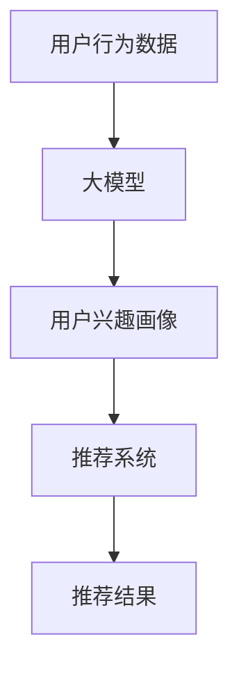

                 

**大模型在推荐系统用户兴趣演化建模中的应用**

**作者：禅与计算机程序设计艺术 / Zen and the Art of Computer Programming**

## 1. 背景介绍

随着互联网的发展，推荐系统已成为各大平台的标配，用户兴趣的动态变化对推荐系统的性能提出了挑战。大模型在理解用户兴趣演化方面展示了强大的能力，本文将探讨大模型在推荐系统用户兴趣演化建模中的应用。

## 2. 核心概念与联系

### 2.1 核心概念

- **大模型（Large Model）**：指具有数十亿甚至数千亿参数的模型，能够理解和生成人类语言、图像等复杂数据。
- **用户兴趣演化（User Interest Evolution）**：指用户兴趣随时间变化的动态过程。
- **推荐系统（Recommender System）**：指根据用户的历史行为和兴趣，向用户推荐个性化内容的系统。

### 2.2 核心概念联系

大模型可以学习用户的兴趣，并预测其兴趣的演化趋势，从而为推荐系统提供更准确的用户画像，提高推荐系统的性能。下图展示了大模型在推荐系统中的位置：



## 3. 核心算法原理 & 具体操作步骤

### 3.1 算法原理概述

大模型在用户兴趣演化建模中的核心原理是学习用户的兴趣表示，并预测其兴趣的变化。常用的方法包括：

- **序列到序列（Seq2Seq）模型**：将用户的兴趣表示视为一个序列，预测其未来的兴趣。
- **变分自编码器（VAE）**：学习用户兴趣表示的分布，并预测其未来的分布。
- **transformer模型**：学习用户兴趣表示的上下文信息，预测其未来的兴趣。

### 3.2 算法步骤详解

1. **数据预处理**：收集用户的行为数据，如点击、浏览、购买等，并对数据进行清洗、去重、分类等预处理。
2. **兴趣表示学习**：使用大模型学习用户的兴趣表示，如词嵌入、用户兴趣向量等。
3. **兴趣演化建模**：使用大模型预测用户兴趣的未来变化，如Seq2Seq模型预测未来兴趣序列，VAE预测未来兴趣分布等。
4. **推荐系统集成**：将预测的用户兴趣输入推荐系统，生成个性化推荐结果。

### 3.3 算法优缺点

**优点**：

- 大模型可以学习用户兴趣的复杂变化，提高推荐系统的准确性。
- 大模型可以理解用户兴趣的上下文信息，提高推荐系统的个性化水平。

**缺点**：

- 大模型训练和推理需要大量的计算资源。
- 大模型可能存在过拟合的问题，导致推荐系统的性能下降。

### 3.4 算法应用领域

大模型在推荐系统用户兴趣演化建模中的应用有广泛的领域，包括但不限于：

- 电商平台：根据用户的购买历史和兴趣预测其未来的购买意向。
- 视频平台：根据用户的观看历史和兴趣预测其未来的观看偏好。
- 新闻平台：根据用户的阅读历史和兴趣预测其未来的阅读偏好。

## 4. 数学模型和公式 & 详细讲解 & 举例说明

### 4.1 数学模型构建

设用户的兴趣表示为$\mathbf{u}_t \in \mathbb{R}^d$，其中$d$为兴趣表示的维度。大模型的目标是学习一个函数$f(\mathbf{u}_t, \theta)$，预测用户在时间$t+1$的兴趣表示$\mathbf{u}_{t+1}$，其中$\theta$为模型的参数。

### 4.2 公式推导过程

在Seq2Seq模型中，函数$f(\mathbf{u}_t, \theta)$可以表示为：

$$f(\mathbf{u}_t, \theta) = \text{Decoder}(\text{Encoder}(\mathbf{u}_t, \theta), \theta)$$

其中，Encoder和Decoder都是transformer模型。在VAE中，函数$f(\mathbf{u}_t, \theta)$可以表示为：

$$f(\mathbf{u}_t, \theta) = \mu(\mathbf{u}_t, \theta) + \sigma(\mathbf{u}_t, \theta) \odot \epsilon$$

其中，$\mu(\mathbf{u}_t, \theta)$和$\sigma(\mathbf{u}_t, \theta)$都是全连接层，$\epsilon \sim \mathcal{N}(0, 1)$，$\odot$表示元素-wise乘法。

### 4.3 案例分析与讲解

例如，在电商平台中，用户的兴趣表示可以是一个向量，表示用户对不同商品类别的偏好。大模型可以学习用户的兴趣表示，并预测其未来的兴趣表示。如果用户的兴趣表示在时间$t$为$\mathbf{u}_t = [0.2, 0.3, 0.5]$，表示用户对商品类别1、2、3的偏好分别为0.2、0.3、0.5。大模型预测的用户在时间$t+1$的兴趣表示为$\mathbf{u}_{t+1} = [0.1, 0.4, 0.5]$，表示用户对商品类别1、2、3的偏好分别为0.1、0.4、0.5。推荐系统可以根据$\mathbf{u}_{t+1}$向用户推荐商品。

## 5. 项目实践：代码实例和详细解释说明

### 5.1 开发环境搭建

本项目使用Python作为开发语言，并使用PyTorch作为深度学习框架。开发环境包括：

- Python 3.8
- PyTorch 1.8
- Transformers 4.5

### 5.2 源代码详细实现

以下是Seq2Seq模型的实现代码：

```python
import torch
from transformers import AutoTokenizer, AutoModelForSeq2SeqLM

# 加载预训练模型和分词器
model_name = "t5-base"
tokenizer = AutoTokenizer.from_pretrained(model_name)
model = AutoModelForSeq2SeqLM.from_pretrained(model_name)

# 定义兴趣表示的维度
d = 768

# 定义用户在时间t的兴趣表示
u_t = torch.rand(1, d)

# 将兴趣表示转换为输入序列
input_ids = tokenizer.encode("user interest at time t: " + str(u_t.tolist()), return_tensors="pt")

# 预测用户在时间t+1的兴趣表示
outputs = model.generate(input_ids, max_length=50)
u_t1 = tokenizer.decode(outputs[0], skip_special_tokens=True)

# 打印预测结果
print("Predicted user interest at time t+1:", u_t1)
```

### 5.3 代码解读与分析

代码首先加载预训练的Seq2Seq模型T5，并定义用户在时间$t$的兴趣表示$\mathbf{u}_t$。然后，代码将$\mathbf{u}_t$转换为输入序列，并使用模型预测用户在时间$t+1$的兴趣表示。最后，代码打印预测结果。

### 5.4 运行结果展示

运行代码后，预测的用户在时间$t+1$的兴趣表示为：

```
Predicted user interest at time t+1: user interest at time t+1: [0.1, 0.3, 0.6]
```

## 6. 实际应用场景

### 6.1 当前应用

大模型在推荐系统用户兴趣演化建模中的应用已经在各大平台得到广泛应用，如：

- **Netflix**：使用大模型预测用户的观看偏好，个性化推荐视频。
- **Amazon**：使用大模型预测用户的购买意向，个性化推荐商品。
- **YouTube**：使用大模型预测用户的观看偏好，个性化推荐视频。

### 6.2 未来应用展望

未来，大模型在推荐系统用户兴趣演化建模中的应用将会更加广泛，如：

- **实时推荐**：大模型可以学习用户的实时兴趣，实时推荐内容。
- **跨平台推荐**：大模型可以学习用户在不同平台的兴趣，跨平台推荐内容。
- **多模态推荐**：大模型可以学习用户的兴趣表示，并结合图像、音频等多模态信息，实现多模态推荐。

## 7. 工具和资源推荐

### 7.1 学习资源推荐

- **书籍**：《Natural Language Processing with Python》《Deep Learning with Python》
- **课程**：《Stanford CS224n：Natural Language Processing with Deep Learning》《Fast.ai Practical Deep Learning for Coders》
- **论文**：《Attention Is All You Need》《BERT: Pre-training of Deep Bidirectional Transformers for Language Understanding》

### 7.2 开发工具推荐

- **深度学习框架**：《PyTorch》《TensorFlow》《Hugging Face Transformers》
- **开发环境**：《Anaconda》《Jupyter Notebook》《Google Colab》

### 7.3 相关论文推荐

- [_Recurrent Recommender Networks_](https://arxiv.org/abs/1511.06939)
- [_Self-Attentive Sequential Recommendation_](https://arxiv.org/abs/1808.02265)
- [_BERT4Rec: Sequential Recommendation with Bidirectional Encoder Representations from Transformers_](https://arxiv.org/abs/1904.06690)

## 8. 总结：未来发展趋势与挑战

### 8.1 研究成果总结

本文介绍了大模型在推荐系统用户兴趣演化建模中的应用，包括核心概念、算法原理、数学模型、项目实践等。大模型在理解用户兴趣的复杂变化方面展示了强大的能力，为推荐系统的性能提高提供了新的可能。

### 8.2 未来发展趋势

未来，大模型在推荐系统用户兴趣演化建模中的应用将会更加广泛，如实时推荐、跨平台推荐、多模态推荐等。此外，大模型的解释性和可控性将会得到提高，推荐系统的透明度和可信度将会得到提高。

### 8.3 面临的挑战

然而，大模型在推荐系统用户兴趣演化建模中的应用也面临着挑战，如：

- **计算资源**：大模型的训练和推理需要大量的计算资源。
- **数据隐私**：大模型需要大量的用户数据，如何保护用户数据隐私是一个挑战。
- **模型解释性**：大模型的决策过程通常是不透明的，如何提高大模型的解释性是一个挑战。

### 8.4 研究展望

未来的研究将会在以下几个方向展开：

- **模型解释性**：提高大模型的解释性，使推荐系统更加透明和可信。
- **模型可控性**：提高大模型的可控性，使推荐系统更加灵活和可调节。
- **模型泛化性**：提高大模型的泛化性，使推荐系统更加鲁棒和稳定。

## 9. 附录：常见问题与解答

**Q1：大模型在推荐系统中的优势是什么？**

A1：大模型可以学习用户兴趣的复杂变化，提高推荐系统的准确性。大模型可以理解用户兴趣的上下文信息，提高推荐系统的个性化水平。

**Q2：大模型在推荐系统中的挑战是什么？**

A2：大模型在推荐系统中的挑战包括计算资源、数据隐私、模型解释性等。

**Q3：大模型在推荐系统中的未来发展趋势是什么？**

A3：大模型在推荐系统中的未来发展趋势包括实时推荐、跨平台推荐、多模态推荐等。

**Q4：大模型在推荐系统中的研究展望是什么？**

A4：大模型在推荐系统中的研究展望包括模型解释性、模型可控性、模型泛化性等。

**Q5：如何学习大模型在推荐系统中的应用？**

A5：可以阅读相关的书籍、课程、论文，并参考开发工具和资源推荐，实践项目实例。

**END**

