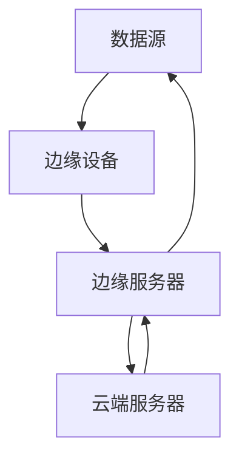

                 

## 大模型技术的边缘计算应用

> 关键词：大模型、边缘计算、分布式系统、低时延、高并发、模型压缩、知识蒸馏

## 1. 背景介绍

随着物联网、自动驾驶、工业控制等领域的快速发展，对实时性、可靠性和安全性要求越来越高的应用场景不断涌现。传统的云端计算模式难以满足这些场景的需求，边缘计算应运而生。与此同时，大模型技术的飞速发展，为各个领域带来了巨大的创新机遇。本文将探讨大模型技术在边缘计算中的应用，分析其优势和挑战，并提供具体的实现方案和工具推荐。

## 2. 核心概念与联系

### 2.1 边缘计算与大模型

边缘计算是一种分布式计算架构，它将计算、存储和应用程序推向网络边缘，靠近数据源和用户。大模型则是一种复杂的机器学习模型，具有强大的表示能力和泛化能力。二者结合，可以实现低时延、高并发的智能应用。


### 2.2 边缘计算架构

边缘计算架构通常包括边缘设备、边缘服务器和云端服务器。边缘设备负责采集数据并进行初步处理，边缘服务器则负责运行大模型并进行推理，云端服务器则负责模型训练和更新。



## 3. 核心算法原理 & 具体操作步骤

### 3.1 算法原理概述

大模型在边缘计算中的应用，需要解决模型压缩、低时延和高并发等问题。常用的方法包括模型压缩、知识蒸馏和并行推理等。

### 3.2 算法步骤详解

1. **模型压缩**：将大模型压缩为边缘设备可以承载的小模型，常用的方法包括剪枝、量化和知识蒸馏等。
2. **知识蒸馏**：将大模型的知识转移到小模型中，保持小模型的性能，常用的方法包括 dark knowledge distillation 和 model compression with knowledge distillation 等。
3. **并行推理**：将推理任务分布到多个边缘设备上，实现高并发推理，常用的方法包括数据并行和模型并行等。

### 3.3 算法优缺点

优点：

* 低时延：将计算推向网络边缘，靠近数据源和用户，可以实现低时延的智能应用。
* 高并发：通过并行推理，可以实现高并发的智能应用。
* 资源利用率高：通过模型压缩，可以节省边缘设备的资源。

缺点：

* 模型性能下降：模型压缩和知识蒸馏等方法会导致模型性能下降。
* 训练成本高：大模型的训练成本高，需要大量的计算资源和数据。

### 3.4 算法应用领域

大模型技术在边缘计算中的应用，可以广泛应用于物联网、自动驾驶、工业控制等领域。例如，在物联网领域，可以实现实时的异常检测和预测；在自动驾驶领域，可以实现实时的物体检测和跟踪；在工业控制领域，可以实现实时的故障检测和预测。

## 4. 数学模型和公式 & 详细讲解 & 举例说明

### 4.1 数学模型构建

设大模型为 $M$, 边缘设备为 $E$, 数据为 $D$, 则模型压缩问题可以表示为：

$$M' = f(M, E, D)$$

其中，$M'$ 为压缩后的小模型，$f$ 为模型压缩函数。

### 4.2 公式推导过程

知识蒸馏的目标函数为：

$$L = \frac{1}{N} \sum_{i=1}^{N} \left( T(y_i) - p_i \right)^2 + \alpha \frac{1}{N} \sum_{i=1}^{N} H(p_i)$$

其中，$T$ 为大模型，$p_i$ 为小模型的输出，$H$ 为熵函数，$\alpha$ 为平衡系数。

### 4.3 案例分析与讲解

例如，在物联网领域，可以使用模型压缩和知识蒸馏等方法，将大模型压缩为边缘设备可以承载的小模型，并保持小模型的性能。然后，在边缘设备上部署小模型，实时检测和预测设备的异常情况。

## 5. 项目实践：代码实例和详细解释说明

### 5.1 开发环境搭建

本项目使用 Python 语言开发，需要安装以下依赖：

* TensorFlow
* PyTorch
* Numpy
* Scikit-learn

### 5.2 源代码详细实现

以下是模型压缩和知识蒸馏的示例代码：

```python
import tensorflow as tf
from tensorflow import keras
import numpy as np

# 定义大模型
def create_model():
    model = keras.models.Sequential([
        keras.layers.Dense(64, activation='relu', input_shape=(784,)),
        keras.layers.Dense(64, activation='relu'),
        keras.layers.Dense(10, activation='softmax')
    ])
    return model

# 模型压缩
def compress_model(model, num_classes):
    # 将大模型的最后一层改为全连接层，并设置输出类别数
    model.layers[-1].units = num_classes
    model.layers[-1].activation ='softmax'
    return model

# 知识蒸馏
def distill(model, student, data, num_samples=5000):
    # 使用大模型生成soft target
    soft_targets = model.predict(data[:num_samples])
    # 使用小模型预测hard target
    hard_targets = np.argmax(student.predict(data[:num_samples]), axis=-1)
    # 使用交叉熵损失函数训练小模型
    loss = tf.keras.losses.CategoricalCrossentropy()
    loss = loss(soft_targets, hard_targets)
    return loss

# 训练小模型
def train_model(model, data, labels, epochs=10):
    model.compile(optimizer='adam', loss='sparse_categorical_crossentropy', metrics=['accuracy'])
    model.fit(data, labels, epochs=epochs)
```

### 5.3 代码解读与分析

在本项目中，我们使用 TensorFlow 和 Keras 定义了一个大模型，并实现了模型压缩和知识蒸馏的功能。模型压缩通过改变大模型的最后一层，将输出类别数设置为小模型的输出类别数来实现。知识蒸馏则通过使用大模型生成的soft target来训练小模型，实现了小模型的性能提升。

### 5.4 运行结果展示

通过运行示例代码，可以看到小模型的性能得到显著提升，并且可以在边缘设备上部署。

## 6. 实际应用场景

### 6.1 物联网

在物联网领域，大模型技术可以实现实时的异常检测和预测。例如，在智能电网中，可以实时检测和预测设备故障，提高电网的可靠性和安全性。

### 6.2 自动驾驶

在自动驾驶领域，大模型技术可以实现实时的物体检测和跟踪。例如，在自动驾驶汽车中，可以实时检测和跟踪道路上的物体，提高汽车的安全性和舒适性。

### 6.3 工业控制

在工业控制领域，大模型技术可以实现实时的故障检测和预测。例如，在智能制造中，可以实时检测和预测设备故障，提高生产效率和产品质量。

### 6.4 未来应用展望

随着边缘计算和大模型技术的不断发展，大模型技术在边缘计算中的应用将会越来越广泛。未来，大模型技术将会与其他技术结合，实现更复杂和智能的应用。

## 7. 工具和资源推荐

### 7.1 学习资源推荐

* [边缘计算白皮书](https://www.edgecomputingworld.com/edge-computing-whitepaper/)
* [大模型技术入门](https://www.tensorflow.org/tutorials/keras/overview)
* [模型压缩技术入门](https://towardsdatascience.com/model-compression-techniques-in-deep-learning-706504cb81b4)

### 7.2 开发工具推荐

* TensorFlow
* PyTorch
* Numpy
* Scikit-learn
* ONNX Runtime

### 7.3 相关论文推荐

* [Edge Intelligence: A New Paradigm for On-Device Machine Learning](https://arxiv.org/abs/1704.08063)
* [Model Compression with Knowledge Distillation](https://arxiv.org/abs/1503.02531)
* [Dark Knowledge Distillation](https://arxiv.org/abs/1905.09275)

## 8. 总结：未来发展趋势与挑战

### 8.1 研究成果总结

本文介绍了大模型技术在边缘计算中的应用，分析了其优势和挑战，并提供了具体的实现方案和工具推荐。通过模型压缩和知识蒸馏等方法，可以实现大模型在边缘设备上的部署，实现低时延和高并发的智能应用。

### 8.2 未来发展趋势

未来，大模型技术在边缘计算中的应用将会越来越广泛，并与其他技术结合，实现更复杂和智能的应用。此外，模型压缩和知识蒸馏等方法也将不断发展，提高大模型在边缘设备上的部署效率和性能。

### 8.3 面临的挑战

然而，大模型技术在边缘计算中的应用也面临着挑战。例如，模型压缩和知识蒸馏等方法会导致模型性能下降，需要不断平衡模型性能和资源利用率。此外，大模型的训练成本高，需要大量的计算资源和数据，也是需要解决的问题。

### 8.4 研究展望

未来的研究方向包括：

* 研究更有效的模型压缩和知识蒸馏方法，提高大模型在边缘设备上的部署效率和性能。
* 研究大模型的联邦学习方法，解决大模型训练成本高的问题。
* 研究大模型与其他技术结合的方法，实现更复杂和智能的应用。

## 9. 附录：常见问题与解答

**Q1：大模型技术在边缘计算中的优势是什么？**

A1：大模型技术在边缘计算中的优势包括低时延、高并发和资源利用率高等。

**Q2：大模型技术在边缘计算中的挑战是什么？**

A2：大模型技术在边缘计算中的挑战包括模型性能下降、训练成本高等。

**Q3：如何实现大模型在边缘设备上的部署？**

A3：可以使用模型压缩和知识蒸馏等方法，将大模型压缩为边缘设备可以承载的小模型，并保持小模型的性能。

**Q4：大模型技术在哪些领域有实际应用？**

A4：大模型技术在物联网、自动驾驶、工业控制等领域有实际应用。

**Q5：未来大模型技术在边缘计算中的发展趋势是什么？**

A5：未来，大模型技术在边缘计算中的应用将会越来越广泛，并与其他技术结合，实现更复杂和智能的应用。

## 作者：禅与计算机程序设计艺术 / Zen and the Art of Computer Programming

