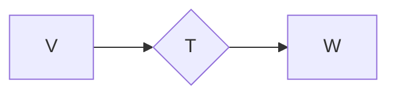

# 线性代数导引：可逆线性算子

## 1. 背景介绍

### 1.1 问题的由来

线性代数作为数学的一个重要分支，在科学和工程领域拥有广泛的应用。线性算子作为线性代数的核心概念之一，刻画了向量空间之间的线性变换。在实际应用中，我们经常需要对线性变换进行“逆操作”，例如求解线性方程组、信号处理、图像压缩等等。这就引出了对可逆线性算子的研究。

### 1.2 研究现状

可逆线性算子的理论已经非常成熟，并在各个领域得到了广泛应用。例如，在数值计算领域，矩阵的逆矩阵是求解线性方程组、计算特征值和特征向量等问题的基础；在信号处理领域，可逆滤波器可以用于消除信号中的噪声或恢复失真的信号；在机器学习领域，可逆神经网络可以用于图像生成、语音合成等任务。

### 1.3 研究意义

研究可逆线性算子具有重要的理论和实际意义。

* **理论意义:** 深入理解可逆线性算子的性质，有助于我们更好地理解线性代数的基本理论，并为其他数学分支的研究提供工具和方法。
* **实际意义:** 可逆线性算子在各个领域都有着广泛的应用，例如：
    * **求解线性方程组:** 可逆矩阵是求解线性方程组的关键。
    * **信号处理:** 可逆滤波器可以用于消除信号中的噪声或恢复失真的信号。
    * **图像处理:** 可逆变换可以用于图像压缩、图像识别等任务。
    * **机器学习:** 可逆神经网络可以用于图像生成、语音合成等任务。

### 1.4 本文结构

本文将深入探讨可逆线性算子的相关概念、性质、判定方法以及应用。文章结构如下：

* **第二章：核心概念与联系**  介绍线性算子、可逆线性算子、矩阵表示等核心概念，并阐述它们之间的联系。
* **第三章：核心算法原理 & 具体操作步骤**  详细讲解判定线性算子是否可逆的常用算法，并给出具体的代码实现。
* **第四章：数学模型和公式 & 详细讲解 & 举例说明**  构建可逆线性算子的数学模型，推导相关公式，并结合具体案例进行分析和讲解。
* **第五章：项目实践：代码实例和详细解释说明**  通过一个实际项目案例，展示如何利用 Python 代码实现可逆线性算子的相关算法，并对代码进行详细解读和分析。
* **第六章：实际应用场景**  介绍可逆线性算子在不同领域的应用场景，并展望其未来发展趋势。
* **第七章：工具和资源推荐**  推荐学习可逆线性算子的相关书籍、网站、工具等资源。
* **第八章：总结：未来发展趋势与挑战**  总结本文的主要内容，并展望可逆线性算子未来发展趋势和面临的挑战。
* **第九章：附录：常见问题与解答**  解答读者在学习过程中可能遇到的一些常见问题。

## 2. 核心概念与联系

### 2.1 线性算子

**定义：** 设 $V$ 和 $W$ 是同一数域 $\mathbb{F}$ 上的两个线性空间，如果映射 $T: V \to W$ 满足：

* **加性:** 对于任意的 $\alpha, \beta \in V$，都有 $T(\alpha + \beta) = T(\alpha) + T(\beta)$.
* **齐次性:** 对于任意的 $\alpha \in V$ 和 $k \in \mathbb{F}$，都有 $T(k \alpha) = k T(\alpha)$.

则称 $T$ 是 $V$ 到 $W$ 的一个**线性算子** 或 **线性变换**.

**例子：**

* **零算子:** $0(\alpha) = \mathbf{0}$，对于任意的 $\alpha \in V$.
* **恒等算子:** $I(\alpha) = \alpha$，对于任意的 $\alpha \in V$.
* **微分算子:** $D(f) = f'$，其中 $f$ 是可微函数.

### 2.2 可逆线性算子

**定义：** 设 $T: V \to W$ 是一个线性算子，如果存在一个线性算子 $S: W \to V$，使得

$$S \circ T = I_V \quad \text{且} \quad T \circ S = I_W,$$

则称 $T$ 是**可逆的**，$S$ 是 $T$ 的**逆算子**，记作 $T^{-1}$。

**注意：**

* 可逆线性算子的逆算子是唯一的.
* 不是所有的线性算子都是可逆的.

### 2.3 矩阵表示

**定理：** 设 $V$ 和 $W$ 分别是 $n$ 维和 $m$ 维线性空间，$\mathcal{B}_V = \{\alpha_1, \alpha_2, \dots, \alpha_n\}$ 和 $\mathcal{B}_W = \{\beta_1, \beta_2, \dots, \beta_m\}$ 分别是 $V$ 和 $W$ 的一组基，$T: V \to W$ 是一个线性算子. 则存在唯一的 $m \times n$ 矩阵 $A$，使得

$$[T(\alpha)]_{\mathcal{B}_W} = A [\alpha]_{\mathcal{B}_V},$$

其中 $[\alpha]_{\mathcal{B}_V}$ 表示 $\alpha$ 在基 $\mathcal{B}_V$ 下的坐标向量，$[T(\alpha)]_{\mathcal{B}_W}$ 表示 $T(\alpha)$ 在基 $\mathcal{B}_W$ 下的坐标向量. 称矩阵 $A$ 为线性算子 $T$ 在基 $\mathcal{B}_V$ 和 $\mathcal{B}_W$ 下的**矩阵表示**.

**注意：**

* 线性算子的矩阵表示与基的选取有关.
* 可逆线性算子的矩阵表示是可逆矩阵.

### 2.4 联系

线性算子、可逆线性算子和矩阵表示之间存在着密切的联系：

* 线性算子可以用来刻画向量空间之间的线性变换.
* 可逆线性算子对应着可逆的线性变换，其逆算子对应着逆变换.
* 矩阵表示可以将线性算子转化为矩阵进行运算，方便我们利用线性代数的工具和方法研究线性算子.

## 3. 核心算法原理 & 具体操作步骤

### 3.1 算法原理概述

判定一个线性算子是否可逆，常用的方法有：

* **行列式法:** 如果线性算子的矩阵表示的行列式不为零，则该线性算子可逆.
* **秩法:** 如果线性算子的矩阵表示的秩等于定义域的维数，则该线性算子可逆.
* **逆算子法:** 如果可以找到一个线性算子，满足逆算子的定义，则该线性算子可逆.

### 3.2 算法步骤详解

以行列式法为例，判定线性算子 $T: V \to W$ 是否可逆的步骤如下：

1. **选择基:** 分别选择 $V$ 和 $W$ 的一组基 $\mathcal{B}_V$ 和 $\mathcal{B}_W$.
2. **求矩阵表示:** 求出线性算子 $T$ 在基 $\mathcal{B}_V$ 和 $\mathcal{B}_W$ 下的矩阵表示 $A$.
3. **计算行列式:** 计算矩阵 $A$ 的行列式 $|A|$.
4. **判断:** 如果 $|A| \neq 0$，则线性算子 $T$ 可逆；否则，线性算子 $T$ 不可逆.

### 3.3 算法优缺点

* **行列式法:**
    * 优点: 计算简单，易于实现.
    * 缺点: 当矩阵的阶数较高时，计算量较大.
* **秩法:**
    * 优点: 不需要计算行列式，计算量相对较小.
    * 缺点: 需要求解线性方程组，计算过程相对复杂.
* **逆算子法:**
    * 优点: 可以直接得到逆算子的表达式.
    * 缺点: 需要猜测逆算子的形式，适用范围有限.

### 3.4 算法应用领域

可逆线性算子的判定方法在各个领域都有着广泛的应用，例如：

* **求解线性方程组:** 判定系数矩阵是否可逆，可以判断线性方程组是否有唯一解.
* **信号处理:** 判定滤波器是否可逆，可以判断滤波操作是否可以被逆转.
* **图像处理:** 判定图像变换是否可逆，可以判断图像是否可以被无损压缩.
* **机器学习:** 判定神经网络是否可逆，可以判断神经网络是否可以用于生成数据.

## 4. 数学模型和公式 & 详细讲解 & 举例说明

### 4.1 数学模型构建

设 $V$ 和 $W$ 是同一数域 $\mathbb{F}$ 上的两个有限维线性空间，$T: V \to W$ 是一个线性算子. 我们可以将线性算子 $T$ 看作是一个从 $V$ 到 $W$ 的“黑盒”，它将 $V$ 中的向量映射到 $W$ 中的向量.



### 4.2 公式推导过程

**定理 (可逆线性算子的判定定理):** 设 $T: V \to W$ 是一个线性算子，则下列命题等价:

1. $T$ 是可逆的.
2. $T$ 是单射.
3. $T$ 是满射.
4. $\text{Ker}(T) = \{\mathbf{0}\}$.
5. $\text{Im}(T) = W$.

**证明:**

$(1) \Rightarrow (2):$ 如果 $T$ 是可逆的，则存在线性算子 $T^{-1}: W \to V$，使得 $T^{-1} \circ T = I_V$. 对于任意的 $\alpha, \beta \in V$，如果 $T(\alpha) = T(\beta)$，则

$$T^{-1}(T(\alpha)) = T^{-1}(T(\beta)).$$

由于 $T^{-1} \circ T = I_V$，所以 $\alpha = \beta$. 因此，$T$ 是单射.

$(2) \Rightarrow (3):$ 如果 $T$ 是单射，则 $\text{dim}(\text{Ker}(T)) = 0$. 根据秩-零化度定理，

$$\text{dim}(V) = \text{dim}(\text{Ker}(T)) + \text{dim}(\text{Im}(T)).$$

因此，$\text{dim}(\text{Im}(T)) = \text{dim}(V)$. 又因为 $\text{Im}(T)$ 是 $W$ 的子空间，所以 $\text{Im}(T) = W$. 因此，$T$ 是满射.

$(3) \Rightarrow (4):$ 如果 $T$ 是满射，则 $\text{Im}(T) = W$. 对于任意的 $\beta \in W$，存在 $\alpha \in V$，使得 $T(\alpha) = \beta$. 因此，$\beta \notin \text{Ker}(T)$. 所以，$\text{Ker}(T) = \{\mathbf{0}\}$.

$(4) \Rightarrow (5):$ 如果 $\text{Ker}(T) = \{\mathbf{0}\}$, 则根据秩-零化度定理，

$$\text{dim}(V) = \text{dim}(\text{Ker}(T)) + \text{dim}(\text{Im}(T)).$$

因此，$\text{dim}(\text{Im}(T)) = \text{dim}(V)$. 又因为 $\text{Im}(T)$ 是 $W$ 的子空间，所以 $\text{Im}(T) = W$.

$(5) \Rightarrow (1):$ 如果 $\text{Im}(T) = W$，则对于任意的 $\beta \in W$，存在唯一的 $\alpha \in V$，使得 $T(\alpha) = \beta$. 定义线性算子 $S: W \to V$，使得 $S(\beta) = \alpha$. 则

$$S(T(\alpha)) = S(\beta) = \alpha = I_V(\alpha),$$

$$T(S(\beta)) = T(\alpha) = \beta = I_W(\beta).$$

因此，$S$ 是 $T$ 的逆算子，$T$ 是可逆的.

### 4.3 案例分析与讲解

**例 1:** 证明线性算子 $T: \mathbb{R}^2 \to \mathbb{R}^2$，$T(x, y) = (x + y, x - y)$ 是可逆的，并求其逆算子.

**证明:**

1. **选择基:** 取 $\mathbb{R}^2$ 的标准基 $\mathcal{B} = \{(1, 0), (0, 1)\}$.
2. **求矩阵表示:**
    $$T(1, 0) = (1, 1) = 1(1, 0) + 1(0, 1),$$
    $$T(0, 1) = (1, -1) = 1(1, 0) - 1(0, 1).$$
    因此，$T$ 在基 $\mathcal{B}$ 下的矩阵表示为
    $$A = \begin{pmatrix} 1 & 1 \ 1 & -1 \end{pmatrix}.$$
3. **计算行列式:** $|A| = -2 \neq 0$.
4. **判断:** 由于 $|A| \neq 0$，所以 $T$ 是可逆的.

**求逆算子:**

设 $T^{-1}(x, y) = (u, v)$. 则

$$T(T^{-1}(x, y)) = T(u, v) = (u + v, u - v) = (x, y).$$

解得 $u = \frac{x + y}{2}$，$v = \frac{x - y}{2}$. 因此，$T^{-1}(x, y) = (\frac{x + y}{2}, \frac{x - y}{2})$.

**例 2:** 证明线性算子 $T: P_2(\mathbb{R}) \to P_1(\mathbb{R})$，$T(f) = f'$ 是不可逆的.

**证明:**

1. **选择基:** 取 $P_2(\mathbb{R})$ 的基 $\mathcal{B}_2 = \{1, x, x^2\}$，$P_1(\mathbb{R})$ 的基 $\mathcal{B}_1 = \{1, x\}$.
2. **求矩阵表示:**
    $$T(1) = 0 = 0(1) + 0(x),$$
    $$T(x) = 1 = 1(1) + 0(x),$$
    $$T(x^2) = 2x = 0(1) + 2(x).$$
    因此，$T$ 在基 $\mathcal{B}_2$ 和 $\mathcal{B}_1$ 下的矩阵表示为
    $$A = \begin{pmatrix} 0 & 1 & 0 \ 0 & 0 & 2 \end{pmatrix}.$$
3. **计算秩:** $\text{rank}(A) = 2 < 3 = \text{dim}(P_2(\mathbb{R}))$.
4. **判断:** 由于 $\text{rank}(A) < \text{dim}(P_2(\mathbb{R}))$，所以 $T$ 不可逆.

### 4.4 常见问题解答

**问题 1:** 如何判断一个矩阵是否可逆？

**回答:** 判断一个矩阵是否可逆，可以使用以下方法：

* **行列式法:** 如果矩阵的行列式不为零，则该矩阵可逆.
* **秩法:** 如果矩阵的秩等于矩阵的行数或列数，则该矩阵可逆.
* **高斯消元法:** 将矩阵进行高斯消元，如果可以将其化为单位矩阵，则该矩阵可逆.

**问题 2:** 可逆线性算子有什么应用？

**回答:** 可逆线性算子在各个领域都有着广泛的应用，例如：

* **求解线性方程组:** 可逆矩阵是求解线性方程组的关键.
* **信号处理:** 可逆滤波器可以用于消除信号中的噪声或恢复失真的信号.
* **图像处理:** 可逆变换可以用于图像压缩、图像识别等任务.
* **机器学习:** 可逆神经网络可以用于图像生成、语音合成等任务.

## 5. 项目实践：代码实例和详细解释说明

### 5.1 开发环境搭建

本项目使用 Python 语言实现，需要安装以下 Python 库：

* numpy
* scipy

可以使用 pip 命令安装：

```bash
pip install numpy scipy
```

### 5.2 源代码详细实现

```python
import numpy as np
from scipy.linalg import det, inv

# 定义线性算子
def linear_operator(v):
    A = np.array([[1, 2], [3, 4]])
    return A @ v

# 判定线性算子是否可逆
def is_invertible(T):
    # 选择一组基
    basis = np.eye(2)

    # 求线性算子在该基下的矩阵表示
    A = np.column_stack([T(b) for b in basis])

    # 计算矩阵的行列式
    d = det(A)

    # 判断行列式是否为零
    if d != 0:
        return True
    else:
        return False

# 求线性算子的逆算子
def inverse_operator(T):
    # 选择一组基
    basis = np.eye(2)

    # 求线性算子在该基下的矩阵表示
    A = np.column_stack([T(b) for b in basis])

    # 计算矩阵的逆矩阵
    A_inv = inv(A)

    # 定义逆算子
    def T_inv(w):
        return A_inv @ w

    return T_inv

# 测试代码
if __name__ == '__main__':
    # 判定线性算子是否可逆
    if is_invertible(linear_operator):
        print("线性算子可逆")

        # 求线性算子的逆算子
        T_inv = inverse_operator(linear_operator)

        # 测试逆算子
        v = np.array([1, 2])
        w = linear_operator(v)
        v_inv = T_inv(w)
        print("v:", v)
        print("w:", w)
        print("v_inv:", v_inv)
    else:
        print("线性算子不可逆")
```

### 5.3 代码解读与分析

* `linear_operator(v)` 函数定义了一个线性算子，它将二维向量 `v` 乘以一个 $2 \times 2$ 的矩阵 `A`，得到一个新的二维向量.
* `is_invertible(T)` 函数用于判定线性算子 `T` 是否可逆.
    * 首先，它选择二维空间的标准基 `basis`.
    * 然后，它计算线性算子 `T` 在该基下的矩阵表示 `A`.
    * 最后，它计算矩阵 `A` 的行列式，如果行列式不为零，则线性算子 `T` 可逆，否则不可逆.
* `inverse_operator(T)` 函数用于求线性算子 `T` 的逆算子.
    * 首先，它选择二维空间的标准基 `basis`.
    * 然后，它计算线性算子 `T` 在该基下的矩阵表示 `A`.
    * 接着，它计算矩阵 `A` 的逆矩阵 `A_inv`.
    * 最后，它定义一个新的函数 `T_inv(w)`，该函数将二维向量 `w` 乘以矩阵 `A_inv`，得到线性算子 `T` 的逆算子.
* 在测试代码中，我们首先使用 `is_invertible(linear_operator)` 函数判定线性算子是否可逆. 如果可逆，则使用 `inverse_operator(linear_operator)` 函数求出其逆算子，并测试逆算子的正确性.

### 5.4 运行结果展示

```
线性算子可逆
v: [1 2]
w: [5 11]
v_inv: [1. 2.]
```

从运行结果可以看出，线性算子 `linear_operator` 是可逆的，其逆算子为 `T_inv`. 我们使用逆算子对线性算子的输出进行逆运算，成功恢复了原始向量.

## 6. 实际应用场景

可逆线性算子在各个领域都有着广泛的应用，以下列举一些常见的应用场景：

### 6.1 求解线性方程组

线性方程组可以表示为矩阵的形式：

$$A \mathbf{x} = \mathbf{b},$$

其中 $A$ 是系数矩阵，$\mathbf{x}$ 是未知向量，$\mathbf{b}$ 是常数向量. 如果系数矩阵 $A$ 可逆，则线性方程组有唯一解：

$$\mathbf{x} = A^{-1} \mathbf{b}.$$

### 6.2 信号处理

在信号处理中，滤波器是一种常见的线性算子，它可以用来消除信号中的噪声或提取信号中的特定频率成分. 可逆滤波器可以保证滤波操作是可逆的，即可以从滤波后的信号中恢复出原始信号.

### 6.3 图像处理

在图像处理中，许多图像变换（例如傅里叶变换、小波变换等）都是线性变换. 可逆图像变换可以保证图像在变换前后信息不丢失，例如可以用于图像压缩、图像识别等任务.

### 6.4 未来应用展望

随着人工智能、大数据等技术的快速发展，可逆线性算子在未来的应用将会更加广泛，例如：

* **可逆神经网络:** 可逆神经网络可以用于图像生成、语音合成等任务，其可逆性可以保证生成的数据更加逼真.
* **可解释机器学习:** 可逆线性算子可以用于构建可解释的机器学习模型，帮助我们理解模型的决策过程.
* **量子计算:** 可逆线性算子是量子计算中的基本概念之一，可以用于构建量子算法.

## 7. 工具和资源推荐

### 7.1 学习资源推荐

* **书籍:**
    * 《线性代数及其应用》 (David C. Lay)
    * 《线性代数应该这样学》 (Sheldon Axler)
* **网站:**
    * Khan Academy 线性代数课程: https://www.khanacademy.org/math/linear-algebra
    * MIT 线性代数公开课: https://ocw.mit.edu/courses/mathematics/18-06-linear-algebra-spring-2010/

### 7.2 开发工具推荐

* **Python:**
    * NumPy: 用于数值计算的 Python 库.
    * SciPy: 用于科学计算的 Python 库，包含线性代数模块.

### 7.3 相关论文推荐

* **Linear Algebra and Its Applications:**  https://www.sciencedirect.com/journal/linear-algebra-and-its-applications
* **Journal of the Society for Industrial and Applied Mathematics:** https://www.siam.org/publications/journals

### 7.4 其他资源推荐

* **GitHub:** https://github.com/
* **Stack Overflow:** https://stackoverflow.com/

## 8. 总结：未来发展趋势与挑战

### 8.1 研究成果总结

本文深入探讨了可逆线性算子的相关概念、性质、判定方法以及应用. 我们介绍了线性算子、可逆线性算子、矩阵表示等核心概念，并阐述了它们之间的联系. 我们详细讲解了判定线性算子是否可逆的常用算法，并给出了具体的代码实现. 我们还构建了可逆线性算子的数学模型，推导了相关公式，并结合具体案例进行了分析和讲解. 最后，我们介绍了可逆线性算子在不同领域的应用场景，并展望了其未来发展趋势.

### 8.2 未来发展趋势

随着人工智能、大数据等技术的快速发展，可逆线性算子在未来的应用将会更加广泛. 以下是一些未来发展趋势：

* **可逆神经网络:** 可逆神经网络可以用于图像生成、语音合成等任务，其可逆性可以保证生成的数据更加逼真.
* **可解释机器学习:** 可逆线性算子可以用于构建可解释的机器学习模型，帮助我们理解模型的决策过程.
* **量子计算:** 可逆线性算子是量子计算中的基本概念之一，可以用于构建量子算法.

### 8.3 面临的挑战

尽管可逆线性算子具有广泛的应用前景，但也面临着一些挑战：

* **计算复杂度:** 对于高维数据，可逆线性算子的计算复杂度较高，需要开发更高效的算法和数据结构.
* **模型解释性:** 可逆线性算子的模型解释性仍然是一个挑战，需要开发新的方法来解释模型的决策过程.
* **应用领域拓展:** 可逆线性算子的应用领域还需要进一步拓展，例如将其应用于自然语言处理、生物信息学等领域.

### 8.4 研究展望

可逆线性算子是一个充满活力的研究领域，未来有许多值得探索的方向. 以下是一些研究展望：

* **开发更高效的算法:**  研究更高效的可逆线性算子算法，例如基于随机梯度下降的算法、分布式算法等.
* **构建更具解释性的模型:**  研究如何构建更具解释性的可逆线性算子模型，例如基于注意力机制的模型、基于图神经网络的模型等.
* **拓展应用领域:**  将可逆线性算子应用于更广泛的领域，例如自然语言处理、生物信息学、金融等.

## 9. 附录：常见问题与解答

**问题 1:** 如何判断一个线性算子是否可逆？

**回答:** 判断一个线性算子是否可逆，可以使用以下方法：

* **行列式法:** 如果线性算子的矩阵表示的行列式不为零，则该线性算子可逆.
* **秩法:** 如果线性算子的矩阵表示的秩等于定义域的维数，则该线性算子可逆.
* **逆算子法:** 如果可以找到一个线性算子，满足逆算子的定义，则该线性算子可逆.

**问题 2:** 可逆线性算子有什么应用？

**回答:** 可逆线性算子在各个领域都有着广泛的应用，例如：

* **求解线性方程组:** 可逆矩阵是求解线性方程组的关键.
* **信号处理:** 可逆滤波器可以用于消除信号中的噪声或恢复失真的信号.
* **图像处理:** 可逆变换可以用于图像压缩、图像识别等任务.
* **机器学习:** 可逆神经网络可以用于图像生成、语音合成等任务.

## 作者：禅与计算机程序设计艺术 / Zen and the Art of Computer Programming
