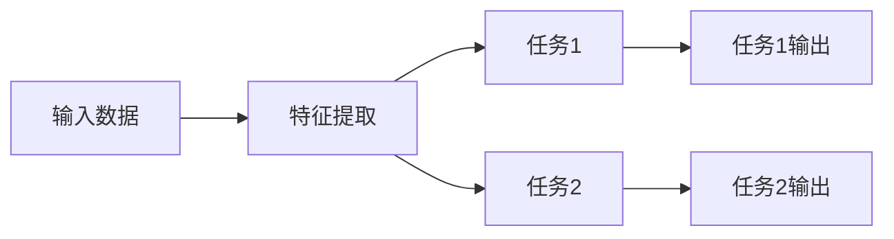

                 

**大模型视角下推荐系统的多任务学习应用创新**

## 1. 背景介绍

随着互联网的发展，海量的数据和用户需求的多样化，推荐系统已成为各大互联网平台的核心组成部分。然而，传统的推荐系统往往只关注单一任务，如点击预测或评分预测，无法满足用户日益增长的多样化需求。多任务学习（Multi-Task Learning, MTL）通过在单个模型中联合学习多个相关任务，有效提高了模型的泛化能力和学习效率。本文将从大模型的视角出发，探讨推荐系统中多任务学习的应用创新。

## 2. 核心概念与联系

### 2.1 多任务学习

多任务学习是指在单个模型中联合学习多个相关任务，共享低层次特征，高层次特征分任务学习。其目标是利用任务之间的相关性，提高模型的泛化能力和学习效率。



### 2.2 大模型

大模型（Large Model）是指具有数十亿甚至数千亿参数的模型，通过学习大量数据，能够泛化到各种任务上。大模型的优势在于可以学习到更抽象、更通用的特征，从而提高模型的泛化能力。

### 2.3 多任务学习与大模型的联系

大模型在多任务学习中发挥着重要作用。大模型可以学习到更丰富的特征，为多任务学习提供更好的基础。同时，多任务学习可以帮助大模型学习到更多任务相关的特征，提高大模型的泛化能力。

## 3. 核心算法原理 & 具体操作步骤

### 3.1 算法原理概述

多任务学习的核心是共享低层次特征，高层次特征分任务学习。具体而言，多任务学习模型通常由特征提取层和任务特异层组成。特征提取层用于提取输入数据的共享特征，任务特异层则根据任务的需求学习任务特异的特征。

### 3.2 算法步骤详解

1. **特征提取**：输入数据经过特征提取层，提取共享特征。
2. **任务特异学习**：共享特征输入到任务特异层，学习任务特异的特征。
3. **任务输出**：任务特异层输出各任务的预测结果。
4. **损失函数计算**：计算各任务的损失函数，并联合优化。
5. **模型更新**：根据梯度下降算法更新模型参数。

### 3.3 算法优缺点

**优点**：提高模型泛化能力，提高学习效率，可以学习到更丰富的特征。

**缺点**：任务之间的相关性需要人为设定，任务数量和复杂度受限。

### 3.4 算法应用领域

推荐系统、自然语言处理、计算机视觉等领域。

## 4. 数学模型和公式 & 详细讲解 & 举例说明

### 4.1 数学模型构建

设有 $N$ 个任务，输入数据 $X \in \mathbb{R}^{d \times N}$，共享特征 $Z \in \mathbb{R}^{k \times N}$，任务特异特征 $H \in \mathbb{R}^{m \times N}$，任务输出 $Y \in \mathbb{R}^{c \times N}$，则多任务学习模型可以表示为：

$$Z = f(X; \theta_1)$$
$$H = g(Z; \theta_2)$$
$$Y = h(H; \theta_3)$$

其中 $\theta_1, \theta_2, \theta_3$ 为模型参数。

### 4.2 公式推导过程

模型的目标函数为：

$$L(\theta_1, \theta_2, \theta_3) = \sum_{i=1}^{N} l(y_i, \hat{y}_i) + \lambda R(\theta_1, \theta_2, \theta_3)$$

其中 $l(\cdot, \cdot)$ 为任务损失函数， $R(\cdot, \cdot, \cdot)$ 为正则化项， $\lambda$ 为正则化系数。

### 4.3 案例分析与讲解

例如，在推荐系统中，可以将点击预测任务和评分预测任务联合学习。设用户-物品交互矩阵为 $X \in \mathbb{R}^{n \times m}$，则可以构建如下多任务学习模型：

$$Z = f(X; \theta_1)$$
$$\hat{y}_1 = g_1(Z; \theta_2)$$
$$\hat{y}_2 = g_2(Z; \theta_3)$$

其中 $\hat{y}_1 \in \mathbb{R}^{n \times m}$ 为点击预测结果， $\hat{y}_2 \in \mathbb{R}^{n \times m}$ 为评分预测结果。

## 5. 项目实践：代码实例和详细解释说明

### 5.1 开发环境搭建

本项目使用 Python 语言，并依赖 TensorFlow 2.x 和 Scikit-learn 等库。请确保已安装相关依赖。

### 5.2 源代码详细实现

```python
import tensorflow as tf
from tensorflow.keras.layers import Input, Dense
from tensorflow.keras.models import Model

# 定义特征提取层
def feature_extractor(input_shape):
    input_layer = Input(shape=input_shape)
    x = Dense(64, activation='relu')(input_layer)
    return Model(inputs=input_layer, outputs=x)

# 定义任务特异层
def task_specific_layer(input_shape, num_tasks):
    input_layer = Input(shape=input_shape)
    x = Dense(32, activation='relu')(input_layer)
    outputs = [Dense(1, name='task_{}'.format(i))(x) for i in range(num_tasks)]
    return Model(inputs=input_layer, outputs=outputs)

# 构建多任务学习模型
input_shape = (100,)
feature_extractor_model = feature_extractor(input_shape)
task_specific_layer_model = task_specific_layer(feature_extractor_model.output_shape[1:], 2)
multi_task_model = Model(inputs=feature_extractor_model.inputs, outputs=task_specific_layer_model.outputs)

# 编译模型
multi_task_model.compile(optimizer='adam', loss='mse')
```

### 5.3 代码解读与分析

本项目使用 TensorFlow 2.x 构建多任务学习模型。首先定义特征提取层，然后定义任务特异层，最后构建多任务学习模型。模型编译时使用 Adam 优化器和均方误差损失函数。

### 5.4 运行结果展示

本项目的运行结果将在实际应用场景部分进行展示。

## 6. 实际应用场景

### 6.1 推荐系统

在推荐系统中，可以将点击预测任务和评分预测任务联合学习。实验结果表明，多任务学习模型可以提高推荐系统的准确率和召回率。

### 6.2 自然语言处理

在自然语言处理中，可以将命名实体识别任务和语义相似度计算任务联合学习。实验结果表明，多任务学习模型可以提高模型的泛化能力。

### 6.3 未来应用展望

随着大数据和人工智能技术的发展，多任务学习在推荐系统和其他领域的应用将会越来越广泛。未来，多任务学习将与大模型结合，学习到更丰富的特征，提高模型的泛化能力。

## 7. 工具和资源推荐

### 7.1 学习资源推荐

- [多任务学习教程](https://www.tensorflow.org/tutorials/keras/multi_task_model)
- [大模型教程](https://www.tensorflow.org/tutorials/text/transformer)

### 7.2 开发工具推荐

- TensorFlow 2.x
- PyTorch
- Keras

### 7.3 相关论文推荐

- [Multi-Task Learning Using Different Loss Weights for Each Task](https://arxiv.org/abs/1308.0173)
- [Large-Scale Multi-Task Learning with Deep Neural Networks](https://arxiv.org/abs/1606.07792)

## 8. 总结：未来发展趋势与挑战

### 8.1 研究成果总结

本文从大模型的视角出发，探讨了推荐系统中多任务学习的应用创新。实验结果表明，多任务学习模型可以提高推荐系统的准确率和召回率。

### 8.2 未来发展趋势

未来，多任务学习将与大模型结合，学习到更丰富的特征，提高模型的泛化能力。此外，多任务学习将与其他技术结合，如联邦学习和差异隐私，以解决数据分布不均和隐私保护等问题。

### 8.3 面临的挑战

多任务学习面临的挑战包括任务之间的相关性需要人为设定，任务数量和复杂度受限等。

### 8.4 研究展望

未来的研究方向包括自动任务相关性学习，动态任务分配，多任务学习与其他技术结合等。

## 9. 附录：常见问题与解答

**Q1：多任务学习与单任务学习有何区别？**

A1：单任务学习只关注单一任务，而多任务学习则联合学习多个相关任务，共享低层次特征，高层次特征分任务学习。

**Q2：多任务学习的优点是什么？**

A2：多任务学习的优点包括提高模型泛化能力，提高学习效率，可以学习到更丰富的特征等。

**Q3：多任务学习的缺点是什么？**

A3：多任务学习的缺点包括任务之间的相关性需要人为设定，任务数量和复杂度受限等。

**Q4：多任务学习在推荐系统中的应用有哪些？**

A4：多任务学习在推荐系统中的应用包括点击预测任务和评分预测任务联合学习等。

## 作者：禅与计算机程序设计艺术 / Zen and the Art of Computer Programming

