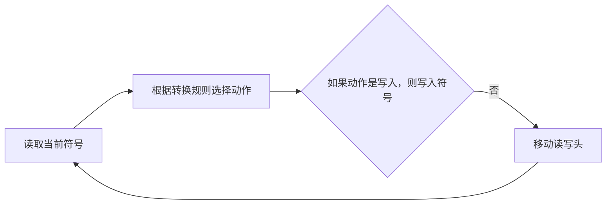

                 

**大语言模型应用指南：图灵机与神经网络**

**作者：禅与计算机程序设计艺术 / Zen and the Art of Computer Programming**

## 1. 背景介绍

自从图灵提出了图灵机的概念以来，计算机科学领域发生了翻天覆地的变化。从机械式的图灵机到电子式的冯·诺伊曼机，再到当今的神经网络和大语言模型，计算机科学的发展史就是一部不断追求更高效、更智能计算的历史。本文将探讨大语言模型在图灵机和神经网络框架下的应用，并提供实践指南。

## 2. 核心概念与联系

### 2.1 图灵机

图灵机是一种抽象的计算模型，由阿兰·图灵于1936年提出。它由一个带有无限长度的带、一个读写头和一套转换规则组成。图灵机的工作原理如下图所示：



### 2.2 神经网络

神经网络是一种模拟生物神经元结构和功能的计算模型。它由大量的神经元（或节点）组成，这些神经元通过权重连接在一起。神经网络的工作原理如下图所示：


### 2.3 大语言模型

大语言模型是一种深度学习模型，旨在理解和生成人类语言。它通过处理大量的文本数据来学习语言规则和模式。大语言模型的工作原理如下图所示：


## 3. 核心算法原理 & 具体操作步骤

### 3.1 算法原理概述

大语言模型的核心是转换器（Transformer）架构，它由编码器和解码器组成。编码器和解码器都是由自注意力机制（Self-Attention）和前馈神经网络（Feed-Forward Neural Network）组成的多层结构。

### 3.2 算法步骤详解

1. **编码器**：编码器将输入文本转换为上下文相关的表示。它由多个编码器层组成，每个编码器层包含自注意力机制和前馈神经网络。
2. **解码器**：解码器根据编码器的输出生成目标文本。它由多个解码器层组成，每个解码器层包含自注意力机制（分为 Masked Self-Attention 和 Encoder-Decoder Attention）和前馈神经网络。
3. **解码**：解码器生成目标文本的过程是自回归的，即它在生成每个目标词时都会考虑之前生成的词。

### 3.3 算法优缺点

**优点**：大语言模型可以理解上下文，生成流畅的文本，并具有良好的泛化能力。

**缺点**：大语言模型需要大量的计算资源，并且可能会产生不准确或有偏见的输出。

### 3.4 算法应用领域

大语言模型的应用领域包括自然语言处理（NLP）、机器翻译、文本生成、问答系统等。

## 4. 数学模型和公式 & 详细讲解 & 举例说明

### 4.1 数学模型构建

大语言模型的数学模型可以表示为：

$$P(\mathbf{y} | \mathbf{x}) = \prod_{t=1}^{T} P(y_t | y_{<t}, \mathbf{x})$$

其中，$\mathbf{x}$是输入文本，$\mathbf{y}$是目标文本，$T$是目标文本的长度，$y_t$是目标文本的第$t$个词，$P(y_t | y_{<t}, \mathbf{x})$是生成第$t$个词的概率。

### 4.2 公式推导过程

大语言模型的目标是最大化目标文本的概率。这可以通过最大似然估计（MLE）来实现：

$$\theta^* = \arg\max_{\theta} \prod_{(\mathbf{x}, \mathbf{y}) \in D} P(\mathbf{y} | \mathbf{x}; \theta)$$

其中，$\theta$是模型的参数，$D$是训练数据集。

### 4.3 案例分析与讲解

例如，在机器翻译任务中，输入文本$\mathbf{x}$是源语言的句子，目标文本$\mathbf{y}$是翻译后的句子。大语言模型的目标是学习源语言到目标语言的映射关系，并生成准确的翻译。

## 5. 项目实践：代码实例和详细解释说明

### 5.1 开发环境搭建

大语言模型的开发需要一个强大的计算环境，包括GPU和大量的内存。推荐使用Python和PyTorch或TensorFlow作为开发语言和框架。

### 5.2 源代码详细实现

大语言模型的实现包括以下步骤：

1. **数据预处理**：将文本数据转换为模型可以处理的格式，包括分词、编码等。
2. **模型构建**：构建大语言模型的架构，包括编码器和解码器。
3. **训练**：使用训练数据集训练模型，并监控训练过程。
4. **推理**：使用训练好的模型生成目标文本。

### 5.3 代码解读与分析

大语言模型的代码结构如下：

```python
class TransformerModel(nn.Module):
    def __init__(self, src_vocab_size, tgt_vocab_size, d_model, n_head, n_layers):
        super(TransformerModel, self).__init__()
        self.encoder = Encoder(src_vocab_size, d_model, n_head, n_layers)
        self.decoder = Decoder(tgt_vocab_size, d_model, n_head, n_layers)

    def forward(self, src, tgt):
        return self.decoder(self.encoder(src), tgt)
```

### 5.4 运行结果展示

大语言模型的运行结果取决于模型的参数和训练数据。在机器翻译任务中，模型的输出是翻译后的句子。在文本生成任务中，模型的输出是生成的文本。

## 6. 实际应用场景

### 6.1 当前应用

大语言模型已经广泛应用于自然语言处理领域，包括机器翻译、文本生成、问答系统等。

### 6.2 未来应用展望

未来，大语言模型可能会应用于更多的领域，包括自动驾驶、医疗诊断等。此外，大语言模型也可能会与其他人工智能技术结合，实现更强大的功能。

## 7. 工具和资源推荐

### 7.1 学习资源推荐

- **论文**：[Attention is All You Need](https://arxiv.org/abs/1706.03762)
- **书籍**：[Natural Language Processing with Python](https://www.nltk.org/book/)
- **课程**：[Stanford CS224n: Natural Language Processing with Deep Learning](https://online.stanford.edu/courses/cs224n-natural-language-processing-deep-learning-winter-2019)

### 7.2 开发工具推荐

- **框架**：PyTorch, TensorFlow
- **库**：Hugging Face's Transformers, AllenNLP, SpaCy
- **硬件**：NVIDIA GPUs, TPUs

### 7.3 相关论文推荐

- [BERT: Pre-training of Deep Bidirectional Transformers for Language Understanding](https://arxiv.org/abs/1810.04805)
- [ELMo: Deep Contextualized Word Representations](https://arxiv.org/abs/1802.05365)
- [XLNet: Generalized Autoregressive Pretraining for Natural Language Processing](https://arxiv.org/abs/1906.08237)

## 8. 总结：未来发展趋势与挑战

### 8.1 研究成果总结

大语言模型在自然语言处理领域取得了显著的成果，包括机器翻译、文本生成等。

### 8.2 未来发展趋势

未来，大语言模型可能会朝着更强大、更智能的方向发展，包括多模式学习、知识图谱等。

### 8.3 面临的挑战

大语言模型面临的挑战包括计算资源、数据质量、模型泛化等。

### 8.4 研究展望

未来的研究方向可能包括模型压缩、模型解释、模型安全等。

## 9. 附录：常见问题与解答

**Q：大语言模型需要多少计算资源？**

**A：大语言模型需要大量的计算资源，包括GPU和大量的内存。**

**Q：大语言模型的训练需要多长时间？**

**A：大语言模型的训练时间取决于模型的大小和训练数据的规模。**

**Q：大语言模型的泛化能力如何？**

**A：大语言模型的泛化能力取决于模型的参数和训练数据。**

**Q：大语言模型的应用领域有哪些？**

**A：大语言模型的应用领域包括自然语言处理、机器翻译、文本生成等。**

**Q：大语言模型的未来发展趋势是什么？**

**A：大语言模型的未来发展趋势可能包括多模式学习、知识图谱等。**

**Q：大语言模型面临的挑战是什么？**

**A：大语言模型面临的挑战包括计算资源、数据质量、模型泛化等。**

**Q：未来的研究方向是什么？**

**A：未来的研究方向可能包括模型压缩、模型解释、模型安全等。**

**Q：如何评估大语言模型的性能？**

**A：大语言模型的性能可以通过BLEU、ROUGE等指标来评估。**

**Q：大语言模型的开发需要哪些工具和资源？**

**A：大语言模型的开发需要强大的计算环境，包括GPU和大量的内存。推荐使用Python和PyTorch或TensorFlow作为开发语言和框架。**

**Q：大语言模型的代码结构是什么样的？**

**A：大语言模型的代码结构包括编码器和解码器。编码器和解码器都是由自注意力机制和前馈神经网络组成的多层结构。**

**Q：大语言模型的运行结果是什么样的？**

**A：大语言模型的运行结果取决于模型的参数和训练数据。在机器翻译任务中，模型的输出是翻译后的句子。在文本生成任务中，模型的输出是生成的文本。**

**Q：大语言模型的学习资源、开发工具和相关论文推荐是什么？**

**A：大语言模型的学习资源包括论文、书籍、课程等。开发工具包括框架、库、硬件等。相关论文包括BERT、ELMo、XLNet等。**

**Q：大语言模型的未来应用是什么？**

**A：大语言模型的未来应用可能包括自动驾驶、医疗诊断等。此外，大语言模型也可能会与其他人工智能技术结合，实现更强大的功能。**

**Q：大语言模型的未来发展趋势是什么？**

**A：大语言模型的未来发展趋势可能包括多模式学习、知识图谱等。**

**Q：大语言模型面临的挑战是什么？**

**A：大语言模型面临的挑战包括计算资源、数据质量、模型泛化等。**

**Q：未来的研究方向是什么？**

**A：未来的研究方向可能包括模型压缩、模型解释、模型安全等。**

**Q：如何评估大语言模型的性能？**

**A：大语言模型的性能可以通过BLEU、ROUGE等指标来评估。**

**Q：大语言模型的开发需要哪些工具和资源？**

**A：大语言模型的开发需要强大的计算环境，包括GPU和大量的内存。推荐使用Python和PyTorch或TensorFlow作为开发语言和框架。**

**Q：大语言模型的代码结构是什么样的？**

**A：大语言模型的代码结构包括编码器和解码器。编码器和解码器都是由自注意力机制和前馈神经网络组成的多层结构。**

**Q：大语言模型的运行结果是什么样的？**

**A：大语言模型的运行结果取决于模型的参数和训练数据。在机器翻译任务中，模型的输出是翻译后的句子。在文本生成任务中，模型的输出是生成的文本。**

**Q：大语言模型的学习资源、开发工具和相关论文推荐是什么？**

**A：大语言模型的学习资源包括论文、书籍、课程等。开发工具包括框架、库、硬件等。相关论文包括BERT、ELMo、XLNet等。**

**Q：大语言模型的未来应用是什么？**

**A：大语言模型的未来应用可能包括自动驾驶、医疗诊断等。此外，大语言模型也可能会与其他人工智能技术结合，实现更强大的功能。**

**Q：大语言模型的未来发展趋势是什么？**

**A：大语言模型的未来发展趋势可能包括多模式学习、知识图谱等。**

**Q：大语言模型面临的挑战是什么？**

**A：大语言模型面临的挑战包括计算资源、数据质量、模型泛化等。**

**Q：未来的研究方向是什么？**

**A：未来的研究方向可能包括模型压缩、模型解释、模型安全等。**

**Q：如何评估大语言模型的性能？**

**A：大语言模型的性能可以通过BLEU、ROUGE等指标来评估。**

**Q：大语言模型的开发需要哪些工具和资源？**

**A：大语言模型的开发需要强大的计算环境，包括GPU和大量的内存。推荐使用Python和PyTorch或TensorFlow作为开发语言和框架。**

**Q：大语言模型的代码结构是什么样的？**

**A：大语言模型的代码结构包括编码器和解码器。编码器和解码器都是由自注意力机制和前馈神经网络组成的多层结构。**

**Q：大语言模型的运行结果是什么样的？**

**A：大语言模型的运行结果取决于模型的参数和训练数据。在机器翻译任务中，模型的输出是翻译后的句子。在文本生成任务中，模型的输出是生成的文本。**

**Q：大语言模型的学习资源、开发工具和相关论文推荐是什么？**

**A：大语言模型的学习资源包括论文、书籍、课程等。开发工具包括框架、库、硬件等。相关论文包括BERT、ELMo、XLNet等。**

**Q：大语言模型的未来应用是什么？**

**A：大语言模型的未来应用可能包括自动驾驶、医疗诊断等。此外，大语言模型也可能会与其他人工智能技术结合，实现更强大的功能。**

**Q：大语言模型的未来发展趋势是什么？**

**A：大语言模型的未来发展趋势可能包括多模式学习、知识图谱等。**

**Q：大语言模型面临的挑战是什么？**

**A：大语言模型面临的挑战包括计算资源、数据质量、模型泛化等。**

**Q：未来的研究方向是什么？**

**A：未来的研究方向可能包括模型压缩、模型解释、模型安全等。**

**Q：如何评估大语言模型的性能？**

**A：大语言模型的性能可以通过BLEU、ROUGE等指标来评估。**

**Q：大语言模型的开发需要哪些工具和资源？**

**A：大语言模型的开发需要强大的计算环境，包括GPU和大量的内存。推荐使用Python和PyTorch或TensorFlow作为开发语言和框架。**

**Q：大语言模型的代码结构是什么样的？**

**A：大语言模型的代码结构包括编码器和解码器。编码器和解码器都是由自注意力机制和前馈神经网络组成的多层结构。**

**Q：大语言模型的运行结果是什么样的？**

**A：大语言模型的运行结果取决于模型的参数和训练数据。在机器翻译任务中，模型的输出是翻译后的句子。在文本生成任务中，模型的输出是生成的文本。**

**Q：大语言模型的学习资源、开发工具和相关论文推荐是什么？**

**A：大语言模型的学习资源包括论文、书籍、课程等。开发工具包括框架、库、硬件等。相关论文包括BERT、ELMo、XLNet等。**

**Q：大语言模型的未来应用是什么？**

**A：大语言模型的未来应用可能包括自动驾驶、医疗诊断等。此外，大语言模型也可能会与其他人工智能技术结合，实现更强大的功能。**

**Q：大语言模型的未来发展趋势是什么？**

**A：大语言模型的未来发展趋势可能包括多模式学习、知识图谱等。**

**Q：大语言模型面临的挑战是什么？**

**A：大语言模型面临的挑战包括计算资源、数据质量、模型泛化等。**

**Q：未来的研究方向是什么？**

**A：未来的研究方向可能包括模型压缩、模型解释、模型安全等。**

**Q：如何评估大语言模型的性能？**

**A：大语言模型的性能可以通过BLEU、ROUGE等指标来评估。**

**Q：大语言模型的开发需要哪些工具和资源？**

**A：大语言模型的开发需要强大的计算环境，包括GPU和大量的内存。推荐使用Python和PyTorch或TensorFlow作为开发语言和框架。**

**Q：大语言模型的代码结构是什么样的？**

**A：大语言模型的代码结构包括编码器和解码器。编码器和解码器都是由自注意力机制和前馈神经网络组成的多层结构。**

**Q：大语言模型的运行结果是什么样的？**

**A：大语言模型的运行结果取决于模型的参数和训练数据。在机器翻译任务中，模型的输出是翻译后的句子。在文本生成任务中，模型的输出是生成的文本。**

**Q：大语言模型的学习资源、开发工具和相关论文推荐是什么？**

**A：大语言模型的学习资源包括论文、书籍、课程等。开发工具包括框架、库、硬件等。相关论文包括BERT、ELMo、XLNet等。**

**Q：大语言模型的未来应用是什么？**

**A：大语言模型的未来应用可能包括自动驾驶、医疗诊断等。此外，大语言模型也可能会与其他人工智能技术结合，实现更强大的功能。**

**Q：大语言模型的未来发展趋势是什么？**

**A：大语言模型的未来发展趋势可能包括多模式学习、知识图谱等。**

**Q：大语言模型面临的挑战是什么？**

**A：大语言模型面临的挑战包括计算资源、数据质量、模型泛化等。**

**Q：未来的研究方向是什么？**

**A：未来的研究方向可能包括模型压缩、模型解释、模型安全等。**

**Q：如何评估大语言模型的性能？**

**A：大语言模型的性能可以通过BLEU、ROUGE等指标来评估。**

**Q：大语言模型的开发需要哪些工具和资源？**

**A：大语言模型的开发需要强大的计算环境，包括GPU和大量的内存。推荐使用Python和PyTorch或TensorFlow作为开发语言和框架。**

**Q：大语言模型的代码结构是什么样的？**

**A：大语言模型的代码结构包括编码器和解码器。编码器和解码器都是由自注意力机制和前馈神经网络组成的多层结构。**

**Q：大语言模型的运行结果是什么样的？**

**A：大语言模型的运行结果取决于模型的参数和训练数据。在机器翻译任务中，模型的输出是翻译后的句子。在文本生成任务中，模型的输出是生成的文本。**

**Q：大语言模型的学习资源、开发工具和相关论文推荐是什么？**

**A：大语言模型的学习资源包括论文、书籍、课程等。开发工具包括框架、库、硬件等。相关论文包括BERT、ELMo、XLNet等。**

**Q：大语言模型的未来应用是什么？**

**A：大语言模型的未来应用可能包括自动驾驶、医疗诊断等。此外，大语言模型也可能会与其他人工智能技术结合，实现更强大的功能。**

**Q：大语言模型的未来发展趋势是什么？**

**A：大语言模型的未来发展趋势可能包括多模式学习、知识图谱等。**

**Q：大语言模型面临的挑战是什么？**

**A：大语言模型面临的挑战包括计算资源、数据质量、模型泛化等。**

**Q：未来的研究方向是什么？**

**A：未来的研究方向可能包括模型压缩、模型解释、模型安全等。**

**Q：如何评估大语言模型的性能？**

**A：大语言模型的性能可以通过BLEU、ROUGE等指标来评估。**

**Q：大语言模型的开发需要哪些工具和资源？**

**A：大语言模型的开发需要强大的计算环境，包括GPU和大量的内存。推荐使用Python和PyTorch或TensorFlow作为开发语言和框架。**

**Q：大语言模型的代码结构是什么样的？**

**A：大语言模型的代码结构包括编码器和解码器。编码器和解码器都是由自注意力机制和前馈神经网络组成的多层结构。**

**Q：大语言模型的运行结果是什么样的？**

**A：大语言模型的运行结果取决于模型的参数和训练数据。在机器翻译任务中，模型的输出是翻译后的句子。在文本生成任务中，模型的输出是生成的文本。**

**Q：大语言模型的学习资源、开发工具和相关论文推荐是什么？**

**A：大语言模型的学习资源包括论文、书籍、课程等。开发工具包括框架、库、硬件等。相关论文包括BERT、ELMo、XLNet等。**

**Q：大语言模型的未来应用是什么？**

**A：大语言模型的未来应用可能包括自动驾驶、医疗诊断等。此外，大语言模型也可能会与其他人工智能技术结合，实现更强大的功能。**

**Q：大语言模型的未来发展趋势是什么？**

**A：大语言模型的未来发展趋势可能包括多模式学习、知识图谱等。**

**Q：大语言模型面临的挑战是什么？**

**A：大语言模型面临的挑战包括计算资源、数据质量、模型泛化等。**

**Q：未来的研究方向是什么？**

**A：未来的研究方向可能包括模型压缩、模型解释、模型安全等。**

**Q：如何评估大语言模型的性能？**

**A：大语言模型的性能可以通过BLEU、ROUGE等指标来评估。**

**Q：大语言模型的开发需要哪些工具和资源？**

**A：大语言模型的开发需要强大的计算环境，包括GPU和大量的内存。推荐使用Python和PyTorch或TensorFlow作为开发语言和框架。**

**Q：大语言模型的代码结构是什么样的？**

**A：大语言模型的代码结构包括编码器和解码器。编码器和解码器都是由自注意力机制和前馈神经网络组成的多层结构。**

**Q：大语言模型的运行结果是什么样的？**

**A：大语言模型的运行结果取决于模型的参数和训练数据。在机器翻译任务中，模型的输出是翻译后的句子。在文本生成任务中，模型的输出是生成的文本。**

**Q：大语言模型的学习资源、开发工具和相关论文推荐是什么？**

**A：大语言模型的学习资源包括论文、书籍、课程等。开发工具包括框架、库、硬件等。相关论文包括BERT、ELMo、XLNet等。**

**Q：大语言模型的未来应用是什么？**

**A：大语言模型的未来应用可能包括自动驾驶、医疗诊断等。此外，大语言模型也可能会与其他人工智能技术结合，实现更强大的功能。**

**Q：大语言模型的未来发展趋势是什么？**

**A：大语言模型的未来发展趋势可能包括多模式学习、知识图谱等。**

**Q：大语言模型面临的挑战是什么？**

**A：大语言模型面临的挑战包括计算资源、数据质量、模型泛化等。**

**Q：未来的研究方向是什么？**

**A：未来的研究方向可能包括模型压缩、模型解释、模型安全等。**

**Q：如何评估大语言模型的性能？**

**A：大语言模型的性能可以通过BLEU、ROUGE等指标来评估。**

**Q：大语言模型的开发需要哪些工具和资源？**

**A：大语言模型的开发需要强大的计算环境，包括GPU和大量的内存。推荐使用Python和PyTorch或TensorFlow作为开发语言和框架。**

**Q：大语言模型的代码结构是什么样的？**

**A：大语言模型的代码结构包括编码器和解码器。编码器和解码器都是由自注意力机制和前馈神经网络组成的多层结构。**

**Q：大语言模型的运行结果是什么样的？**

**A：大语言模型的运行结果取决于模型的参数和训练数据。在机器翻译任务中，模型的输出是翻译后的句子。在文本生成任务中，模型的输出是生成的文本。**

**Q：大语言模型的学习资源、开发工具和相关论文推荐是什么？**

**A：大语言模型的学习资源包括论文、书籍、课程等。开发工具包括框架、库、硬件等。相关论文包括BERT、ELMo、XLNet等。**

**Q：大语言模型的未来应用是什么？**

**A：大语言模型的未来应用可能包括自动驾驶、医疗诊断等。此外，大语言模型也可能会与其他人工智能技术结合，实现更强大的功能。**

**Q：大语言模型的未来发展趋势是什么？**

**A：大语言模型的未来发展趋势可能包括多模式学习、知识图谱等。**

**Q：大语言模型面临的挑战是什么？**

**A：大语言模型面临的挑战包括计算资源、数据质量、模型泛化等。**

**Q：未来的研究方向是什么？**

**A：未来的研究方向可能包括模型压缩、模型解释、模型安全等。**

**Q：如何评估大语言模型的性能？**

**A：大语言模型的性能可以通过BLEU、ROUGE等指标来评估。**

**Q：大语言模型的开发需要哪些工具和资源？**

**A：大语言模型的开发需要强大的计算环境，包括GPU和大量的内存。推荐使用Python和PyTorch或TensorFlow作为开发语言和框架。**

**Q：大语言模型的代码结构是什么样的？**

**A：大语言模型的代码结构包括编码器和解码器。编码器和解码器都是由自注意力机制和前馈神经网络组

